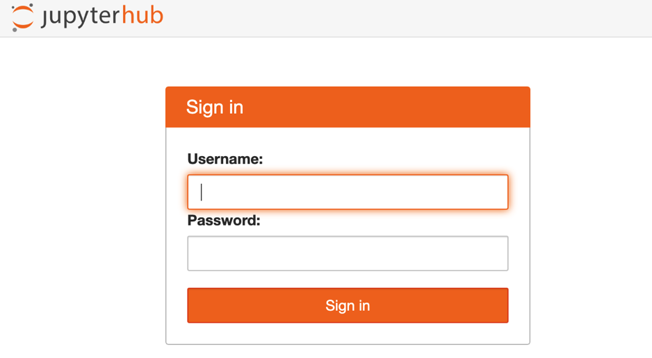
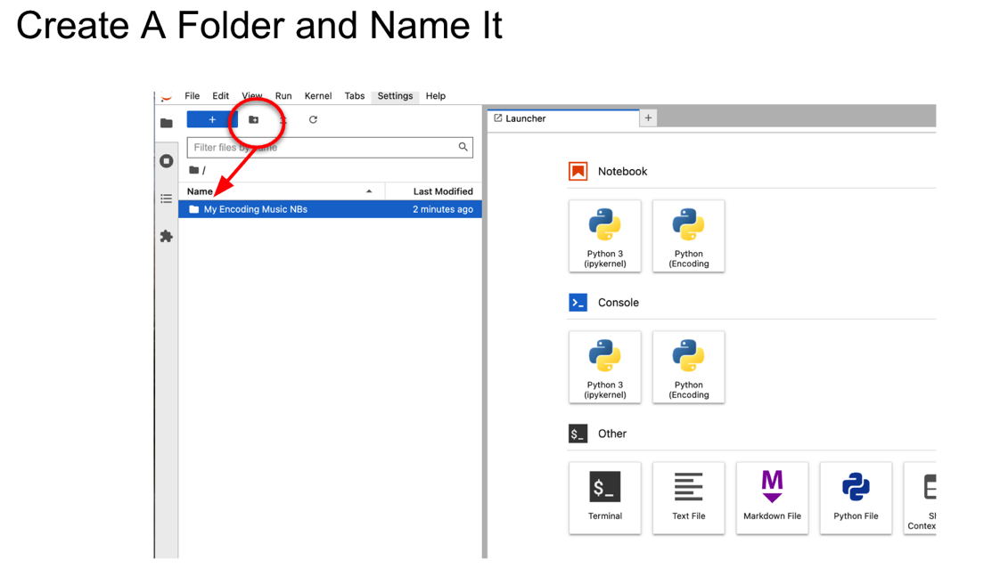
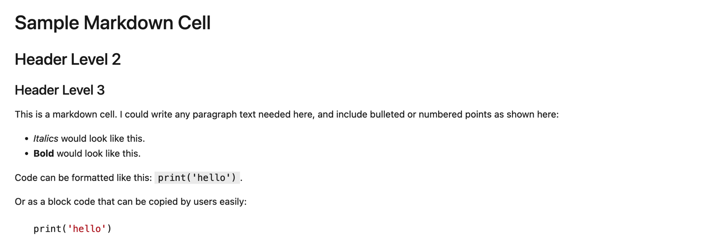
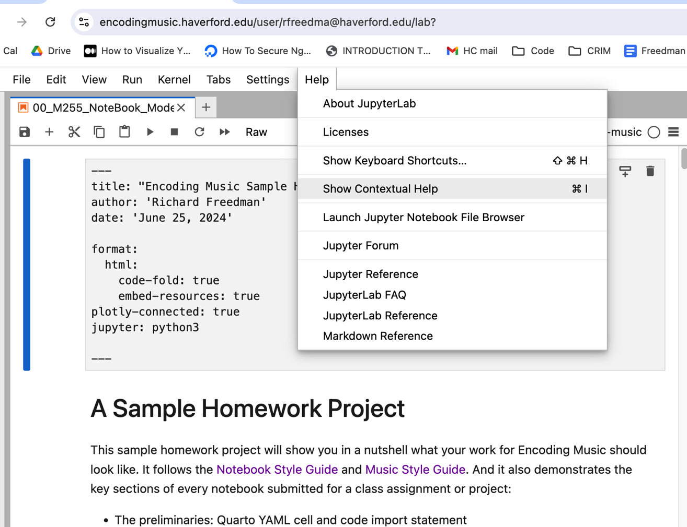
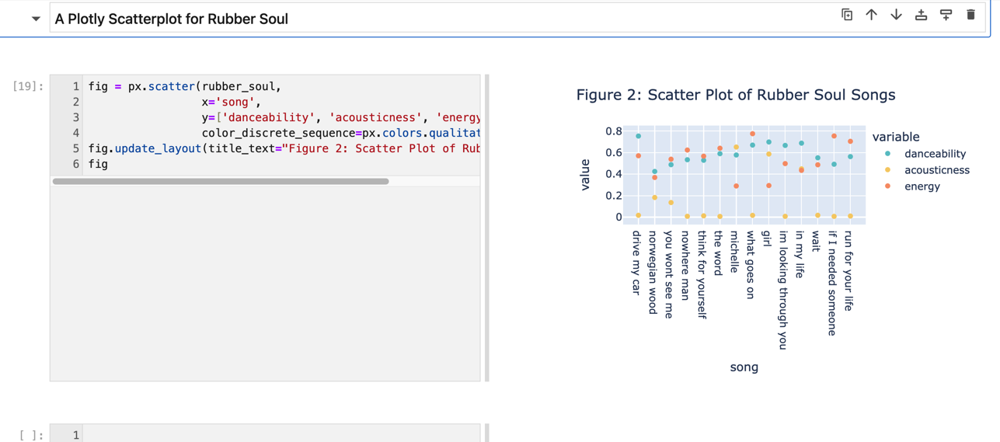
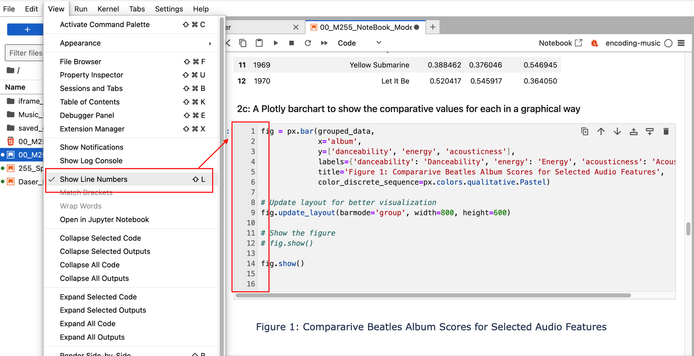
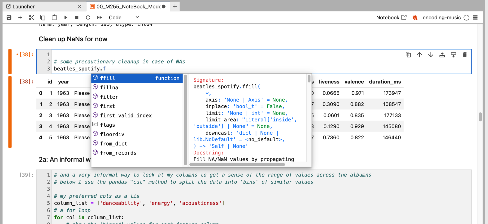
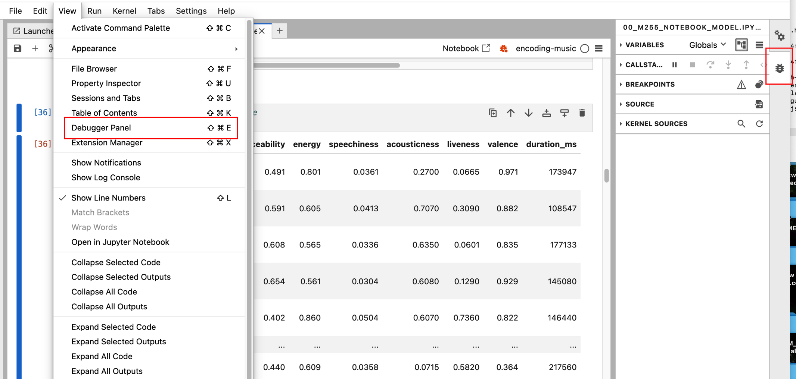
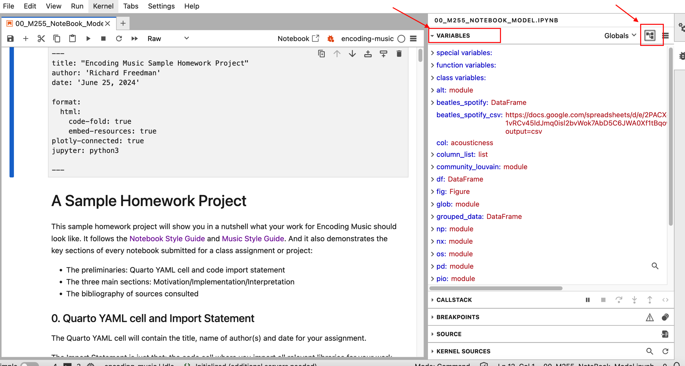
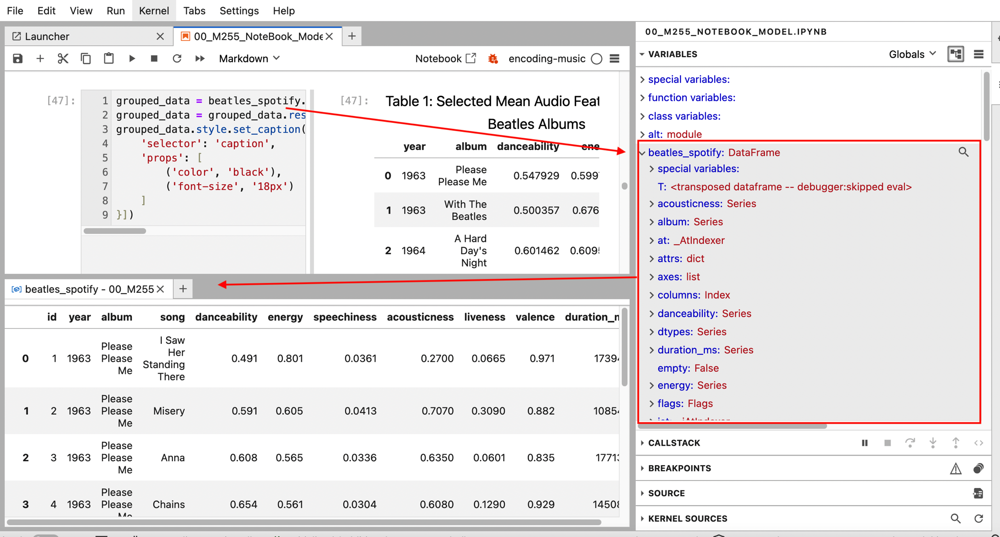

# Using Jupyter Notebooks; Publishing Them with Quarto

- [Introduction](#Introduction)
- [Log In to Jupyter Hub](#Log-In-to-Jupyter-Hub)
- [Make a Folder, Create a Notebook](#Make-a-Folder,-Create-a-Notebook)
- [Markdown and Code Cells](#Markdown-and-Code-Cells)
- [Display Options  Side by Side and Code Line Numbers](#side-by-side-view-and-code-line-numbers)
- [Notebook Frozen?](#notebook-frozen)
- [Debugging and Inspecting Variables](#debugging-and-inspecting-variables)
- [Viewing and Saving Charts and Graphics](#Viewing-and-Saving-Charts-and-Graphics)
- [Saving DataFrames as CSV Files (and Loading Datframes from CSV)](#Saving-DataFrames-as-CSV-Files-(and-Loading-Datframes-from-CSV))
- [Copy, Save, and Download Notebook](#Copy,-Save,-and-Download-Notebook)
- [Export and Publish with Quarto](#Export-and-Publish-with-Quarto)


## Introduction
In this short guide you will learn how to use **Jupyter Notebooks**, which allow anyone to run Python code in any browser, without the need to use the terminal or command line. The notebooks are saved with the `ipynb` extension. 

Notebooks are organized as 'cells', which can be **commentary** (or 'markdown' cells). These are static, and written in [Markdown](https://github.com/adam-p/markdown-here/wiki/Markdown-Cheatsheet), or **Python code** (which produce dynamic output).  

Normally you will do this in our [Encoding Music Jupyter Hub](https://encodingmusic.crimproject.org), which manages all the necessary Python libraries needed for our work. But it is also possible to run your notebook locally in an integrated development environment such as **VS Code**.  See the separate tutorial to learn more.

Notebooks can be saved in your Encoding Music Jupyter Hub space, or downloaded to share or submit as part of your work. But while a saved version of your notebook contains all the code and commentary you used, it does not preserve all of the results.  

**Quarto** provides a great way for you to publish your work in an elegant way, preserving the interactive tables and charts, hiding the code, and allowing your readers to focus on what matters about your ideas. Quarto allows you to think of a notebook as a narrative argument, turning your notebook into a stand-alone HTML or PDF document. And you can create a Quarto version of your notebook easily, with a few lines of code.  See more below and at [Quarto tutorial](https://quarto.org/docs/get-started/hello/jupyter.html).


## Log In to Jupyter Hub

There are several ways to run, edit, and create notebooks. Students in Encoding Music can use the [Jupyter Hub](encodingmusic.crimproject.org). Ask your instructor for your username. You will create a password on your first log in.  Make it something secure and write it down, since it cannot be changed!





Your screen should look now look like this on your first login. Create a new notebook by clicking on the icon.  An 'untitled.ipynb' file will appear in the folder at the left.


It is also possible to run Notebooks locally in VS Code. See more [here](02_Anaconda_VS_Code_Jupyter.md).

## Make a Folder, Create a Notebook

You will want to make a folder for your work, and perhaps different folders for different assignments or projects.  You could have subfolders for data (CSV, Music Files, etc). 

`Right+click` to rename or delete the folder:





Now you can create a Notebook within that Folder. 


`Ctr+Shift` (Mac) or `Right+Click` (Windows) lets you interact with a range of options for renaming, duplicating, and downloading files.


It is also good practice to **copy and rename** any notebook you work on in order to preserve the original version of it.  See more below to learn how.
### How to Create, Navigate, and Run Cells

Now you are ready to create some code and commentary!


* **Create a cell** with the `+` (the 'plus') icon in your Notebook:


* By default the new cell will be a **code cell** but you can change it to a **markdown** cell:


* **Navigate between cells** with the arrow keys on your computer, or just click in the cell you want to edit or run. 

* To **run an individual cell**, use the arrow/run command at the top of the Notebook, or just press `Shift+Enter` on your keyboard.

* To **move a cell** you will need to hover to the left of the cell contents (near the 'sequence' number) and then click+drag the cell to its new position.  This can be a bit tedious, so it is best to 'save' your notebook before you try this! 

* The **sequence in which cells have been run** is tracked in the space to left of individual cells. **The succession often matters, since one cell will use the state of a variable or dataframe that has been created in a previous one.  *This is important*, since it is possible to alter in a subsequent cell something that has been established in a previous one!

## Markdown and Code Cells

Code cells must of course be valid Python code.  They can contain comments (lines prefaced with `#`).  But for narrative explanation dedicated 'markdown' cells will be best.  The standard markdown language includes features for headings, bold, italic, lists, code blocks, images, and so on.  

Learn about markdown [here](https://quarto.org/docs/authoring/markdown-basics.html)


As written:


As displayed:



<br>

You can also find a link to a Markdown Guide built right into the Notebook!  Look under the **Help** menu in the Jupyterlab browser:




<br>


## Side by Side View and Code Line Numbers

If you explore the **View** menu in the Jupyterlab Browser you will see that there are some useful options for viewing cells and outputs.  

But two there are two important options you might want to consider:

- Try the **Side by Side** display option if you want to see the a code cell and it's output at the same time.  This can be especially helpful when producing charts, since it will allow you to see results without the need to scroll up and down.

Select Side by Side:

<br>


<br>

What you'll see:




<br>

- Try the **Show Line Numbers** option if you are getting error messages, which often refer you to specific lines of code that are having problems.

<br>



<br>


## Notebook Frozen?

If your Notebook becomes unresponsive, or you are simply stuck in some other way, one solution is to **Restart the Kernel** and begin again from the top.  Look for the **Kernel** menu or function.


## Syntax Completion and Help

JupyterLab really cannot compare with the power of VSCode and other Integrated Development Environments when it comes to highlighting Python syntax and anticipating problems in your code.  But it does have a **Tab Syntax Completion and Documentation** system that you will find helpful.  

For instance, let's say you were about to add the `fillna('')` method to a dataframe, but you could not quite recall exactly what it was called (`fillna('')`, or `fill_na('')`.  Nor could you recall exactly what went inside the parentheses.  But if you knew enough to type `f`, then press the `TAB` key, you will see a list of options from which to choose (keep typing additional letters to narrow the choices, or navigate to the one you want and press `ENTER` to select it).  

While the Tab Syntax tool is active, you will also see a full description of the various options and arguments for this method.  This will work for all Python libraries, so it is a good way to understand things like `px.barchart()`, and so on.

<br>




<br>

## Debugging and Inspecting Variables

JupyterLab has a built-in system for debugging your code.  It cannot quite compare with the power of VS Code.  But it does offer some good features

As noted above, using the **Code Line Number**s option is a good way to move between error messages and your code cells.  But sometimes you might find it useful to "inspect" the active variables, particularly if what is happening in a given cell requires several different objects to work together. 

But the **Debugger Panel** offers some more detailed options.  You can access it under the View menu, or at the far right via the "bug" icon.

<br>





<br>

With the **Debugger Panel** active, click on the **Variables** dropdown at top right, and also click the **Tree** icon at the top right, which will produce a list of all the active variables in your Notebook.

<br>



<br>


Now you can use the **dropdown arrows** to view details of each variable, or click the **inspector glass** to open it in its own window.  

In the case of this `groupby` operation, for instance, it seemed useful to look at the contents of the original `beatles_spotify` dataframe that was being passed to the `groupby` operation.  We can see which columns are which, and even use nested dropdown arrows to see the details of each column or datatype.


<br>




<br>


## Viewing and Saving Charts and Graphics

Normally, in the Encoding Music version and your local Anaconda Jupyter, all charts, graphs, and notation should render directly in the output cells for each code block. Certain complex networks will be saved as separate HTML files in your working folder, and can be viewed as a separate tab in your JupyterLab interface.

In a local VS-Code version of the notebook, you might find that graphs and charts are saved to your working folder (at the left) as `.png` or `.html` files.  You will need to open these in a browser or other viewer.

If you would like to save a chart or graph to reuse in another publication (such as Google Slides or Docs), there are various solutions:

In the **Encoding Music** hub version of Jupyter, `right-click` on output of the cell in question, then select `copy to clipboard`.  Now you can paste this image directly into some other document.  The process is the same if you are running notebooks **locally in Anaconda Jupyter** 


In a local **Anaconda VS-Code** put your cursor in the output area of the cell (near the image).  You will then see three icons--the one on the right is to "Save" the image.  Follow the dialogue to name and save the PNG file, then use it some other document.


## Saving DataFrames as CSV Files (and Loading Datframes from CSV)

Dataframes can be saved as CSV files, which provide a good way of reusing them in other projects.  For instance a df called `beatles_hits` could be saved with:

```python
beatles_hits.to_csv('beatles_hits_output.csv')
```

Note that you must include `.csv` as part of name of the file, and that you must provide a name for the file in quotation marks.

Conversely, it's easy to *load* a csv file as a dataframe.  Either provide a url (such as the raw version of a github file, or a shared csv from Google drive), or a local path to the file on your computer). For example:

Name the file path some simple variable, then use `pd.read_csv` to import to Pandas:

We give the URL of the CSV file a name (simply for convenience), then pass that name to the `read_csv('source_file_name')` method, and name the resulting data frame.

```python
beatles_spotify_csv = 'https://docs.google.com/spreadsheets/d/e/2PACX-1vRCv45ldJmq0isl2bvWok7AbD5C6JWA0Xf1tBqow5ngX7_ox8c2d846PnH9iLp_SikzgYmvdPHe9k7G/pub?output=csv'

beatles_spotify = pd.read_csv(beatles_spotify_csv)
```

## Copy, Save, and Download Notebook

It's a good idea to **make a Copy of your Notebook before you run or edit it**.  Rename with "_dev" at the end, for instance, so you can distinguish it from the original.

### Download ipynb File from Jupyter Hub (Encoding Music)

In the **Encoding Music** hub version of Jupyter, `right-click` on the NB file, then pick "Duplicate".  Note that you can follow the same menu to `Download` your Notebook as ipynb to share or submit.


### Download ipynb File from Your Local Anaconda Installation

If you are running notebooks **locally in Anaconda Jupyter**, then `File>DownloadAs>Notebook`:


In a local **Anaconda VS-Code** you can simply find the ipynb file on your computer and copy or share it from there.

## Export and Publish with Quarto

Saving your Notebook as HTML or PDF is the only way to share your work outside of the Jupyter environment. The process of creating HTML or PDF is slightly different (but equally tedious) in each platform.  See below for details.

A better option is to use **Quarto**, which publishes your notebook as a stand-alone HTML document, allowing you to retain the interactive aspects of the charts and tables, but without the need for users to run the Notebook in a Python environment. Users can 'hide/view' your original code (so that you reduce clutter in the output). And can also choose from a variety of styles for the final output (using CSS templates for HMTL).  There are also options for creating PDFs, Presentations and websites--although these are more advanced.

Using Quarto is fairly simple, but requires attention to two key details:

### Add Special Quarto YAML Cell at the Start of your NB

* Inclusion of a special `raw` cell at the *very start of the notebook*.  This cell is written in a special markdown format for quarto ('yaml' for 'yet another markdown language').  It specifies certain aspects of the translation to html, including code folding and the overall style of the result.  Here is what you should use.  
	* Be sure to make this a `raw` cell!  It should *not* be a `code` or `markdown` cell.
	* Be sure to include `---` at the start and end of the cell!
	* The indentations shown matter!

```python
---
title: "My Notebook Project"
author: 'My Name'
date: 'June 23, 2024'

format:
  html:
    code-fold: true
    embed-resources: true
plotly-connected: true
jupyter: python3

---
```

Note that here we have set the code cells to 'fold' by default.  This means that any code block in your notebook will be temporarily hidden by default in the HTML output.  Users can view/hide the code for individual cells with a simple dropdown arrow.

If you want to 'show' all code by default, then set `code-fold: false`.

### Add Special Code Cell for Managing Altair and Plotly in Quarto

You will also need to include the following as a `code` cell in your notebook.  This can be done as part of all the initial import of libraries, or in a separate cell.  It does *not* need to be the first cell, and should *not* be part of the YAML cell shown above.

This code ensures that images created with altair and plotly will be correctly managed by Quarto as part of the output file.

Here is the code to use:

```python
alt.renderers.enable('default')
import plotly.io as pio
pio.renderers.default = "plotly_mimetype+notebook_connected"
```

### Render Stand-Alone HTML with Quarto and Terminal Command (Recommended!)

Quarto renders your Notebook as a 'stand-alone' HTML file, including all markdown, code, and outputs. As noted above, the code cells will by default be 'folded' (so users can view/hide as needed). The code itself will not run in this HTML version, but all of the outputs will be interactive:  users can scroll through long tables (vertically and horizontally), see pop-up details or charts, or interact with dynamic networks and other visualizations.

But before you 'render' with Quarto, make sure all the outputs are as you expect.  

* Run all the cells, from top to bottom.
* When finished running the cells, be sure to `save` your Notebook.  This ensures that Quarto will render all the output.

When you are ready to 'render', follow these steps:

* Under the `File` menu in JupyterLab, start `New Launcher`:


* From the new main window, choose `Terminal`.  


* At the `command prompt`, type the following text (edited to match the name of your notebook!)

`jupyter-hc_test@encodingmusic:~$ quarto render My_Notebook.ipynb`

After a few seconds you will see a **new HTML file** in your Jupyter Lab folder.  It will have the *same name as your original notebook*.  **Download it** and open it with your preferred browser.

You can also preview it within Jupyter Lab by double clicking.  It should open in a new tab.

But downloading and then opening in a browser is the most reliable way to check that things are working as you expect!

This HTML is *complete*.  That is:  you can share it with colleagues, or even host it (on Github IO, for example) as a publication.

Using the default Quarto html style, it will look like this:


### Option: HTML to PDF from Jupyter Hub (Encoding Music)

This is possible, but much less reliable or useful than Quarto!

From the **Encoding Music** hub or **Local Jupyter (on Anaconda)**, follow `File>Download` (or `File>DownloadAs`) and select **HTML** as the format.  Be sure to select HTML and *not* any of the PDF formats, which will not work! This will be saved to the 'downloads' area on your computer. 

Next, **open the file in a browser, then use the `Print` dialogue to save it as PDF**.  Be sure to name it according to the conventions!


### Option: HTML to PDF from Local Anaconda

This is possible, but much less reliable or useful than Quarto!

From Local VS-Code (on Anaconda), look for the 'three dots' at the top right of your Notebook, then pick `Export`:


Now from the Export menu select 'HTML' (PDF will not work!). The HTML will be saved to the 'downloads' area on your computer. Open the file in a browser, then use the `Print` dialogue to save it as PDF.  Be sure to name it according to the conventions!


