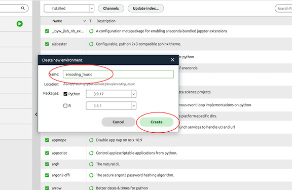

# Encoding Music:  Running Notebooks and Code on Your Own Machine

It's certainly possible to do all assignments via the class [Jupyter Hub](https:encodingmusic.crimproject.org) using your assigned login

But it is also possible to run all our notebooks (and also develop your own ideas) on your own computer.  The steps detailed below will show you how.

## Anaconda Navigator, VS Code, and All the Rest

### Install Anaconda Navigator

* Download and install [Anaconda Navigator](https://www.anaconda.com/download) on your machine.  It's free. Learn more about Anaconda Navigator via its [learning resources](https://learning.anaconda.cloud/)

### Create a New Virtual Environment

* The next step is to create a new virtual environment, which will make sure that you are working with the correct libraries, and the correct versions of those libraries in a way that will not interfere with any other packages or resources on your computer. You can name the virtual environment it as you like, for example "encoding_music"; note that it's best to avoid spaces in the name!

> 1) Click the "+" at the bottom of Navigator to start the process:


> 2) And then name the environment via the dialogue box:



> 3) You are creating a **Python** environment.  Choose **Python 3.10** (it can be any sub-version, as long as it is 3.10)

### Install Jupyter Notebook and Visual Studio Code

* From the 'home' page of your environment you will see an array of software packages.  The ones we will use are Jupyter Notebook and VS Code.  If they are already installed, you will see a button to 'launch'.  If you see 'install' then click that to do so. No need to launch either of them yet, however!


### Run VS Code Locally Using Encoding Music Server Remotely

* Python Libraries handle various functions (from charts and graphs to music rendering). They are installed via a `requirements.txt` file that can be found on github for [Encoding Music](https://github.com/RichardFreedman/Encoding_Music/blob/main/requirements.txt). To install the various libraries in your local environment, you will need to:

Open a new 'terminal' as shown here:


The terminal prompt (in a new window), will look something like what you see below, with the name of your environment in parentheses, and the name of your computer afterwards:

```(encoding_music) rfreedma@rfreedma-22 ~ %```

Copy the following code and paste it directly after the terminal prompt, then press return/enter.

```python
pip install -r https://raw.githubusercontent.com/RichardFreedman/Encoding_Music/main/requirements.txt
```


This might take a minute or two, and you will see a long and rapdily moving display of content in the Terminal window.  Eventually the process will stop and you will see the prompt again.  Success!

### Get The Notebooks and Work With Them Locally

You have various options for working with the Notebooks (or creating new ones). 

You could simply download our Encoding Music notebooks from github, saving them locally on your computer.  This will certainly work, although you will need to keep track as you edit them.  It's a good policy to _rename_ any file you are working with (perhaps with a suffix) so that you don't spoil the one you downloaded.  Find all the Notebooks at [Encoding Music on github](https://github.com/RichardFreedman/Encoding_Music)

Click the `code` button and `download zip` as shown below to get the files.


Alternatively you could `clone` the entire repository via your own git account.  The files will remain on your computer, but you will also have the security of publishing version-controlled copies on github.  But DO NOT include your passwords or other secure information in your notebooks if you choose this approach!

### Run A Notebook (or Create Your Own Code)

Again you have choices.  You can run the Notebooks in **Jupyter Notebook** (which you will launch from the home page of your environment). Notebooks provide a browser-like space to run code and create markdown.  They are relatively simple to use, but they give only minimal guidance as you write code (called 'syntax highlighting'), and little support to fix errors.


You can also run the Notebooks in **VS Code**.  Here you have more support for syntax highlighting (such as telling you when a variable has been used in your code, or not), and also support for debugging.  But to start a Notebook in VS Code you must be sure to select the correct Python "Kernel".  This will only be necessary the first time you run it.  See below:


You might also be prompted (only the first time you use VS Code with your first notebook) to install an "Extension" called `ipykernel`.  This is easily done via the Extensions manager.  Ask if you need help.  

You might also want to install an extension called `live preview`, which will help to render networks and other figures.


### Run VS Code Locally While Using Encoding Music Server Remotely

It is also possible to use a *local* copy of VS Code but invoke the code *from the remote Encoding Music server*.  In this way you will not need to install the libraries, and you will still be able to use all the current features for our work.

Here is how to do this:


