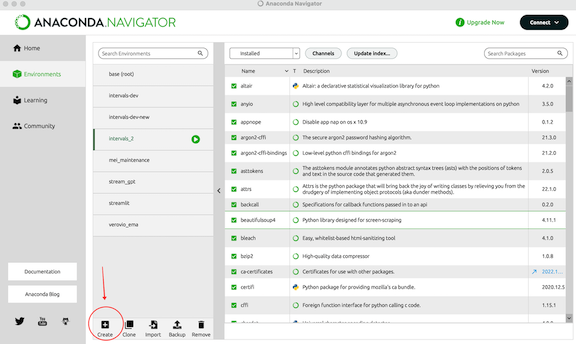

# intervals-streamlit

# A Streamlit Web Application for CRIM Intervals

Learn about CRIM Intervals here:  https://github.com/HCDigitalScholarship/intervals/tree/rich_dev_22

Learn about Streamlit functions here:  https://docs.streamlit.io/library/api-reference

To use and develop the application:

* **Create a virtual environment.**  One good way to manage virtual environments is with Anaconda Navigator:  https://www.anaconda.com/download.  Learn more about Anaconda Navigator here:  https://learning.anaconda.cloud/

* Create a new environment (you can name it as you like, for example "Streamlit")

* **Install Jupyter Notebook or Visual Studio Code** if they are not already in that environment.

From 

* **Clone the Streamlit for Intervals repository to your local machine**.  Github Desktop is a good way to do this:  https://desktop.github.com/.  You will need to look for Clone a Repository under the File menu for GitHub Desktop, then paste in this url:  https://github.com/RichardFreedman/intervals-streamlit and provide a location on your own computer where you would like the files to be saved.

* From within your Streamlit virtual environment on Anaconda Navigator, and using VS Code or Jupyter Notebook, **open a new Terminal window, and 'acvitate' your environment**.  When you start the terminal you will probably see that you are running on 'base', but you will need to type `conda activate streamlit` (the last word will be the name of the environment you created above) at the terminal prompt:

If you are successful you will see that you are now running on 'streamlit' (or whatever you call your environment).

* Make sure that terminal (and thus VS Code and Jupyter Notebooks) are looking to the local directory on your computer where you downloaded the Streamlit repository in the step above.  At the terminal prompt, type (for instance) `cd '/Users/rfreedma/Documents/CRIM_Python/intervals-streamlit'`

* **Install the 'requirements' for Streamlit Intervals**.  This is file is part of the streamlit intervals GitHub repository, and which was added to your local folder when you cloned the respository in the step above.  So in the terminal type `pip install -r requirements.txt`

This might take a minute or two, and you will see a long and rapdily moving display of content in the Terminal window.  Eventually the process will stop and you will see the prompt again.

* Now you are ready to start the Streamlit for Intervals application via the terminal with `streamlit run intervals_streamlit2.py`.  Your internet browser will launch automatically, and then you can use the app!

