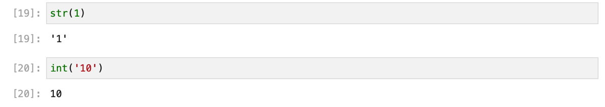
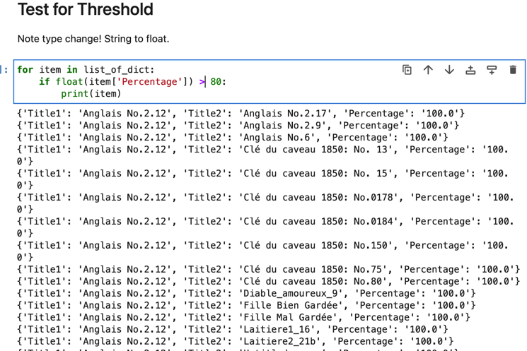

# Python Basics

## Introduction
In Python, like other programming languages, we declare **variables**, then use **functions** transform them in various ways.  There are functions (and libraries) that help us work with numbers, text, statistics, graphs, etc.

Read more about [Python with w3school reference guide](https://www.w3schools.com/python/python_intro.asp)


---


## Data Types
It's important to understand **data types**:

*   **integer**:  any whole number, such as 1, 2, 10
*   **float**:  decimal numbers, such as 2.25, 6.875
*   **string**:   any alpha-numeric character, surrounded by quotation marks (double or single)
*   **Boolean**:  True or False (in fact these are reserved words in Python and should not be used beyond Boolean functions)

---
## Collections

These can also be combined as various kind of **collections**:

*   **lists**:  an ordered sequence presented in brackets and separated by commas, such as **["Blues", "Gospel", "Country"]** or **[1.0, 4.0, 6.0]**.  Lists can contain duplicates
*   **set**:  an unordered sequence; it cannot contain duplicates
*   **tuples**: a special kind of list that cannot be altered, presented as **("Jazz", "Classical", "Folk")** or **(1.25, 4.76, 8.03)**
*   **dictionaries**:  a series of **key : value** pairs contained within braces, such as **{"artist" : "McCartney, Paul", "title" : "Yesterday"}**

Read more about [Python data types at the w3schools resource](https://www.w3schools.com/python/python_datatypes.asp)

---

## Checking Data Types

Check the **data type** of any item:

`type(item)`


    item_1 = 'guitar'
    item_2 = 1
    item_3 = 2.25
    item_4 = True
    item_5 = ["Blues", "Gospel", "Country", 4] 
    item_6 = ("Jazz", "Classical", "Folk")
    item_7 = {"artist_surname" : "McCartney", "artist_given_name" : "Paul", "title" : "Yesterday"}
Note that simply defining a variable does not produce any output. 
If you want to see the value of a variable, you can print it:

    print(my_variable)

or just write it as the last line in the cell:

    my_variable

---
## Numbers, Strings, Floats, and Booleans
Depending on the data type, it's possible to perform various **operations** on them.

* You **can** add/subtract **integers** and **floats** to each other
* You **cannot** add an **integer** to **text or a Boolean**
* Many other kinds of operators can be used to compare items, test for thresholds, etc. 


**Integers** and **floats** can be used with various mathematical tests:

```
Equals: a == b
Not Equals: a != b
Less than: a < b
Less than or equal to: a <= b
Greater than: a > b
Greater than or equal to: a >= b
```


Read about [operators at the w3school site](https://www.w3schools.com/python/python_operators.asp)


**Strings** are text.  There are a wide variety of built-in methods that allow to you to work with them to:

* change lower/upper case
* strip out certain characters (like punctuation)
* split texts (at spaces, for example)
* find substrings, or first/last characters
* etc!

See more [about strings at w3schools](https://www.w3schools.com/python/python_strings_methods.asp).

## Converting One Datatype to Another

Thus sometimes you will need to 'evaluate' a given string, float, or integer as another datatype.

For instance:

- `int("1")` will return the string "1" as the integer 1.

- `str(10)` will return the integer 10 as a string



## Collections:  Lists, Dictionaries, Sets, and Tuples

In Python, items gathered together are called a **collection**. There are four types, each with its own properties: 

* **Lists** are used to store an **ordered sequence of  items** in a single variable.  Each item is surrounded by quotation marks, separated by a comma from the next. Square brackets surround the whole.  The example below is a list of strings (note the quotation marks). See [about lists at w3schools](https://www.w3schools.com/python/python_lists.asp).

```
list_of_genres =  ["Blues", "Gospel", "Country", "Hip-Hop"] 
```

* **Sets** are like lists, but are **not ordered**, and cannot contain duplicates. See more [about sets at w3schools](https://www.w3schools.com/python/python_sets.asp).

```
set(list_of_genres)
{'Blues', 'Country', 'Gospel', 'Hip-Hop'}

```
Turn a set back into a list:  

```
list(set(list_of_genres)
```
---
* **Dictionaries** are used to store data values in **key:value pairs**. Like lists, they are ordered. But like sets they do not allow duplicates. Each key or value is surrounded by quotation marks. Each key:value pair is followed by a comma. Curly brackets surround the whole. Dictionaries can also contain other dictionaries, as 'nested' dictionaries. See more [about dictionaries at w3schools,](https://www.w3schools.com/python/python_dictionaries.asp) and below.

>    In this example the **keys** and **values** are both strings.  But we could also restrict certain data types.  For instance, we could insist that the `date` value be that specific data type (and not just a string).

```
my_dict = {"artist_first_name" : "Wolfgang Amadeus",
"artist_last_name" : "Mozart",
"work_title" : "The Magic Flute",
"work_genre" : "singspiel",
"date" : "1791",
"first_performance_place" : "Vienna"}
```

* **Tuples** are a special type of collection:  ordered (like lists), but unchangeable (it is not possible to add or remove items). See more [about tuples at w3schools](https://www.w3schools.com/python/python_tuples.asp). 


---

## Working with Lists
In the case of lists, we often need to:
* **Add or remove items**, as in `my_list.append(another_item)` or `my_list.remove(some_item)`
* Find out **how many items** are in a list (that is, the "length"), such as `len(my_list)`
* Find the **unique items** in a list (that is, the "set"), such as `set(my_list)`.
* Find **how many unique items** there are in a given list, which is the "length" of the "set": `len(set(my_list))`.  Note the nested parentheses!
* Find particular **items by their index** (= position in the list): `my_list[0]` (remember that the index of first position is always "0").  The last item in a list is `my_list[-1]` (a "negative index" counts back from the end, starting with "-1").
* Find the **index (= position)** of a particular item: `my_list.index(item_name)`.  This will return a value, rather than the item in question.
* **Sort** the list: ``my_list.sort()``, or in reverse alphabetical order: ``my_list.sort(reverse = True)``

**Note** that there are many other ways to work with lists, including methods for find a **range** of items ("the first 10 items", "every other item", "all but the first and last items").

**Note** that some methods modify a list but don't show you the result. In order to see the modification, output the new list by just typing the name of the list again.  It can be confusing!

Read more about [working with **Lists** at w3schools](https://www.w3schools.com/python/python_lists.asp)

[Try them out with list exercises.](https://www.w3schools.com/python/python_lists_exercises.asp)

[Read about the list methods.](https://www.w3schools.com/python/python_lists_methods.asp)

---

## Working with Dictionaries
You can think of a dictionary like a small catalog, with a series of unique "keys" and their associated "values", like:

```
my_dict = {"artist_first_name" : "Wolfgang Amadeus",
"artist_last_name" : "Mozart",
"work_title" : "The Magic Flute",
"work_genre" : "singspiel",
"date" : "1791",
"first_performance_place" : "Vienna"}
```
The values can repeat, but the keys in any dictionary must be unique.

There are various ways to:

* list the **keys**:  `my_dict.keys()`
* list the **values**:  `my_dict.values()`
* list all the **items** (both the keys and values): `my_dict.items()`
* list the **value for a particular key**: `my_dict["date"]`
* update the **value for a particular key**: `my_dict["date"] = "1789"`
* add a **key/value pair**:  `my_dict["language"] = "German"`
* remove a **key/value pair**: `my_dict.pop("language")`
* add a **key** (and supply the value later)    `my_dict["librettist"] = None`


Need to build a dictionary for a mapping function in Pandas?  Here is a way to do this from a list of keys:


```python
my_keys = ["artist_first_name", "artist_last_name", "work_title", "work_genre", "date", "first_performance_place"]
my_dict = dict.fromkeys(my_keys)
print(my_dict)

{'artist_first_name': None, 'artist_last_name': None, 'work_title': None, 'work_genre': None, 'date': None, 'first_performance_place': None}
```

Now you could take that dictionary and fill in the values as needed.


Sometimes you will encounter a **List of Dictionaries**:

```python
list_work_dicts = [
{"work_id": 'work_1',
"composer_first_name" : "Wolfgang Amadeus",
"composer_last_name" : "Mozart",     
"work_title" : "The Magic Flute",
"work_genre" : "singspiel",
"date" : "1791",
"first_performance_place" : "Vienna"},
{"work_id": 'work_2',
"composer_first_name" : "Giuseppe",
"composer_last_name" : "Verdi",     
"work_title" : "Aïda",
"work_genre" : "opera",
"date" : "1871",
"first_performance_place" : "Cairo"}
]
```

In this case we can iterate through each dictionary in the list, returning values in various ways.

For instance, reporting each value for the `work_title` key:

```python
# iterate through each dictionary in the list
for work in list_work_dicts:
    # print the value for the 'work_title' key
    print(work['work_title'])


# the output:
The Magic Flute
Aïda
```

Or now performing a logical test that allows us to report *only certain values*:

```python
# itrerate through each dictionary in the list
for work in list_work_dicts:

    if work['work_title'] == "The Magic Flute":
        # print the composer's full name
        print(work['composer_first_name'] + " " + work['composer_last_name'])

# the output:
Wolfgang Amadeus Mozart
```

Or to report the date of first performance for works in the genre "opera":

```python
# iterate through each dictionary in the list
for work in list_work_dicts:
    # check if the date is 1871
    if work['date'] == "1871":
        # print the work title and date
        print(work['work_title'] + " was first performed in " + work['date']+ ".")

# the output:
Aïda was first performed in 1871.

**Nested Dictionaries** are ones in which one dictionary contains another.  These can be much more complex to work with.

For example, this dictionary of works in a concert, each with their own details about composer, title, genre, etc.

```python
my_concert = {
    "work_1": {
        "composer_first_name" : "Wolfgang Amadeus",
        "composer_last_name" : "Mozart",     
        "work_title" : "The Magic Flute",
        "work_genre" : "singspiel",
        "date" : "1791",
        "first_performance_place" : "Vienna"},
    "work_2": {
        "composer_first_name" : "Giuseppe",
        "composer_last_name" : "Verdi",     
        "work_title" : "Aïda",
        "work_genre" : "opera",
        "date" : "1871",
        "first_performance_place" : "Cairo"}
}
```

Access the **top-level key** 'work_1':

```
my_concert['work_1']

```
Access **all the keys nested** within 'work_1':

```
my_concert['work_1'].keys()

```
Access an **individual key nested** within 'work_1':

```
my_concert['work_1']['work_title']
```
**Add a key/value pair** to one item:

```
my_concert['work_1']["librettist"] = 'Schickaneder'
```

**Query the combined dictionaries** to return the value for a particular key for each item:

```
# Create a list of 'work' keys
work_keys = list(my_concert.keys())

# Now a for loop to get the _all_ the values and then print the one we want
for work in my_concert.values():
    print(work['date'])
```


### From CSV to Dictionary

CSV means 'comma separated values' and is a common interchange standard for tabular information.  You can easily obtain a CSV from Excel or Google Sheets.

As we will learn, it is actually very simple to build a Pandas dataframe from a CSV file, or from a Dictionary.

But it's also possible to build Python dictionaries from CSV files.  In this case you will obtain a _list_ of dictionaries---you can imagine each dictionary as the row of your original spreadsheet.

You will need to import a new library, 'csv', in order to make this work.  Note that you will need to upload your csv file to the same folder where your current notebook resides, and change the `sample.csv` in the code below to the name of your file.  Of course you can also load this from some URL or space on your computer, but in that case will need the file path.  Upload the CSV to a local folder (like `saved_csv`) in your Jupyter Hub, then import it as follows:


```python
# load library
import csv

# define path to csv
csv_data = "saved_csv/OurVoyager.csv"

# load the file
list_of_dicts = []
with open(csv_data, 'r') as data:
    dict_reader = csv.DictReader(data)
    list_of_dicts = list(dict_reader)

# print the list of dictionaries
print(list_of_dicts)

```


Now it's possible to _search_ and _filter_ this sort of list to return items that match a particular condition.  See more below.

Depending on the length of your csv, the output of the print statement might be _very long_.  So you might want to print just one entry instead.  The '0' item in the list is the first.  Of course Python will allow to 'slice' lists like this in lots of different ways.  Look up the documentation via w3schools.

`print(list_of_dicts[0])`

[More about dictionaries from w3schools](https://www.w3schools.com/python/python_dictionaries.asp).


---


## "If" Statements

"If" statements allow you to perform **logical tests** on your data, such as:

```
Equals: a == b
Not Equals: a != b
Less than: a < b
Less than or equal to: a <= b
Greater than: a > b
Greater than or equal to: a >= b
```
Examples in "if" statement:

```
if item_value > 10:
  print("high value")
elif item_value > 5:
  print("medium value")
else:  # default case, item_value <= 5
  print("low value")
```

or

```
group_name = "Beatles"
if group_name.startswith("B"):
  print(True)
```
Note that "if" statements can be multi-stage, with **"if"** followed by **"elif"** (another condition to test if the first condition is not met), and **"else"** (a default result if none of the previous tests are true). 

More about "if" statements [here](https://www.w3schools.com/python/python_conditions.asp).


## "For" Loops
"For" loops allow you to iterate over the items in any collection, performing the same operation or function on each.

**Note** loops like are very helpful when working with individual lists or dictionaries.  But you will want to **avoid** attempting to use them directly on a **Pandas column**.  Instead, write the function by "apply" it to that column for all rows in the dataframe.  More about that in Notebook B!


**"if"** statement **within a "for"** loop:

```
genres =  ["Blues", "Gospel", "Country", "Hip-Hop"] 
for genre in genres:
  if genre.startswith("B"):
    print(genre)

```

or to all those that do _not_ satisfy the condition:

```
genres =  ["Blues", "Gospel", "Country", "Hip-Hop"] 
for genre in genres:
  if genre.startswith("B"):
    pass
  else:
    print(genre)
```

Note that **list comprehension** allows you work with lists without the need to create separate **for** loops.  For example:

```
b_list = [x for x in genres if x.startswith("B")]
```

More about **list comprehension** [here](https://www.w3schools.com/python/python_lists_comprehension.asp).


## For Loops with Simple Dictionaries

It's not hard to create a test that will search through a list of dictionaries, returning the items that match certain conditions.  Using our imported sample csv file above (with keys for two works and a percentage of their relatedness), we can return only the items (dictionaries) that match a given condition, for example the % of relatedness.

Create the dictionaries from a csv:

```
import csv

with open('sample.csv', 'r') as data:
    dict_reader = csv.DictReader(data)
    list_of_dict = list(dict_reader)
    
print(list_of_dict[0])
```

Filter it for the percentage threshold.  Note that since the value for percentage in the original CSV (and dictionary) is a `string`, we must *evaluate that string as a float* in order use `>` as a comparator to make the test:

```
for item in list_of_dict:
    if float(item['Percentage']) > 80:
        print(item)
```


---

## For Loops with Nested Dictionaries

Now create a **nested** dictionary based on the one you made above.  This could be a *series of related items* (like songs on a playlist, or instruments in a collection, or scores on your shelf). The id's (or keys) for each item will need to be unique at the highest level, but the keys within each item can repeat.  

Sample nested dictionary of works on opera season:

```
my_operas = {
    "work_1": {
        "composer_first_name" : "Wolfgang Amadeus",
        "composer_last_name" : "Mozart",     
        "work_title" : "The Magic Flute",
        "work_genre" : "singspiel",
        "date" : "1791",
        "first_performance_place" : "Vienna"},
    "work_2": {
        "composer_first_name" : "Giuseppe",
        "composer_last_name" : "Verdi",     
        "work_title" : "Aïda",
        "work_genre" : "opera",
        "date" : "1871",
        "first_performance_place" : "Cairo"}
}
```


Then try the following to iterate through each work in the dictionary, and then print the individual key-value pairs for each work:


```
python
# interate through each work in the nested dictionary, returning both the work id and its info as a tuple
for work_id, work_info in my_operas.items():
    # print the work id
    print("\nWork ID:", work_id)
    
    # now iterate through each key in the work's info dictionary and print the key and its value
    for key in work_info:
        print(key + ':', work_info[key])
```

---
## Functions

Functions are just what they sound like:  a short series of steps that can be applied to 
some data, and **return** various results depending on the logic you apply.

We will take a simple example that can be applied later in our work with Pandas data sets.

Let's imagine that you have a dataset in which a particular column contains data that are inconsistent:  in some places for the name of an artist you have `John Lennon`, and other places `John Lenin`.  You could correct them by hand in a spreadsheet.  But there is an easier way with a Python **function**.


```

def name_check(sample_name):
    if sample_name == "John Lenin":
        print("That should be John Lennon instead")
    else:
        print("It's spelled correctly")
```

So far all we have done is to **define the function** (take note of the ":" signs and of the indentations.  But now we must actually run it with some data.

First on **one** sample name:

```
sample_name = "John Lenin"
name_check(sample_name)
```

Or combined with a **for** loop, we can run this over a list of names:

```
sample_name_list = ["John Lenin", "John Lennon", "John Lenin"]
for sample_name in sample_name_list:
    name_check(sample_name)
```

### Lambda functions

You may encounter code using the term `lambda`. This is a shorthand way for defining entire functions in a single line. While it is quicker to write, it is much harder to read and understand. For this reason, you'll mostly see functions defined using `def` in these tutorials. However, you are encouraged to learn more about Python `lambda` functions [here][lambda-functions].

[lambda-functions]: https://www.w3schools.com/python/python_lambda.asp


## Credits and License

Resources from **Music 255:  Encoding Music**, a course taught at Haverford College by Professor Richard Freedman.

Special thanks to Haverford College students Charlie Cross, Owen Yaggy, Harrison West, Edgar Leon and Oleh Shostak for indispensable help in developing the course, the methods and documentation.

Additional thanks to Anna Lacy and Patty Guardiola of the Digital Scholarship team of the Haverford College libraries, to Adam Portier, systems administrator in the IITS department, and to Dr Daniel Russo-Batterham, Melbourne University.

This work is licensed under CC BY-NC-SA 4.0 
