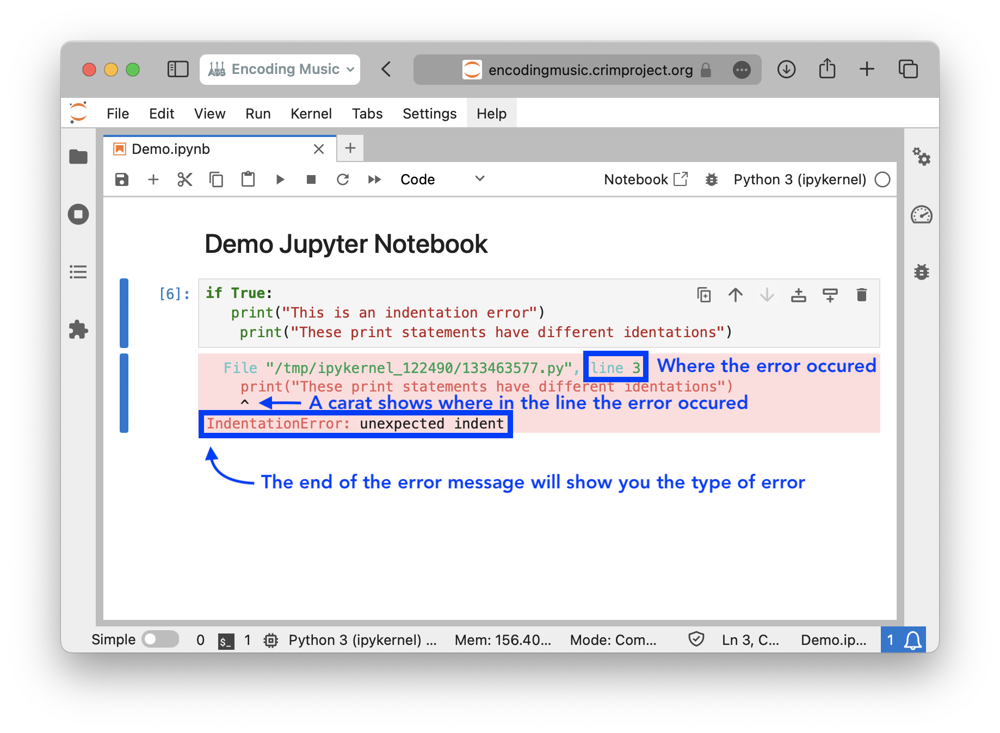
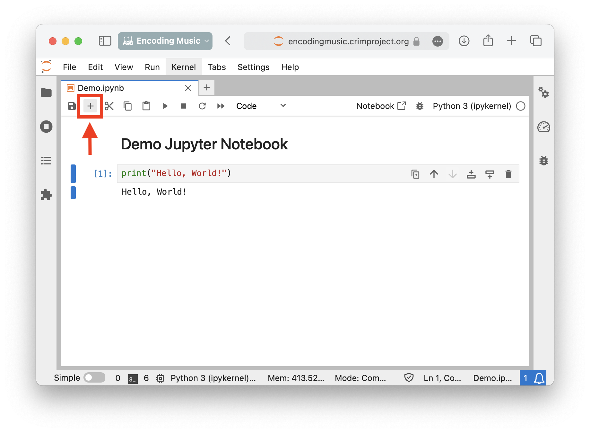
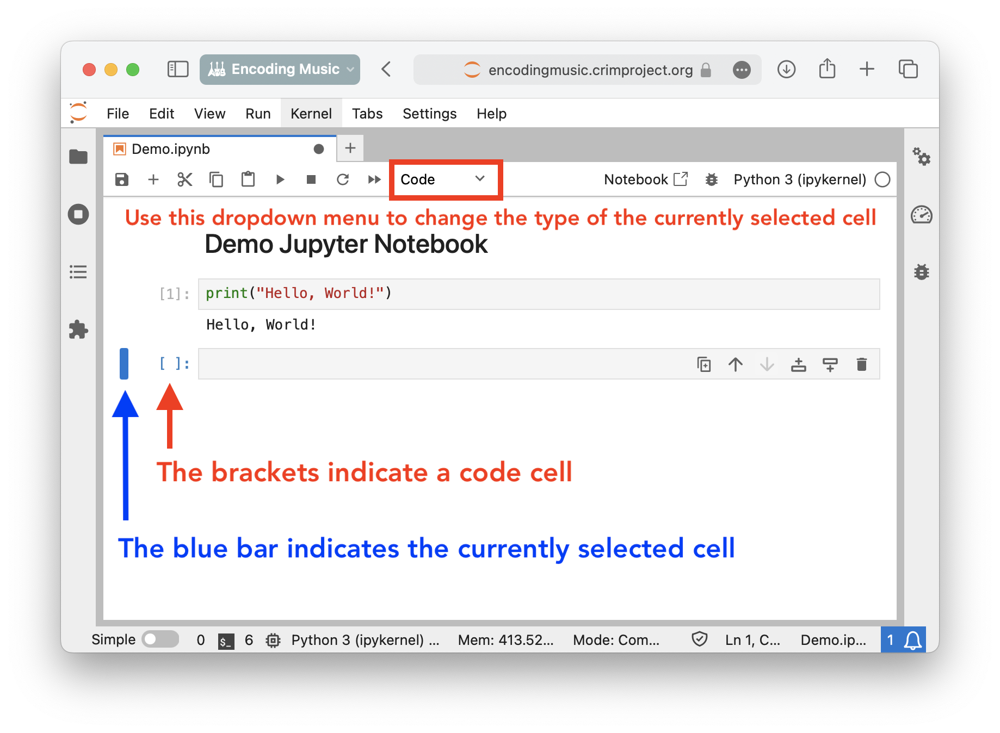
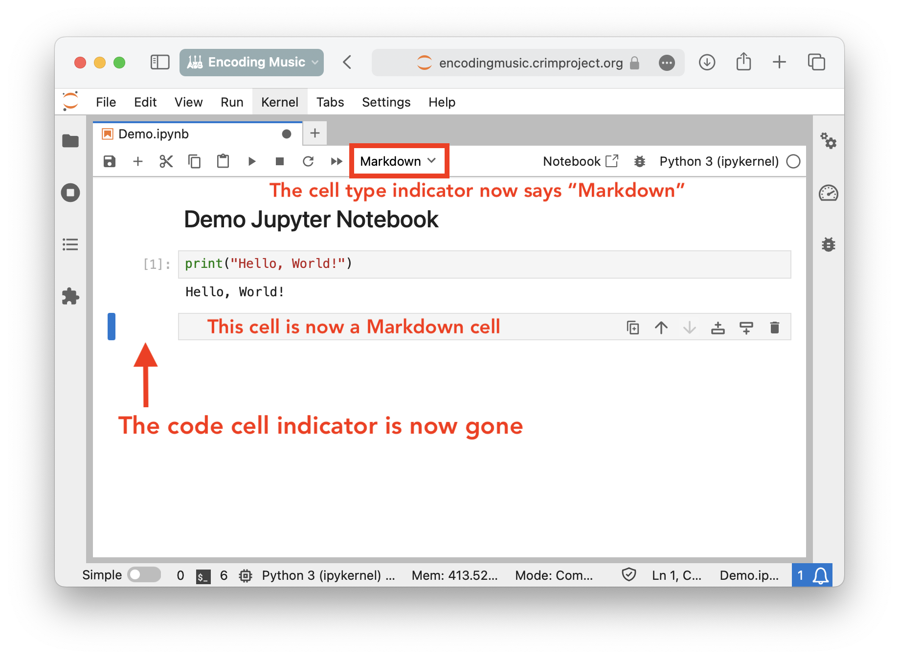
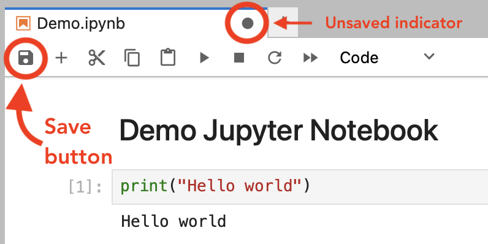

# Common Python and Jupyter Issues

<b>I'm getting an error, how do I fix it?</b>

<ul>
    <li>
        

        
<b>How can you identify the error?</b>

        <ul>
            <li>
            You can use the provided error message to understand the problem.
            
            </li>
        </ul>
        

    </li>
    <li>If code in one cell depends on code in another cell, you might have forgotten to run another cell first. If you have a <code>NameError</code> for a variable you already created (and spelled correctly), you might have forgotten to run the cell where you created it.</li>
    <li>Make sure your code is properly indented. Refer to the Python Basics markdown for examples.</li>
    <li>Learn about fixing specific types of errors <a href="https://betterstack.com/community/guides/scaling-python/python-errors/">here</a>.</li>
</ul>

<b>How do I create a specific type of cell in Jupyter?</b>

<ul>
    <li>Use the plus button in your menu bar to create a new cell</li>
    <li>Use the dropdown menu to select the type of your new cell</li>
    <li>Your notebook will then reflect the new cell type</li>
</ul>

<b>What is the difference between a code cell and a Markdown cell?</b>

<ul>
    <li>Code cells are where you write Python code. You can run the code in Python cells.</li>
    <li>Markdown cells are where you write text, describing your code or anything else you want to write about. Though you can just start typing in a markdown cell to get plain text, it's also possible to do some formatting. See the <a href="https://github.com/adam-p/markdown-here/wiki/Markdown-Cheatsheet">markdown guide</a> for more.</li>
</ul>

<b>How do I convert between different data types?</b>

<ul>
    <li>Use Python's type casting, described in <a href="https://www.w3schools.com/python/python_casting.asp">this W3Schools resource</a></li>
</ul>

<b>How do I read data from files?</b>

<ul>
    <li>To read data from CSV files, see <a href="03_Python_Basics.md#from-csv-to-dictionary">the section "From CSV to Dictionary"</a> in the Python Basics markdown (reload the page after clicking the link to be directed to the correct section).</li>
    <li>We'll learn about a more powerful way to do this using Pandas later.</li>
</ul>

<b>How do I run a cell?</b>

<ul>
    <li>To run cells in a Jupyter notebook, see instructions in <a href="03_Python_Basics.md#How-to-Create,-Navigate,-and-Run-Cells">the section "How to Create, Navigate, and Run Cells"</a> in the Python Basics markdown (reload the page after clicking the link to be directed to the correct section).</li>
</ul>

<b>How do I import libraries?</b>

<ul>
    <li>Create a code cell. It's best practice to import all libraries in the first code cell of your notebook.</li>
    <li>Write all necessary import statements in this cell. As an example, to import Pandas, write: 

    import pandas as pd
</li> 
    <li><code>pandas</code> is the name of the library</li>
    <li><code>as pd</code> gives <code>pandas</code> the alias <code>pd</code>, meaning you can write <code>pd.read_csv()</code> to access <code>pandas</code> commands.
</ul>

<b>What do I do if I'm struggling with Python syntax?</b>

<ul>
    <li>Python has to be written in a very specific way in order to run correctly, and it might not be obvious when something is slightly off. A good idea is to look at <b>example code</b>, for example <a href="https://github.com/RichardFreedman/Encoding_Music/blob/main/04_CRIM_Corpus_Project_Template/CRIM_Padua_Notebook.ipynb">this notebook working with CRIM</a>.</li>
    <li>If you're struggling every time you encounter a specific type of code, for example <b><code>if</code> statements</b>, look up the relevant section on <a href="https://www.w3schools.com/python/default.asp">W3Schools</a>. [<a href="https://www.w3schools.com/python/python_conditions.asp">W3Schools resource on <code>if</code> statements</a>]
</ul>

<b>How do I make sure my work is saved?</b>

    
    <ul><li>You can also use <code>CTRL-</code> or <code>CMD-S</code>.</li></ul>

