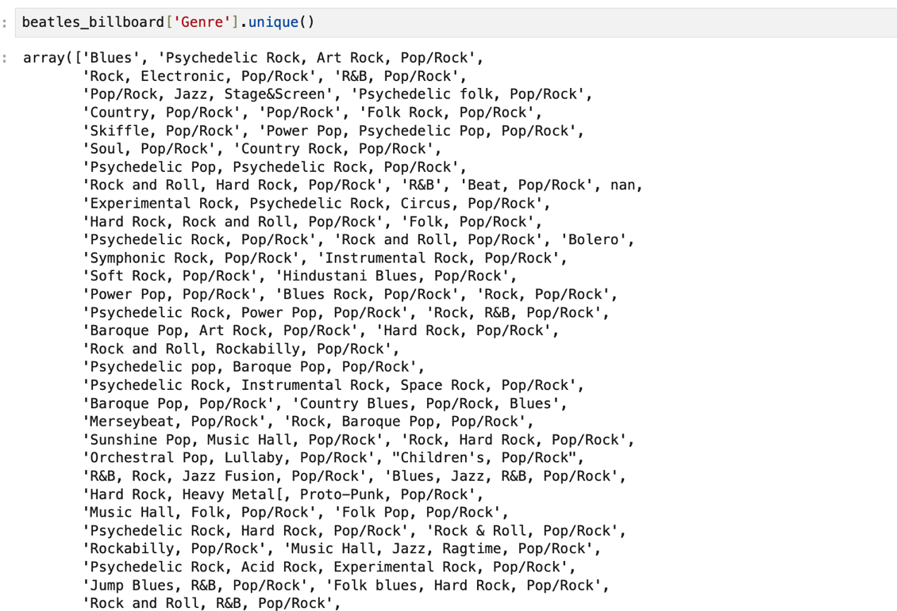
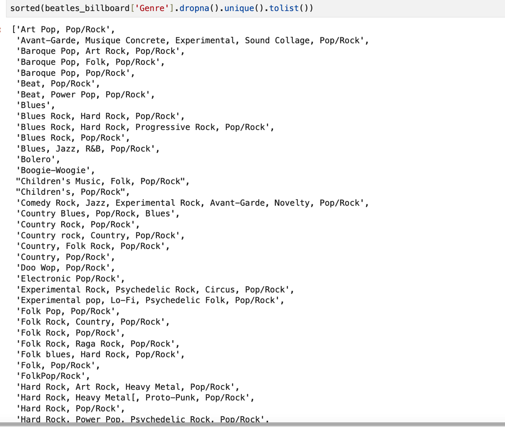

# Pandas:  Clean and Tidy Data

In this tutorial we explore various ways of cleaning data.  We also explore ways to make your data follow the "Tidy Data" principles, which will vastly simplify other work.  The key concept here is to *un-nest* the various cells that might contain multiple data points.  "One observation or event per row" is the preferred format for Tidy Data.

[Read more](https://pandas.pydata.org/about/).

[Tutorials](https://www.w3schools.com/python/pandas/default.asp).

[Pandas Cheat Sheet](https://pandas.pydata.org/Pandas_Cheat_Sheet.pdf).

<!---
7/16/24

The table of contents will need to be updated.

--->

Contents of this Tutorial

## [Create a Notebook and Load the Pandas library](#create-a-notebook-and-load-the-pandas-library-1)
## [Meet the Beatles (Again)](#meet-the-beatles-again-1)
## [Checking Data](#checking-data-1)
## [The NaN Problem](#the-nan-problem-1)
## [Duplicate Rows](#duplicate-rows-1)
## [Wrong Data Types:  Strings, Floats, Integers, Dates](#wrong-data-types--strings-floats-integers-dates-1)
## [Wrong or Inconsistent Case or Spelling](#wrong-or-inconsistent-case-or-spelling-1)
## [Leading/Trailing Whitespace or Characters](#leadingtrailing-whitespace-or-characters-1)
## [Replacing Text, Selectively](#replacing-text-selectively-1)
## [Cleaning Data with Functions](#cleaning-data-with-functions-1)
## [Split and Join](#split-and-join-1)


##  Create a Notebook and Load the Pandas library 

```python
import pandas as pd
```


##  Meet the Beatles (Again) 

We continue with our data about The Beatles:

* A set from **Spotify** includes information about 193 songs, albums, years, plus other acoustic ratings that Spotify uses to characterize tracks. View these data as a [Google spreadsheet](https://docs.google.com/spreadsheets/d/1CBiNbxqF4FHWMkFv-C6nl7AyOJUFqycrR-EvWvDZEWY/edit#gid=953807965).

* A set compiled by a team at the **University of Belgrade (Serbia)** that contains information about over 300 Beatles songs:  author(s), lead singer(s), album, musical genre(s), and standing in the Top 50 Billboard charts.  View these data on [Github]('https://github.com/inteligentni/Class-05-Feature-engineering/blob/master/The%20Beatles%20songs%20dataset%2C%20v1%2C%20no%20NAs.csv').

We will work with both of these sets, and in the process learn how to clean and 'tidy' the data in preparation for other operations.

Get the Spotify data:

```python
beatles_spotify_csv = 'https://docs.google.com/spreadsheets/d/e/2PACX-1vRCv45ldJmq0isl2bvWok7AbD5C6JWA0Xf1tBqow5ngX7_ox8c2d846PnH9iLp_SikzgYmvdPHe9k7G/pub?output=csv'

beatles_spotify = pd.read_csv(beatles_spotify_csv)
```

and the Billboard data:

```python
beatles_billboard_csv = 'https://raw.githubusercontent.com/inteligentni/Class-05-Feature-engineering/master/The%20Beatles%20songs%20dataset%2C%20v1%2C%20no%20NAs.csv'

beatles_billboard = pd.read_csv(beatles_billboard_csv)
```

<!---
7/16/24 Comment

Made corrections in following paragraph
--->


##  Checking Data


Missing data or data encoded as the wrong type will result in errors of various kinds.  Learn more about data cleaning with Pandas [here](https://www.w3schools.com/python/pandas/pandas_cleaning.asp).

You will first want to understand all the values you are trying to correct. Let's say you wanted to inspect all of the *unique values* found in the 'Genre' column of the Beatles Billboard data. Simply calling this `beatles_billboard['Genre'].unique()` will return the values, but as a numpy array, which is not easy to read.

<Details>
<Summary>View the Array of Values for "Genre" </Summary>



</Details>

<br>

Instead try `sorted(beatles_billboard['Genre'].dropna().unique().tolist())`, which displays as a single list of the values in alphabetical order. Note that here we include `dropna()` so that any Null values are ignored; otherwise you would return a type error.

<Details>
<Summary>View the Sorted List of Values for "Genre" </Summary>



</Details>

<br>

Looking over these you will quickly discover things that need to be cleaned or reformatted:

* leading/trailing whitespace
* variant spellings of the same term
* inconsistent capitalization
* and above all, the fact that in each case the various terms have been strung together as a single string  

See below for ways to address these systematically.


## The NAN Problem


In Python there is a difference between a "0" and nothing.  The latter is a Null, which represents "no data at all."  Nulls will result in errors when you attempt to perform some operation on them.  You cannot add to or compare something to a Null.  Nor can you test whether a Null contains some set of characters or matches a word. 

* **Find the NaN's**:  `df[df.isna().any(axis=1)]`, or for the billboard data:  `beatles_billboard[beatles_billboard.isna().any(axis=1)]`.  

<!---
7/16/24 Comment

Made corrections in following paragraph

Do you want to do something about 'inplace' now?  What is the solution?

Do you want something more explicit?

beatles_billboard['Album.debut'] = beatles_billboard['Album.debut'].fillna("unreleased")

--->

* **Fill the NaN's**. If you are performing mathematical operations, you can fill missing values with some default number or string. The solution will probably vary from one column to the next (since some are integers, some dates, and are text):  `beatles_billboard.fillna("-")` would fill *all NaN* with the same string.  But we could instead try something that would be more meaningful.  For example: `beatles_billboard['Album.debut'].fillna("unreleased", inplace=True)`
* If you are trying to filter a data frame by a particular keyword or condition, you can treat the Nulls as "False" and thereby ignore them, as have seen above:  `sorted(beatles_billboard['Genre'].dropna().unique().tolist())`


## Duplicate Rows


<!---
7/16/24

Corrected small typos and reformatted the following:

--->

Duplicate rows can also create errors, or distort your results.  

* Find them:  `duplicate = beatles_billboard[beatles_billboard.duplicated()]duplicate` (in this case there are none).  
* Remove them automatically with `beatles_billboard = beatles_billboard.drop_duplicates()`


## Wrong Data Types:  Strings, Floats, Integers, Dates


Wrong data type in a given column is another common error (particularly since Pandas attempts to guess the correct data type when importing from CSV or JSON).  In our beatles_spotify dataset, notice that *the data type for 'energy' is `object`*, which in the context of Pandas means it is a Python `string`.  As such we cannot perform mathematical operations on it. Change the data type with the `astype()` method:

```python
beatles_spotify['energy'] = beatles_spotify['energy'].astype(np.float64)
```

<!---
7/16/24

Corrected typos below

--->

The same thing can happen with **date-time** information.  In our orignal datasets, the "Year" columms are in fact integers.  This works fine for basic sorting.  But Pandas has an intelligent format for working with date-time information that allows us to sort by month-day-year, or create 'bins' representing quarters, decades, centuries.  

So you will need to check the original data type, then convert to strings before converting to **date-time format**.  For example:

```python
beatles_billboard["Year"] = beatles_billboard["Year"].astype(str)
```

Then convert that string to **datetime** format (in this case, in a new column, for comparison):

```python
beatles_billboard["Year_DT"] = pd.to_datetime(beatles_billboard["Year"], format='%Y')
```

<!--- 
7/15/24 comment:

The following suggestion about column order does NOT belong here.  Don't we have another portion of the Tutorials devoted to this?
--->

And then reorder the columns for clarity:

```python
beatles_billboard_sorted = beatles_billboard.iloc[:, [0, 1, 9, 3, 4, 5, 6, 7, 8]]
beatles_billboard_sorted.head()

```
<!--- 
7/15/24 comment:

New title for the following section and additional content, too,

--->

## Wrong or Inconsistent Case or Spelling


You often notice that data are filled with inconsistencies:  

* variant spellings ('color' vs 'colour')
* inconsistent capitalization ('rock and roll', 'Rock and Roll')

There are Pandas methods to help with this process.  Mainy of them use the `str` accessor, to which you in turn apply any of a number of tools to correct the problem, as described below.  What's more, you can apply the `str.my_method()` to an entire dataframe, an entire column, or even to some subset of column values that match a particular condition.

Here are some examples:

#### Inconsistent Capitalization

Access the column, then add `.str.lower()` and copy this back into the original column (or you could make a new column):

```python
# make all the terms lower case
beatles_billboard['Genre'] = beatles_billboard['Genre'].str.lower()
```

## Leading/Trailing Whitespace or Characters

#### Dealing with Trailing/Leading Whitespace

You might also notice that some strings include leading and trailing spaces (' rock') [in which there is a space *before* the word]

Here we add `.strip()` to the `str.` accessor:

```python
beatles_billboard['Genre'] = beatles_billboard['Genre'].str.strip()
```

Note that this will `strip()` the leading/trailing spaces from the *complete string* in each cell.  

But if we `split()` the long strings of genre names into lists (as suggested below), or even `explode()` a dataframe so that each row has only a single Genre term, we will find that there are still other leading/trailing spaces associated with individual strings in these lists.  So you might need to use `strip()` more than once!

#### Dealing with Trailing/Leading Characters

In the Genre column of the Beatles Billboard data, some terms have *spurious bracket symbols at the end of the given genre label*.  You can use the `strip` method to remove them, just pass in the character or string you want to remove:

```python
beatles_billboard['Genre'] = beatles_billboard['Genre'].str.strip('[')
beatles_billboard['Genre'] = beatles_billboard['Genre'].str.strip(']')
```
**Important**: The `strip('my_symbol') will only remove things that appear *at the beginning or end* of the complete contents of the cell!

#### Chaining strip() Commands

Note that we can also chain these methods together in a single line of code:


```python
beatles_billboard['Genre'] = beatles_billboard['Genre'].str.lower().str.strip().str.strip('[').str.strip(']')
```


##  Replacing Text, Selectively


The `str` accessor also has a built-in `replace()` method that allows you to selectively change the contents of any substring. In the following string, let's say we needed to fix a spelling error:

`genre_name = "rock&roll"`

Since the `genre_name` variable is *already a string* you can do this simply by calling `name.replace('rock&roll', 'rock')`.  Note that the first string within the `replace()` method is the string to match, and the second is the updated string you want.

If you were working only with this single variable, you would want to refresh the original variable:

`genre_name = genre_name.replace('rock&roll', 'rock')`

But you can also use the `replace()` method on an entire column of a dataframe.  Here the key step is to remember that *you will also need to include `str.` in order for Pandas to access the contents of the given cell as a string*.  The following code will relace the substring `rock&roll` with `rock` anywhere it appears in the designated column.

```python
beatles_billboard['Genre'] = beatles_billboard['Genre'].str.replace('rock&roll', 'rock')
```
You also might want to regularize:

* 'rock & roll', 'rock'
* 'r&b' (as 'rhythm and blues' ?)
* 'stage&screen' (as 'stage and screen')
* 'experimental music' as 'experimental', or 'children's music' as 'children's' (since having 'music' in a list of music genres is not very useful)


##  Cleaning Data with Functions


Some situations are more complex, and you might want to use subject the contents of the cell to some conditional test before you make the correction.  In this case `str.replace()` might not be subtle enough for your needs.

Now that you know what the problem values are, write a **function** that corrects `John Lenin` to `John Lennon`.  If you don't recall **functions** see **Python Basic Notebook**!

```python
def name_check:
    if df["Artist"] == "John Lenin":
        return "John Lennon"
```
In this case the **return** statement makes the result available for the next step in the process.

But how to run this over **all rows** of a data frame?  We can easily do this with the **apply** method. In effect it **apply** allows us to automatically pass over all rows in the data frame, transforming only the column we select.  

```python
df['column'] = df['column'].apply(name_check)
```

Note that we could use this approach not only for correcting data, but for creating **new columns** based on **existing columns**.  For example:  a Boolean column (True/False) based on the result of the contents of another column.  Here the new column will report True for any row where the column "artist" contains the string "Lennon".  

```python
df['By_Lennon'] = df['artist'].str.contains("Lennon")
```


<!---
7/16/24

Does the following discussion of Boolean filtering belong here in the Clean and Tidy Tutorial?  

Should this instead be in the Filter/Sort/Group section?

--->
We can then use the Boolean column to filter the entire frame (see below).

Try some out:

**NANs anywhere:**

```python
beatles_billboard[beatles_billboard.isna().any(axis=1)]
```

**Replace NA's in Album column with 'unreleased'**

```python
beatles_billboard['Album.debut'].fillna("unreleased", inplace=True)
beatles_billboard.head(25)
```

**Convert the year column to an integer, then use the Pandas "year" format to make an intelligent date out of it, and sort the columns according to their `index` positions:**

```python
beatles_billboard["Year"] = beatles_billboard["Year"].astype(int)
beatles_billboard["Year_DT"] = pd.to_datetime(beatles_billboard["Year"], format='%Y')
beatles_billboard_sorted = beatles_billboard.iloc[:, [0, 1, 9, 3, 4, 5, 6, 7, 8]]
beatles_billboard_sorted.head()
```

You can think of some others!

<!---
7/16/24 Comments

The following is new--a general heading for nested lists and tuples

--->


## Split and Join

The Beatles Billboard dataset is filled with interesting information. But the way the data have been formatted is in some ways frustrating.  As we have seen above, the individual cells of the 'Genre' appear to contain a list of various terms. But on close inspection this is *not a list in the Pythonic sense*:  it is just a long string, and thus any attempt to count or analyze the individual genre terms will not be possible.

```python
beatles_billboard['Genre'][1]
'Psychedelic Rock, Art Rock, Pop/Rock'
```


#### Split Long String into List of Strings

We can `split` this long string with a built-in Python function available to the `str.` accessor, which is in turn applied to the complete column.  It looks for the commas and then divides the long string into individual strings, returning them as a Python `list` object: 

```python
beatles_billboard['Genre'] = beatles_billboard['Genre'].str.split(', ')
```

And now the cell looks like a proper Python list:

```python
beatles_billboard['Genre'][1]
['Psychedelic Rock', 'Art Rock', 'Pop/Rock']
```

As a next step, we might want to 'tidy' the data by *putting the individual strings on separate rows*, which would be useful for **GroupBy operations**. See the next tutorial to learn how!

#### Join List of Strings into a Single String

We could also *reverse the process*, in this case with a simple function that will take a list of strings and return a single string.  We then `apply()` that function to all the rows in the given column.

```python
# define the function to convert a list of strings into a single string, with individual items separated by commas
def convertlist(my_list):
    out = ""
    if isinstance(my_list, list):
        out = ', '.join(my_list)
    return out  
# now apply the function to a given column
df['my_col'] = df['my_col'].apply(convertlist)
```

#### Tuple Trouble (and How to Cure It)

Tuples (such as: `(Rock, Pop)`) can present special challenges, since they do no lend themselves well to certain operations, such as counting all the values. If you have 'tuple trouble' you can convert these with a simple function that uses the `join` method, returning the tuple items as a single string. Here is how to do it:


```python
# define the function to convert tuples to strings, joined by the "_" character
def convertTuple(tup):
    out = ""
    if isinstance(tup, tuple):
        out = '_'.join(tup)
    return out  
# clean the tuples using 'apply'
df['my_col'] = df['my_col'].apply(convertTuple)
```

