___________
# **Music Data Analysis: Spotify API with Pandas, Altair, and NetworkX**

This tutorial illustrates several ways to operate Spotify API using Spotipy – a Python package designed to enable user-friendly (ish) interactions with Spotify's music metadata. 

In Part 1 of this tutorial, we will use Spotipy and Pandas to **set up a DataFrame containing a collection of songs (tracks)** found by a playlist ID. Then, we will investigate ways to **visually represent and compare** this collection using Altair and Plotly (Part 2) and explore the basics of **network graph visualization** using Pyvis and NetworkX.

You can learn more about these resources here:
* [Spotify API](https://developer.spotify.com/documentation/web-api/)
* [Spotipy](https://spotipy.readthedocs.io/en/master/#)
* [Pandas](https://pandas.pydata.org/)
* [Altair](https://altair-viz.github.io/)
* [Plottly](https://plotly.com/python/radar-chart/)
* [Pyvis](https://pyvis.readthedocs.io/en/latest/)
* [NetworkX](https://networkx.org/)


## Brief Introduction: Spotify, APIs, Spotify API, and Spotipy

**Spotify** is a paid music streaming web application launched in 2006. The service has about 182 million subscribers and hosts more than 70 million tracks. In 2014, Spotify released **Spotify API**, a web-based interface that allows anyone with a Spotify account to search, analyze, and manipulate Spotify's music metadata. In short, **an API** is a piece of software that enables two or more programs to talk to each other. You can learn more about APIs [here](https://en.wikipedia.org/wiki/API).

This tutorial explains, you'll be able to request Spotify API access for your personal notebook and perform all sorts of analyses on the tracks, users, artists, albums, and playlists of your interest. 

Thanks to [Max Hilsdorf](https://towardsdatascience.com/how-to-create-large-music-datasets-using-spotipy-40e7242cc6a6), whose Spotipy library does the heavy lifting of bringing Spotify data to your Notebook. 

Note that as part of the **Encoding Music** course, we have created a special `spotipy_tools.py` library that includes all of the key functions explained below.  If you install that library along with the others shown below.
______

## **Part 1: Setting up**
### Step 1.1: Importing Python Libraries

You will need the following libraries:
```

import pandas as pd
import numpy as np
import random
import altair as alt
import requests
import inspect
import spotipy
from spotipy.oauth2 import SpotifyClientCredentials
import networkx as nx
import networkx.algorithms.community as nx_comm
import matplotlib.cm as cm
import matplotlib.pyplot as plt
import pyvis
from pyvis import network as net
from itertools import combinations
from community import community_louvain
from copy import deepcopy
```

### Step 1.2: Providing User Credentials


In order to utilize the functionality of Spotify's API, you'll need to establish a connection between the local endpoint (your laptop) and the API (cloud). To do that, you'll need to create a **web client** (read more [here](https://en.wikipedia.org/wiki/Client_(computing))).

A web client typically requires authentication parameters **(key and secret)**. Spotify API uses OAuth2.0 authorization scheme. You can learn more about authentication [here](https://en.wikipedia.org/wiki/OAuth).

We can share a common login for use by students in Encoding Music.  But to create your own key and secret, you will need to:

* Log in to Spotify with your personal account
* Visit the [Spotify for Developers](https://developer.spotify.com/dashboard/create) page
* Provide information about an 'app' you are developing.  This does not need to be a real app (yet), but simply provide a `name` ("my_M255_project" will do), and some `website` url (this could be any URL, for instance your github address), and a `redirect` URI (which could be the same address).
* After entering these, Spotify will provide you with a **key** and **secret**. Make a note of these some place secure!  You will need them, and **you should not share them**!

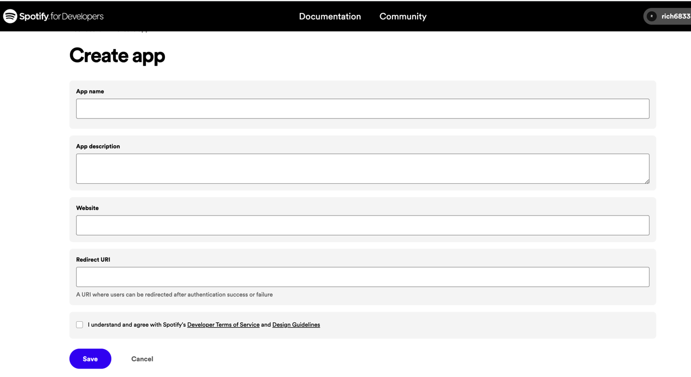

Enter your tokens and username below:

```
python
# storing the credentials:
#
CLIENT_ID = "MY_ID"
CLIENT_SECRET = "MY_SECRET"
my_username = "my_spotify_name"

# instantiating the client
# source: Max Hilsdorf (https://towardsdatascience.com/how-to-create-large-music-datasets-using-spotipy-40e7242cc6a6)
client_credentials_manager = SpotifyClientCredentials(client_id=CLIENT_ID, client_secret=CLIENT_SECRET)
sp = spotipy.Spotify(client_credentials_manager=client_credentials_manager)
```


```
AUTH_URL = 'https://accounts.spotify.com/api/token'

# POST
auth_response = requests.post(AUTH_URL, {
    'grant_type': 'client_credentials',
    'client_id': CLIENT_ID,
    'client_secret': CLIENT_SECRET,
})

# convert the response to JSON
auth_response_data = auth_response.json()

# save the access token
access_token = auth_response_data['access_token']
```

At this point, you should be perfectly able to access the API! Hence, we move on to scraping and analyzing music metadata.

----------
## **Part 2: Analyzing Playlists**

We can **get tracks in a playlist** of a user using the *sp.user_playlist_tracks(username, playlist)* method and turning it into a Pandas DataFrame. The two parameters we need for this are **user ID** and **playlist ID**; they can be easily found on the Spotify website or in the Spotify app. Just look in the URL bar and copy the IDs as Strings.

In this we are using the following data:
* "sx47r9lq4dwrjx1r0ct9f9m09": user_1's **Spotify User ID**. Typically, a Spotify ID is formatted somewhat nicer (e.g. "barackobama" but user_1 somehow messed his up...
* "7KfWEjHxpcOIkqvDqMW5RV": the **Playlist ID** for one of user_1's playlists. 

Both playlist ID and User ID **can be found in a web browser** when accessing the User's or Playlist's webpage.

* for example, user_1's Spotify User page can be found at: "https://open.spotify.com/user/sx47r9lq4dwrjx1r0ct9f9m09", and you can see that the User ID is what follows ater "...user/", meaning "sx47r9lq4dwrjx1r0ct9f9m09"
* for example, Spotify's featured Pop Mix playlist can be found at: "https://open.spotify.com/playlist/37i9dQZF1EQncLwOalG3K7", and you can find the Playlist ID ater "...playlist/", meaning "37i9dQZF1EQncLwOalG3K7"

### Tracks in a Playlist
```
# specify the name of the user who created the list
user_id = "my_user_name"
# and the id of the playlist (this will be everything after the last "/" in the url of the list)
play_list_id = "some_string_of_numbers_letters" 
playlist_tracks = pd.DataFrame(sp.user_playlist_tracks(user_id, play_list_id))
# playlist_tracks
```

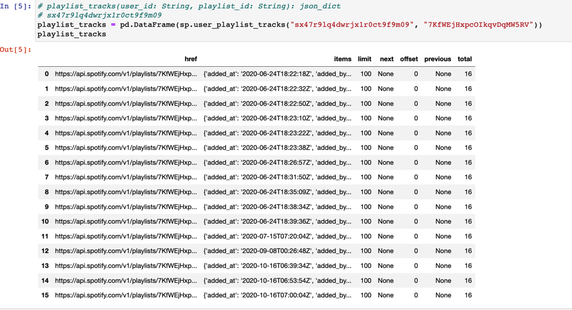

### One Track 
We can take a look at an **individual track** here:


```
sample_track = playlist_tracks.iloc[1]["items"]["track"]
sample_track
```

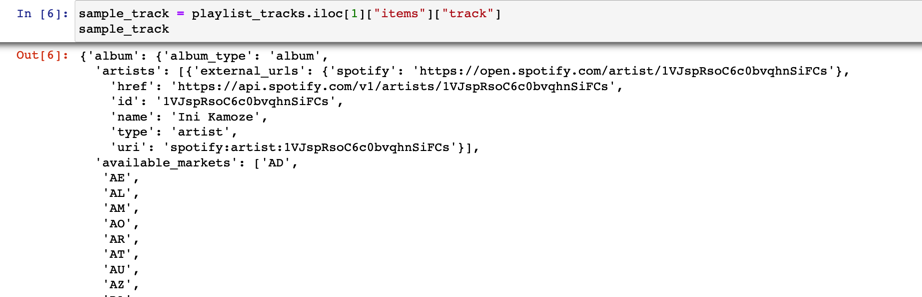


As you can notice, tracks are stored as **JSON objects** (think Dictionaries), which you can read more about [here](https://developer.mozilla.org/en-US/docs/Web/Juser_2cript/Reference/Global_Objects/JSON). Each Track object has many attributes, including "album", "artists", "id", "duration", "popularity", "name" etc. Some of these are extremely useful to us! You can learn more about Spotify's Track features [here](https://developer.spotify.com/documentation/web-api/reference/#/operations/get-track).

### Audio Features in One Track

While this information is already a lot (!), we can extract some perhaps-more-interesting features of tracks via the Audio Features method. Using *sp.audio_features(track_id)*, we easily get track's audio features (by track_id):


```
sample_track_audio_features = pd.DataFrame(sp.audio_features(sample_track["id"]))
sample_track_audio_features
```

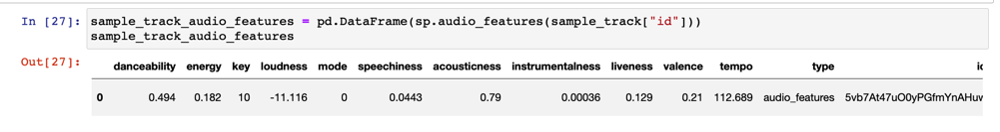


As you can see, each track has **a large number of recorded audio features**. These are typically generated by Spotify and cover various musical aspects, ranging from Loudness to Liveness, from Danceability to Duration, and from Tempo to Time Signature. The feature values are of different **data types**: "key" is an **Integer**, "energy" is a **Float**, "id" is a **String**, and "mode" is a **Boolean** represented as Integer. As you work your way through this notebook, you will discover many options to count, bin, sort, graph, and connect variables and values of different types.

### Audio Features for All Tracks in a Playlist

Consider the function below (courtesy of Max Hilsdorf), which can help us **loop through the items of a playlist and get every track's audio features of interest**:

Note:  this function is available to you via the spotipy_tools library.  The code below is just for reference.

To call the function on a playlist, simply create a cell with:

```
get_audio_features_df(playlist)
```


```
# This function is created based on Max Hilsdorf's article
# Source: https://towardsdatascience.com/how-to-create-large-music-datasets-using-spotipy-40e7242cc6a6
def get_audio_features_df(playlist):
    
    # Create an empty dataframe
    playlist_features_list = ["artist", "album", "track_name", "track_id","danceability","energy","key","loudness","mode", "speechiness","instrumentalness","liveness","valence","tempo", "duration_ms","time_signature"]
    playlist_df = pd.DataFrame(columns = playlist_features_list)
    
    # Loop through every track in the playlist, extract features and append the features to the playlist df
    for track in playlist["items"]:
        # Create empty dict
        playlist_features = {}
        # Get metadata
        playlist_features["artist"] = track["track"]["album"]["artists"][0]["name"]
        playlist_features["album"] = track["track"]["album"]["name"]
        playlist_features["track_name"] = track["track"]["name"]
        playlist_features["track_id"] = track["track"]["id"]
        
        # Get audio features
        audio_features = sp.audio_features(playlist_features["track_id"])[0]
        for feature in playlist_features_list[4:]:
            playlist_features[feature] = audio_features[feature]
        
        # Concat the DataFrames
        track_df = pd.DataFrame(playlist_features, index = [0])
        playlist_df = pd.concat([playlist_df, track_df], ignore_index = True)
        
    return playlist_df
```

Note: the **@playlist parameter** (that is passed in to the get_audio_features_df() method) should be a **DataFrame consisting of several track objects**. In our case, we have one such collection stored in **playlist_tracks**, which we got from calling sp.user_playlist_tracks() on a playlist and storing it as a Pandas DataFrame. Running the get_audio_features_df() method on our tracks will return the **audio features DataFrame** for the tracks in **playlist_tracks**.


```
audio_features_df = get_audio_features_df(playlist_tracks)
audio_features_df.head()
```

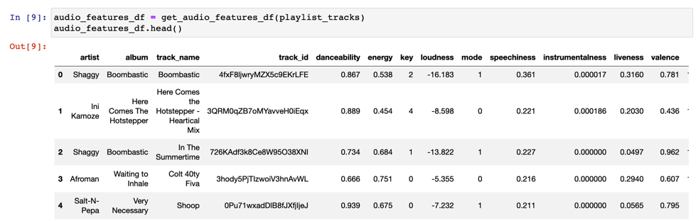


### Save these as CSV for later, if you like:

```
audio_features_df.to_csv("Miles_Davis_Spotify.csv")
```

As you can see above, our new DataFrame contains **Spotify's audio features for every track in the provided playlist**.

## Step 2.2: Charting Data

As we now have a collection of data points that represent different feature values for one complete playlist, we should be able to graph our findings using Altair. While there are many available charts, we will start with graphing **one feature's values for every item (track) in the series**. 

### A Scatterplot of a Playlist (based on one audio feature)

To illustrate this concept, we will use **Altair's scatterplot** to chart **each track's tempo**. This could be done by setting the Chart's data source to **audio_features_df**, it's **x** variable to **track_name** and it's **y** variable to **tempo**.

Here's our chart:


```
alt.Chart(audio_features_df).mark_point().encode(
    x="track_name",
    y='tempo'
)
```


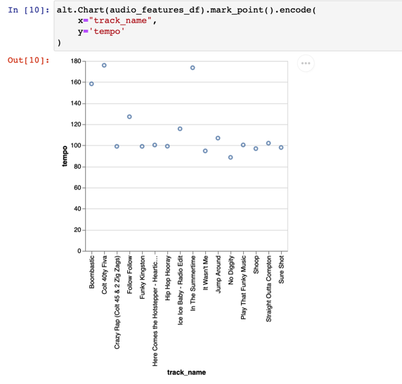


Note: by default, Altair will sort the tracks alphabetically. If you prefer to keep the original sorting or sort them some particular way, you should toggle the **sort** attribute on the axis of interest. Specifically, we will set up our **x** variable this way: *x=alt.X("track_name", sort=None)* instead of *x="track_name"*. 

You can read more about **Altair's axis sorting** [here](https://altair-viz.github.io/user_guide/generated/channels/altair.X.html). 

### Adding Multiple Variables: Plotting Correlations


While there are many available charts, one useful way to visually illustrate a correlation between two variables (think DataFrame columns) is **constructing a scatterplot using two data ranges**. 

In general, a Scatterplot requires **two variables (data ranges)** that will be mapped according to their corresponding values. For example, consider **"energy"** and **"loudness"**. Our first track (Shaggy: Boombastic) has an "energy" score of 0.538 and a "loudness" score of -16.183, which together make one of the points on the scatterplot: (0.538, -16.183); the second track (Ini Kamoze: Here Comes The Hotstepper) makes up the (0.454, -8.598) datapoint – hopefully, you can see where this is going.

You can read more about Altair's scatterplots [here](https://altair-viz.github.io/gallery/scatter_tooltips.html).

In the example below, we are using **audio_features_df** as the data source, **"energy"** as the x (horizontal variable) and **"loudness"** as the y (vertical variable). Let's take a look at the result:


```
alt.Chart(audio_features_df).mark_point().encode(
    x='energy',
    y='loudness'
)
```


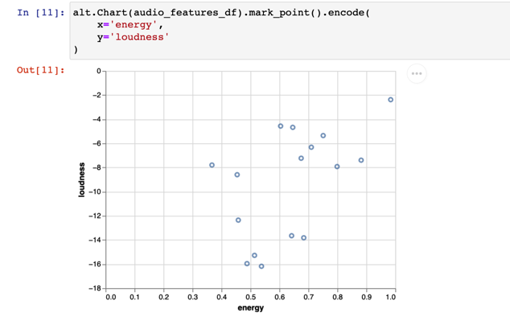


As you can see in the example above, "energy" and "loudness" tend to have somewhat of a **corresponding upward trend**: for items with higher "energy", "valence" tends to be higher, too. This, in turn, corresponds to our natural hypothesis: one could normally expect a higher-energy track to be louder. Mathematically, the relationship between these two variables could be described as one having **positive correlation**. 

Learn [more about correlations](https://www.washington.edu/assessment/scanning-scoring/scoring/reports/correlations/).  Also see Edgar Leon's [regressions tutorial](https://github.com/RichardFreedman/Encoding_Music/blob/dev_Edgar/Regressions.md)

Using Pandas' built-in *pandas.Series.corr()* method, it is extremely easy to obtain the **Correlation Coefficient** for the two variables:


```
audio_features_df['energy'].corr(audio_features_df['loudness'])
```


    0.5252140232410945

### Radar Plots

Radar (or Polar) plots are a useful way to represent multiple variables at once.

Read more about the various features via [Plotly](https://plotly.com/python/radar-chart/) (under scatter plots):

While there is a multitude of aspects to correlation (including test types, sample sizes, strengths, variance, and many other factors), it sometimes can be a useful statistical measure in your Music Data Analysis exploration.

This function is available via the spotipy_tools.py library, so the following is just for purposes of explanation (or if you want to adapt it in some way):


```
feature_columns = ["danceability", "energy", "speechiness", "liveness", "instrumentalness", "valence", "danceability"]
def createRadarElement(row, feature_cols):
    return go.Scatterpolar(
        r = row[feature_cols].values.tolist(), 
        theta = feature_cols, 
        mode = 'lines', 
        name = row['track_name'])

def get_radar_plot(playlist_id, features_list):
    current_playlist_audio_df = get_audio_features_df(pd.DataFrame(sp.playlist_items(playlist_id)))
    current_data = list(current_playlist_audio_df.apply(createRadarElement, axis=1, args=(features_list, )))  
    fig = go.Figure(current_data, )
    fig.show(renderer='iframe')
    fig.write_image(playlist_id + '.png', width=1200, height=800)
    
def get_radar_plots(playlist_id_list, features_list):
    for item in playlist_id_list:
        get_radar_plot(item, features_list)
```


```
playlist_id = "1NppEwvZhkjeG3ZTYoOwVM"
get_radar_plot(playlist_id, feature_columns)
```

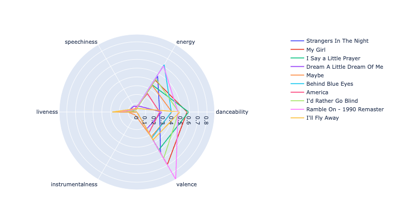

### Categorization:  From Continuous to Discrete Variables

To categorize your tracks, you would sometimes need to map their values from a continuous range onto a discrete range. Typically, we call this process **"binning"**. Binning usually involves creating a new column within the existing (or in a new) DataFrame such that the new column's values correspond to the discretely defined categories of the item (based on some threshold value).

Read more about [continuous and discrete variables](https://en.wikipedia.org/wiki/Continuous_or_discrete_variable).

For example, consider **"danceability"** – a continuous variable with values ranging from 0 to 1. In order to **"bin"** our tracks, we will classify everything with a "danceability" score of 0.75 and higher as a dance tune. For this, we'll create a new column – "dance_tune", and if a track's "danceability" score is equal to or above 0.75, its "dance_tune" value should be True; otherwise, it should be set to False.

This can be easily done using Pandas and NumPy's [np.where method](https://numpy.org/doc/stable/reference/generated/numpy.where.html).

Here's how to do it:


```
feature_based_tracks = audio_features_df.copy() # make a copy of the DataFrame
feature_based_tracks["dance_tune"] = np.where(feature_based_tracks['danceability'] >= 0.75, True, False)
feature_based_tracks.head()
```

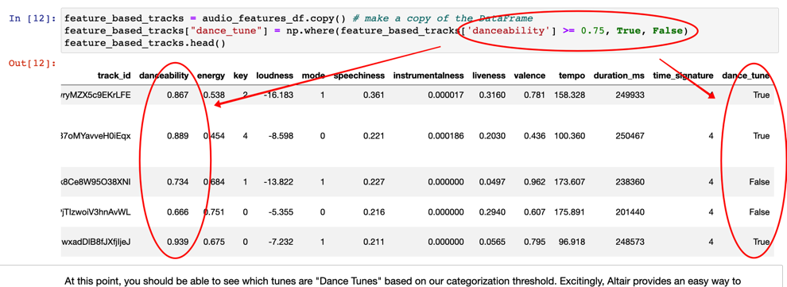

At this point, you should be able to see which tunes are "Dance Tunes" based on our categorization threshold. Excitingly, Altair provides an easy way to visualize our findings using a **bar chart**.

You can learn more about Altair's bar charts [here](https://altair-viz.github.io/gallery/simple_bar_chart.html).

Here's how to do it:


```
alt.Chart(feature_based_tracks).mark_bar().encode(
    x='dance_tune',
    y='count()'
)
```

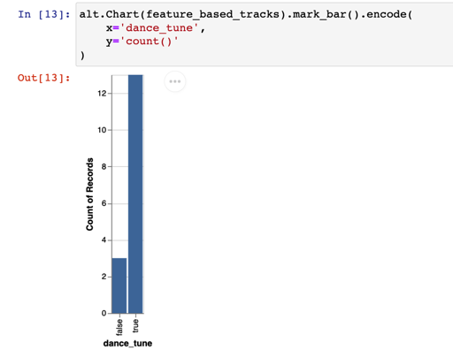


As you can see, our data indicates that out of 16 songs in the playlist, 13 are Dance Tunes (e.g. have a "danceability" score of at least 0.75) and 3 are not. 

<br> 

If we were looking to make our lives even more complicated, we could **bin "energy"** based on a 0.75 "energy" score threshold:


```
feature_based_tracks["energy_tune"] = np.where(feature_based_tracks['energy'] >= 0.75, True, False)
feature_based_tracks.head()
```

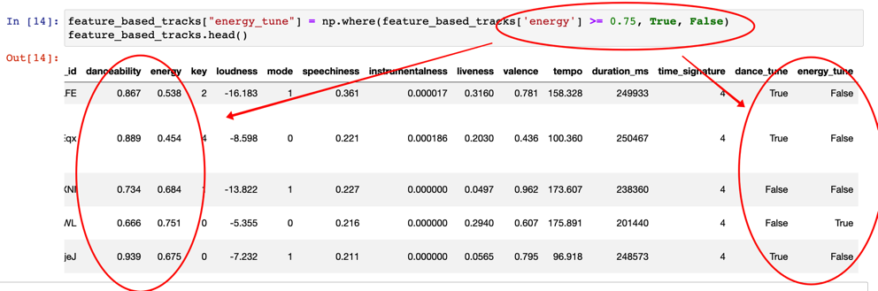


Based on this information, we can **analyze the composition** of our modified DataFrame using Altair. For example, one could think: out of the dance tunes, are most high energy or low energy? 

Here's a way to find out using Altair:


```
bars = alt.Chart().mark_bar().encode(
    x=alt.X('energy_tune', title=""),
    y=alt.Y('count()', title='Count'),
    color=alt.Color('energy_tune', title="High energy")
)

alt.layer(bars, data=feature_based_tracks).facet(
    column=alt.Column('dance_tune', title = "Dance tune")
)
```


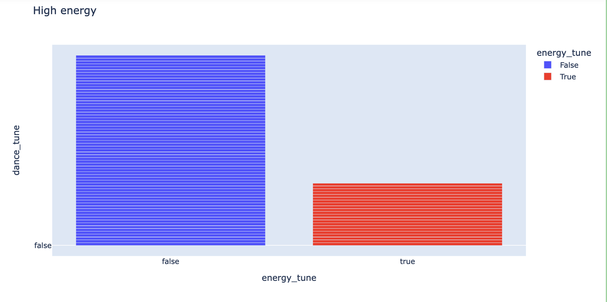


Alternatively, we can use **Altair's built-in bin method** of the Chart object to produce more standard binning. This is typically useful when creating a Histogram.

You can learn more about binning and histograms in Altair [here](https://altair-viz.github.io/gallery/simple_histogram.html).

Here's an example:


```
alt.Chart(feature_based_tracks).mark_bar().encode(
    alt.X("danceability", bin=True),
    y='count()',
)
```

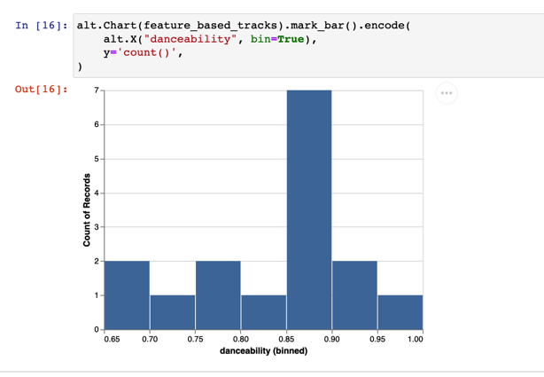


Another extremely useful tool is **sorting a DataFrame** based on one or many columns. As an example, we can sort our brand new DataFrame by the Tracks' "energy":


```
my_sorted_df = feature_based_tracks.sort_values(['energy'], ascending=[True])
my_sorted_df.head()
```

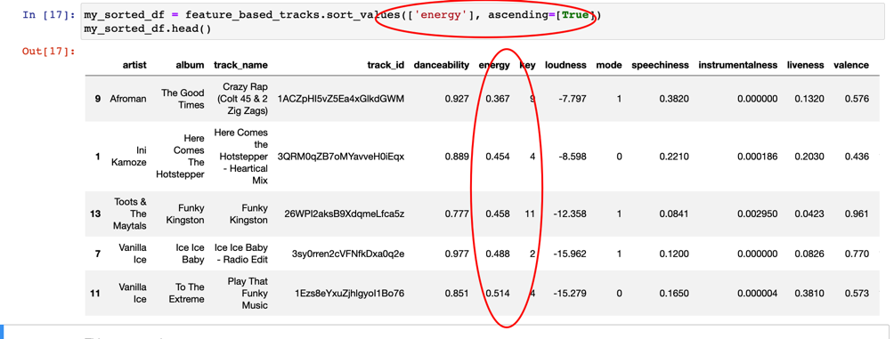


Things to note here:
* the tracks in this new DataFrame are arranged based on their "energy" scores
* the tracks' indices are now inconsequent (the leftmost column), but could be easily reset (check out Pandas B lab)
* the tracks can also be sorted by multiple columns (specified in the value list)

Let's **chart the Tracks' "energy" based on our new DataFrame**:


```
alt.Chart(my_sorted_df).mark_point().encode(
    x=alt.X("track_name", sort=None),
    y="energy"
)
```

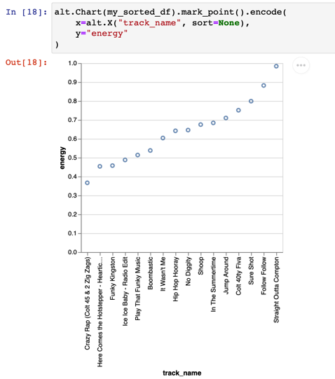


----------
## **Part 3: Comparing Playlists**

In this part, we will obtain tracks from multiple playlists (from the same user) and compare these playlists using Altair's charts and scatterplots and Panda's built-in statistics methods.

### Get All Tracks Belonging to a Particular User

Building onto Max Hilsdorf's code, we can create a function that would **produce an audio features DataFrame for all tracks for a given Spotify User** based on a User ID:

Note that this function is included in the `spotipy_tools.py` library, so you only need to run it below.  The code here is just for purposes of explanation.


```
# preserve the name of the playlist in the dataframe
def get_all_user_tracks(username):
  all_my_playlists = pd.DataFrame(sp.user_playlists(username))
  list_of_dataframes = []

  for playlist in all_my_playlists.index:
    current_playlist = pd.DataFrame(sp.user_playlist_tracks(username, all_my_playlists["items"][playlist]["id"]))
    current_playlist_audio = get_audio_features_df(current_playlist)
    if all_my_playlists["items"][playlist]["name"]:
      current_playlist_audio["playlist_name"] = all_my_playlists["items"][playlist]["name"]
    else:
       current_playlist_audio["playlist_name"] = None
    list_of_dataframes.append(current_playlist_audio)

  return pd.concat(list_of_dataframes)
```
Or simply:

    get_all_user_tracks(username)


Using this function, we can get **all tracks contained in user_1's followed public playlists** and **produce an Audio Features DataFrame** for them:


```
# Getting the current_user's all tracks
all_my_tracks = get_all_user_tracks(my_username)
all_my_tracks["Author"] = "user_1" # noting where the tracks came from
all_my_tracks.head()
```


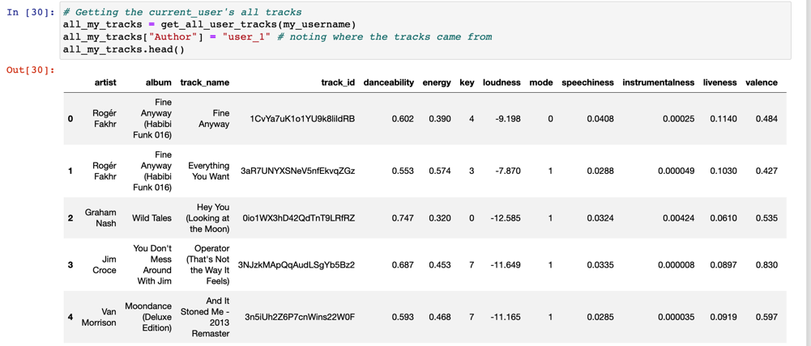


As you can see, our new DataFrame consists of 267 tracks – which are pretty much **all user_1's tracks**. Using the familiar tools from Altair, we can **produce a color-coded chart** for the new collection.

Specifically, we can **color** the data points **based on the playlist** they are in:


```
alt.Chart(all_my_tracks).mark_point().encode(
    x="liveness",
    y="danceability",
    color="playlist_name"
)
```

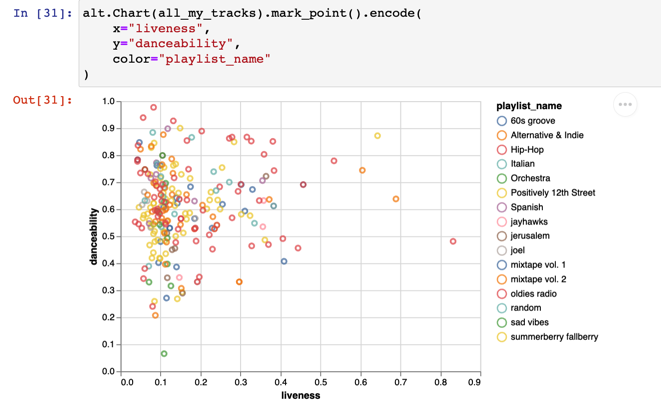


Bigger sample sizes prompt stronger observations! If you have noticed a trend when looking at just the 16 Tracks of the initial playlist, you are much more likely to witness a similar trend as the **sample size increases**.

Another useful chart would be **charting every track's energy and color-coding the data points** based on what playlist they are in.

Here's how to do it:


```
alt.Chart(all_my_tracks).mark_point().encode(
    x=alt.X("track_name", sort=None),
    y='energy',
    color="playlist_name",
    tooltip=["artist", "track_name", "playlist_name"]
).properties(
    width=1200
)
```

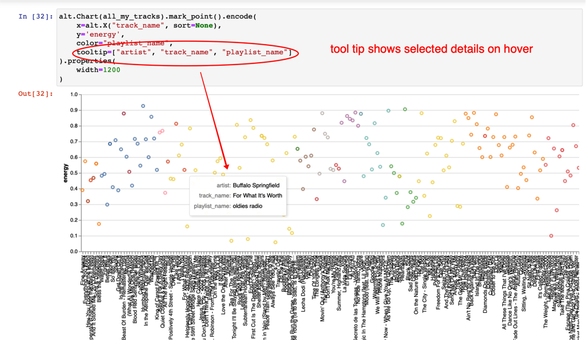


As you can see in the chart above, user_1's playlists tend to **follow a certain "energy" trend (typically upward)** as the playlist progresses. This likely corresponds with how many of you listen to your own playlists: start with less energetic songs and move on to more energetic ones.

Mathematically, we can **describe** each playlist as a subset of the overall DataFrame. You can read more about categorical descriptions in [Pandas](https://pandas.pydata.org/docs/reference/api/pandas.DataFrame.describe.html).

Here's how to get the **description detail for a particular Playlist**:


```
all_my_tracks[all_my_tracks["playlist_name"] == "Alternative & Indie"].describe()
```

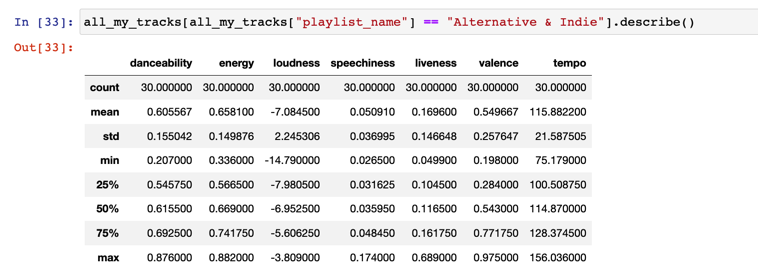


### Comparing Playlists Across Users

Now, let's compare user_1's tracks to another listener! For example, we could **get one of User_2 playlists** using the *sp.plylist_items()* method. In this example, we will use a playlist with Playlist ID = "3tt4ET474Xr1uOPgNz8jAY" 

Here's how to do it:


```
user_2_playlist_df = pd.DataFrame(sp.playlist_items("3tt4ET474Xr1uOPgNz8jAY"))
user_2_playlist_df.head()
```


Similarly to what we have done earlier, we can **construct an Audio Features DataFrame** for this playlist:


```
user_2_audio_features_df = get_audio_features_df(user_2_playlist_df)
user_2_audio_features_df["Author"] = "user_2"
user_2_audio_features_df.head()
```

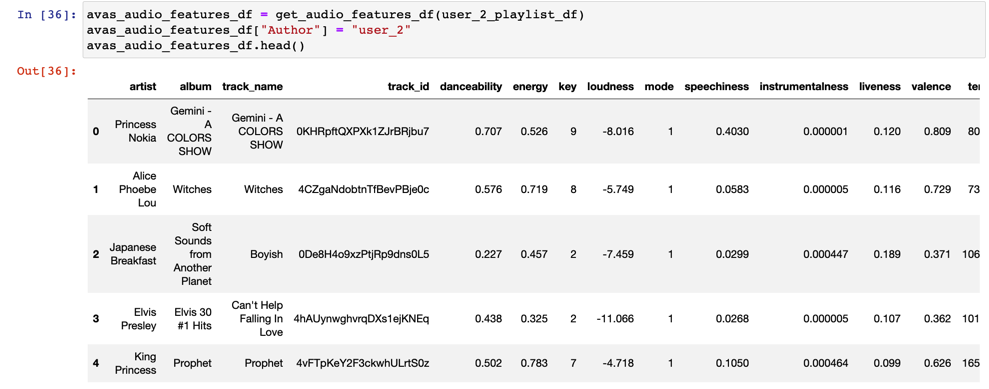


As it is useful to conduct comparisons on collections of similar sizes, we could **import one of user_1's playlists of relatively similar length**. One of such playlists has ID "47VfnY1RsMOadBdy9MCDYW"; and, as we've seen before, user_1's Spotify User ID is "sx47r9lq4dwrjx1r0ct9f9m09". 

After constructing the playlist DataFrame, we will concatenate the two individual-playlist-based DataFrames into one. This will help us chart our results.

Here's how to do it:


```
# Getting one of user_1's playlists
gs_playlist_tracks = pd.DataFrame(sp.user_playlist_tracks("sx47r9lq4dwrjx1r0ct9f9m09", "47VfnY1RsMOadBdy9MCDYW"))
gs_playlist_tracks_audio_df = get_audio_features_df(gs_playlist_tracks)
gs_playlist_tracks_audio_df["Author"] = "user_1"

# Combining the two DataFrames
two_playlists_combined = pd.concat([gs_playlist_tracks_audio_df, user_2_audio_features_df], ignore_index=True)
two_playlists_combined.head()
```

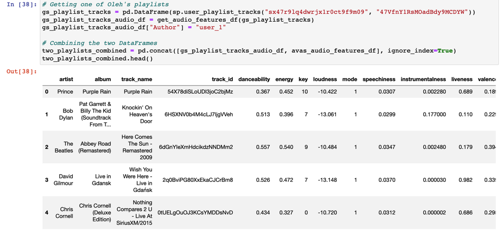

### Comparative Charts of Multiple Playlists

Finally, we can **chart the two playlist side by side**.

In this example, we color the entries based on the Author column and sort them exactly the way they appear in the original playlist (by setting sort=None). We will color User_2 tracks blue and user_1's tracks yellow. Some trends are very visible from the plot:


```
alt.Chart(two_playlists_combined).mark_point().encode(
    x=alt.X("track_name", sort=None),
    y='energy',
    color="Author",
    tooltip=["artist", "track_name"]
).properties(
    width=1000
)
```

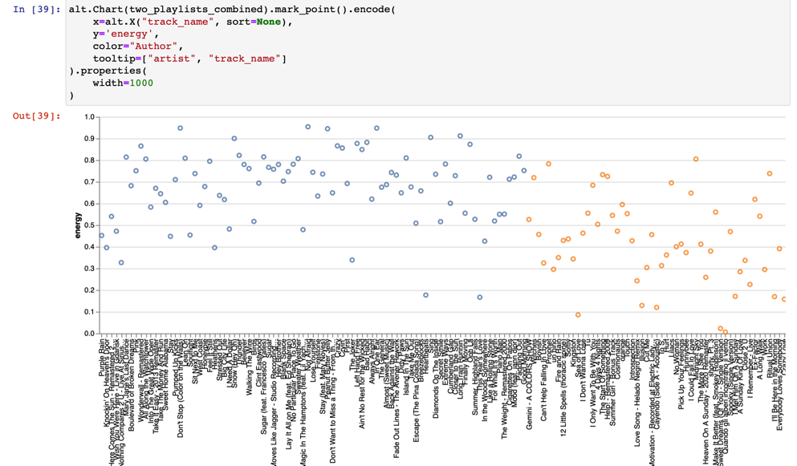


Note a few things here:
* user_1's tracks (yellow) typically **vary** less, whereas User_2 tracks **vary** greatly
* user_1's tracks (yellow) have **average** energy that is higher than that of User_2
* user_1's tracks (yellow) follow a visible **trend** in the way they arranged

<br>

We can support our conclusions mathematically, by exploring Pandas' **descriptions** of the "energy" column for the two sub-DataFrames: 


```
print("user_1's data: \n", two_playlists_combined[two_playlists_combined["Author"] == "user_1"]["energy"].describe(), "\n")
print("User_2 data: \n", two_playlists_combined[two_playlists_combined["Author"] == "ava"]["energy"].describe())
```


    user_1's data: 
     count    87.000000
    mean      0.678161
    std       0.168881
    min       0.167000
    25%       0.569000
    50%       0.710000
    75%       0.800000
    max       0.954000
    Name: energy, dtype: float64 
    
    User_2 data: 
     count    60.000000
    mean      0.419764
    std       0.200654
    min       0.006220
    25%       0.284750
    50%       0.412500
    75%       0.553500
    max       0.806000
    Name: energy, dtype: float64


As expected, there are some corresponding statistical observations:
* user_1's Standard Deviation (std) is 0.169 whereas User_2 is 0.201 (corresponding to the spread)
* user_1's average "energy" (mean) is 0.678 whereas User_2 is 0.420 (lower average, as expected)

<br>

Instead of comparing just two playlists, we can compare many! As an example, we'll load **8 of User_2 favorite playlists**:


```
list_of_user_2_playlists = []
user_2_export_playlists_list = ["3tt4ET474Xr1uOPgNz8jAY",
                              "69bvktIqRHFk56zJLFu3ms", 
                              "5nGnFuPH2G1e2lZwji2qxy",
                              "1H715wD7rkVCSGz0fwtLeH",
                              "35DLrFVs4dK3QreeuQt9vZ",
                              "0N6HSTGQcNhgrsjvdgqjH9",
                              "1BwJKfuRNrnfdkvIpaaSHH",
                              "6AfdBAcUHElsK8cRzMpnc1"]

for item in user_2_export_playlists_list:
  temp_playlist_df = pd.DataFrame(sp.playlist_items(item))
  temp_playlist_audio = get_audio_features_df(temp_playlist_df)
  temp_playlist_audio["playlist_name"] = sp.playlist(item)["name"]
  temp_playlist_audio["Author"] = "user_2"
  list_of_user_2_playlists.append(temp_playlist_audio)

user_2_eight_playlists = pd.concat(list_of_user_2_playlists)
user_2_eight_playlists.head()
```

Here we got the 218 songs User_2 listens to in total! And, similarly, we'll **chart them side by side**:


```
alt.Chart(user_2_eight_playlists).mark_point().encode(
    x=alt.X("track_name", sort=None),
    y='energy',
    color="playlist_name",
    tooltip=["artist", "track_name", "playlist_name"]
).properties(
    width=1200
)
```

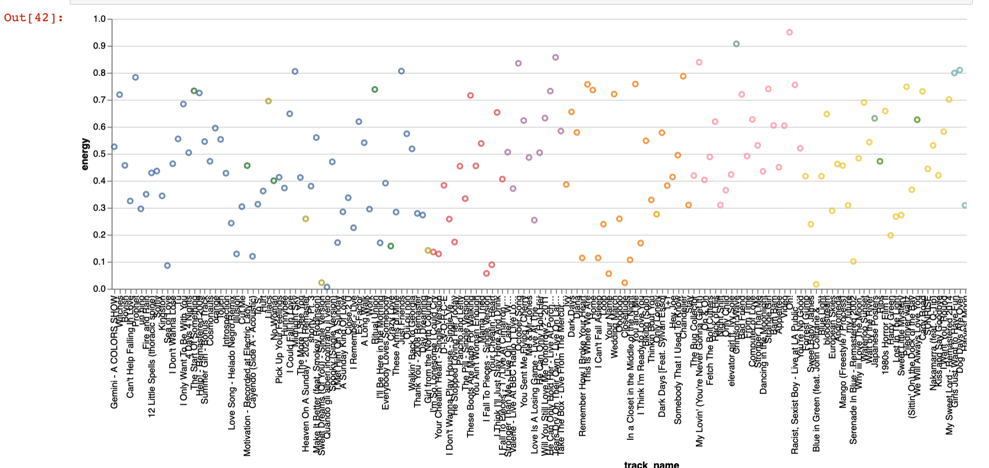

Then, we can create our **shared DataFrame of all the tracks** obtained from user_1's and User_2 Spotify profiles:


```
two_people_dataframe = pd.concat([user_2_eight_playlists, all_my_tracks], ignore_index=True)
two_people_dataframe
```


The combined DataFrame consists of 485 songs that these two people listen to in totality. Let's **chart out the "energy" values** for these songs to see how the two compare:


```
alt.Chart(two_people_dataframe).mark_point().encode(
    x=alt.X("track_name", sort=None),
    y='energy',
    color="Author",
    tooltip=["artist", "track_name", "playlist_name"]
).properties(
    width=1200
)
```

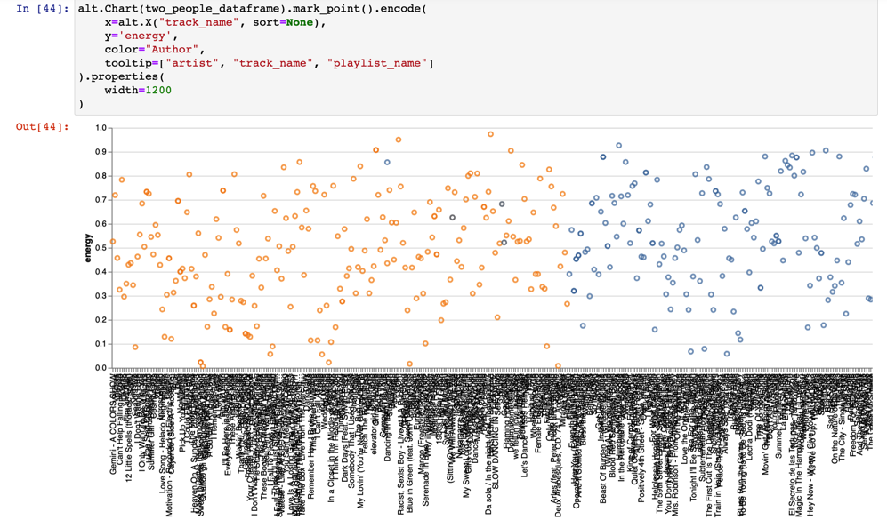


Just as noted earlier (when comparing just two playlists), there are some important things to note here:

* user_1's tracks (yellow) typically **vary** less, whereas User_2 tracks **vary** greatly
* user_1's tracks (yellow) have **average** energy that is higher than that of User_2
* user_1's tracks (yellow) follow a visible **trend** in the way they arranged

<br>

We can similarly support our conclusions mathematically, by exploring Pandas' **descriptions** of the "energy" column for the two sub-DataFrames: 


```
print("user_1's data: \n", two_people_dataframe[two_people_dataframe["Author"] == "user_1"]["energy"].describe(), "\n")
print("User_2 data: \n", two_people_dataframe[two_people_dataframe["Author"] == "ava"]["energy"].describe())
```

    user_1's data: 
     count    275.000000
    mean       0.649754
    std        0.163933
    min        0.099300
    25%        0.533500
    50%        0.658000
    75%        0.776500
    max        0.984000
    Name: energy, dtype: float64 
    
    User_2 data: 
     count    218.000000
    mean       0.473340
    std        0.220546
    min        0.006220
    25%        0.310750
    50%        0.472000
    75%        0.647000
    max        0.973000
    Name: energy, dtype: float64


As expected, there are some corresponding statistical observations:
* user_1's Standard Deviation (std) is 0.161 whereas User_2 is 0.221 (corresponding to the spread)
* user_1's average "energy" (mean) is 0.653 whereas User_2 is 0.473 (lower average, as expected)
<br>

----


## **Part 4a: Networks**
In the field of data science, networks (also known as graphs) are powerful tools used to represent and study relationships between entities. A network is composed of **nodes** (also called vertices) and **edges** (also called links). Each node represents an entity, while each edge represents a relationship between two entities.

## Nodes
Nodes are the fundamental building blocks of a network. Think of them as the entities or objects you want to study. In a social network, nodes could represent individuals, while in a transportation network, nodes could represent cities or intersections.

## Edges
Edges are the connections between nodes. They show how the entities are related to each other. In a social network, edges could represent friendships, and in a transportation network, edges could represent roads connecting cities.

## Weights
Edges can have an associated **weight**. The weight of an edge represents the strength or intensity of the relationship between the connected nodes. For example, in a co-authorship network, the weight of an edge between two researchers could represent the number of papers they co-authored.

## How are two things more related than others?
Determining the strength of the relationship between two nodes depends on the context of the network. For example, in a social network, the frequency and duration of interactions, mutual friends, and common interests can help establish the strength of friendships. In other cases, such as a transportation network, the distance between nodes could be a factor in determining the weight of the edges.

## Louvain Algorithm

The Louvain algorithm is a community detection algorithm used to find groups of nodes that are densely interconnected with each other within a network. In simpler terms, it helps identify clusters or communities of related nodes.

### How the Louvain Algorithm Works

1. **Step 1: Initialization**
   - Each node is initially assigned to its own community.

2. **Step 2: Iterative Optimization**
   - The algorithm iteratively tries to improve the modularity of the network. Modularity is a measure of how well the nodes are grouped into communities.
   - It does this by attempting to move nodes between communities to increase the overall modularity.

3. **Step 3: Community Aggregation**
   - Once no more improvements can be made, the algorithm aggregates the communities found in the previous step and treats them as individual nodes in a new network.

4. **Step 4: Repeat**
   - The algorithm repeats steps 2 and 3 on the new network until a high modularity value is achieved.

### Why Modularity Matters
Modularity measures how well a network is divided into communities. Higher modularity values indicate better community structures. The Louvain algorithm aims to maximize the modularity by rearranging nodes into communities where they are more densely connected with each other and less connected with nodes in other communities.

## Consider the following example
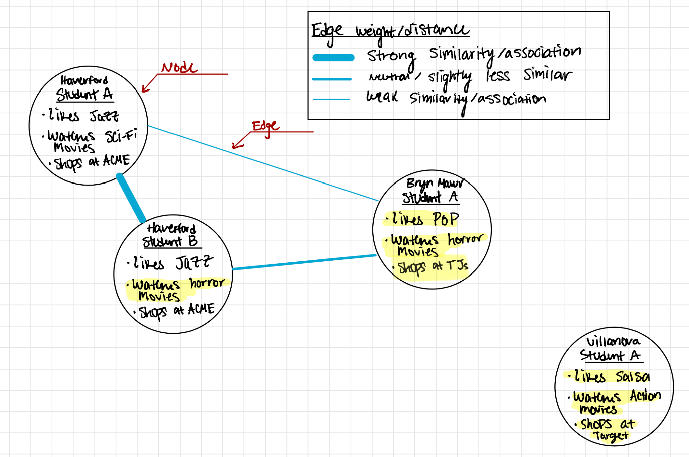
In the Network graph above, the highlighted characteristics represent the differences between Haverford student A and every other student. We see that Haverford student A & B only have one difference, so the edge weight is strong and the nodes are closer together. Haverford student B and Bryn Mawr student A have two differences, so the edge weight is _relatively_ weaker. We also see a node in our graph that has no connection and has no similarity to the other three nodes.

## Why is Bryn Mawr Student A connected and not Villanova Student A if they both have no similarities to Haverford Student A?
### Reason one
Bryn Mawr student A watches horror movies and Haverford student B also watches horror movies, so they are connected.

### Reason two (less obvious without context)
Haverford and Bryn Mawr are part of the tri-co! Often in network graphs and in data science, machines find an abstract connection between vast amounts of data, often clustering data or nodes together, but that may not always mean that it is directly evident as to what these clusters or connections represent. For example, none of our node bullet points have "_is part of the tri-co_" as a characteristic, but perhaps there is some underlying bias or evidence that may not be evident to us that _is_ evident to machines which allows them to cluster or connect otherwise "different" data. 

----
## **Part 4b: Network Example Using Spotify Data **

In this part, we'll explore some basic Network Theory graphing for Spotify's Artists and Songs based on Recommended and Related songs and artists.

### Network Basics

At first, we will illustrate the basics of Pyvis-based **Network Graphs**. Generally speaking, a Network Graph is a visual structure designed to emphasize connections between discrete entities. It consists of Nodes and Edges, which represent a system of connected or related elements, and is largely studied within Network Theory. 

You can learn more about [Network Theory](https://en.wikipedia.org/wiki/Network_theory) and explore Network Grahps [here](https://en.wikipedia.org/wiki/Graph_(discrete_mathematics)).

Here's how to **build, populate, and show a simple Network Graph** using Networkx and Pyvis:


```
# Creating a Network
g = net.Network(notebook=True, width=1000, height = 800)

# Adding nodes
g.add_node("John")
g.add_node("Paul")

# Adding an edge
g.add_edge("John", "Paul")

# Showing the network
g.show("example.html")
```


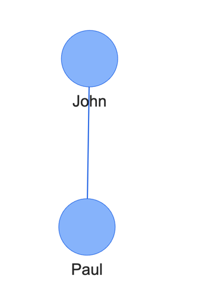


As you can see, in this example we created two nodes "John" and "Paul" and connected them. We are able to **add nodes** to an existing network by calling *net.Network.add_node()* and **add edges** to the same network by calling *net.Network.add_edge()*. It is also possible to **get all nodes** by calling *net.Network.get_edges()*.

Using these tools, we can **check if a node is in a network**:


```
# checking
"John" in g.get_nodes()
```


    True


Building onto these tools, we can create something more advanced – for example, **a diagram of user_1's playlists** (by iterating over *all_my_tracks*). We will scale the nodes (playlists) based on their size using Pyvis' **value** attribute of Nodes.

Here's how to do it:


```
# Creating a Network with one center Node
playlists_network = net.Network(notebook=True, width=1000, height = 800)
playlists_network.add_node("user_1's Spotify", color="#fffff")

# As we want to record both playlist names and corresponding sizes, we need a Dictionary:
user_1_playlist_dictionary = {}
user_1s_playlists = pd.DataFrame(sp.user_playlists(my_username)["items"])

# Iterating over the playlists and recording Names and Sizes
for i in range(len(user_1s_playlists)):
    user_1_playlist_dictionary[user_1s_playlists.loc[i]["name"]] = user_1s_playlists["tracks"][i]["total"]

# Adding new Nodes and Edges based on the items in the Dictionary:
for item in user_1_playlist_dictionary:
    playlists_network.add_node(item, value=user_1_playlist_dictionary[item])
    playlists_network.add_edge("user_1's Spotify", item)

# Showing the Network Graph
playlists_network.show("playlists_diagram.html")
```

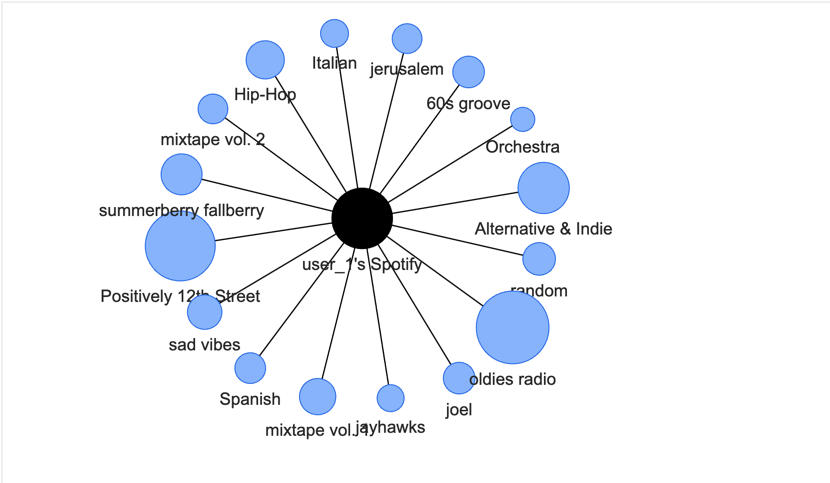
    


As expected, we can see the center node we added at first – which is now connected to 8 other nodes, which all correspond to user_1's playlists. These nodes are sized based on the playlists' sizes (number of tracks) and named based on the playlists' names. **This is a simple undirected network**.

----

### Complex Networks:  Related Artists

Now, we'll get into slightly more complicated things.

Spotify API provides a way to **get related artists** given an Artist ID. According to Spotify, this method returns a collection of artists "similar to a given artist", and the **"similarity is based on analysis of the Spotify community's listening history"**.  Note that these connections are **social and collaborative**, and not based on the **audio feature** data explored above.

Learn more about Spotify's [Related Artists method](https://developer.spotify.com/documentation/web-api/reference/#/operations/get-an-artists-related-artists).

Reflecting this method, Spotipy conveniently has *sp.artist_related_artists*, which returns a collection of artists related to an artist. Making use of this method, one could think of a function that would go through a number of related artists (**limit**) and add graph Nodes and Edges corresponding to the newly discovered related artists. We will also **size nodes** based on popularity.

Here's what such a function could look like:


```
def add_related_artists(starting_artist_name, starting_artist_id, existing_graph, limit, order_group=None):
    # get artists related to the current artist
    current_artist_related = pd.DataFrame(sp.artist_related_artists(starting_artist_id)["artists"])
    # loop through the related artists, add nodes and edges
    for i in range(limit):
        # check if node already exists
        if current_artist_related.loc[i]["name"] not in existing_graph.get_nodes():
            if order_group:
                existing_graph.add_node(current_artist_related.loc[i]["name"], value=int(current_artist_related.loc[i]["popularity"]), group=order_group)
            else:
                existing_graph.add_node(current_artist_related.loc[i]["name"], value=int(current_artist_related.loc[i]["popularity"]), group=(i + 1))
        # add edge
        existing_graph.add_edge(starting_artist_name, current_artist_related.loc[i]["name"])
```

    
### Get Artist Albums


```

headers = {
    'Authorization': 'Bearer {token}'.format(token=access_token)
}
BASE_URL = 'https://api.spotify.com/v1/'
artist_id = '7nwUJBm0HE4ZxD3f5cy5ok'

# pull all artists albums
r = requests.get(BASE_URL + 'artists/' + artist_id + '/albums', 
                 headers=headers, 
                 params={'include_groups': 'album', 'limit': 50})
d = r.json()

df = pd.DataFrame(d)
# df["items"][0]
```

### Get Related Artists (for Multiple Generations)

In the cell below, we will make use of the function we just defined. Using this function and some basic information, we will **produce a Network Graph for two generations (circles) of artists related to The Beatles**. 

As noted, we will start with Beatles (Artist ID = "3WrFJ7ztbogyGnTHbHJFl2", Name = "The Beatles")


```
## First, we need to record the information about The Beatles
center_artist_id = "3WrFJ7ztbogyGnTHbHJFl2"
center_artist_name = "The Beatles"
center_artist_popularity = 80

# # or, we need to record the information about Aretha
# center_artist_id = "6uRJnvQ3f8whVnmeoecv5Z"
# center_artist_name = "Berlin"
# center_artist_popularity = 100

# # or, we need to record the information about Aretha
# center_artist_id = "7nwUJBm0HE4ZxD3f5cy5ok"
# center_artist_name = "Aretha"
# center_artist_popularity = 100

# limit: how many related per generation are we interested in
limit = 5

center_artist_related = pd.DataFrame(sp.artist_related_artists(center_artist_id)["artists"]).loc[0:(limit-1)]

# setting up the Network
artist_network = net.Network(notebook=True, width=1000, height=800)
artist_network.add_node(center_artist_name, value=center_artist_popularity, color="#fffff", group=0)

# Getting the first circle of related artists:
add_related_artists(center_artist_name, center_artist_id, artist_network, limit)

# artist_network.add_node("test")

# Showing the Network Graph
artist_network.show("artist_example.html")
```


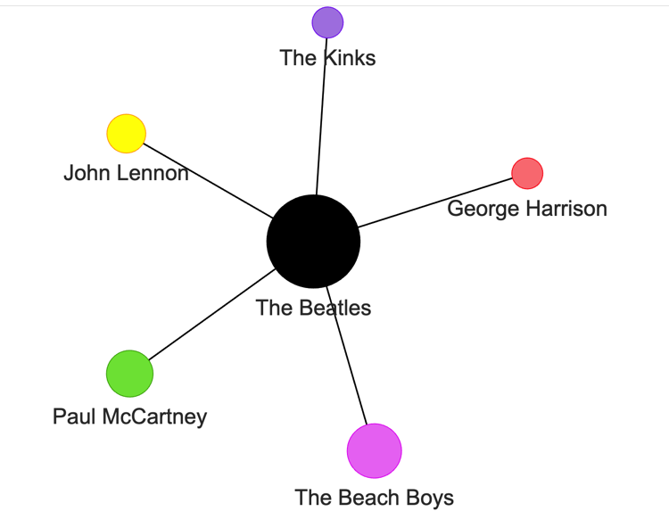


In order to further complicate our lives, we can **add one more generation of related artists** (think friends of friends):


```
# Running through the once-related artists
for i in range(limit):
    add_related_artists(center_artist_related.loc[i]["name"], center_artist_related.loc[i]["id"], artist_network, limit, (i+1))

# Showing the Network Graph
artist_network.show("artist_example.html")
```

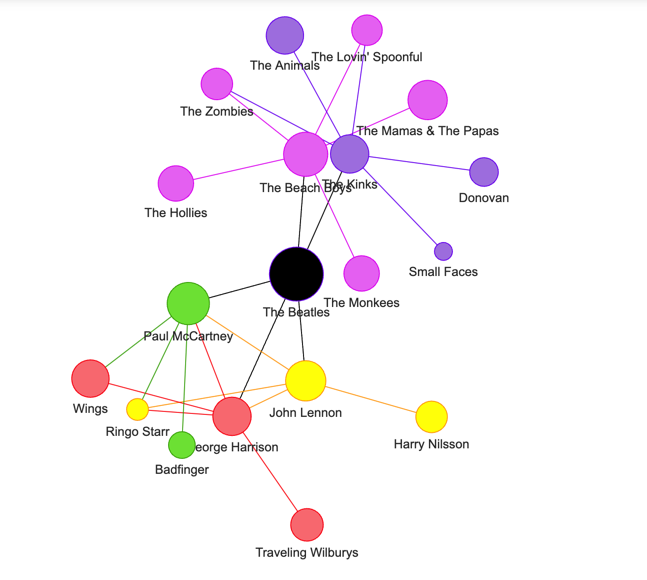


As you can see, the Network Graph above provides some very interesting information and prompts some very important thoughts. Think about: 
* Why are the nodes located the way they are located? 
* Who are the artists we've missed? 
* How are these people related?

<br>

### A Network of Songs

Similarly to Related Artists, Spotify API has a way of **recommending songs** based on a "seed" of tracks. Acording to the API Documentation, "recommendations **are generated based on the available information for a given seed entity and matched against similar artists and tracks**".

You can read more about Spotify's Recommendations [here](https://developer.spotify.com/documentation/web-api/reference/#/operations/get-recommendations).

This method is mirrored by Spotipy – specifically, in the *sp.recommendations* method. One could think of a function that would **get a generation of recommended songs and add them to a Network Graph** (scaled by popularity):


```
def add_related_songs(starting_song_name, starting_artist_name, starting_song_id, existing_graph, limit, first_gen=True, order_group=None):
    current_song_related = pd.DataFrame(sp.recommendations(seed_tracks=[starting_song_id])["tracks"])
    for i in range(limit):
        if str(current_song_related.loc[i]["artists"][0]["name"] + ": " + current_song_related.loc[i]["name"]) not in existing_graph.get_nodes():
            if order_group:
                existing_graph.add_node(str(current_song_related.loc[i]["artists"][0]["name"] + ": " + current_song_related.loc[i]["name"]), value=int(current_song_related.loc[i]["popularity"]), group=order_group)
            else:
                existing_graph.add_node(str(current_song_related.loc[i]["artists"][0]["name"] + ": " + current_song_related.loc[i]["name"]), value=int(current_song_related.loc[i]["popularity"]), group=(i+1))
        existing_graph.add_edge(str(starting_artist_name + ": " + starting_song_name), str(current_song_related.loc[i]["artists"][0]["name"] + ": " + current_song_related.loc[i]["name"]))
    return current_song_related
```

In the cell below, we will make use of the function we just defined. Using this function and some basic information, we will **produce a Network Graph for two generations (circles) of recommended songs based on Ben E. King's Stand By Me**. 

As noted, we will start with Stand By Me (Song ID = "3SdTKo2uVsxFblQjpScoHy")


```
# First, we need to record the information about Stand By Me
center_song = sp.track("3SdTKo2uVsxFblQjpScoHy")
# Or Mahler 1

# center_song = sp.track("7vZoMrrqsqfO96vortxxjn")

# Or Lasso

# center_song = sp.track("4CAp8WXEotxJLE5A2c3Yup")

center_song_id = center_song["id"]
center_song_artist = center_song["artists"][0]["name"]
center_song_name = center_song["name"]
center_song_popularity = int(center_song["popularity"])


# limit: how many recommended songs per generation we are interested in
limit = 3

# Creating the Network graph and adding the center Node
song_network = net.Network(notebook=True, width=1000, height=800)
song_network.add_node(str(center_song_artist + ": " + center_song_name), value=center_song_popularity, color="#fffff", group=0)

# Getting the first circle of related artists:
recommended_songs = add_related_songs(center_song_name, center_song_artist, center_song_id, song_network, limit)

# Showing the Network
song_network.show("song_network_short.html")
```


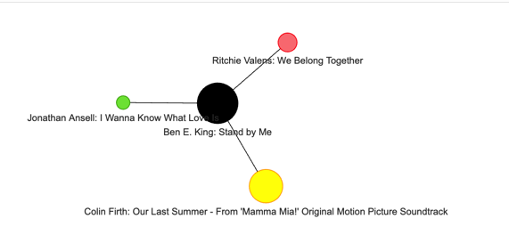


Similarly to Related Artists, we will further complicate our lives by **adding one more generation of recommended songs** (with no extra seed knowledge):


```
# Getting the second generation of Recommended songs
for i in range(limit):
    add_related_songs(recommended_songs.loc[i]["name"], recommended_songs.loc[i]["artists"][0]["name"], recommended_songs.loc[i]["id"], song_network, limit, False, (i+1))

# Showing the network
song_network.show("song_network.html")
```


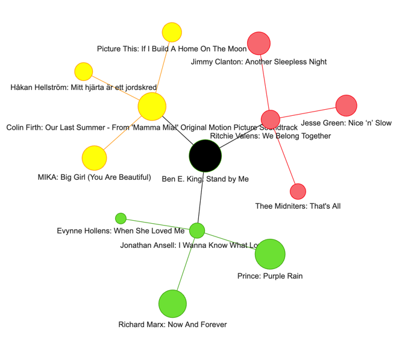


Interestingly, Spotify's recommendations for songs **change every time you run your code**. We encourage you to re-run  the previous two cells a few times! Just like the Related Artists graph, the Network Graph above provides some very interesting information and prompts some very important thoughts. Think about: 
* Why are the nodes located the way they are located? 
* Who are the artists we've missed? 
* How are these people related?

<br>

Finally, we can make one very slight tweak to our add_related_songs method. Previously, we only included one track as a seed track for running the GET Recommendations method. In the function below, we will define a new function that will essentially do the same thing as the one above, except it will **pass 5 random tracks (out of the tracks in the graph) as the recommendation seed** into the Recommendation function:


```
def add_related_songs_gen(starting_song_name, starting_artist_name, starting_song_id, existing_graph, limit, first_gen=True, order_group=None):
    current_song_related = pd.DataFrame(sp.recommendations(seed_tracks=starting_song_id)["tracks"]).loc[0:(limit - 1)]
    for i in range(limit):
        if str(current_song_related.loc[i]["artists"][0]["name"] + ": " + current_song_related.loc[i]["name"]) not in existing_graph.get_nodes():
            if order_group:
                existing_graph.add_node(str(current_song_related.loc[i]["artists"][0]["name"] + ": " + current_song_related.loc[i]["name"]), value=int(current_song_related.loc[i]["popularity"]), group=order_group)
            else:
                existing_graph.add_node(str(current_song_related.loc[i]["artists"][0]["name"] + ": " + current_song_related.loc[i]["name"]), value=int(current_song_related.loc[i]["popularity"]), group=(i+1))
        existing_graph.add_edge(str(starting_artist_name + ": " + starting_song_name), str(current_song_related.loc[i]["artists"][0]["name"] + ": " + current_song_related.loc[i]["name"]))
    return current_song_related
```

We will run this function for **two generations** for the same song (Stand By Me by Ben E. King):


```
# Start the network
song_network = net.Network(notebook=False, width=1000, height=800)
song_network.add_node(str(center_song_artist + ": " + center_song_name), value=center_song_popularity, color="#fffff", group=0)

# First generation
recommended_songs = add_related_songs_gen(center_song_name, center_song_artist, [center_song_id], song_network, limit)

# Second generation
for i in range(limit):
    add_related_songs_gen(recommended_songs.loc[i]["name"], recommended_songs.loc[i]["artists"][0]["name"], random.sample(list(recommended_songs["id"]), 3), song_network, limit, False, (i+1))

# Show the network Graph
song_network.show("song_network.html")
```

Note that this graph looks a little different! What are **some of your observations**?  As a listener, do the recommendations make sense?


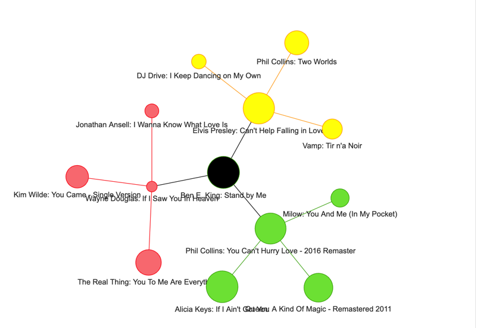


----

### Louvain Community Detection:  The Ghost in the Machine

In the last part of this Notebook, we will briefly explore Louvain Community Detection. In short, this is a method that allows us to visually identify communities of discrete entities that share a common attribute. 

You can learn more about the mathematics behind the Louvain algorithm [here](https://towardsdatascience.com/louvain-algorithm-93fde589f58c), explore its documentation [here](https://networkx.org/documentation/stable/reference/algorithms/generated/networkx.algorithms.community.louvain.louvain_communities.html), read about its applications [here](https://towardsdatascience.com/louvains-algorithm-for-community-detection-in-python-95ff7f675306).

In our example, we will **identify Louvain communities of artists** within the playlists they belong to.

<br>

At first, let's **pick 5 playlists** centered around a common theme. For example, let's choose "Rock". By searching on Spotify, we found and randomly picked these 5 playlists:
* [Rock Classics](https://open.spotify.com/playlist/37i9dQZF1DWXRqgorJj26U): "Rock legends & epic songs that continue to inspire generations", Spotify Playlist ID: "37i9dQZF1DWXRqgorJj26U"
* [Rock Mix](https://open.spotify.com/playlist/37i9dQZF1EQpj7X7UK8OOF): "Fleetwood Mac, Elton John, Steve Miller Band and more", Spotify Playlist ID: "37i9dQZF1EQpj7X7UK8OOF"
* [Classic Rock Drive](https://open.spotify.com/playlist/37i9dQZF1DXdOEFt9ZX0dh): "Classic rock to get your motor running. Cover: AC/DC", Spotify Playlist ID: "37i9dQZF1DXdOEFt9ZX0dh"
* [Rock Drive](https://open.spotify.com/playlist/37i9dQZF1DX7Ku6cgJPhh5): "Amp up your commute with these rock hits. Cover: Foo Fighters", Spotify Playlist ID: "37i9dQZF1DX7Ku6cgJPhh5"
* [Dad Rock](https://open.spotify.com/playlist/37i9dQZF1DX09NvEVpeM77): "Classic rock favorites. Cover: Bruce Springsteen", Spotify Playlist ID: "37i9dQZF1DX09NvEVpeM77"

<br>

Let's **put these playlists in a DataFrame**:


```
# Three Model Lists.  Two of them share only one.  Two of them share all except one.  
# What do we expect?
rock_playlists_dfs_list = []
PL_1 = '37i9dQZF1DWXRqgorJj26U'
PL_2 = '37i9dQZF1EQpj7X7UK8OOF'
PL_3 = '37i9dQZF1DXdOEFt9ZX0dh'
PL_4 = '37i9dQZF1DX7Ku6cgJPhh5'
PL_5 = '37i9dQZF1DX09NvEVpeM77'

rock_playlists_ids_list = [PL_1, PL_2, PL_3]


# # Create a list of playlists
# rock_playlists_dfs_list = []
# rock_playlists_ids_list = ["37i9dQZF1DWXRqgorJj26U",
#                           "37i9dQZF1EQpj7X7UK8OOF",
#                           "37i9dQZF1DXdOEFt9ZX0dh",
#                            "37i9dQZF1DX7Ku6cgJPhh5",
#                           "37i9dQZF1DX09NvEVpeM77"]

# Looping through the items and producing Audio Features DataFrames
for item in rock_playlists_ids_list:
  temp_playlist_df = pd.DataFrame(sp.playlist_items(item))
  temp_playlist_audio = get_audio_features_df(temp_playlist_df)
  temp_playlist_audio["playlist_name"] = sp.playlist(item)["name"]
  rock_playlists_dfs_list.append(temp_playlist_audio)
    
# Concatenating the Audio Features DataFrames
rock_playlists_df = pd.concat(rock_playlists_dfs_list)
rock_playlists_df
```


Our new Rock Playlists DataFrame contains 400 tracks gathered across the 5 playlists. As we don't want to overwhelm our Network, we will **choose a random sample** of 100 tracks out of this DataFrame:


```
# also take sample

input_data_rock_df = rock_playlists_df.reset_index()
input_data_rock_df.head()
```


Now, let's **define the Louvain Community Algorithm methods**.

First, we need a method to **create nodes** (courtesy of Daniel Russo Batterham and Richard Freedman):


```
# Creating an HTML node
def create_node_html(node: str, source_df: pd.DataFrame, node_col: str):
    rows = source_df.loc[source_df[node_col] == node].itertuples()
    html_lis = []
    for r in rows:
        html_lis.append(f"""<li>Artist: {r.artist}<br>
                                Playlist: {r.playlist_name}<br>"""
                       )
    html_ul = f"""<ul>{''.join(html_lis)}</ul>"""
    return html_ul
```

Then, a method to **add nodes from edge list** (courtesy of Daniel Russo Batterham and Richard Freedman):


```
# Adding nodes from an Edgelist
def add_nodes_from_edgelist(edge_list: list, 
                               source_df: pd.DataFrame, 
                               graph: nx.Graph,
                               node_col: str):
    graph = deepcopy(graph)
    node_list = pd.Series(edge_list).apply(pd.Series).stack().unique()
    for n in node_list:
        graph.add_node(n, title=create_node_html(n, source_df, node_col), spring_length=1000)
    return graph
```

Then, the **Louvain Community Builder method** (courtesy of Daniel Russo Batterham and Richard Freedman):


```
# Adding Louvain Communities
def add_communities(G):
    G = deepcopy(G)
    partition = community_louvain.best_partition(G)
    nx.set_node_attributes(G, partition, "group")
    return G
```

Finally, we need a method to **produce a Network of pairs**, which we'll run the add_communities method on, marking the Louvain communities:


```
def choose_network(df, chosen_word, file_name):
    
    # creating unique pairs
    output_grouped = df.groupby(['playlist_name'])[chosen_word].apply(list).reset_index()
    pairs = output_grouped[chosen_word].apply(lambda x: list(combinations(x, 2)))
    pairs2 = pairs.explode().dropna()
    unique_pairs = pairs.explode().dropna().unique()
    
    # creating a new Graph
    pyvis_graph = net.Network(notebook=True, width="1000", height="1000", bgcolor="black", font_color="white")
    G = nx.Graph()
    
    try:
        G = add_nodes_from_edgelist(edge_list=unique_pairs, source_df=input_data_rock_df, graph=G, node_col=chosen_word)
    except Exception as e:
        print(e)
    
    # add edges and find communities
    G.add_edges_from(unique_pairs)
    G = add_communities(G)
    pyvis_graph.from_nx(G)
    return pyvis_graph
```

Now, let's run our algorithm to **detect Louvain communities** of artists within the playlists they belong to:


```
louvain_network = choose_network(input_data_rock_df.sample(100), 'artist', 'modified_rock.html')
louvain_network.show("modified_rock.html")

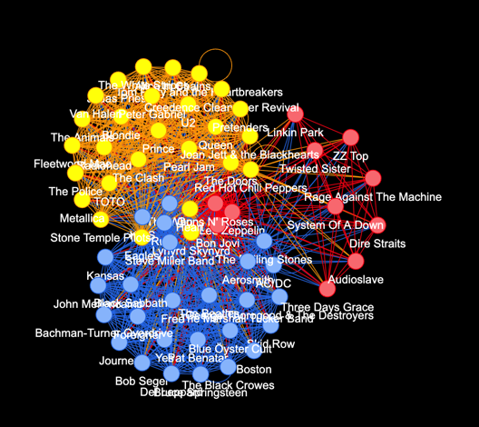


```
output_grouped = input_data_rock_df.groupby(['playlist_name'])['artist'].apply(set).reset_index()
pairs = output_grouped['artist'].apply(lambda x: list(combinations(x, 2)))
pairs2 = pairs.explode().dropna()
unique_pairs = pairs.explode().dropna().unique()

### How the Edges and Nodes are Formed

### First Let's Look at the "Grouped" Playlists


```
output_grouped
```


<div>
<style scoped>
    .dataframe tbody tr th:only-of-type {
        vertical-align: middle;
    }

    .dataframe tbody tr th {
        vertical-align: top;
    }

    .dataframe thead th {
        text-align: right;
    }
</style>
<table border="1" class="dataframe">
  <thead>
    <tr style="text-align: right;">
      <th></th>
      <th>playlist_name</th>
      <th>artist</th>
    </tr>
  </thead>
  <tbody>
    <tr>
      <th>0</th>
      <td>PL1</td>
      <td>{Jimi Hendrix, Ben E. King, Aretha Franklin, H...</td>
    </tr>
    <tr>
      <th>1</th>
      <td>PL2</td>
      <td>{Jimi Hendrix, Ben E. King, Aretha Franklin, O...</td>
    </tr>
    <tr>
      <th>2</th>
      <td>PL3</td>
      <td>{Etta James, Patsy Cline, The Byrds, Smokey Ro...</td>
    </tr>
  </tbody>
</table>
</div>


### And the "Pairs" in each List


```
pairs[0]
```


    [('Jimi Hendrix', 'Ben E. King'),
     ('Jimi Hendrix', 'Aretha Franklin'),
     ('Jimi Hendrix', "Howlin' Wolf"),
     ('Jimi Hendrix', 'The Temptations'),
     ('Jimi Hendrix', 'Sam Cooke'),
     ('Jimi Hendrix', 'Donovan'),
     ('Jimi Hendrix', 'Jefferson Airplane'),
     ('Jimi Hendrix', 'Leonard Cohen'),
     ('Jimi Hendrix', 'Simon & Garfunkel'),
     ('Ben E. King', 'Aretha Franklin'),
     ('Ben E. King', "Howlin' Wolf"),
     ('Ben E. King', 'The Temptations'),
     ('Ben E. King', 'Sam Cooke'),
     ('Ben E. King', 'Donovan'),
     ('Ben E. King', 'Jefferson Airplane'),
     ('Ben E. King', 'Leonard Cohen'),
     ('Ben E. King', 'Simon & Garfunkel'),
     ('Aretha Franklin', "Howlin' Wolf"),
     ('Aretha Franklin', 'The Temptations'),
     ('Aretha Franklin', 'Sam Cooke'),
     ('Aretha Franklin', 'Donovan'),
     ('Aretha Franklin', 'Jefferson Airplane'),
     ('Aretha Franklin', 'Leonard Cohen'),
     ('Aretha Franklin', 'Simon & Garfunkel'),
     ("Howlin' Wolf", 'The Temptations'),
     ("Howlin' Wolf", 'Sam Cooke'),
     ("Howlin' Wolf", 'Donovan'),
     ("Howlin' Wolf", 'Jefferson Airplane'),
     ("Howlin' Wolf", 'Leonard Cohen'),
     ("Howlin' Wolf", 'Simon & Garfunkel'),
     ('The Temptations', 'Sam Cooke'),
     ('The Temptations', 'Donovan'),
     ('The Temptations', 'Jefferson Airplane'),
     ('The Temptations', 'Leonard Cohen'),
     ('The Temptations', 'Simon & Garfunkel'),
     ('Sam Cooke', 'Donovan'),
     ('Sam Cooke', 'Jefferson Airplane'),
     ('Sam Cooke', 'Leonard Cohen'),
     ('Sam Cooke', 'Simon & Garfunkel'),
     ('Donovan', 'Jefferson Airplane'),
     ('Donovan', 'Leonard Cohen'),
     ('Donovan', 'Simon & Garfunkel'),
     ('Jefferson Airplane', 'Leonard Cohen'),
     ('Jefferson Airplane', 'Simon & Garfunkel'),
     ('Leonard Cohen', 'Simon & Garfunkel')]


```
# pairs are produced via combinations of all items in a set:

list(combinations(["paul", "john", 'george'], 2))
```


    [('paul', 'john'), ('paul', 'george'), ('john', 'george')]


```
# note the same thing as permutations (which considers all orderings)

from itertools import permutations
list(permutations(["paul", "john", 'george'], 3))
```


    [('paul', 'john', 'george'),
     ('paul', 'george', 'john'),
     ('john', 'paul', 'george'),
     ('john', 'george', 'paul'),
     ('george', 'paul', 'john'),
     ('george', 'john', 'paul')]


```
# each item in series is a list of tuples. the tuples will be the edges!
pairs
```


    0    [(Jimi Hendrix, Ben E. King), (Jimi Hendrix, A...
    1    [(Jimi Hendrix, Ben E. King), (Jimi Hendrix, A...
    2    [(Etta James, Patsy Cline), (Etta James, The B...
    Name: artist, dtype: object


```
pairs.shape
```


    (3,)


### Explode will unnest the lists.  Now the len is 856!


```

pairs.explode().apply(sorted)
```


    0           [Ben E. King, Jimi Hendrix]
    0       [Aretha Franklin, Jimi Hendrix]
    0          [Howlin' Wolf, Jimi Hendrix]
    0       [Jimi Hendrix, The Temptations]
    0             [Jimi Hendrix, Sam Cooke]
                        ...                
    2       [Janis Joplin, Louis Armstrong]
    2         [Frank Sinatra, Janis Joplin]
    2    [Ella Fitzgerald, Louis Armstrong]
    2      [Ella Fitzgerald, Frank Sinatra]
    2      [Frank Sinatra, Louis Armstrong]
    Name: artist, Length: 135, dtype: object


### There are nevertheless duplicate edges!  We could keep them for figuring weights!
### But the key thing is that Louvain does NOT know about the lists!  
### It creates the commmunities only on the basis of edges!


```

# pairs2 = pairs.explode().dropna()

# do not need drop na!

# Note that the original lists are NOT here!

# could have other attributes added to data structure--weights, for instance!
unique_pairs = pairs.explode().unique()
unique_pairs
```


    array([('Jimi Hendrix', 'Ben E. King'),
           ('Jimi Hendrix', 'Aretha Franklin'),
           ('Jimi Hendrix', "Howlin' Wolf"),
           ('Jimi Hendrix', 'The Temptations'), ('Jimi Hendrix', 'Sam Cooke'),
           ('Jimi Hendrix', 'Donovan'),
           ('Jimi Hendrix', 'Jefferson Airplane'),
           ('Jimi Hendrix', 'Leonard Cohen'),
           ('Jimi Hendrix', 'Simon & Garfunkel'),
           ('Ben E. King', 'Aretha Franklin'),
           ('Ben E. King', "Howlin' Wolf"),
           ('Ben E. King', 'The Temptations'), ('Ben E. King', 'Sam Cooke'),
           ('Ben E. King', 'Donovan'), ('Ben E. King', 'Jefferson Airplane'),
           ('Ben E. King', 'Leonard Cohen'),
           ('Ben E. King', 'Simon & Garfunkel'),
           ('Aretha Franklin', "Howlin' Wolf"),
           ('Aretha Franklin', 'The Temptations'),
           ('Aretha Franklin', 'Sam Cooke'), ('Aretha Franklin', 'Donovan'),
           ('Aretha Franklin', 'Jefferson Airplane'),
           ('Aretha Franklin', 'Leonard Cohen'),
           ('Aretha Franklin', 'Simon & Garfunkel'),
           ("Howlin' Wolf", 'The Temptations'), ("Howlin' Wolf", 'Sam Cooke'),
           ("Howlin' Wolf", 'Donovan'),
           ("Howlin' Wolf", 'Jefferson Airplane'),
           ("Howlin' Wolf", 'Leonard Cohen'),
           ("Howlin' Wolf", 'Simon & Garfunkel'),
           ('The Temptations', 'Sam Cooke'), ('The Temptations', 'Donovan'),
           ('The Temptations', 'Jefferson Airplane'),
           ('The Temptations', 'Leonard Cohen'),
           ('The Temptations', 'Simon & Garfunkel'), ('Sam Cooke', 'Donovan'),
           ('Sam Cooke', 'Jefferson Airplane'),
           ('Sam Cooke', 'Leonard Cohen'), ('Sam Cooke', 'Simon & Garfunkel'),
           ('Donovan', 'Jefferson Airplane'), ('Donovan', 'Leonard Cohen'),
           ('Donovan', 'Simon & Garfunkel'),
           ('Jefferson Airplane', 'Leonard Cohen'),
           ('Jefferson Airplane', 'Simon & Garfunkel'),
           ('Leonard Cohen', 'Simon & Garfunkel'),
           ('Jimi Hendrix', 'Otis Redding'), ('Ben E. King', 'Otis Redding'),
           ('Aretha Franklin', 'Otis Redding'),
           ('Otis Redding', "Howlin' Wolf"),
           ('Otis Redding', 'The Temptations'), ('Otis Redding', 'Sam Cooke'),
           ('Otis Redding', 'Donovan'), ('Otis Redding', 'Leonard Cohen'),
           ('Otis Redding', 'Simon & Garfunkel'),
           ('Etta James', 'Patsy Cline'), ('Etta James', 'The Byrds'),
           ('Etta James', 'Smokey Robinson & The Miracles'),
           ('Etta James', 'Led Zeppelin'), ('Etta James', 'The Temptations'),
           ('Etta James', 'Janis Joplin'), ('Etta James', 'Ella Fitzgerald'),
           ('Etta James', 'Louis Armstrong'), ('Etta James', 'Frank Sinatra'),
           ('Patsy Cline', 'The Byrds'),
           ('Patsy Cline', 'Smokey Robinson & The Miracles'),
           ('Patsy Cline', 'Led Zeppelin'),
           ('Patsy Cline', 'The Temptations'),
           ('Patsy Cline', 'Janis Joplin'),
           ('Patsy Cline', 'Ella Fitzgerald'),
           ('Patsy Cline', 'Louis Armstrong'),
           ('Patsy Cline', 'Frank Sinatra'),
           ('The Byrds', 'Smokey Robinson & The Miracles'),
           ('The Byrds', 'Led Zeppelin'), ('The Byrds', 'The Temptations'),
           ('The Byrds', 'Janis Joplin'), ('The Byrds', 'Ella Fitzgerald'),
           ('The Byrds', 'Louis Armstrong'), ('The Byrds', 'Frank Sinatra'),
           ('Smokey Robinson & The Miracles', 'Led Zeppelin'),
           ('Smokey Robinson & The Miracles', 'The Temptations'),
           ('Smokey Robinson & The Miracles', 'Janis Joplin'),
           ('Smokey Robinson & The Miracles', 'Ella Fitzgerald'),
           ('Smokey Robinson & The Miracles', 'Louis Armstrong'),
           ('Smokey Robinson & The Miracles', 'Frank Sinatra'),
           ('Led Zeppelin', 'The Temptations'),
           ('Led Zeppelin', 'Janis Joplin'),
           ('Led Zeppelin', 'Ella Fitzgerald'),
           ('Led Zeppelin', 'Louis Armstrong'),
           ('Led Zeppelin', 'Frank Sinatra'),
           ('The Temptations', 'Janis Joplin'),
           ('The Temptations', 'Ella Fitzgerald'),
           ('The Temptations', 'Louis Armstrong'),
           ('The Temptations', 'Frank Sinatra'),
           ('Janis Joplin', 'Ella Fitzgerald'),
           ('Janis Joplin', 'Louis Armstrong'),
           ('Janis Joplin', 'Frank Sinatra'),
           ('Ella Fitzgerald', 'Louis Armstrong'),
           ('Ella Fitzgerald', 'Frank Sinatra'),
           ('Louis Armstrong', 'Frank Sinatra')], dtype=object)


###  can count Tuples, so this would help us make a dict of value counts
###  These could be edge weights in the graph


```

pairs.explode().value_counts()
```


    (Jimi Hendrix, Aretha Franklin)                      2
    (Aretha Franklin, The Temptations)                   2
    (Aretha Franklin, Simon & Garfunkel)                 2
    (Donovan, Leonard Cohen)                             2
    (Howlin' Wolf, Simon & Garfunkel)                    2
                                                        ..
    (Louis Armstrong, Frank Sinatra)                     1
    (Smokey Robinson & The Miracles, Louis Armstrong)    1
    (Etta James, Smokey Robinson & The Miracles)         1
    (Otis Redding, Howlin' Wolf)                         1
    (Patsy Cline, Ella Fitzgerald)                       1
    Name: artist, Length: 99, dtype: int64


In the Network Graph above, you can see the 5 **communities** of artists that are detected based on what playlist they belong to. Note: *we didn't pass the playlist information into the Network*!

What are your **observations**?

<br>

----

<br>


---
# Spotify Functions for the Encoding Music Course

## Table of Contents:
1. [Analyze a Single Playlist](#analyze-a-single-playlist)
2. [Analyze Multiple Playlists](#analyze-multiple-playlists)
3. [Analyze a User's Tracks](#analyze-user-tracks)


##  <span style="color:olive"> Analyze a Single Playlist </span> <a name="analyze-a-single-playlist"></a>

#### This function is used to get the audio features of a Spotify playlist such as: 
- Artist
- Album
- Track Name
- Track ID
- Danceablility
- Energy
- Key
- Loudness
- Mode
- Speechiness
- Instrumentalness
- Liveness
- Valence
- Tempo
- Durations (in ms)
- Time Signature
#### To use this function, you need the creator username of the playlist and the playlist ID. 
---
#### For example:

Image Source: [“Warm Fuzzy Feeling” Playlist by Spotify from Medium Article](https://miro.medium.com/v2/resize:fit:1400/1*P9nEAoRKqybJ4qiORrN7xA.png)

#### From the image above, we get the following:
```
creator_id = "spotify"
```

Image Source: [“Warm Fuzzy Feeling” Playlist URL from Medium Article](https://miro.medium.com/v2/resize:fit:1106/format:webp/1*RARQekRU6bKakcNTIJo4bQ.png)
#### From the image above, we get the following:
```
playlist_id = "37i9dQZF1DX5IDTimEWoTd"
```
---
#### Now that we know both the creator username and the playlist ID, we can call the  function <span style="color:olive">analyze_playlist</span> to return a dataframe of the analysis of the playlist:

```
playlist_data_frame = analyze_playlist(creator_id, playlist_id) #Stores the resulting data frame as the variable: playlist_data_frame
playlist_data_frame.head() #Displays the first n rows of the data frame 
```
<Details>
<Summary>Image of Sample Output</Summary>

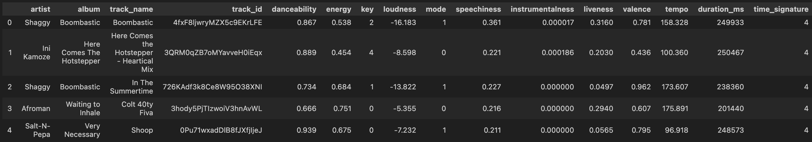


</Details>

<Details>
<Summary>Full Code</Summary>

```
def analyze_playlist(creator, playlist_id):
# source: Max Hilsdorf (https://towardsdatascience.com/how-to-create-large-music-datasets-using-spotipy-40e7242cc6a6)

    # Create empty dataframe
    playlist_features_list = ["artist", "album", "track_name", "track_id", 
                             "danceability", "energy", "key", "loudness", "mode", "speechiness",
                             "instrumentalness", "liveness", "valence", "tempo", "duration_ms", "time_signature"]
    playlist_df = pd.DataFrame(columns = playlist_features_list)
    
    # Create empty dict
    playlist_features = {}
    
    # Loop through every track in the playlist, extract features and append the features to the playlist df
    playlist = sp.user_playlist_tracks(creator, playlist_id)["items"]
    for track in playlist:
        # Get metadata
        playlist_features["artist"] = track["track"]["album"]["artists"][0]["name"]
        playlist_features["album"] = track["track"]["album"]["name"]
        playlist_features["track_name"] = track["track"]["name"]
        playlist_features["track_id"] = track["track"]["id"]
        # Get audio features
        audio_features = sp.audio_features(playlist_features["track_id"])[0]
        for feature in playlist_features_list[4:]:
            playlist_features[feature] = audio_features[feature]
        
        # Concat the dfs
        track_df = pd.DataFrame(playlist_features, index = [0])
        playlist_df = pd.concat([playlist_df, track_df], ignore_index = True)
        
    return playlist_df
```
</Details>

---
## <span style="color:olive"> Analyze Multiple Playlists </span> <a name="analyze-multiple-playlists"></a>
#### This function returns the same data frame as the function from above, but allows you to analyze multiple playlists.
---
#### To use this function, you need to create a dictionary of playlists. To do so, see the example code below.
```
playlist_dict = {
    "PLAYLIST NAME HERE": ("CREATOR_ID HERE", "PLAYLIST_ID HERE")
}
```
```
playlist_dict = {
    "warm_fuzzy_feeling" : ("spotify", "37i9dQZF1DX5IDTimEWoTd"), 
    #Follow the same format to add more playlists
}
```
---
#### Now that we have created our playlist dictionary, we can call the function <span style="color:olive">analyze_playlist_dict</span> to analyze the audio features of the songs in multiple playlists.
```
multiple_playlist_data_frame = analyze_playlist_dict(playlist_dict)
multiple_playlist_data_frame.head()
```
<Details>
<Summary>Image of Sample Output</Summary>

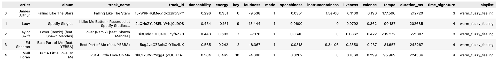


</Details>
<Details>
<Summary>Full Code</Summary>

```
def analyze_playlist_dict(playlist_dict):
    
    # Loop through every playlist in the dict and analyze it
    for i, (key, val) in enumerate(playlist_dict.items()):
        playlist_df = analyze_playlist(*val)
        # Add a playlist column so that we can see which playlist a track belongs too
        playlist_df["playlist"] = key
        # Create or concat df
        if i == 0:
            playlist_dict_df = playlist_df
        else:
            playlist_dict_df = pd.concat([playlist_dict_df, playlist_df], ignore_index = True)
            
    return playlist_dict_df
```
</Details>

---

##  <span style="color:olive"> Analyze All of a User's Tracks </span> <a name="analyze-user-tracks"></a>
#### This function allows you to obtain and analyze all the tracks from a user's followed public playlists.

---

#### To use this function, you need to have the Spotify username of the user you want to analyze the tracks from.
```
my_username = "spotify"
```

---

#### Now that we have the user's Spotify username, we can call the function <span style="color:olive">get_all_user_tracks</span> to analyze all tracks.

```
all_user_tracks = get_all_user_tracks(my_username)
all_user_tracks.head()
```

<Details>
<Summary>Image of Sample Output</Summary>

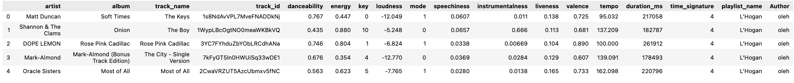


</Details>
<Details>
<Summary>Full Code</Summary>

```
def get_all_user_tracks(username):
  all_my_playlists = pd.DataFrame(sp.user_playlists(username))
  list_of_dataframes = []

  for playlist in all_my_playlists.index:
    current_playlist = pd.DataFrame(sp.user_playlist_tracks(username, all_my_playlists["items"][playlist]["id"]))
    current_playlist_audio = get_audio_features_df(current_playlist)
    if all_my_playlists["items"][playlist]["name"]:
      current_playlist_audio["playlist_name"] = all_my_playlists["items"][playlist]["name"]
    else:
       current_playlist_audio["playlist_name"] = None
    list_of_dataframes.append(current_playlist_audio)

  return pd.concat(list_of_dataframes)
```
</Details>


