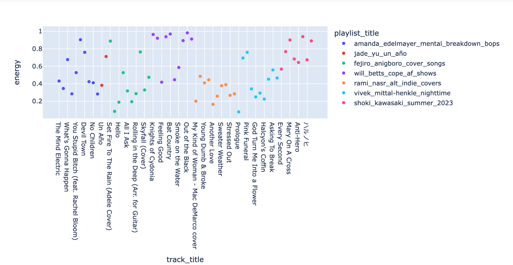
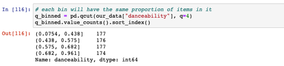
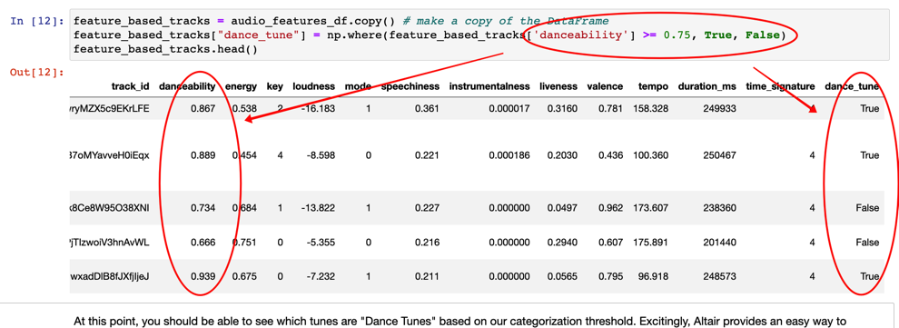
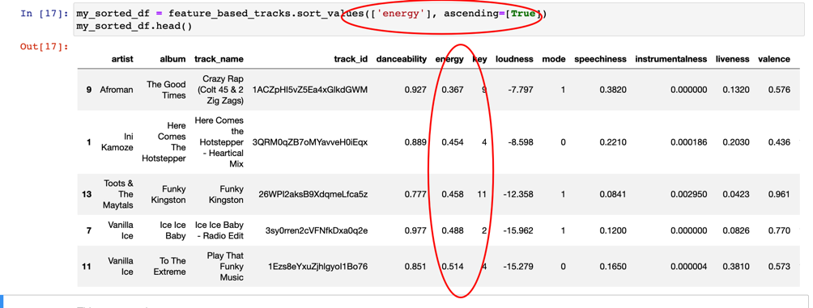
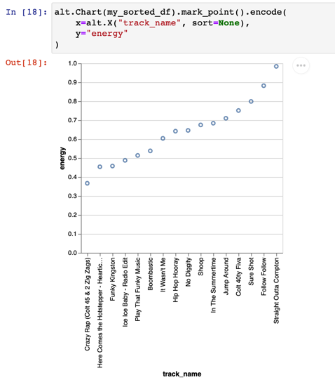
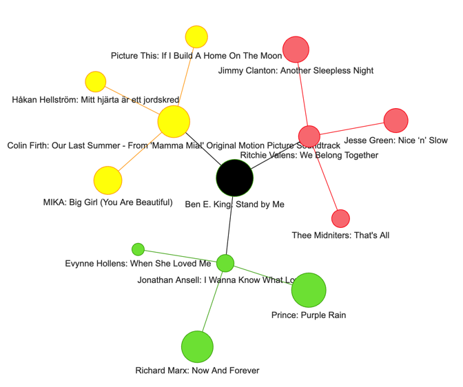
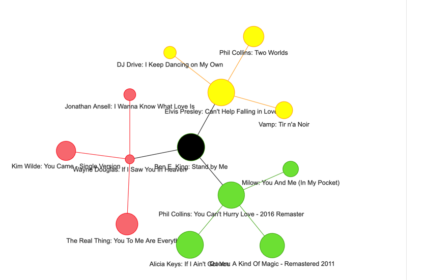

---

# Spotify Functions for the Encoding Music Course

## Brief Introduction: Spotify, APIs, Spotify API, and Spotipy

**Spotify** is a paid music streaming web application launched in 2006. The service has about 182 million subscribers and hosts more than 70 million tracks. In 2014, Spotify released **Spotify API**, a web-based interface that allows anyone with a Spotify account to search, analyze, and manipulate Spotify's music metadata. In short, **an API** is a piece of software that enables two or more programs to talk to each other. You can learn more about APIs [here](https://en.wikipedia.org/wiki/API).

This tutorial explains, you'll be able to request Spotify API access for your personal notebook and perform all sorts of analyses on the tracks, users, artists, albums, and playlists of your interest. 

Thanks to [Max Hilsdorf](https://towardsdatascience.com/how-to-create-large-music-datasets-using-spotipy-40e7242cc6a6), whose Spotipy library does the heavy lifting of bringing Spotify data to your Notebook. 

Note that as part of the **Encoding Music** course, we have created a special `spotipy_tools.py` library that includes all of the key functions explained below.  If you install that library along with the others shown below.


## Table of Contents: The Spotify Tools at a Glance
0. [Option for Google Colab](#google-colab)
1. [Import Libraries](#import-libraries)
2. [Establish Credentials for the Spotify API](#establish-credentials)
3. [Get Basic Metadata for One or More Tracks](#full-metadata)
4. [Get Audio Features for a Single Playlist (or Song)](#playlist_audio)
5. [Get Audio from Multiple Playlists](#audio_multiple_playlists)
6. [Get All of a Particular User's Tracks](#analyze-user-tracks)
7. [Charting Data:  Scatterplots, Correlations and Radar Plots](#charting-data)
8. [Categories and Bins:  From Continuous to Discrete Variable](#categories)
9. [Sorting Dataframes](#sorting)
10. [Networks:  Basic Concepts and Methods](#networks)
11. [Networks with Spotify Data](#networks-spotify)
12. [Complex Networks:  Related Artists](#artist_networks)
13. [Complex Networks:  Song Network](#song-network)
14. [Louvain Community Detection:  The Ghost in the Machine](#louvain)

##  <span style="color:olive"> Using Google Colab (Alternative to Encoding Music) </span> <a name="google-colab"></a>

If you have gmail, you can alternatively use all this code on Google Colab, which will avoid some of the Max Retries errors we have encountered.

1. Log in to your Google Account (HC students can just proceed as usual)
2. Visit [Google Colab](https://colab.google/) and "Start New Notebook".  Name the notebook, and then you will see it saved in a folder in your Gdrive called Colab Notebooks, where you can find it again later

3. Before you Import Libraries, you will first need to *install* a few of them that are not already active on Google Colab put the following in a new cell at the top of your Notebook:

```python
!pip install spotipy
!pip install git+https://github.com/RichardFreedman/Encoding_Music.git
!pip install pyvis
!pip install time
```
4. Now follow the **Import Libraries** and **Establish Credential** steps below.

##  <span style="color:olive"> Import Libraries </span> <a name="import-libraries"></a>

You will need the following libraries:

```
import pandas as pd
import numpy as np
import random
import altair as alt
import plotly.graph_objects as go
import requests
import inspect
import spotipy
from spotipy.oauth2 import SpotifyClientCredentials
import spotify_tools
import networkx as nx
import networkx.algorithms.community as nx_comm
import matplotlib.cm as cm
import matplotlib.pyplot as plt
import plotly.express as px
import pyvis
from pyvis import network as net
from itertools import combinations
from community import community_louvain
from copy import deepcopy
import time
```


##  <span style="color:olive"> Establish Credentials for the Spotify API</span> <a name="establish-credentials"></a>

In order to utilize the functionality of Spotify's API, you'll need to establish a connection between the local endpoint (your laptop) and the API (cloud). To do that, you'll need to create a **web client** (read more [here](https://en.wikipedia.org/wiki/Client_(computing))).

A web client typically requires authentication parameters **(key and secret)**. Spotify API uses OAuth2.0 authorization scheme. You can learn more about authentication [here](https://en.wikipedia.org/wiki/OAuth).

We can share a common login for use by students in Encoding Music.  But to create your own key and secret, you will need to:

* Log in to Spotify with your personal account
* Visit the [Spotify for Developers](https://developer.spotify.com/dashboard/create) page
* Provide information about an 'app' you are developing.  This does not need to be a real app (yet), but simply provide a `name` ("my_M255_project" will do), and some `website` url (this could be any URL, for instance your github address), and a `redirect` URI (which could be the same address).
* After entering these, Spotify will provide you with a **key** and **secret**. Make a note of these some place secure!  You will need them, and **you should not share them**!


Enter your tokens and username below:

```python
# storing the credentials:
#
CLIENT_ID = "MY_ID"
CLIENT_SECRET = "MY_SECRET"
my_username = "my_spotify_name"

# instantiating the client.  This 'sp' version of the client is used repeatedly below
# source: Max Hilsdorf (https://towardsdatascience.com/how-to-create-large-music-datasets-using-spotipy-40e7242cc6a6)
client_credentials_manager = SpotifyClientCredentials(client_id=CLIENT_ID, client_secret=CLIENT_SECRET)
sp = spotipy.Spotify(client_credentials_manager=client_credentials_manager)
```


The following is needed **only if you are using direct requests with the API**.   It is NOT needed for the Spotify Tools used in this documentation.

```
AUTH_URL = 'https://accounts.spotify.com/api/token'

# POST
auth_response = requests.post(AUTH_URL, {
    'grant_type': 'client_credentials',
    'client_id': CLIENT_ID,
    'client_secret': CLIENT_SECRET,
})

# convert the response to JSON
auth_response_data = auth_response.json()

# save the access token
access_token = auth_response_data['access_token']
```

At this point, you should be perfectly able to access the API! Hence, we move on to scraping and analyzing music metadata.


##  <span style="color:olive"> Get Basic Metadata for One or More Tracks</span> <a name="full-metadata"></a>

The Spotify API returns a rather large range of metadata, including not only Audio Features (more on that below) but also information about the artist, release dates, countries of availability, albumn art, and so on.

The spotipy client can return these as shown below. To use this function, you need the creator username of the playlist and the playlist ID. 

For example: [Our Voyager Playlist](https://open.spotify.com/playlist/75OAYmyh848DuB16eLqBtk)

#### Get the `creator_id`:

This is the id of the user who made the playlist. It's not the same as the client_id for the Spotify API above.

```python
creator_id = "rich6833spot"
```

#### And the `playlist_id`

This is the last string of characters following the "/":

```python
playlist_id = "75OAYmyh848DuB16eLqBtk"
```

#### And now the spotipy client function to return the full metadata
```python
# playlist_tracks(user_id: String, playlist_id: String): json_dict
playlist_tracks = pd.DataFrame(sp.user_playlist_tracks("rich6833spot", "75OAYmyh848DuB16eLqBtk"))
playlist_tracks
```


#### And for an individual track from this list, returned as a JSON object:

```python
sample_track = playlist_tracks.iloc[0]["items"]["track"]
sample_track
```


<br>


As you can notice, tracks are stored as **JSON objects** (think Dictionaries), which you can read more about [here](https://developer.mozilla.org/en-US/docs/Web/Juser_2cript/Reference/Global_Objects/JSON). Each Track object has many attributes, including "album", "artists", "id", "duration", "popularity", "name" etc. Some of these are extremely useful to us! You can learn more about Spotify's Track features [here](https://developer.spotify.com/documentation/web-api/reference/#/operations/get-track).


##  <span style="color:olive"> Get Audio Features for a Single Playlist </span> <a name="playlist_audio"></a>

The spotify_tools.py (created by Edgar Leon and Oleh Shostak at Haverford College) simplify this complex JSON, return only the audio features, in this case as a Pandas dataframe.

#### This function is used to get the audio features of a Spotify playlist such as: 
- Artist
- Album
- Track Name
- Track ID
- Danceablility
- Energy
- Key
- Loudness
- Mode
- Speechiness
- Instrumentalness
- Liveness
- Valence
- Tempo
- Durations (in ms)
- Time Signature

#### To use this function, you need the creator username of the playlist and the playlist ID. 

For example: [Our Voyager Playlist](https://open.spotify.com/playlist/75OAYmyh848DuB16eLqBtk)

#### Get the `creator_id`:

This is the id of the user who made the playlist. It's not the same as the client_id for the Spotify API above.

```python
creator_id = "rich6833spot"
```

#### And the `playlist_id`

This is the last string of characters following the "/":

```python
playlist_id = "75OAYmyh848DuB16eLqBtk"
```

#### Call the Analyze Playlist function <span style="color:olive">analyze_playlist</span>

This function is based on [Max Hilsdorf's article](https://towardsdatascience.com/how-to-create-large-music-datasets-using-spotipy-40e7242cc6a6), and  returns a dataframe showing *just* the audio features of the given playlist.  


#### Now, Audio Only Features for One Playlist

Note that you must pass in the **playlist tracks** obtained above, the **time delay** (normally `2`, since this is needed to prevent errors from Spotify), and the **spotify client** created above ( `sp`)
```python
playlist_audio_features = spotify_tools.get_audio_features_slowly(playlist_tracks, 2, sp) #Stores the resulting data frame as the variable: playlist_data_frame
playlist_audio_features.head() #Displays the first n rows of the data frame 
```
<Details>
<Summary>Full Code from Spotify Tools for Reference</Summary>

```python
def get_audio_features_slowly(playlist_tracks, time_delay, sp):
    track_info = playlist_tracks.apply(lambda row: row["items"]["track"], axis=1).to_list()
    track_dict_list = []
    for track in track_info:
        try:
            time.sleep(time_delay)
            this_track_dict = {
                'track_id' : track['id'],
                'track_title' : track['name'],
                'artist_name' : track['artists'][0]['name']}
            audio_features_temp = sp.audio_features(track['id'])[0]
            # test for missing values
            this_track_dict.update(audio_features_temp)
            track_dict_list.append(this_track_dict)
        except Exception as e:
            print(e, track['id'])
    audio_features = pd.DataFrame(track_dict_list)
    return audio_features
```
</Details>

<Details>
<Summary>Image of Sample Output</Summary>


</Details>

<br>

#### Audio Features for One Track from that List

```python
sample_track = playlist_audio_features.iloc[1]
sample_track
```
<Details>
<Summary>Image of Sample Output</Summary>


</Details>


<br>

As you can see, each track has **a large number of recorded audio features**. These are typically generated by Spotify and cover various musical aspects, ranging from Loudness to Liveness, from Danceability to Duration, and from Tempo to Time Signature. The feature values are of different **data types**: "key" is an **Integer**, "energy" is a **Float**, "id" is a **String**, and "mode" is a **Boolean** represented as Integer. As you work your way through this guide, you will discover many options to count, bin, sort, graph, and connect variables and values of different types.

---
## <span style="color:olive"> Get Audio from Multiple Playlists </span> <a name="audio_multiple_playlists"></a>

This function returns the same data frame as the function from above, but allows you to analyze multiple playlists. To use this function, you need to create a dictionary of playlists. To do so, see the example code below.

```python
playlist_dict = {
    "PLAYLIST NAME HERE": ("CREATOR_ID HERE", "PLAYLIST_ID HERE")
}
```
```python
playlist_dict = {
    "voyager" : ("rich6833spot", "75OAYmyh848DuB16eLqBtk"), 
    "phrygian" : ("rich6833spot", "3LssUmwJxSBf3WoEz4aJuC")
    #Follow the same format to add more playlists
}
```
---

Note that the "NAME" field above will appear as a separate column in the resulting combined dataframe, thus identifying the data from each original playlist.

Now pass that **playlist dictionary**, the **time delay** (`2` is good) and the **spotify client** established above to the function.
Now that we have created our playlist dictionary, we can call the function <span style="color:olive">analyze_playlist_dict</span> to analyze the audio features of the songs in multiple playlists.

```python
multiple_playlist_data_frame = spotify_tools.get_multiple_audio_features_slowly(playlist_dict, 2, sp)
multiple_playlist_data_frame.head()
```
<Details>
<Summary>Image of Sample Output</Summary>




</Details>


<Details>
<Summary>Full Code from Spotify Tools for Reference</Summary>

```python
def get_multiple_audio_features_slowly(playlist_dict, time_delay, sp):
    list_of_audio_dfs = []
    for playlist_name, value in playlist_dict.items():
        time.sleep(30)
        print(f"Getting tracks for playlist {playlist_name}")
        playlist_tracks = pd.DataFrame(sp.user_playlist_tracks(value[0], value[1]))
        if playlist_tracks is None:
            continue
        try:
            audio_features_this_playlist = spotify_tools.get_audio_features_slowly(playlist_tracks, time_delay, sp)
            audio_features_this_playlist["playlist_title"] = playlist_name
            audio_features_this_playlist.to_csv(f"{playlist_name}.csv")
            list_of_audio_dfs.append(audio_features_this_playlist)
        except Exception as e:
            print(e)
    combined_audio_features = pd.concat(list_of_audio_dfs)
    return combined_audio_features
```
</Details>

---

##  <span style="color:olive"> Get All of a Particular User's Tracks </span> <a name="analyze-user-tracks"></a>

This function allows you to obtain and analyze all the tracks from a user's followed public playlists. To use this function, you need to have the **Spotify username** of the user whose tracks you want to analyze.


```python
my_username = 'rich6833spot'
```

Now that we have the user's Spotify username, we can call the function <span style="color:olive">get_all_user_tracks</span> to analyze all tracks.

```python
spotify_tools.get_user_playlists(my_username, spotify_client)
```
This will return a dictionary of playlists, as shown above, which in turn can be used with `get_multiple_audio_features_slowly`


<Details>
<Summary>Image of Sample Output</Summary>


</Details>
<Details>
<Summary>Full Code from Spotify_Tools for Reference</Summary>

```python
def get_user_playlists(user_id, spotify_client):
    playlists = spotify_client.user_playlists(user_id)
    playlist_dictionary = {}
    for playlist in playlists['items']:
        playlist_dictionary[playlist['name']] = (user_id, playlist['id'])
    return playlist_dictionary

```
</Details>

##  <span style="color:olive"> Charting Data:  Scatterplots, Correlations and Radar Plots </span> <a name="charting-data"></a>
As we now have a collection of data points that represent different feature values for one complete playlist, we should be able to graph our findings using Altair. While there are many available charts, we will start with graphing **one feature's values for every item (track) in the series**. 

### A Scatterplot of a Playlist (based on one audio feature)

To illustrate this concept, we will use the *scatter* chart feature of Plotly Express to show the tempo of each track:


```python
import pandas as pd
import plotly.express as px

# create the figure using selected columns
fig = px.scatter(sample_df,
                 x="track_title", y='tempo')

# update layout for track titles
fig.update_xaxes(tickangle=45)
fig.show()
```
<Details>
<Summary>Image of Sample Output</Summary>


</Details>

<br>

Note: by default Plotly Express preserves the original order of the items in the dataframe.  But we can easily sort them another way. For instance, here we sort the track titles alphabetically.  Of course you could also sort the dataframe some other way *in advance* of making the chart.

```python
import pandas as pd
import plotly.express as px

# create figure using selected columns from the dataframe
fig = px.scatter(sample_df,
                 x="track_title", y='tempo')

# update layout of title labels for the x axis
fig.update_xaxes(tickangle=45)

# sort the titles alphabetically
fig.update_xaxes(categoryorder='category ascending')

fig.show()
```
<Details>
<Summary>Image of Sample Output</Summary>


</Details>

<br>


### Correlation Matrix and Heatmap


It is surprisingly easy to produce a quick and overview of the correlations among *all* of the numerical variables in any dataframe.  These can in turn easily be plotted in an interactive graphical form (with the option to hover over individual items to view the underlying correlations).

Note that it is also possible to apply different standard correlation measurements to the data.

To run the correlation matrix on your data frame.  For example:

```python
playlist_audio_features.corr()

```


<Details>
<Summary>Image of Sample Output</Summary>


</Details>

<br>


And then you can render a graphical **heatmap** with Plotly Express. Learn more at [Plotly Express](https://plotly.com/python/splom/)

Note that in the Encoding Music Juypyter Hub installation you will need to *save* the resulting file as HTML, then view it via the folder on the left of your browser.  It when you open this, the system might prompt you to 'trust html'.  Accept that!

```python
fig=px.imshow(playlist_audio_features.corr())
fig.write_html('my_heatmnap_file.html')
```

<Details>
<Summary>Image of Sample Output</Summary>


</Details>

<br>

### Exploring Pairs of Variables via Scatterplots

Another ne useful way to visually illustrate a correlation between two variables (think DataFrame columns) is **constructing a scatterplot using two data ranges**. 

In general, a Scatterplot requires **two variables (data ranges)** that will be mapped according to their corresponding values. For example, consider **"energy"** and **"loudness"**.  The chart shows how these compare for each song.

In the example below, we are using **audio_features_df** as the data source, **"energy"** as the x (horizontal variable) and **"loudness"** as the y (vertical variable). Let's take a look at the result:


```python
import pandas as pd
import plotly.express as px
fig = px.scatter(selected_artists,
                x='track_title', y = 'energy')

fig.show()
```

<Details>
<Summary>Image of Sample Output</Summary>


</Details>

<br>

As you can see in the example above, "energy" and "loudness" tend to have somewhat of a **corresponding upward trend**: for items with higher "energy", "valence" tends to be higher, too. This, in turn, corresponds to our natural hypothesis: one could normally expect a higher-energy track to be louder. Mathematically, the relationship between these two variables could be described as one having **positive correlation**. 

Learn [more about correlations](https://www.washington.edu/assessment/scanning-scoring/scoring/reports/correlations/).  Also see Edgar Leon's [regressions tutorial](https://github.com/RichardFreedman/Encoding_Music/blob/dev_Edgar/Regressions.md)

Using Pandas' built-in *pandas.Series.corr()* method, it is extremely easy to obtain the **Correlation Coefficient** for the two variables:

```python
playlist_audio_features['energy'].corr(playlist_audio_features['loudness'])
```


    0.5252140232410945


### Comparing Playlists with Scatterplots

Here we plot the energy for each title in a selection of playlists, which turn are marked with distinctive colors.  

```python
import pandas as pd
import plotly.express as px

# make figure, passing in df and selecting columns and colors for playlist titles
fig = px.scatter(selected_artists,
                x='track_title', y = 'energy', 
                color = 'playlist_title')

fig.show()
```

<Details>
<Summary>Image of Sample Output</Summary>


</Details>

Bigger sample sizes prompt stronger observations! If you have noticed a trend when looking at just the 16 Tracks of the initial playlist, you are much more likely to witness a similar trend as the **sample size increases**.

Another useful chart would be **charting every track's energy and color-coding the data points** based on what playlist they are in.

Add the `hover_data` parameter and list of columns to show selected metadata about each track when the user pauses over the individual point.  Here we display the track name, artist, and playlist name; you could add any other relevant metadata here from the original dataframe.

```python
import pandas as pd
import plotly.express as px

# make figure, passing in df and selecting columns and colors for playlist titles
fig = px.scatter(selected_artists,
                x='track_title', y = 'energy', 
                color = 'playlist_title',
                hover_data = ['artist_name', 'track_title', 'track_id'])

fig.show()
```

<Details>
<Summary>Image of Sample Output</Summary>


</Details>

---


### Radar Plots

Radar (or Polar) plots are a useful way to represent multiple variables at once. Read more about the various features via [Plotly](https://plotly.com/python/radar-chart/) (under scatter plots):

While there is a multitude of aspects to correlation (including test types, sample sizes, strengths, variance, and many other factors), it sometimes can be a useful statistical measure in your Music Data Analysis exploration.

This function is available via the spotipy_tools.py library, so the following is just for purposes of explanation (or if you want to adapt it in some way):

Be sure to specify the audio features.  Note that with Radar plots the first and last item in the following list must be the same (in order to complete the plot!).  You will also need to specify the column from the dataframe you want to plot, and the output filename, as shown below

Typical usage:

```python
feature_columns = ["danceability", "energy", "speechiness", "liveness", "instrumentalness", "valence", "danceability"]
get_radar_plot(feature_columns, our_data, chosen_column_to_plot="track_title", file_name='Radar Plot of Audio Features')
```


<Details>
<Summary>Full Code from Spotify Tools for Reference</Summary>

```python
def createRadarElement(row, feature_list, chosen_column_to_plot):
    return go.Scatterpolar(
        r = row[feature_list].values.tolist(), 
        theta = feature_list, 
        mode = 'lines', 
        name = row[chosen_column_to_plot])

# This builds the plot for ONE playlist audio feature dataframe.
# Note that you can pass in a custom name for your file

def get_radar_plot(feature_list, local_df, chosen_column_to_plot, file_name='Radar Plot of Audio Features'):
    current_data = list(local_df.apply(createRadarElement, axis=1, args=(feature_list, chosen_column_to_plot)))  
    fig = go.Figure(current_data, )
    fig.layout.title=file_name
    fig.show(renderer='iframe')
    fig.write_image(file_name + ".png", width=1200, height=800)
```
</Details>

<Details>
<Summary>Image of Sample Output</Summary>


</Details>

<br>

##  <span style="color:olive"> Categories and Bins:  From Continuous to Discrete Variables </span> <a name="categories"></a>

To categorize your tracks, you would sometimes need to map their values from a continuous range onto a discrete range. Typically, we call this process **"binning"**. Binning usually involves creating a new column within the existing (or in a new) DataFrame such that the new column's values correspond to the discretely defined categories of the item (based on some threshold value). Read more about [continuous and discrete variables](https://en.wikipedia.org/wiki/Continuous_or_discrete_variable).

### Automatic Bins and Charts with Plotly Express

The Plotly Express library makes it quite easy to create a chart based on a given column that has any number of specified bins for the range of data in at hand. This is typically useful when creating a Histogram. You can learn more about binning and histograms in 


Pass in the name of your dataframe and set the number of bins with the `bins` parameter.


```python
import pandas as pd
import plotly.express as px

fig = px.histogram(data_df, x="energy", 
                    nbins=10)
fig.show()
```

<Details>
<Summary>Image of Sample Output</Summary>


</Details>

<br>

### Automatic Bins with Pandas `cut` and `qcut` methods

### Categorical Bins

Sometimes, a simple True/False ranking isn't enough. For example, the "tempo" column provides the Beat Per Minute musical tempo value for a given track; this value typically ranges between 1 and ~500 bpm. While it is possible to classify tracks into Slow and Not Slow, it might be more useful to, for example, categorize them into "Slow", "Medium", and "Fast". 

#### `cut` and `qcut`:  Creating Categorical Bins Automatically

Pandas provides two powerful methods for putting scalar data into bins, and (in turn) labeling the bins as part of the dataframe.

The `cut` method will divide your scalar data into "n" bins, with each bin representing an **equal segment of your original range**.  There are several parameters and options that allow you do deal with special cases. In the code below, we set `include_lowest=True` so that the 'items representing the lowest' of each bin boundary are include in the relevant bin.  Read the  [Pandas Cut Documentation](https://pandas.pydata.org/docs/reference/api/pandas.cut.html)

The bins are of equal size, but contain different numbers of items:
 
```python
binned_data = pd.cut(our_data["danceability"], bins=4)
binned_data.value_counts().sort_index()
```


The `qcut` method takes the distribution (and not just the range) of your data into account.  With this method, Pandas will create categories in which there is are an **equal number of items** in each range.  For example if we asked for 5 bins, and if 80% of your values are equally distributed in the lowest 40% of your range, we might expect to see four 'bands' for that range, and only one band for the remaining band (that is: five bands in all, each with the same number of items in it).

Here the bins are of different size, but contain equal numbers of items:

```python
# each bin will have the same proportion of items in it
q_binned = pd.qcut(our_data["danceability"], q=4)
q_binned.value_counts().sort_index()
```




#### Adding Labels to the Bins

It's also possible to add labels to each of these bins.

With `cut` method:

```python
# specify a list of columns to be binned and labeled
binned_cols = ['danceability',
 'energy',
 'key',
 'loudness',
 'speechiness',
 'liveness',
 'valence',
 'tempo',
 'duration_ms']
# now make a copy 
our_data_binned = our_data.copy()
# label the bins and count the number of labels for use below
labels = ['l', 'm', 'h', 's']
bin_count = len(labels)
# loop over the columns and 'cut' the data, returning new columns with the individual rows labeled
for column in binned_cols:
    our_data_binned[f"{column}_binned"] = pd.cut(our_data_binned[column], bins=bin_count, labels=labels)
```


With `qcut` method:

```python
# specify a list of columns to be binned and labeled
binned_cols = ['danceability',
 'energy',
 'key',
 'loudness',
 'speechiness',
 'liveness',
 'valence',
 'tempo',
 'duration_ms']
# now make a copy of the dataframe
our_data_q_binned = our_data.copy()
# label the bins and count the number of labels for use below
labels = ['l', 'm', 'h', 's']
bin_count = len(labels)
# loop over the columns and 'cut' the data, returning new columns with the individual rows labeled
# note that here we need to `drop` items that might be duplicated across bins
for column in binned_cols:
    our_data_q_binned[f"{column}_q_binned"] = pd.qcut(our_data_q_binned[column], 
                                                 q=bin_count,
                                                labels = labels,
                                                 duplicates='drop')
```

### Defining Your Own Thresholds for Bins

For example, consider **"danceability"** – a continuous variable with values ranging from 0 to 1. In order to **"bin"** our tracks, we will classify everything with a "danceability" score of 0.75 and higher as a dance tune. For this, we'll create a new column – "dance_tune", and if a track's "danceability" score is equal to or above 0.75, its "dance_tune" value should be True; otherwise, it should be set to False.

This can be easily done using Pandas and NumPy's [np.where method](https://numpy.org/doc/stable/reference/generated/numpy.where.html).

Here's how to do it:


```python
feature_based_tracks = playlist_audio_features.copy() # make a copy of the DataFrame
feature_based_tracks["dance_tune"] = np.where(feature_based_tracks['danceability'] >= 0.75, True, False)
feature_based_tracks
```

<Details>
<Summary>Image of Sample Output</Summary>



</Details>

<br>

At this point, you should be able to see which tunes are "Dance Tunes" based on our categorization threshold. Excitingly, Plotly Express provides an easy way to visualize our findings using a **bar chart**.  Learn more at [Plotly Express](https://plotly.com/python/bar-charts/)


Here's how to do it using the results of the binned data created immediately above.  In this case we pass in our dataframe of audio features, indicate the Boolean column and use the `value_counts()` method to supply the data for the histogram:


```python
import plotly.express as px

fig = px.bar(feature_based_tracks['dance_tune'].value_counts(), 
            title='Count of Dance Tunes')
fig.show()
```

<Details>
<Summary>Image of Sample Output</Summary>


</Details>

<br>

 

<br> 

If we were looking to make our lives even more complicated, we could also **bin "energy"** based on a 0.75 "energy" score threshold:


```python
feature_based_tracks["energy_tune"] = np.where(feature_based_tracks['energy'] >= 0.75, True, False)
feature_based_tracks.head()
```

<Details>
<Summary>Image of Sample Output</Summary>


</Details>

<br>


Based on this information, we can **analyze the composition** of our modified DataFrame using Plotly Express. For example, one could think: out of the dance tunes, are most high energy or low energy? 

Here's a way to find:


```python
fig = px.bar(feature_based_tracks, x='energy_tune', y='dance_tune', 
             color='energy_tune',
             title='High energy')

fig.show()
```


<Details>
<Summary>Image of Sample Output</Summary>


</Details>

<br>


##  <span style="color:olive"> Sorting Dataframes </span> <a name="sorting"></a>

Another extremely useful tool is **sorting a DataFrame** based on one or many columns. As an example, we can sort our brand new DataFrame by the Tracks' "energy":


```python
my_sorted_df = feature_based_tracks.sort_values(['energy'], ascending=[True])
my_sorted_df.head()
```

<Details>
<Summary>Image of Sample Output</Summary>




</Details>


<br>

Things to note here:
* the tracks in this new DataFrame are arranged based on their "energy" scores
* the tracks' indices are now inconsequent (the leftmost column), but could be easily reset with `df.reset_index(inplace=True)`
* the tracks can also be sorted by multiple columns (specified in the value list)

Let's **chart the Tracks' "energy" based on our new DataFrame**:


```python
alt.Chart(my_sorted_df).mark_point().encode(
    x=alt.X("track_name", sort=None),
    y="energy"
)
```


<Details>
<Summary>Image of Sample Output</Summary>



</Details>

<br>

##  <span style="color:olive">Networks:  Basic Concepts and Methods </span> <a name="networks"></a>

In the field of data science, networks (also known as graphs) are powerful tools used to represent and study relationships between entities. A network is composed of **nodes** (also called vertices) and **edges** (also called links). Each node represents an entity, while each edge represents a relationship between two entities.

### Nodes
Nodes are the fundamental building blocks of a network. Think of them as the entities or objects you want to study. In a social network, nodes could represent individuals, while in a transportation network, nodes could represent cities or intersections.

### Edges
Edges are the connections between nodes. They show how the entities are related to each other. In a social network, edges could represent friendships, and in a transportation network, edges could represent roads connecting cities.

### Weights
Edges can have an associated **weight**. The weight of an edge represents the strength or intensity of the relationship between the connected nodes. For example, in a co-authorship network, the weight of an edge between two researchers could represent the number of papers they co-authored.

### How are two things more related than others?
Determining the strength of the relationship between two nodes depends on the context of the network. For example, in a social network, the frequency and duration of interactions, mutual friends, and common interests can help establish the strength of friendships. In other cases, such as a transportation network, the distance between nodes could be a factor in determining the weight of the edges.

### More About Network Theory
You can learn more about [Network Theory](https://en.wikipedia.org/wiki/Network_theory) and explore Network Graphs [here](https://en.wikipedia.org/wiki/Graph_(discrete_mathematics)).

#### An Example:  A Network of Students


In the Network graph above, the highlighted characteristics represent the differences between Haverford student A and every other student. We see that Haverford student A & B only have one difference, so the edge weight is strong and the nodes are closer together. Haverford student B and Bryn Mawr student A have two differences, so the edge weight is _relatively_ weaker. We also see a node in our graph that has no connection and has no similarity to the other three nodes.

Why is Bryn Mawr Student A connected and not Villanova Student A if they both have no similarities to Haverford Student A?

#### Reason One
Bryn Mawr student A watches horror movies and Haverford student B also watches horror movies, so they are connected.

#### Reason Two (less obvious without context)
Haverford and Bryn Mawr are part of the tri-co! Often in network graphs and in data science, machines find an abstract connection between vast amounts of data, often clustering data or nodes together, but that may not always mean that it is directly evident as to what these clusters or connections represent. For example, none of our node bullet points have "_is part of the tri-co_" as a characteristic, but perhaps there is some underlying bias or evidence that may not be evident to us that _is_ evident to machines which allows them to cluster or connect otherwise "different" data. 

### Pyvis and NetworkX:  Python Tools for Networks

Generally speaking, a network graph is a visual structure designed to emphasize connections between discrete entities. It consists of Nodes and Edges, which represent a system of connected or related elements, and is largely studied within Network Theory. 

Here we show how to build the network with **NetworkX** (ee the excellent [tutorial for NetworkX](https://networkx.org/documentation/stable/tutorial.html) for more assistance).  And then we will show how to display this network with **Pyvis**.  The two libraries are often used together in this way.

Here's how to **build, populate, and show a simple Network Graph** using **NetworkX** and **Pyvis**.  Here is a sample network consisting of just two nodes and one edge to connect them.

```
#python
# import libraries
import pyvis
from pyvis import network as net
import networkx as nx

# create empty graph
G = nx.Graph()

# add nodes
G.add_nodes_from(["John", "Paul"])

# add edges
G.add_edge("John", "Paul")

# render with pyvis
pyvis_graph = net.Network(notebook=True, width="800", height="800", bgcolor="white", font_color="black")
pyvis_graph.from_nx(G)
pyvis_graph.show('my_graph.html')
```

<Details>
<Summary>Image of Sample Output</Summary>


</Details>

<br>

#### Adding Nodes and Edges in One Step

You could add any number of new nodes and edges to a given network using the same approach.  But in fact it's possible to add nodes *at the same time you add the edges*, simply by passing a list of tuples that represent the edges to `G.add_edges_from()`.  For example:

```python
# define a list of tuples for the nodes and edges
# notice that repeating a node is fine; doing so simply adds another edge to the given node
my_edge_list = [("John", "Paul"), ("John", "Ringo"), ("John", "George")]

# create empty graph
G = nx.Graph()

# add the nodes and edges
G.add_edges_from(my_edge_list)

# render with pyvis
pyvis_graph = net.Network(notebook=True, width="800", height="800", bgcolor="white", font_color="black")
pyvis_graph.from_nx(G)
pyvis_graph.show('my_graph.html')
```

<Details>
<Summary>Image of Sample Output</Summary>


</Details>

<br>

And so with `add_edges_from()` it should be possible to easily transform tabular data (for instance, a pair of values in each row) as a list of tuples, and pass these directly to NetworkX 

For additional information on adding attributes to nodes and edges (such as color, size, or pop ups, see the NetworkX documentation cited above.)

----
##  <span style="color:olive">Networks with Spotify Data </span> <a name="networks-spotify"></a>

In this part, we'll explore some basic Network Theory graphing for Spotify's Artists and Songs based on Recommended and Related songs and artists.

Building onto these tools, we can create something more advanced – for example, **a diagram of user_1's playlists** (by iterating over *all_my_tracks*). We will scale the nodes (playlists) based on their size using Pyvis' **value** attribute of Nodes.

Here's how to do it (add this code to your Notebook)


```python
# Creating a Network with one center Node
playlists_network = net.Network(notebook=True, width=1000, height = 800)

playlists_network.add_node("user_1's Spotify", color="#fffff")

# As we want to record both playlist names and corresponding sizes, we need a Dictionary:
user_1_playlist_dictionary = {}
# replace "my_username" with the Spotify user ID of your choice
user_1s_playlists = pd.DataFrame(sp.user_playlists(my_username)["items"])

# Iterating over the playlists and recording Names and Sizes
for i in range(len(user_1s_playlists)):
    user_1_playlist_dictionary[user_1s_playlists.loc[i]["name"]] = user_1s_playlists["tracks"][i]["total"]

# Adding new Nodes and Edges based on the items in the Dictionary:
for item in user_1_playlist_dictionary:
    playlists_network.add_node(item, value=user_1_playlist_dictionary[item])
    playlists_network.add_edge("user_1's Spotify", item)

# Showing the Network Graph
playlists_network.show("playlists_diagram.html")
```


    

<br>

As expected, we can see the center node we added at first – which is now connected to 8 other nodes, which all correspond to user_1's playlists. These nodes are sized based on the playlists' sizes (number of tracks) and named based on the playlists' names. **This is a simple undirected network**.

----

##  <span style="color:olive">Complex Networks:  Related Artists </span> <a name="artist_networks"></a> 

Now, we'll get into slightly more complicated things.

Spotify API provides a way to **get related artists** given an Artist ID. According to Spotify, this method returns a collection of artists "similar to a given artist", and the **"similarity is based on analysis of the Spotify community's listening history"**.  Note that these connections are **social and collaborative**, and not based on the **audio feature** data explored above.

Learn more about Spotify's [Related Artists method](https://developer.spotify.com/documentation/web-api/reference/#/operations/get-an-artists-related-artists).

Reflecting this method, Spotipy conveniently has *spotipy_client.artist_related_artists*, which returns a collection of artists related to an artist. Making use of this method, one could think of a function that would go through a number of related artists (**limit**) and add graph Nodes and Edges corresponding to the newly discovered related artists. We will also **size nodes** based on popularity.

Here's what such a function could look like (add this to your Notebok):


```
def add_related_artists(starting_artist_name, starting_artist_id, existing_graph, limit, spotipy_client, order_group=None):
    # get artists related to the current artist
    current_artist_related = pd.DataFrame(spotipy_client.artist_related_artists(starting_artist_id)["artists"])
    # loop through the related artists, add nodes and edges
    for i in range(limit):
        # check if node already exists
        if current_artist_related.loc[i]["name"] not in existing_graph.get_nodes():
            if order_group:
                existing_graph.add_node(current_artist_related.loc[i]["name"], value=int(current_artist_related.loc[i]["popularity"]), group=order_group)
            else:
                existing_graph.add_node(current_artist_related.loc[i]["name"], value=int(current_artist_related.loc[i]["popularity"]), group=(i + 1))
        # add edge
        existing_graph.add_edge(starting_artist_name, current_artist_related.loc[i]["name"])
```

    
#### Get Artist Albums

```

headers = {
    'Authorization': 'Bearer {token}'.format(token=access_token)
}
BASE_URL = 'https://api.spotify.com/v1/'
artist_id = '7nwUJBm0HE4ZxD3f5cy5ok'

# pull all artists albums
r = requests.get(BASE_URL + 'artists/' + artist_id + '/albums', 
                 headers=headers, 
                 params={'include_groups': 'album', 'limit': 50})
d = r.json()

df = pd.DataFrame(d)
# df["items"][0]
```

#### Get Related Artists (for Multiple Generations)

In the cell below, we will make use of the function we just defined. Using this function and some basic information, we will **produce a Network Graph for two generations (circles) of artists related to The Beatles**. 

As noted, we will start with Beatles (Artist ID = "3WrFJ7ztbogyGnTHbHJFl2", Name = "The Beatles")


```
## First, we need to record the information about The Beatles
center_artist_id = "3WrFJ7ztbogyGnTHbHJFl2"
center_artist_name = "The Beatles"
center_artist_popularity = 80

# # or, we need to record the information about Aretha
# center_artist_id = "6uRJnvQ3f8whVnmeoecv5Z"
# center_artist_name = "Berlin"
# center_artist_popularity = 100

# # or, we need to record the information about Aretha
# center_artist_id = "7nwUJBm0HE4ZxD3f5cy5ok"
# center_artist_name = "Aretha"
# center_artist_popularity = 100

# limit: how many related per generation are we interested in
limit = 5

center_artist_related = pd.DataFrame(sp.artist_related_artists(center_artist_id)["artists"]).loc[0:(limit-1)]

# setting up the Network
artist_network = net.Network(notebook=True, width=1000, height=800)
artist_network.add_node(center_artist_name, value=center_artist_popularity, color="#fffff", group=0)

# Getting the first circle of related artists:
add_related_artists(center_artist_name, center_artist_id, artist_network, limit, sp)

# artist_network.add_node("test")

# Showing the Network Graph
artist_network.show("artist_example.html")
```

<Details>
<Summary>Image of Sample Output</Summary>


</Details>


<br>

In order to further complicate our lives, we can **add one more generation of related artists** (think friends of friends):


```
# Running through the once-related artists
for i in range(limit):
    add_related_artists(center_artist_related.loc[i]["name"], center_artist_related.loc[i]["id"], artist_network, limit, sp, (i+1))

# Showing the Network Graph
artist_network.show("artist_example.html")


```

<Details>
<Summary>Image of Sample Output</Summary>


</Details>

<br>


As you can see, the Network Graph above provides some very interesting information and prompts some very important thoughts. Think about: 
* Why are the nodes located the way they are located? 
* Who are the artists we've missed? 
* How are these people related?

<br>


##  <span style="color:olive"> Complex Networks:  A Network of Songs </span> <a name="song-network"></a>

Similarly to Related Artists, Spotify API has a way of **recommending songs** based on a "seed" of tracks. Acording to the API Documentation, "recommendations **are generated based on the available information for a given seed entity and matched against similar artists and tracks**".

You can read more about Spotify's Recommendations [here](https://developer.spotify.com/documentation/web-api/reference/#/operations/get-recommendations).

This method is mirrored by Spotipy – specifically, in the *sp.recommendations* method. One could think of a function that would **get a generation of recommended songs and add them to a Network Graph** (scaled by popularity).

Add this to your Notebook:


```python
def add_related_songs(starting_song_name, starting_artist_name, starting_song_id, existing_graph, limit, spotipy_client, first_gen=True, order_group=None):
    current_song_related = pd.DataFrame(spotipy_client.recommendations(seed_tracks=[starting_song_id])["tracks"])
    for i in range(limit):
        if str(current_song_related.loc[i]["artists"][0]["name"] + ": " + current_song_related.loc[i]["name"]) not in existing_graph.get_nodes():
            if order_group:
                existing_graph.add_node(str(current_song_related.loc[i]["artists"][0]["name"] + ": " + current_song_related.loc[i]["name"]), value=int(current_song_related.loc[i]["popularity"]), group=order_group)
            else:
                existing_graph.add_node(str(current_song_related.loc[i]["artists"][0]["name"] + ": " + current_song_related.loc[i]["name"]), value=int(current_song_related.loc[i]["popularity"]), group=(i+1))
        existing_graph.add_edge(str(starting_artist_name + ": " + starting_song_name), str(current_song_related.loc[i]["artists"][0]["name"] + ": " + current_song_related.loc[i]["name"]))
    return current_song_related
```

In the cell below, we will make use of the function we just defined. Using this function and some basic information, we will **produce a Network Graph for two generations (circles) of recommended songs based on Ben E. King's Stand By Me**. 

As noted, we will start with Stand By Me (Song ID = "3SdTKo2uVsxFblQjpScoHy")


```
# First, we need to record the information about Stand By Me
center_song = sp.track("3SdTKo2uVsxFblQjpScoHy")
# Or Mahler 1

# center_song = sp.track("7vZoMrrqsqfO96vortxxjn")

# Or Lasso

# center_song = sp.track("4CAp8WXEotxJLE5A2c3Yup")

center_song_id = center_song["id"]
center_song_artist = center_song["artists"][0]["name"]
center_song_name = center_song["name"]
center_song_popularity = int(center_song["popularity"])


# limit: how many recommended songs per generation we are interested in
limit = 3

# Creating the Network graph and adding the center Node
song_network = net.Network(notebook=True, width=1000, height=800)
song_network.add_node(str(center_song_artist + ": " + center_song_name), value=center_song_popularity, color="#fffff", group=0)

# Getting the first circle of related artists:
recommended_songs = add_related_songs(center_song_name, center_song_artist, center_song_id, song_network, limit, sp)

# Showing the Network
song_network.show("song_network_short.html")

# Note that depending on your Jupyter Hub this network might not render directly in the Notebook.  Look for the named file in the folder where your Notebook is stored and open it there.
```

<Details>
<Summary>Image of Sample Output</Summary>


</Details>

<br>

Similarly to Related Artists, we will further complicate our lives by **adding one more generation of recommended songs** (with no extra seed knowledge):


```
# Getting the second generation of Recommended songs
for i in range(limit):
    add_related_songs(starting_song_name=recommended_songs.loc[i]["name"], 
                      starting_artist_name=recommended_songs.loc[i]["artists"][0]["name"], 
                      starting_song_id=recommended_songs.loc[i]["id"], 
                      existing_graph=song_network, 
                      limit=limit, 
                      spotipy_client=sp, 
                      first_gen=False, 
                      order_group=(i+1))
                      


# Showing the network
song_network.show("song_network.html")
```

<Details>
<Summary>Image of Sample Output</Summary>



</Details>

<br>

Interestingly, Spotify's recommendations for songs **change every time you run your code**. We encourage you to re-run  the previous two cells a few times! Just like the Related Artists graph, the Network Graph above provides some very interesting information and prompts some very important thoughts. Think about: 
* Why are the nodes located the way they are located? 
* Who are the artists we've missed? 
* How are these people related?

<br>

Finally, we can make one very slight tweak to our add_related_songs method. Previously, we only included one track as a seed track for running the GET Recommendations method. In the function below, we will define a new function that will essentially do the same thing as the one above, except it will **pass 5 random tracks (out of the tracks in the graph) as the recommendation seed** into the Recommendation function.


Add this to your Notebook:


```python
def add_related_songs_gen(starting_song_name, starting_artist_name, starting_song_id, existing_graph, limit, spotipy_client, first_gen=True, order_group=None):
    current_song_related = pd.DataFrame(sp.recommendations(seed_tracks=starting_song_id)["tracks"]).loc[0:(limit - 1)]
    for i in range(limit):
        if str(current_song_related.loc[i]["artists"][0]["name"] + ": " + current_song_related.loc[i]["name"]) not in existing_graph.get_nodes():
            if order_group:
                existing_graph.add_node(str(current_song_related.loc[i]["artists"][0]["name"] + ": " + current_song_related.loc[i]["name"]), value=int(current_song_related.loc[i]["popularity"]), group=order_group)
            else:
                existing_graph.add_node(str(current_song_related.loc[i]["artists"][0]["name"] + ": " + current_song_related.loc[i]["name"]), value=int(current_song_related.loc[i]["popularity"]), group=(i+1))
        existing_graph.add_edge(str(starting_artist_name + ": " + starting_song_name), str(current_song_related.loc[i]["artists"][0]["name"] + ": " + current_song_related.loc[i]["name"]))
    return current_song_related
```

We will run this function for **two generations** for the same song (Stand By Me by Ben E. King):


```
# Start the network
song_network = net.Network(notebook=False, width=1000, height=800)
song_network.add_node(str(center_song_artist + ": " + center_song_name), value=center_song_popularity, color="#fffff", group=0)

# First generation
recommended_songs = add_related_songs_gen(center_song_name, center_song_artist, [center_song_id], song_network, limit, sp)

# Second generation
for i in range(limit):
    add_related_songs_gen(recommended_songs.loc[i]["name"], recommended_songs.loc[i]["artists"][0]["name"], random.sample(list(recommended_songs["id"]), 3), song_network, limit, sp, False, (i+1))

# Show the network Graph
song_network.show("song_network.html")
```

Note that this graph looks a little different! What are **some of your observations**?  As a listener, do the recommendations make sense?

<Details>
<Summary>Image of Sample Output</Summary>



</Details>

<br>
----

##  <span style="color:olive">Louvain Community Detection:  The Ghost in the Machine </span> <a name="louvain"></a>


In the last part of this guide, we will briefly explore **Louvain Community Detection**. In short, this is a method that allows us to visually identify communities of discrete entities that share a common attribute. In simpler terms, it helps identify clusters or communities of related nodes.

You can learn more about the mathematics behind the Louvain algorithm [here](https://towardsdatascience.com/louvain-algorithm-93fde589f58c), explore its documentation [here](https://networkx.org/documentation/stable/reference/algorithms/generated/networkx.algorithms.community.louvain.louvain_communities.html), read about its applications [here](https://towardsdatascience.com/louvains-algorithm-for-community-detection-in-python-95ff7f675306).


#### How the Louvain Algorithm Works

1. **Step 1: Initialization**
   - Each node is initially assigned to its own community.

2. **Step 2: Iterative Optimization**
   - The algorithm iteratively tries to improve the modularity of the network. Modularity is a measure of how well the nodes are grouped into communities.
   - It does this by attempting to move nodes between communities to increase the overall modularity.

3. **Step 3: Community Aggregation**
   - Once no more improvements can be made, the algorithm aggregates the communities found in the previous step and treats them as individual nodes in a new network.

4. **Step 4: Repeat**
   - The algorithm repeats steps 2 and 3 on the new network until a high modularity value is achieved.

### Why Modularity Matters
Modularity measures how well a network is divided into communities. Higher modularity values indicate better community structures. The Louvain algorithm aims to maximize the modularity by rearranging nodes into communities where they are more densely connected with each other and less connected with nodes in other communities.


### Example A:  Network of Artists Shared Among Five Related Spotify Playlists

In our first example, we will **identify Louvain communities of artists** within the playlists they belong to.  This approach is simply tracing common artists--it does not involve Spotify Audio Feature data.

<br>

At first, let's **pick 5 playlists** centered around a common theme. For example, let's choose "Rock". By searching on Spotify, we found and randomly picked these 5 playlists:
* [Rock Classics](https://open.spotify.com/playlist/37i9dQZF1DWXRqgorJj26U): "Rock legends & epic songs that continue to inspire generations", Spotify Playlist ID: "37i9dQZF1DWXRqgorJj26U"
* [Rock Mix](https://open.spotify.com/playlist/37i9dQZF1EQpj7X7UK8OOF): "Fleetwood Mac, Elton John, Steve Miller Band and more", Spotify Playlist ID: "37i9dQZF1EQpj7X7UK8OOF"
* [Classic Rock Drive](https://open.spotify.com/playlist/37i9dQZF1DXdOEFt9ZX0dh): "Classic rock to get your motor running. Cover: AC/DC", Spotify Playlist ID: "37i9dQZF1DXdOEFt9ZX0dh"
* [Rock Drive](https://open.spotify.com/playlist/37i9dQZF1DX7Ku6cgJPhh5): "Amp up your commute with these rock hits. Cover: Foo Fighters", Spotify Playlist ID: "37i9dQZF1DX7Ku6cgJPhh5"
* [Dad Rock](https://open.spotify.com/playlist/37i9dQZF1DX09NvEVpeM77): "Classic rock favorites. Cover: Bruce Springsteen", Spotify Playlist ID: "37i9dQZF1DX09NvEVpeM77"

<br>

Let's **put these playlists in a DataFrame**:

<Details>
<Summary>See the Code (and Copy to Your Notebook)</Summary>

```python
# Three Model Lists.  Two of them share only one.  Two of them share all except one.  
# What do we expect?
rock_playlists_dfs_list = []
PL_1 = '37i9dQZF1DWXRqgorJj26U'
PL_2 = '37i9dQZF1EQpj7X7UK8OOF'
PL_3 = '37i9dQZF1DXdOEFt9ZX0dh'
PL_4 = '37i9dQZF1DX7Ku6cgJPhh5'
PL_5 = '37i9dQZF1DX09NvEVpeM77'

rock_playlists_ids_list = [PL_1, PL_2, PL_3]

# # Create a list of playlists
# rock_playlists_dfs_list = []
# rock_playlists_ids_list = ["37i9dQZF1DWXRqgorJj26U",
#                           "37i9dQZF1EQpj7X7UK8OOF",
#                           "37i9dQZF1DXdOEFt9ZX0dh",
#                            "37i9dQZF1DX7Ku6cgJPhh5",
#                           "37i9dQZF1DX09NvEVpeM77"]

# Looping through the items and producing Audio Features DataFrames

for item in rock_playlists_ids_list:
  temp_playlist_df = pd.DataFrame(sp.playlist_items(item))
  temp_playlist_audio = spotify_tools.get_audio_features_df(temp_playlist_df, sp)
  temp_playlist_audio["playlist_name"] = sp.playlist(item)["name"]
  rock_playlists_dfs_list.append(temp_playlist_audio)
    
# Concatenating the Audio Features DataFrames
rock_playlists_df = pd.concat(rock_playlists_dfs_list)
rock_playlists_df

# Our new Rock Playlists DataFrame contains 400 tracks gathered across the 5 playlists. As we don't want to overwhelm our Network, we will **choose a random sample** of 100 tracks out of this DataFrame:

input_data_rock_df = rock_playlists_df.reset_index()
our_sample = input_data_rock_df.sample(100)
```

</Details>

<br>

Now, let's **define the Louvain Community Algorithm methods**.

**Create nodes** (courtesy of Daniel Russo Batterham and Richard Freedman).  See the code below, or just run this with the `rock_playlists_df`

<Details>
<Summary>See the Code (and Copy to Your Notebook)</Summary>

```python
# Creating an HTML node
def create_node_html(node: str, source_df: pd.DataFrame, node_col: str):
    rows = source_df.loc[source_df[node_col] == node].itertuples()
    html_lis = []
    for r in rows:
        html_lis.append(f"""<li>Artist: {r.artist}<br>
                                Playlist: {r.playlist_name}<br>"""
                       )
    html_ul = f"""<ul>{''.join(html_lis)}</ul>"""
    return html_ul
```

</Details>

<br>

**Add nodes from edge list** (courtesy of Daniel Russo Batterham and Richard Freedman):

<Details>
<Summary>See the Code (and Copy to Your Notebook)</Summary>

```python
# Adding nodes from an Edgelist
def add_nodes_from_edgelist(edge_list: list, 
                               source_df: pd.DataFrame, 
                               graph: nx.Graph,
                               node_col: str):
    graph = deepcopy(graph)
    node_list = pd.Series(edge_list).apply(pd.Series).stack().unique()
    for n in node_list:
        graph.add_node(n, title=create_node_html(n, source_df, node_col), spring_length=1000)
    return graph
```

</Details>
<br>

**Find Louvain Communities** (courtesy of Daniel Russo Batterham and Richard Freedman):

<Details>
<Summary>See the Code (and Copy to Your Notebook)</Summary>

```python
# Adding Louvain Communities
def add_communities(G):
    G = deepcopy(G)
    partition = community_louvain.best_partition(G)
    nx.set_node_attributes(G, partition, "group")
    return G
```
</Details>
<br>

**Produce a Network of pairs**, which we'll run the add_communities method on, marking the Louvain communities:

<Details>
<Summary>See the Code (and Copy to Your Notebook)</Summary>

```python
def choose_network(df, chosen_word, output_file_name, output_width=800):
    
    # creating unique pairs
    output_grouped = df.groupby(['tags'])[chosen_word].apply(list).reset_index()
    pairs = output_grouped[chosen_word].apply(lambda x: list(combinations(x, 2)))
    pairs2 = pairs.explode().dropna()
    unique_pairs = pairs.explode().dropna().unique()
    
    # creating a new Graph
    pyvis_graph = net.Network(notebook=True, width=output_width, height="1000", bgcolor="black", font_color="white")
    G = nx.Graph()
    # adding nodes
    try:
        G = add_nodes_from_edgelist(edge_list=unique_pairs, source_df=df, graph=G, node_col=chosen_word)
    except Exception as e:
        print(e)
    # add edges
    G.add_edges_from(unique_pairs)
    # find communities
    G = add_communities(G)
    pyvis_graph.from_nx(G)
    pyvis_graph.show(output_file_name)
```

</Details>
<br>

**Detect Louvain Communities** of artists within the playlists they belong to:

<Details>
<Summary>See the Code (and Copy to Your Notebook)</Summary>

```python
louvain_network = choose_network(input_data_rock_df.sample(50), 'artist', 'modified_rock.html')
louvain_network.show("modified_rock.html")
```

</Details>
<br>

<Details>
<Summary>Image of Sample Output</Summary>


</Details>


### Example B:  Networks Using Audio Feature Data 

In our second example, we will **identify Louvain communities of using Spotify Audio Feature data**.  We do this in several steps:

**Create Categorical Bins from Scalar Audio Feature Data.**

Spotify Audio Feature data are of course scalars.  And so to find 'similar' tracks it is helpful to transform these as categorical data types (for instance:  `low, middle, high, very high` for `danceability`).  This is easily done with Pandas `cut` and `qcut` methods.  Here we use the latter, creating four bins, each with its own label:

<Details>
<Summary>Code to Use</Summary>

```python

# select the columns to categorize:
binned_cols = ['danceability',
 'energy',
 'key',
 'loudness',
 'speechiness',
 'liveness',
 'valence',
 'tempo',
 'duration_ms']

# copy the original dataframe, define labels and create new binned/categorized columns based on the originals
our_data_q_binned = our_data.copy()
labels = ['l', 'm', 'h', 's']
bin_count = len(labels)
for column in binned_cols:
    our_data_q_binned[f"{column}_q_binned"] = pd.qcut(our_data_q_binned[column], 
                                                 q=bin_count,
                                                labels = labels,
                                                 duplicates='drop')
```
</Details>

<br>

**Create 'Tags' that Combine Categories as Distinctive Types**.  Using python `join` we next link up the various categorical labels into distinctive 'tags' (like `L_L_M_H_L` which represent the values for several different Audio Features at once.

<Details>
<Summary>Code to Use</Summary>

```python
# select some useful set of columns to combine
q_bin_tag_cols = ['danceability_q_binned',
 'energy_q_binned',
 'speechiness_q_binned',
 'liveness_q_binned',
 'valence_q_binned']

# join them into a new column:

our_data_q_binned['tags'] = our_data_q_binned[q_bin_tag_cols].apply(lambda row : "_".join(row), axis='columns')
```

</Details>

<br>

**Create the Louvain Communities Networks from the Binned and Tagged Audio Feature Data**.  Below we detail the functions used to create the Louvain Communnities Network:


<Details>
<Summary>Code to use in Notebooks</Summary>

```python
# Adding nodes from an Edgelist
def add_nodes_from_edgelist(edge_list: list, 
                               source_df: pd.DataFrame, 
                               graph: nx.Graph,
                               node_col: str):
    graph = deepcopy(graph)
    node_list = pd.Series(edge_list).apply(pd.Series).stack().unique()
    for n in node_list:
        graph.add_node(n, spring_length=1000)
    return graph
# Adding Louvain Communities
def add_communities(G):
    G = deepcopy(G)
    partition = community_louvain.best_partition(G)
    nx.set_node_attributes(G, partition, "group")
    return G

def choose_network(df, chosen_word, output_file_name, output_width=800):
    
    # creating unique pairs
    output_grouped = df.groupby(['tags'])[chosen_word].apply(list).reset_index()
    pairs = output_grouped[chosen_word].apply(lambda x: list(combinations(x, 2)))
    pairs2 = pairs.explode().dropna()
    unique_pairs = pairs.explode().dropna().unique()
    
    # creating a new Graph
    pyvis_graph = net.Network(notebook=True, width=output_width, height="1000", bgcolor="black", font_color="white")
    G = nx.Graph()
    # adding nodes
    try:
        G = add_nodes_from_edgelist(edge_list=unique_pairs, source_df=df, graph=G, node_col=chosen_word)
    except Exception as e:
        print(e)
    # add edges
    G.add_edges_from(unique_pairs)
    # find communities
    G = add_communities(G)
    pyvis_graph.from_nx(G)
    pyvis_graph.show(output_file_name)

```

</Details>

</br>

**Create the Network**.  With all the code above in place, create the network:

```python
louvain_network = choose_network(our_data_q_binned, 'artist_name', 'artist_net.html')
```

The Result Tells us How Tracks (or Artists, or Playlists) are connected according to Audio Features:


#### Background on the Louvain Network is Created: How the Edges and Nodes are Formed: The "Grouped" Playlists


```python
output_grouped = input_data_rock_df.groupby(['playlist_name'])['artist'].apply(set).reset_index()
pairs = output_grouped['artist'].apply(lambda x: list(combinations(x, 2)))
pairs2 = pairs.explode().dropna()
unique_pairs = pairs.explode().dropna().unique()

```

#### Here is the `output_grouped`:

<Details>
<Summary>Image of Sample Output</Summary>


</Details>

#### And the `Pairs` in each List:

<Details>
<Summary>Image of Sample Output</Summary>


</Details>

Pairs are produced via combinations of all items in a set:

list(combinations(["paul", "john", 'george'], 2))
```
    [('paul', 'john'), ('paul', 'george'), ('john', 'george')]

```
Note the same thing as permutations (which considers all orderings)

from itertools import permutations
list(permutations(["paul", "john", 'george'], 3))
```
    [('paul', 'john', 'george'),
     ('paul', 'george', 'john'),
     ('john', 'paul', 'george'),
     ('john', 'george', 'paul'),
     ('george', 'paul', 'john'),
     ('george', 'john', 'paul')]

```
Each item in series is a list of tuples. the tuples will be the edges!

```

    0    [(Jimi Hendrix, Ben E. King), (Jimi Hendrix, A...
    1    [(Jimi Hendrix, Ben E. King), (Jimi Hendrix, A...
    2    [(Etta James, Patsy Cline), (Etta James, The B...
    Name: artist, dtype: object

```

Here we un-nest all the lists with `explode`.  Now the `len(pairs)` is 856!


```
pairs.explode().apply(sorted)
    0           [Ben E. King, Jimi Hendrix]
    0       [Aretha Franklin, Jimi Hendrix]
    0          [Howlin' Wolf, Jimi Hendrix]
    0       [Jimi Hendrix, The Temptations]
    0             [Jimi Hendrix, Sam Cooke]
                        ...                
    2       [Janis Joplin, Louis Armstrong]
    2         [Frank Sinatra, Janis Joplin]
    2    [Ella Fitzgerald, Louis Armstrong]
    2      [Ella Fitzgerald, Frank Sinatra]
    2      [Frank Sinatra, Louis Armstrong]
    Name: artist, Length: 135, dtype: object

```

There are nevertheless duplicate edges!  We could keep them for figuring weights!

### The Ghost In the Machine:

The key thing is that **Louvain does NOT know about the lists**!  It creates the commmunities **only on the basis of edges**!


```

# pairs2 = pairs.explode().dropna()

# do not need drop na!

# Note that the original lists are NOT here!

# could have other attributes added to data structure--weights, for instance!
unique_pairs = pairs.explode().unique()
unique_pairs
```
    array([('Jimi Hendrix', 'Ben E. King'),
           ('Jimi Hendrix', 'Aretha Franklin'),
           ('Jimi Hendrix', "Howlin' Wolf"),
           ('Jimi Hendrix', 'The Temptations'), ('Jimi Hendrix', 'Sam Cooke'),
           ('Jimi Hendrix', 'Donovan'),
           ('Jimi Hendrix', 'Jefferson Airplane'),
           ('Jimi Hendrix', 'Leonard Cohen'),
           ('Jimi Hendrix', 'Simon & Garfunkel'),
           ('Ben E. King', 'Aretha Franklin'),
           ('Ben E. King', "Howlin' Wolf"),
           ('Ben E. King', 'The Temptations'), ('Ben E. King', 'Sam Cooke'),
           ('Ben E. King', 'Donovan'), ('Ben E. King', 'Jefferson Airplane'),
           ('Ben E. King', 'Leonard Cohen'),
           ('Ben E. King', 'Simon & Garfunkel')])
          

### Adding Weighted Edges

We can count Tuples, which are the edges, so this would help us make a dict of value counts, and these could serve as the edge weights in the graph.


```
pairs.explode().value_counts()
```

    (Jimi Hendrix, Aretha Franklin)                      2
    (Aretha Franklin, The Temptations)                   2
    (Aretha Franklin, Simon & Garfunkel)                 2
    (Donovan, Leonard Cohen)                             2
    (Howlin' Wolf, Simon & Garfunkel)                    2
                                                        ..
    (Louis Armstrong, Frank Sinatra)                     1
    (Smokey Robinson & The Miracles, Louis Armstrong)    1
    (Etta James, Smokey Robinson & The Miracles)         1
    (Otis Redding, Howlin' Wolf)                         1
    (Patsy Cline, Ella Fitzgerald)                       1
    Name: artist, Length: 99, dtype: int64


In the Network Graph above, you can see the 3 **communities** of artists that are detected based on what playlist they belong to. Note: *we didn't pass the playlist information into the Network*!


