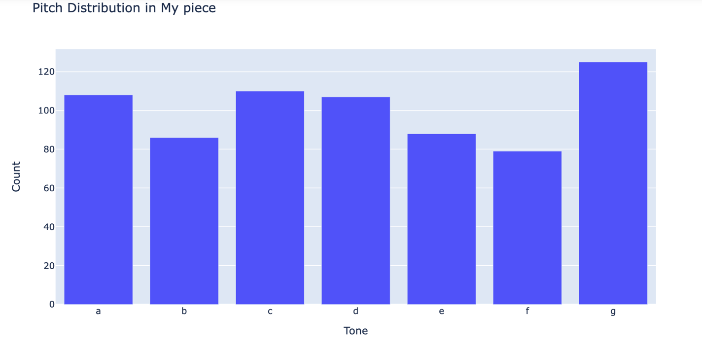

____________________
# Exploring (and Mining) XML with BeautifulSoup

**XML** stands for **eXtensible Markup Language**, and mainly serves to transport and store data. At its core, XML was designed to be **both machine- and human-readable**. 

XML is used widely on the web--**HTML** files are a kind of XML, in this case used for structured graphical representation of content. Read more about [**XML**](https://www.w3schools.com/xml/xml_syntax.asp).

In the case of music files, the common encoding standard is **MEI**, which stands for **Music Encoding Initiative** and is built on top of the XML framework. Read more about [**MEI**](https://music-encoding.org/).

**Beautiful Soup** is a Python library that allows us to interact with XML files--finding elements (the 'tags') and their attributes. Documentation: [here](https://www.crummy.com/software/BeautifulSoup/bs4/doc/) and [here](https://tedboy.github.io/bs4_doc/index.html).

**Beautiful Soup** can also be a good way to learn about the structure of MEI files.

In this tutorial we will explore the possibilities.

------
## Setup: Importing Python Libraries


```python
i%config IPCompleter.greedy=True
import pandas as pd
import matplotlib.pyplot as plt
import os
import bs4
from bs4 import BeautifulSoup

from pathlib import Path
import requests
import plotly.express as px
import plotly.graph_objects as go
from collections import Counter
import math
import numpy as np

# Visualisation dependencies
import textwrap
import networkx as nx
from pyvis.network import Network
import seaborn as sns
```

A list of all Beautiful Soup methods.  The most important for our work will be those that "find" elements and that 'get' the strings associated with various attributes and tags.


```python
[m for m in dir(BeautifulSoup) if m[0].islower()]
```


['append', 'childGenerator', 'children', 'clear', 'decode',
'decode_contents',
 decompose',
 'decomposed',
 'default',
 'descendants',
 'encode',
 'encode_contents',
 'endData',
 'extend',
 'extract',
 'fetchNextSiblings',
 'fetchParents',
 'fetchPrevious',
 'fetchPreviousSiblings',
 'find',
 'findAll',
 'findAllNext',
 'findAllPrevious',
 'findChild',
 'findChildren',
 'findNext',
 'findNextSibling',
 'findNextSiblings',
 'findParent',
 'findParents',
 'findPrevious',
 'findPreviousSibling',
 'findPreviousSiblings',
 'find_all',
 'find_all_next',
 'find_all_previous',
 'find_next',
 'find_next_sibling',
 'find_next_siblings',
 'find_parent',
 'find_parents',
 'find_previous',
 'find_previous_sibling',
 'find_previous_siblings',
 'format_string',
 'formatter_for_name',
 'get',
 'getText',
 'get_attribute_list',
 'get_text',
 'handle_data',
 'handle_endtag',
 'handle_starttag',
 'has_attr',
 'has_key',
 'index',
 'insert',
 'insert_after',
 'insert_before',
 'isSelfClosing',
 'is_empty_element',
 'new_string',
 'new_tag',
 'next',
 'nextGenerator',
 'nextSibling',
 'nextSiblingGenerator',
 'next_elements',
 'next_siblings',
 'object_was_parsed',
 'parentGenerator',
 'parents',
 'parserClass',
 'popTag',
 'prettify',
 'previous',
 'previousGenerator',
 'previousSibling',
 'previousSiblingGenerator',
 'previous_elements',
 'previous_siblings',
 'pushTag',
 'recursiveChildGenerator',
 'renderContents',
 'replaceWith',
 'replaceWithChildren',
 'replace_with',
 'replace_with_children',
 'reset',
 'select',
 'select_one',
 'setup',
 'smooth',
 'string',
 'string_container',
 'strings',
 'stripped_strings',
 'text',
 'unwrap',
 'wrap']


----
## Import Data (XML files!)

As your first and perhaps most important step, you'll have to go find some data. For this homework assignment, we will work with *these files*, which you can access *here*. Once you've picked your file and copied its URL, use the function provided below to **import it as a JSON object**.

The following function extracts text as a JSON:


```python

def getXML(url):
    # request for xml document of given url
    response = requests.get(url)    
    # response will be provided in JSON format
    return response.text
```

**read in your file** and store it in the "xml_document" variable.  We can also get the original file_name at this point for later use with export.


```python
xml_document = getXML('https://crimproject.org/mei/CRIM_Model_0019.mei')

```

Once you've imported a file, you should be able to **convert it into a Beautiful Soup Object**:


```python
my_soup_file = bs(xml_document, 'xml')
```

____________________
## Explore the XML File

The **MEI** framework tends to be easy to understand (as it is meant to be human-readable, too!) – and given some simple tools you should be able to successfully navigate your data.


First, let's take a look at the document as a whole. Make the cell below **print the "pretty"** version of your MEI file:

```python
print(my_soup_file.prettify())
```

<Details>

<Summary>View Beginning of XML File</Summary>


    <?xml version="1.0" encoding="utf-8"?>
    <?xml-model href="https://music-encoding.org/schema/4.0.1/mei-CMN.rng" type="application/xml" schematypens="http://relaxng.org/ns/structure/1.0"?>
    <?xml-model href="https://music-encoding.org/schema/4.0.1/mei-CMN.rng" type="application/xml" schematypens="http://purl.oclc.org/dsdl/schematron"?>
    <mei meiversion="4.0.1" xml:id="m-1" xmlns="http://www.music-encoding.org/ns/mei">
     <meiHead xml:id="m-2">
      <fileDesc xml:id="m-3">
       <titleStmt>
        <title>
         Ave Maria
        </title>
        <respStmt>
         <persName auth="VIAF" auth.uri="http://viaf.org/viaf/100226284" role="composer">
          Josquin Des Prés
         </persName>
         <persName role="editor">
          Marco Gurrieri
         </persName>
         <persName role="editor">
          Vincent Besson
         </persName>
         <persName role="editor">
          Richard Freedman
         </persName>
        </respStmt>
       </titleStmt>

</Details>

## Finding Elements and Attributes


The `find()` and `find(all)` methods are key ways of returning one or more tags in your XML file.  

`my_soup_file.persName()`, for example, will return the first instance of the `persName` tag in the MEI document we previously imported and named as the `my_soup_file` object. But it is also possible to do this in several other ways, with varied results:

- The **first instance** of the `persName` tag: `my_soup_file.find('persName')` 
- **All** the tags of the `persName` tag: `my_soup_file.find_all('persName')`, in this case returned as a Python `list` object, across which you can 

## Matching  Text Strings in Elements 

It's possible to return all the tags of a given type that **match a particular text string or even substring**.


- All the instances of the `persName` tag that **match a certain text string**:  `my_soup_file.find_all("persName", string="Vincent Besson")`.
- All the instances of the `persName` tag that contain **a substring anywhere in the text of the tag**:  `my_soup_file(lambda tag: tag.name == "persName" and "Vin" in tag.text)`.  In this case we are simply matching "Vin".

## More About Finding and Matching Tag Strings

- It is also possible to pass in lists (to return several different tags), regular expressions (to return tags matching various conditions), and even a dictionary (to match attributes of tags). Read more in the [Beautiful Soup documentation](https://tedboy.github.io/bs4_doc/6_searching_the_tree.html).
- We can *edit* tags and their attributes, and even *add or delete* tags.  For instance we might want to change or add the name of an editor in a certain file, or to update information about copyright in a folder of files.  Read more in the [Beautiful Soup documentation](https://tedboy.github.io/bs4_doc/7_modifying_the_tree.html).
- We can report the **entire tag**, or **get just the text string associated with it**, then use that information in some subsequent report or process.  For instance, below we show ways of finding, matching, and updating information about editors in one or more files.  We also show ways of colleting information about clefs and key signatures across a corpus of files

As explained in the following section of this tutorial, these same basic concepts can be applied across the XML tree to look for children, parents and siblings of various tags.

----
## Family Matters:  Working with Children, Siblings, and Parents 

As you have probably noticed by now, MEI (and XML, generally) files follow a **tree-like structure**. Any document has its elements defined recursively, as its children. Intuitively, **children** are elements contained within a broader element (think section), also known as **parent**.  And **children** of the same parent tag are **siblings**.

<Details>

<Summary> View Chart of Children Siblings, and Parents in XML</Summary>


</Details>

<br>

In a way, the **Title Statement** ("\<titleStmt>") element is a wrapper for all things that define a Title Statement. Mainly, a typical MEI Title Statement describes the piece's title and the people involved with the piece in some capacity. It contains tags labelled `title`, and `respStmt` (which in turn contains a number of `persName` tags).
    
    
```python
print(my_soup_file.titleStmt.prettify())
```

It's possible to return each of these children these in turn, by chaining the elements together.  Since we already know that the `titleStmt` contains the `title`, we can return the latter this way:
    
```python
print(my_soup_file.titleStmt.title.prettify())
```

Or the the complete `respStmt`:
    
    
```python
print(my_soup_file.titleStmt.respStmt.prettify())
```
    
The `respStmt` contains several `persName` tags (for the composer, editors, etc).  Here is the first of those:
  
```python
print(my_soup_file.titleStmt.respStmt.persName.prettify())
```
    
To **find all** of the `persName` children of the `respStmt`, however, we will need to use a new method. See the next section for how.

### Looking Down:  Children

First, let's find all **children** of the `titleStmt`. The results are similar to what we found with other methods, but in this case we are going to see  _all_ the elements nested within the parent:  `my_soup_file.titleStmt.findChildren()`.  This method returns a `list`.  We can then inspect each of these in turn.

One thing we learn from this is that the `persName` repeat:  each individual appears twice--once as part of the nested `restStmt` and again as part of the remainder of the `titleStmt`.  This is part of the MEI standard.  And so if we do any editing of these tags we will need to be on the look out for all instances of a given name.


```python
# find all the children in the titleStmt, and save as a variable
children_of_title = my_soup_file.titleStmt.findChildren()
# iterate through the list to see each child and print
for child in children_of_title:
    print(child.prettify())
```

    <title>
     Veni speciosam
    </title>
    
    <respStmt>
     <persName auth="VIAF" auth.uri="http://viaf.org/viaf/42035469" role="composer">
      Johannes Lupi
     </persName>
     <persName role="editor">
      Marco Gurrieri
     </persName>
     <persName role="editor">
      Bonnie Blackburn
     </persName>
     <persName role="editor">
      Vincent Besson
     </persName>
     <persName role="editor">
      Richard Freedman
     </persName>
    </respStmt>
    <persName auth="VIAF" auth.uri="http://viaf.org/viaf/42035469" role="composer">
     Johannes Lupi
    </persName>
    
    <persName role="editor">
     Marco Gurrieri
    </persName>
    
    <persName role="editor">
     Bonnie Blackburn
    </persName>
    
    <persName role="editor">
     Vincent Besson
    </persName>
    
    <persName role="editor">
     Richard Freedman
    </persName>


### Looking Across: Siblings

Siblings are tags of the *same type* as a given tag.  

Thus `first_person = my_soup_file.titleStmt.persName` will find the **first element** of the `persName` type.

To **find the first sibling of this tag, we use `findNextSibling`, or even just `findNext`.  If the **first sibling** was the composer, then `findNext` or `findNextSibling` will be one of the editors:

```python
very_next_sibling = my_soup_file.titleStmt.persName.findNextSibling()
very_next_sibling

```
    <persName role="editor">Marco Gurrieri</persName>


Another way to **find the very next siblings** afer the current one is with `findNext`.  

Find the first `persName`:

```python
first_person = my_soup_file.titleStmt.persName
first_person.findNext()
```

And append `findNext` to find the second person tag.


```python
second_person = my_soup_file.titleStmt.persName.findNext()
second_person
```

    <persName role="editor">Marco Gurrieri</persName>

To **find ALL the subsequent siblings** of a given element, we use `findNextSiblings` [note the plural!].  Here we take the `my_soup_file`, and get the `titleStmt`, then the first `persName` in that tag, and finally all the siblings of that tag with `findNextSiblings()`.  The result is a `list` of all of the `persName` tags *except* the first:


```python
sibling_names = my_soup_file.titleStmt.persName.findNextSiblings()

```

    [<persName role="editor">Marco Gurrieri</persName>,
     <persName role="editor">Bonnie Blackburn</persName>,
     <persName role="editor">Vincent Besson</persName>,
     <persName role="editor">Richard Freedman</persName>]

### Looking Up:  Parents

Here we can find the tags going up from some lower level to find out the `parent` tag (and in turn discover other children of that parent), or parents of the parents. For example here we find all the `parents` of one `note` in our mei file. We are in effect "looking up" from the lowest level of the tree through all those elements that contain it:


```python
for parent in my_soup_file.note.find_parents():
    print(parent.name)
```

    layer
    staff
    measure
    section
    score
    mdiv
    body
    music
    mei
    [document]

## Return the Text of a Tag

Sometimes, you might be working for scraping/analysis tools and would want to access the **contents (text)** of individual tags:

```python
for tag in my_soup_file.find_all("persName", {"role": "editor"}):
    print(tag.text.strip())
```
    
The `.strip()` function assures that we remove whitespace and other useless code.

Note that the 'text' of a tag is not the same as its 'name':

`print(my_soup_file.titleStmt.persName.name)` will return the 'name' of the tag itself, in this case simply 'title'

`print(my_soup_file.titleStmt.persName.text)` will return the 'contents' of the tag itself, in this case simply 'Ave Maria'


```python

for tag in my_soup_file.find_all("persName", {"role": "editor"}):
    print(tag.text.strip())
```

    Marco Gurrieri
    Bonnie Blackburn
    Vincent Besson
    Richard Freedman


Similarly, we can easily access the composer:


```python
# the text of the composer element:
for tag in my_soup_file.find_all("persName", {"role": "composer"}):
    print(tag.text.strip())
```

    Johannes Lupi
    Johannes Lupi


And the title:


```python
# the text of the title element, more directly:
my_soup_file.title.text.strip()
```

    'Veni speciosam'


## Edit (or Update) a Tag

We can also **update or edit** the text of a tag using `my_tag.string.replace_with('the_new_string')`:

```python
# find the first editor (which is second `persName` tag):
very_next_sibling = my_soup_file.titleStmt.persName.findNextSibling()
# update the 'string' of that tag with 'replace_with'
very_next_sibling.string.replace_with('Kévin Roger')
# return the updated tag
my_soup_file.titleStmt.persName.findNextSibling()
```

    <persName role="editor">Kévin Roger</persName>

## Add a Tag

One way to add a tag is to find a sibling of the same type as your new tag, then look the parent, and finally add a tag to it:

```python
# The parent tag of persName 
people_involved_parent = my_soup_file.find("persName").parent
# create a new tag that will have the role of 'analyst':
new_person_tag = my_soup_file.new_tag("persName", role="Analyst")
# populate the text of that new tag with a string:
new_person_tag.string = "Oleh Shostak"
# add the new tag to the original parent found above
people_involved_parent.append(new_person_tag)
# and show the revised result
my_soup_file.find_all("persName")
```


    [<persName auth="VIAF" auth.uri="http://viaf.org/viaf/42035469" role="composer">Johannes Lupi</persName>,
     <persName role="editor">Marco Gurrieri</persName>,
     <persName role="editor">Bonnie Blackburn</persName>,
     <persName role="editor">Vincent Besson</persName>,
     <persName role="editor">Richard Freedman</persName>,
     <persName role="Analyst">Oleh Shostak</persName>,
     <persName auth="VIAF" auth.uri="http://viaf.org/viaf/42035469" role="composer">Johannes Lupi</persName>,
     <persName auth="VIAF" auth.uri="http://viaf.org/viaf/59135590">Pierre Attaingnant</persName>]


## Finding Attributes within Tags


Tags can also contain **attributes**.  In the case of the `persName` tag in MEI files, for instance, attributes include:

- `role`, which differentiates 'composer' from 'editor' (for example).
- `auth`, which records the authority file for biographical entities (such as 'VIAF')
- `auth.uri`, which is the identifier used by the `auth` (such as 'http://viaf.org/viaf/100226284')


```python
for item in my_soup_file.titleStmt.children:
    print(item.prettify())
```

    <title>
     Ave Maria
    </title>
    
    <respStmt>
     <persName auth="VIAF" auth.uri="http://viaf.org/viaf/100226284" role="composer">
      Josquin Des Prés
     </persName>
     <persName role="editor">
      Marco Gurrieri
     </persName>
     <persName role="editor">
      Vincent Besson
     </persName>
     <persName role="editor">
      Richard Freedman
     </persName>
    </respStmt>


We can easily filter these tags according to **attribute key and value pairs** by passing a dictionary (such as `{'my_key': 'my_value'}`) to the `find_all` method:

Here for instance are all the `persName` tags with the string "editor" in the `role` attribute:


```python
my_soup_file.find_all("persName", {"role": "editor"})
```

    [<persName role="editor">Marco Gurrieri</persName>,
     <persName role="editor">Bonnie Blackburn</persName>,
     <persName role="editor">Vincent Besson</persName>,
     <persName role="editor">Richard Freedman</persName>]

## Edit an Attribute

Sometimes it's necessary to change the contents of an attribute.  For instance here is a list of 'editors':

    `my_soup_file.find_all("persName", {"role": "editor"})``

    [<persName role="editor">Marco Gurrieri</persName>,
    <persName role="editor">Vincent Besson</persName>,
    <persName role="editor">Richard Freedman</persName>]


Here is a way call them 'analysts' instead:

```python
tags_to_edit = my_soup_file.find_all("persName", {"role": "editor"})
for tag in tags_to_edit:
  tag['role'] = 'analyst'
tags_to_edit
```
    [<persName role="analyst">Marco Gurrieri</persName>,
    <persName role="analyst">Vincent Besson</persName>,
    <persName role="analyst">Richard Freedman</persName>]


##  Save Revised XML document

Here we use the file_name from the url, created at the time of import above.

It would also be possible to split the base file name from the extension, and add 'rev', etc.

basename = os.path.splitext(os.path.basename(filepath))[0]
extension = os.path.splitext(os.path.basename(filepath))[-1]

```python
with open(file_name, 'w') as f:
    f.write(str(my_soup_file))
```
-----
## Working with MEI `music`:  Measures, Staves, Notes

MEI (XML) files are normally thought of as rich encodings of musical scores and the editorial and source critical information that surround their production. But they can also be interrogated for music data.  This is despite the fact that those in Common Music Notation (the standard in use since the 18th century) are encoded 'measure by measure' and so it can be rather tricky to take stock of events that (for instance) are occuring at the same time in different staves.  

Advanced analysis of musical patterns is probably best done with Music21 or CRIM Intervals.  But a surprising among of relevant data about notes and editorial practice can be found with Beautiful my_soup_file.

### Staves

Information about the staves are contained in the `staffDef` tag. First, let's look at just the **first staff**:

```python
print(my_soup_file.staffDef.prettify())
```


```python
print(my_soup_file.staffDef.prettify())
```

    <staffDef clef.line="2" clef.shape="G" key.sig="1f" label="Superius" lines="5" n="1" xml:id="m-30">
     <label>
      Superius
     </label>
     <instrDef midi.channel="1" midi.pan="26" midi.volume="100" xml:id="m-32"/>
    </staffDef>
    


Next, **find all staves** with `find_all`:

* Notice that these are returned as a **list** object, so we can easily also run this with a **for** loop.  

```python
my_soup_file.find_all("staffDef")
```

* Beautiful Soup responses are "list ready".  Thus the first staff is `my_soup_file.find_all("staffDef")[0]`.  The last staff is `my_soup_file.find_all("staffDef")[-1]`.

```python
my_soup_file.find_all("staffDef")
```

    [<staffDef clef.line="2" clef.shape="G" key.sig="1f" label="Superius" lines="5" n="1" xml:id="m-30">
     <label>Superius</label>
     <instrDef midi.channel="1" midi.pan="26" midi.volume="100" xml:id="m-32"/>
     </staffDef>,
     <staffDef clef.line="2" clef.shape="G" key.sig="1f" label="Contratenor" lines="5" n="2" xml:id="m-33">
     <label>Contratenor</label>
     <instrDef midi.channel="1" midi.pan="46" midi.volume="100" xml:id="m-35"/>
     </staffDef>,
     <staffDef clef.dis="8" clef.dis.place="below" clef.line="2" clef.shape="G" key.sig="1f" label="PrimusTenor" lines="5" n="3" xml:id="m-36">
     <label>PrimusTenor</label>
     <instrDef midi.channel="1" midi.pan="81" midi.volume="100" xml:id="m-38"/>
     </staffDef>,
     <staffDef clef.dis="8" clef.dis.place="below" clef.line="2" clef.shape="G" key.sig="1f" label="SecundusTenor" lines="5" n="4" xml:id="m-39">
     <label>SecundusTenor</label>
     <instrDef midi.channel="1" midi.pan="81" midi.volume="100" xml:id="m-41"/>
     </staffDef>,
     <staffDef clef.dis="8" clef.dis.place="below" clef.line="2" clef.shape="G" key.sig="1f" label="Bassus" lines="5" n="5" xml:id="m-42">
     <label>Bassus</label>
     <instrDef midi.channel="1" midi.pan="81" midi.volume="100" xml:id="m-44"/>
     </staffDef>]


We can use the collection of Staves to figure out **what voices** are used in a piece:

- find ALL STAVES with a GIVEN CLEF by passing dictionary that specifies the requested type
- the final_all results are a Beautiful Soup list:

```python
# get all G-clef staves:
staves = my_soup_file.find_all("staffDef", {'clef.shape': "G"})
# print cleaned-up text of those tags--just the names
for staff in staves:
    print(staff.text.strip())
```


```python

# Get all G-clef staves:
staves = my_soup_file.find_all("staffDef", {'clef.shape': "G"})

# print cleaned-up text of those tags--just the names
for staff in staves:
    print(staff.text.strip())
```

    Superius
    Contratenor
    PrimusTenor
    SecundusTenor
    Bassus


### Counting Notes

We already know how to find the first note (of the first staff in the first bar):

```python
my_soup_file.note.get('pname')
```

But we can also:


```python
# gets just the first pitch
my_soup_file.note.get('pname')
```

    'g'


```python
# how many notes?
len(my_soup_file.find_all('note'))
```

    1933


```python
# find all the notes and print pitch names
for note in my_soup_file.find_all(name='note'):
    print(note.get('pname'))
```

Shortened output:

    g
    d
    d
    c
    d
    f
    d
    e
    d
    c
    a
    g
    f
    b
    d
    

Using some of the familiar techniques, we can count **pitches** and put them in a **series** or **DataFrame**:


```python
# counts pitches all voices, now as dictionary
pitches = [n.get('pname') for n in my_soup_file.find_all('note')]
counted = Counter(pitches)


counted_notes = pd.Series(counted).to_frame('count').sort_index()
counted_notes
```


<div>
<style scoped>
    .dataframe tbody tr th:only-of-type {
        vertical-align: middle;
    }

    .dataframe tbody tr th {
        vertical-align: top;
    }

    .dataframe thead th {
        text-align: right;
    }
</style>
<table border="1" class="dataframe">
  <thead>
    <tr style="text-align: right;">
      <th></th>
      <th>count</th>
    </tr>
  </thead>
  <tbody>
    <tr>
      <th>a</th>
      <td>277</td>
    </tr>
    <tr>
      <th>b</th>
      <td>227</td>
    </tr>
    <tr>
      <th>c</th>
      <td>262</td>
    </tr>
    <tr>
      <th>d</th>
      <td>410</td>
    </tr>
    <tr>
      <th>e</th>
      <td>209</td>
    </tr>
    <tr>
      <th>f</th>
      <td>216</td>
    </tr>
    <tr>
      <th>g</th>
      <td>332</td>
    </tr>
  </tbody>
</table>
</div>


```python
# count pitches in one voice:

measures = my_soup_file.find_all('measure')
pitches = []
# here we assume the superius is the first staff
superius_bars = [my_soup_file.find_all('staff', {"n": "1"}) for measure in measures]
for superius in superius_bars[0]:
    notes = superius.find_all('note')
    for note in notes:
        pitch = note.get('pname')
        pitches.append(pitch)
pitches_counted = Counter(pitches)
superius_pitch_count = pd.Series(pitches_counted).to_frame('count').sort_index()
superius_pitch_count

```


<div>
<style scoped>
    .dataframe tbody tr th:only-of-type {
        vertical-align: middle;
    }

    .dataframe tbody tr th {
        vertical-align: top;
    }

    .dataframe thead th {
        text-align: right;
    }
</style>
<table border="1" class="dataframe">
  <thead>
    <tr style="text-align: right;">
      <th></th>
      <th>count</th>
    </tr>
  </thead>
  <tbody>
    <tr>
      <th>a</th>
      <td>67</td>
    </tr>
    <tr>
      <th>b</th>
      <td>64</td>
    </tr>
    <tr>
      <th>c</th>
      <td>70</td>
    </tr>
    <tr>
      <th>d</th>
      <td>99</td>
    </tr>
    <tr>
      <th>e</th>
      <td>29</td>
    </tr>
    <tr>
      <th>f</th>
      <td>27</td>
    </tr>
    <tr>
      <th>g</th>
      <td>46</td>
    </tr>
  </tbody>
</table>
</div>


And create a histogram


```python
counted_notes.plot(kind="bar", figsize=(15, 10))
plt.title("Pitch Distribution in My piece")
plt.xticks(rotation = 0)
plt.xlabel("Tone")
plt.ylabel("Count")
plt.show()
```





#### Working with Measures

It is oftentimes useful to look at **measures** – either all at once or specific ones. Here's an example:


```python
# last pitch in last measure, for each voice
measures = my_soup_file.find_all('measure')
last_measure = measures[-1]
for staff in last_measure.find_all('staff'):
        note = staff.find_all('note')[-1]
        print(note.get('pname'))

```

    g
    d
    g
    b
    g


Working with **Score Definitions** (scoreDef), it is possible to search for certain **events** within the piece. For example, find out where a **Time Signature change** occurs.  The results are saved to a dataframe for further analysis or reporting:


```python
# find all the scoredefs (which are places where time signatures change)
scoredefs = my_soup_file.find_all('scoreDef')
# create an empty list for the dictionaries
ts_dict_list = []
# iterate through the score defs, creating dictionary of each new time signature and its location
for scoredef in scoredefs:
    next_measure = scoredef.find_next('measure', )
    ts_dict = {'m_count' : scoredef.get('meter.count'),
               'unit_count' : scoredef.get('meter.unit'),
               'measure' : next_measure.get('n')}
    ts_dict_list.append(ts_dict)
# pass the list of dictionaries to the new dataframe
df = pd.DataFrame(ts_dict_list)
df
```


<div>
<style scoped>
    .dataframe tbody tr th:only-of-type {
        vertical-align: middle;
    }

    .dataframe tbody tr th {
        vertical-align: top;
    }

    .dataframe thead th {
        text-align: right;
    }
</style>
<table border="1" class="dataframe">
  <thead>
    <tr style="text-align: right;">
      <th></th>
      <th>m_count</th>
      <th>unit_count</th>
      <th>measure</th>
    </tr>
  </thead>
  <tbody>
    <tr>
      <th>0</th>
      <td>4</td>
      <td>2</td>
      <td>1</td>
    </tr>
    <tr>
      <th>1</th>
      <td>3</td>
      <td>1</td>
      <td>93</td>
    </tr>
    <tr>
      <th>2</th>
      <td>4</td>
      <td>2</td>
      <td>109</td>
    </tr>
    <tr>
      <th>3</th>
      <td>8</td>
      <td>2</td>
      <td>150</td>
    </tr>
  </tbody>
</table>
</div>


Finding clef and key signature information for each voice part, along with the lowest final tone of the piece.  This could serve as an indication of key or modality:

```python
# the empty list
list_dicts = []

# get composer and title from mei file
composer = my_soup_file.find("persName", {"role": "composer"})
title = my_soup_file.find('title')

measures = my_soup_file.find_all('measure')
last_measure = measures[-1]
last_staff =  last_measure.find_all('staff')[-1]
last_note = last_staff.find_all('note')[-1]

# iterate through the staves, making a temporary dictionary for each, consisting of composer, title, voice, clef shape, clef line, key signature, and last note
for staff in my_soup_file.find_all('staffDef'):
    temp_dict = {"Composer": composer.text,
                 "Title": title.text,
                 "Voice_Name": staff.text.strip(),
                 "Clef_Shape": staff.get('clef.shape'),
                 "Clef_Line": staff.get('clef.line'),
                 "Key_Signature": staff.get('key.sig'),
                 "Last_Lowest_Note": last_note.get('pname')}
# add each temp dict to the list
    list_dicts.append(temp_dict)

# pass the list of temp dicts to make a df
df = pd.DataFrame.from_dict(list_dicts)
df
```


Finally, we can look for some very specific things, like **all notes with a particular duration, pitch, and octave**:

* Use dictionary of key/value pairs to specify particular attributes.

```python
my_soup_file.find_all('note', {'dur': "4", 'pname': "g", 'oct': '3'})
```


```python
my_soup_file.find_all('note', {'dur': "4", 'pname': "g", 'oct': '3'})
```


    [<note dur="4" dur.ppq="256" oct="3" pname="g" pnum="43" stem.dir="up" xml:id="m-323"/>,
     <note dur="4" dur.ppq="256" oct="3" pname="g" pnum="43" stem.dir="up" xml:id="m-421"/>,
     <note dur="4" dur.ppq="256" oct="3" pname="g" pnum="43" stem.dir="up" xml:id="m-635"/>,
     <note dur="4" dur.ppq="256" oct="3" pname="g" pnum="43" stem.dir="up" xml:id="m-1200"/>,
     <note dur="4" dur.ppq="256" oct="3" pname="g" pnum="43" stem.dir="up" xml:id="m-1503">
     <verse n="1" xml:id="m-1553">
     <syl con="d" wordpos="m" xml:id="m-1554">
                 bi
                </syl>
     </verse>
     </note>,
     <note dur="4" dur.ppq="256" oct="3" pname="g" pnum="43" stem.dir="up" xml:id="m-1544"/>,
     <note dur="4" dur.ppq="256" oct="3" pname="g" pnum="43" stem.dir="up" xml:id="m-2519"/>,
     <note dur="4" dur.ppq="256" oct="3" pname="g" pnum="55" stem.dir="up" xml:id="m-2539">
     <verse n="1" xml:id="m-2601">
     <syl con="d" wordpos="m" xml:id="m-2602">
                 sa
                </syl>
     </verse>
     </note>,
     <note dur="4" dur.ppq="256" oct="3" pname="g" pnum="43" stem.dir="up" xml:id="m-2667">
     <verse n="1" xml:id="m-2719">
     <syl con="d" wordpos="i" xml:id="m-2720">
                 ro
                </syl>
     </verse>
     </note>,
     <note dur="4" dur.ppq="256" oct="3" pname="g" pnum="43" stem.dir="up" xml:id="m-3073"/>,
     <note dur="4" dur.ppq="256" oct="3" pname="g" pnum="43" stem.dir="up" xml:id="m-3074">
     <verse n="1" xml:id="m-3079">
     <syl con="d" wordpos="m" xml:id="m-3080">
                 li
                </syl>
     </verse>
     </note>,
     <note dur="4" dur.ppq="256" oct="3" pname="g" pnum="43" stem.dir="up" xml:id="m-3198">
     <verse n="1" xml:id="m-3253">
     <syl con="d" wordpos="m" xml:id="m-3254">
                 li
                </syl>
     </verse>
     </note>,
     <note dur="4" dur.ppq="256" oct="3" pname="g" pnum="55" stem.dir="up" xml:id="m-3375">
     <verse n="1" xml:id="m-3460">
     <syl con="d" wordpos="i" xml:id="m-3461">
                 con
                </syl>
     </verse>
     </note>,
     <note dur="4" dur.ppq="256" oct="3" pname="g" pnum="55" stem.dir="up" xml:id="m-3379"/>,
     <note dur="4" dur.ppq="256" oct="3" pname="g" pnum="43" stem.dir="up" xml:id="m-3409">
     <verse n="1" xml:id="m-3416">
     <syl con="d" wordpos="m" xml:id="m-3417">
                 li
                </syl>
     </verse>
     </note>,
     <note dur="4" dur.ppq="256" oct="3" pname="g" pnum="43" stem.dir="up" xml:id="m-3878"/>,
     <note dur="4" dur.ppq="256" oct="3" pname="g" pnum="43" stem.dir="up" xml:id="m-3911"/>,
     <note dur="4" dur.ppq="256" oct="3" pname="g" pnum="43" stem.dir="up" xml:id="m-3922"/>,
     <note dur="4" dur.ppq="256" oct="3" pname="g" pnum="43" stem.dir="up" xml:id="m-4032"/>,
     <note dur="4" dur.ppq="256" oct="3" pname="g" pnum="43" stem.dir="up" xml:id="m-4056"/>,
     <note dur="4" dur.ppq="256" oct="3" pname="g" pnum="43" stem.dir="up" xml:id="m-4819">
     <verse n="1" xml:id="m-4828">
     <syl con="u" wordpos="t" xml:id="m-4829">
                 na,
                </syl>
     </verse>
     </note>,
     <note dur="4" dur.ppq="256" oct="3" pname="g" pnum="43" stem.dir="up" xml:id="m-4906"/>,
     <note dur="4" dur.ppq="256" oct="3" pname="g" pnum="43" stem.dir="up" xml:id="m-5041"/>,
     <note dur="4" dur.ppq="256" oct="3" pname="g" pnum="43" stem.dir="up" xml:id="m-5188"/>,
     <note dur="4" dur.ppq="256" oct="3" pname="g" pnum="43" stem.dir="up" xml:id="m-5502"/>,
     <note dur="4" dur.ppq="256" oct="3" pname="g" pnum="55" stem.dir="up" xml:id="m-6123">
     <verse n="1" xml:id="m-6131">
     <syl con="u" wordpos="t" xml:id="m-6132">
                 ta?
                </syl>
     </verse>
     </note>,
     <note dur="4" dur.ppq="256" oct="3" pname="g" pnum="43" stem.dir="up" xml:id="m-6193">
     <verse n="1" xml:id="m-6206">
     <syl con="u" wordpos="t" xml:id="m-6207">
                 ta,
                </syl>
     </verse>
     </note>,
     <note dur="4" dur.ppq="256" oct="3" pname="g" pnum="43" stem.dir="up" xml:id="m-6197"/>]


