| [Pandas Basics][pandas-basics] | [Clean Data][pandas-clean] | [Tidy Data][pandas-tidy] | [Filtering, Finding, and Grouping][pandas-filter-find-group] | **Graphs and Charts** | [Networks][pandas-networks] |
|--------|--------|--------|--------|-------|-------|

# Charts and Plots with Plotly Express

Our main resource is the [Plotly Express](https://plotly.com/python/plotly-express) library, which allows for interactive visualizations and more complex/powerful graphs with less code. . The Plotly Express documentation details the very wide range of bar charts, histograms, scatter plots, heat maps, polar (radar) figures you can create, and various ways of adding captions, legends, colors, etc.

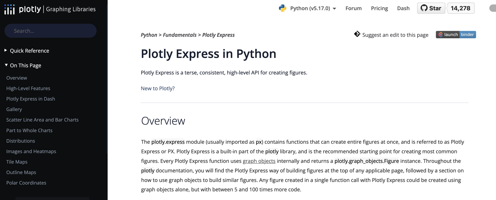

|     | Contents of this Tutorial               | 
|-----|-----------------------------------------|
| 1.  | [**Bar Charts**](#bar-charts) |
| 2.  | [**Histograms**](#histograms) |
| 3.  | [**Scatter Plots**](#scatter-plots) |
| 4.  | [**Radar or Spider Plots**](#radar-or-spider-plots) |
| 5.  | [**Correlation Plots and Heatmaps**](#correlation-plots-and-heatmaps) |
| 6.  | [**Correlation Does Not Equal Causation**](#correlation-does-not-equal-causation) |
| 7.  | [**Adjusting Chart Size**](#adjusting-size-of-the-image) |
| 8.  | [**Pick Custom Color Scheme**](#pick-custom-color-scheme) |
| 9.  | [**Adjusting Axes**](#axis-scaling-linear-or-logarithmic) |
| 10. | [**Adding a Title**](#adding-a-title) |
| 11. | [**Labels and Legends**](#labels-and-legends) |
| 12. | [**X and Y Axis Tickmarks**](#x-and-y-axis-tickmarks) |
| 13. | [**Hover Data**](#hover-to-show-data-points) |

---

The first step is always to import the relevant library. 


```python
# Import libraries
import pandas as pd
import plotly.express as px
```

And of course get some data:

```python
beatles_spotify_pkl = 'https://raw.githubusercontent.com/RichardFreedman/Encoding_Music/main/02_Lab_Data/Beatles/beatles_data.pkl'

# Import to a Pandas dataframe
beatles_spotify = pd.read_pickle(beatles_spotify_pkl)
```

From here you will normally:

- Define a figure by passing a dataframe to a method (such as `fig = px.histogram(df_hist(df)`)
- Specify special labels, formatting, or other features
- Show the figure with `fig.show()`, or specify a file name if you would prefer to save it.

## Bar Charts

Bar charts are used to display categorical data. They consist of vertical or horizontal bars that represent different categories and their corresponding values. Bar charts are excellent for comparing data across different categories.  Learn more at [Plotly Express](https://plotly.com/python/bar-charts/)

Here's an example of a bar chart showing mean values for selected Spotify features, by album:

<details><summary>Bar Chart Code</summary>

```python
# Group data by year and album, calculating the mean for selected audio features
grouped_data = beatles_spotify.groupby(['year', "album"])[['danceability', 'energy', 'acousticness']].mean().copy()
grouped_data = grouped_data.reset_index()

fig = px.bar(grouped_data,
             x='album',
             y=['danceability', 'energy', 'acousticness'], # If you wanted a simpler bar chart, you could use a single feature
             labels={'danceability': 'Danceability', 'energy': 'Energy', 'acousticness': 'Acousticness'},
             title='Figure 1: Compararive Beatles Album Scores for Selected Audio Features')

fig.update_layout(barmode='group') # Set bar mode to group for side-by-side comparison, rather than stacked

# Show the figure
fig.show()
```

</details>

<br>
    
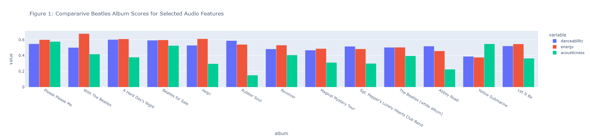
    
<br>


## Histograms
Histograms are used to display the distribution of numerical data. They consist of a series of adjacent rectangles (bins) that represent the frequency or proportion of data falling within specific intervals. Histograms help us understand the shape and spread of data.  Learn more at [Plotly Express](https://plotly.com/python/histograms/)

Let's use one to see how energetic Beatles songs tend to be!

<details><summary>Histogram Code</summary>

```python
 # Create histogram of song energy
fig = px.histogram(
    beatles_spotify,
    x='energy',
    nbins=20, ## Number of bins in the histogram
    title='Distribution of Energy in Beatles Songs',
    labels={'energy': 'Energy (0 = calm, 1 = intense)'},
)

fig.show()
```
</details>

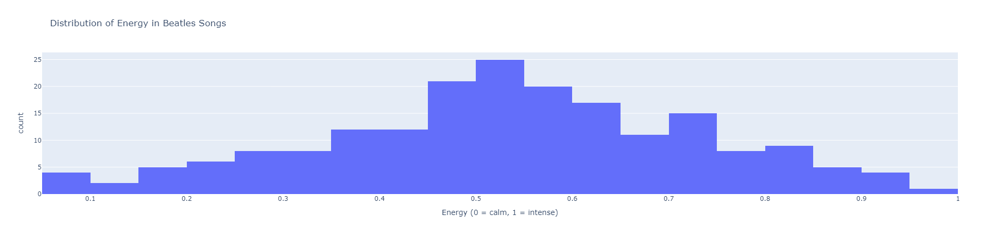

<br>

## Scatter Plots
Scatter plots are used to display the relationship between two numerical variables. Each point on the plot represents the values of the variables. Scatter plots are useful for identifying patterns, trends, and outliers in the data.  Learn more at [Plotly Express](https://plotly.com/python/line-and-scatter/)

Here's an example of a scatter plot showing the relationship between energy and danceability. You may notice that the graph is a little hard to read, since it is stretched out sideways. We'll change this later, when we learn how to customize graphs and charts.

<details><summary>Scatter Plot Code</summary>

```python
fig = px.scatter(
    beatles_spotify,
    x='danceability',
    y='energy',
    color='album',
    title='Scatter Plot: Danceability vs Energy in Beatles Songs',
    labels={'danceability': 'Danceability (0 = low, 1 = high)', 'energy': 'Energy (0 = calm, 1 = intense)'},
)

fig.show()

```

</details>

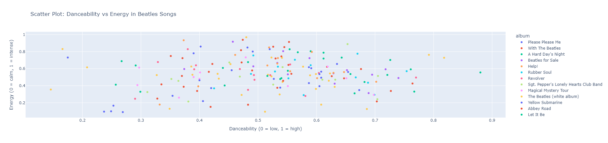

<br>

### Scatter Plot with Variable Marker Size

Here we combine several data features to make a more interesting kind of Scatter Plot.

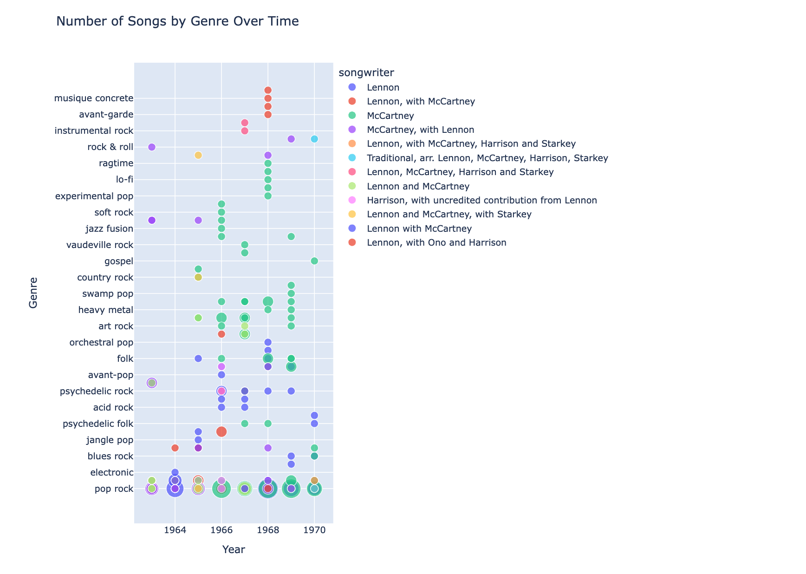

Here is the code to do it:

<Details>

<Summary>Code for ScatterPlot with Variable Markers</Summary>


```python
genre_counts = beatles_data.groupby(['album', 'year', 'songwriter'])['genre'].value_counts().reset_index()

substrings = ['Lennon', 'McCartney']


john_paul = genre_counts[genre_counts['songwriter'].str.contains('|'.join(substrings))]


# Create the scatter plot
fig = px.scatter(
    john_paul,
    x='year',
    y='genre',
    size='count',
    color='songwriter',
    hover_data=['count'],
    labels={
        'x': 'Year',
        'y': 'Genre',
        'size': 'Number of Songs',
        'color': 'Genre'
    },
    title="Number of Songs by Genre Over Time"
)

# Customize the plot
fig.update_layout(
    xaxis_title="Year",
    yaxis_title="Genre",
    showlegend=True,

    width=800,  # Set width to 800px
    height=800,  # Set height to 800px
)

# Show the plot
fig.show()
```

</Details>


## Radar or Spider Plots

Radar (or Polar) plots are a useful way to represent multiple variables at once, putting each of several variables around a central point:  the distance from the center indicates the strength of that feature.  There are many types of polar (radar) plots available in Plotly Express.  Here we use the `line_polar` plot.  Read more about the various features via [Plotly Express](https://plotly.com/python/radar-chart/).  

It is helpful in this instance to use the Pandas `melt` method to transform our 'wide' data (with multiple columns for the individual audio features) into 'long' form data (with each feature represented as an individual row), which is easier for Plotly Express to read.  Here is an example of how to do that: 


```python
# assuming df is a dataframe with a 'track_title' column and several audio feature columns
feature_list = ["danceability", "energy", "speechiness", "liveness", "instrumentalness", "acousticness", "valence"]
pd.melt(df, id_vars=['track_title'], value_vars=feature_list)
```

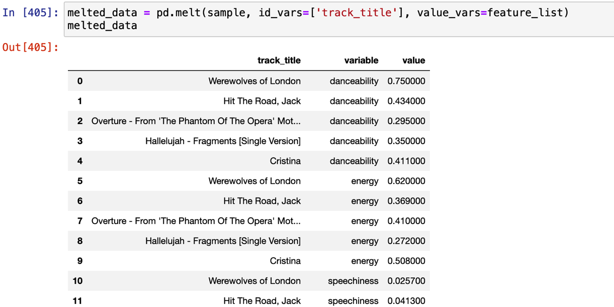

The [Plotly Express](https://plotly.com/python/polar-chart/#polar-chart-with-plotly-express) `line_polar` method in turn can easily read these long-form data to produce the feature-based plots. Here we define a function that takes in the original dataframe of audio features, a list of feature columns to plot, and a name for the final chart.  

<Details>
<Summary>Sample Radar Plot Code</Summary>

```python
# filter our data (in this case to album title)
selected_albums = ['Rubber Soul']
# beatles_bb_spotify_tidy is the 'long' form version of the data, with one row per song and audio feature, rather than one row per song and multiple columns for the audio features

# here we filter the data to show just the songs from the selected alums
album_data = beatles_bb_spotify_tidy[beatles_bb_spotify_tidy['album.debut.uk'].isin(selected_albums)]

# now filter for the selected features
feature_list = ["danceability", "energy", "speechiness", "liveness", "instrumentalness", "acousticness", "valence"]
filtered_data = album_data[album_data['audio_feature'].isin(feature_list)]

# title for the chart
chart_title = f"Radar Plot of Audio Features in {selected_album}"

# now make the chart
fig = px.line_polar(filtered_data, 
                    r='value',  # this is the audio feature scalar
                    theta='audio_feature', # these are 
                    color='song', 
                    labels={'song': "Song"},
                    line_close=True)  # Add this line to make the radar plot closed

fig.update_layout(title=chart_title,
                  width=800, 
                  height=800,
                 legend=dict(
        x=1.2,    # push further right (1.0 = right edge of plot area)
        y=0.5,    # vertically centered
        xanchor='left',
        yanchor='middle')
                 )


fig.show() 
 
```
</Details>

<br>


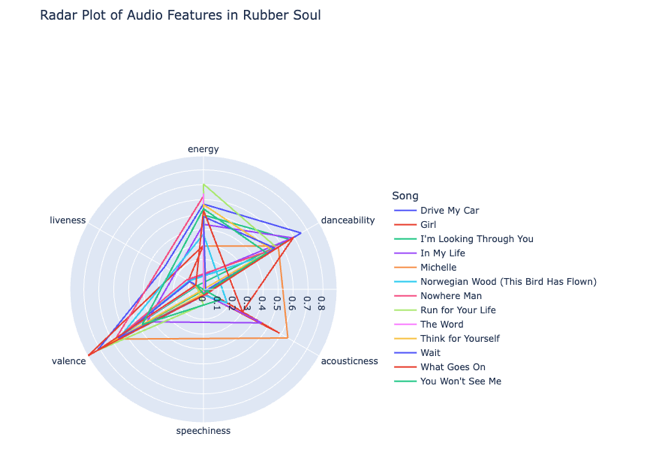


<br>


## Sankey Charts

Sankey charts can be an interesting way of showing connections among different categorical data.  In this example we show the 'flow' of songs in two different albums according to their danceability.  We previously turned the Spotify scalar danceability ratings into 'low', 'middle', and 'high' categoricals using `pd.qcut`, like this:

```python
beatles['dance_binned'] = pd.qcut(beatles["danceability"], q=3, labels=['low', 'medium', 'high'])
```

Then to create our Sankey chart we filter the data to show just two albums, and select the other features accordingly.

Creating a Sankey chart is a bit like creating a network:  we need to establish various `nodes` and various `links` among them.

<Details>

<br>

```python
import plotly.graph_objects as go
df = beatles[beatles['album'].isin(['Magical Mystery Tour', 'Abbey Road'])].copy()


# Configure your columns here - just change the chosen_feature to any column name
album_col = 'album'
song_col = 'song'
chosen_feature = 'dance_binned'  # Change this to any column name you want (e.g., 'key', 'tempo', 'energy', etc.)

# Create count column for flow values
df['count'] = 1

# Create Album → Song links
album_song_links = df.groupby([album_col, song_col])['count'].sum().reset_index()
album_song_links.columns = ['source', 'target', 'value']

# Create Song → Feature links
song_feature_links = df.groupby([song_col, chosen_feature])['count'].sum().reset_index()
song_feature_links.columns = ['source', 'target', 'value']

# Get unique nodes for each tier
albums = sorted(df[album_col].unique())
songs = sorted(df[song_col].unique())
features = sorted([str(feature) for feature in df[chosen_feature].unique()])

# Create complete node list
all_nodes = albums + songs + features

# Create node index mapping
node_to_index = {node: idx for idx, node in enumerate(all_nodes)}

# Create source and target index lists
sources = []
targets = []
values = []

# Add Album → Song links
for _, row in album_song_links.iterrows():
    sources.append(node_to_index[row['source']])
    targets.append(node_to_index[row['target']])
    values.append(row['value'])

# Add Song → Feature links
for _, row in song_feature_links.iterrows():
    sources.append(node_to_index[row['source']])
    targets.append(node_to_index[str(row['target'])])
    values.append(row['value'])

# Create node colors
num_albums = len(albums)
num_songs = len(songs)
num_features = len(features)

node_colors = (['lightcoral'] * num_albums +      # Albums in light coral
              ['lightblue'] * num_songs +          # Songs in light blue  
              ['lightgreen'] * num_features)       # Features in light green

# Simple Sankey with automatic positioning
fig = go.Figure(data=[go.Sankey(
    node=dict(
        label=all_nodes,
        color=node_colors
    ),
    link=dict(
        source=sources,
        target=targets,
        value=values
    )
)])

# Dynamic title based on chosen feature
feature_name = chosen_feature.replace('_', ' ').title()
fig.update_layout(title=f"Album → Song → {feature_name}",
                 height=1200)
fig.show()

```

</Details>


<br>


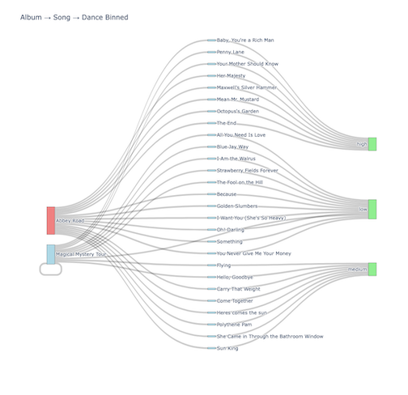

<br>

## Correlation Plots and Heatmaps

Correlation plots are used to visualize the strength and direction of the relationship between two numerical variables. They provide a numerical measure called the correlation coefficient, which ranges from -1 to 1. A value close to -1 indicates a strong negative correlation, a value close to 1 indicates a strong positive correlation, and a value close to 0 indicates no or weak correlation.

One way to do this is via the `scatter_matrix` function in Plotly Express, which produces an individual scatterplot of all pairs of values in each pair of variables in your data.  Here is an example using audio feature data from Spotify.   Learn more at [Plotly Express](https://plotly.com/python/splom/)

Note that to show trend lines as noted above, you would need to produce an individual scatterplot for each pair of variables.


<Details>
<Summary> Sample Correlation Plot Code </Summary>

Here we assume you are working with _wide_ format spotify data from the Beatles set:

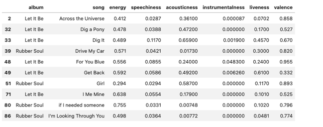


```python
_cols = ['album', 'song', 'energy', 'speechiness', 'acousticness', 
         'instrumentalness', 'liveness', 'valence']

spotify_selected = beatles_spotify_clean[_cols]
selected_albums = ['Rubber Soul', 'Let It Be']
album_data = spotify_selected[spotify_selected['album'].isin(selected_albums)]

feature_cols = ['energy', 'speechiness', 'acousticness', 
                'instrumentalness', 'liveness', 'valence']

fig = px.scatter_matrix(
    album_data,
    dimensions=feature_cols,
    color='album',
    hover_data=['song', 'album'],   # these appear in the tooltip
    labels={'album': 'Album'}
)

fig.update_layout(
    title=f'Audio Feature Correlation for {", ".join(selected_albums)}',
    width=800,
    height=800
)
fig.show()

```

</Details>

<br>


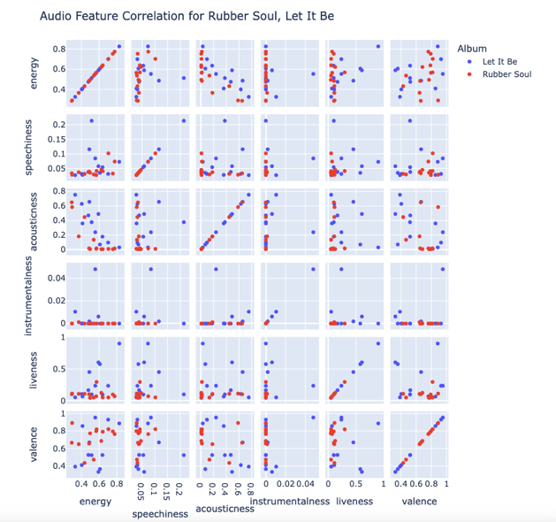


You can also create a correlation heatmap, which shows the correlation coefficients between pairs of variables in a matrix format. The values are typically color-coded to indicate the strength and direction of the correlations.  Learn more at [Plotly Express](https://plotly.com/python/heatmaps/)

<Details>
<Summary> Sample Correlation Heatmap Code </Summary>

```python
selected_albums = ['Rubber Soul']
selected_album_data = beatles_spotify_clean[beatles_spotify_clean['album'].isin(selected_albums)]

feature_cols = ['energy', 'speechiness', 'acousticness', 
                'instrumentalness', 'liveness', 'valence']
spotify_selected_albums = selected_album_data[feature_cols]

correlation_matrix = spotify_selected_albums.corr()

fig = px.imshow(correlation_matrix)

fig.update_layout(
    title=f'Audio Feature Correlation for {", ".join(selected_albums)}',
    width=600,
    height=600
)
fig.show()
```
</Details>

<br>

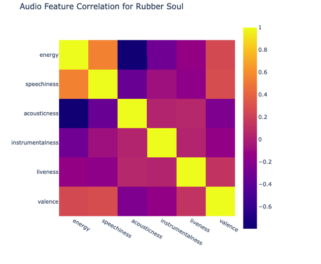


<br>

### Correlation Does Not Equal Causation
It's crucial to understand that correlation does not imply causation. Just because two variables are correlated does not mean that one variable causes the other. Correlation measures the statistical relationship between variables but cannot determine cause and effect.

Always exercise caution when interpreting correlations and avoid making causal claims based solely on correlation. Other factors, such as confounding variables, might be influencing the observed relationship.

Remember, correlation is not causation!

For example: 

Image Source: [Spurious Correlations by Tyler Vigen](https://www.tylervigen.com/spurious-correlations)

Although these two are strongly correlated, married couples that eat more margarine are not guaranteed to get divorced.

## Adjusting the Size, Title, Color, and Labels in Plotly Express Charts

In Plotly Express there are various ways to change the size of your final image, provide a title, adjust the scale of the X and Y axes, and provide special labels for the items noted each axis.  It's also possibe to provide additional data in 'pop-up' lists that appear when the user hovers over individual points on the chart.

The Plotly Express documentation explains the main options.  Here we summarize a few of the most important.


### Adjusting Size of the Image

Remember the scatterplot that was hard to read because of the layout size? Here, we are going to try to fix it by setting the x and y dimensions to values that makes sense, prevent stretching of the axes. Generally, 800 x 600 is a good place to start.

Adjust the size by adding `fig.update_layout(width=x, height=y)` on the penultimate line of your chart code (immediately before `fig.show()`.  The values for width and height are expressed in pixels. Of course, remember to replace x and y with actual values! Learn more at [Plotly Express](https://plotly.com/python/setting-graph-size/).

<details><summary>Code for altering size</summary>

```python
# Create the original scatter plot of danceability vs energy
fig = px.scatter(
    beatles_spotify,
    x='danceability',
    y='energy',
    color='album',
    title='Scatter Plot: Danceability vs Energy in Beatles Songs',
    labels={'danceability': 'Danceability (0 = low, 1 = high)', 'energy': 'Energy (0 = calm, 1 = intense)'},
)

# Adjust size
fig.update_layout(
    width=800,
    height=600,
)

# Show the figure
fig.show()
```

</details>

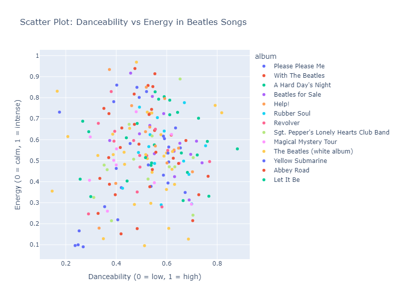

<br>

#### Adding a trend line

Now that we can read our plot a little better, lets add a basic trend line with `trendline="ols"`. It's worth noting that if you don't remove `color = 'album'`, it will create a trend line for each album - a jumbled mess. Also, see how we adjusted the size within the initial code.

<details><summary>Trend line code</summary>

```python
# Create the scatter plot of danceability vs energy
fig = px.scatter(
    beatles_spotify,
    x='danceability',
    y='energy',
    trendline="ols", # Adding a trendline for better analysis
    title='Scatter Plot: Danceability vs Energy in Beatles Songs',
    labels={'danceability': 'Danceability (0 = low, 1 = high)', 'energy': 'Energy (0 = calm, 1 = intense)'},
    width=800,
    height=700,
)

fig.show()
```

</details>

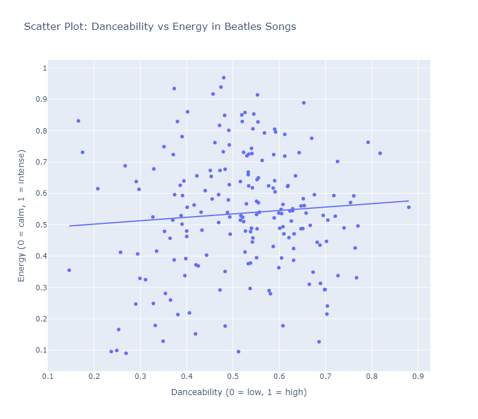


### Pick Custom Color Scheme

You can select an overall color palette from among several options.  Here you need to add `color_discrete_sequence=px.colors.qualitative.Pastel` when you create the chart.  Learn more at [Plotly Express](https://plotly.com/python/discrete-color/)


<details><summary>Changing the color scheme</summary>

```python
# we also 'filter' the results to eliminate songs instances of just one song in the matching Year/Songwriter/Genre category

# First, create a 'song_count' column (since it doesn't exist in the DataFrame)
beatles_billboard['song_count'] = 1

author_counts = beatles_billboard.groupby(['Year', 'Songwriter', 'Genre'])['song_count'].sum().reset_index()

# filter out 'unique' genres (or focus on them!)
author_counts = author_counts[author_counts['song_count'] >= 2]

# Create the scatter plot
fig = px.scatter(
    author_counts,
    x='Year',
    y='Songwriter',
    size='song_count',
    color='Genre',
    hover_data=['song_count'],
    labels={
        'Year': 'Year',
        'Songwriter': 'Songwriter',
        'song_count': 'Number of Songs',
        'Genre': 'Genre'
    },
    title="Number of Songs by Songwriter Over Time",
    color_discrete_sequence = px.colors.qualitative.Pastel # Change the color scheme to a pastel palette
)

# Customize the plot
fig.update_layout(
    xaxis_title="Year",
    yaxis_title="Songwriter",
    showlegend=True,
    width=1200,  # Set width to 800px
    height=800,  # Set height to 800px
)

# Show the plot
fig.show()
```

</details>

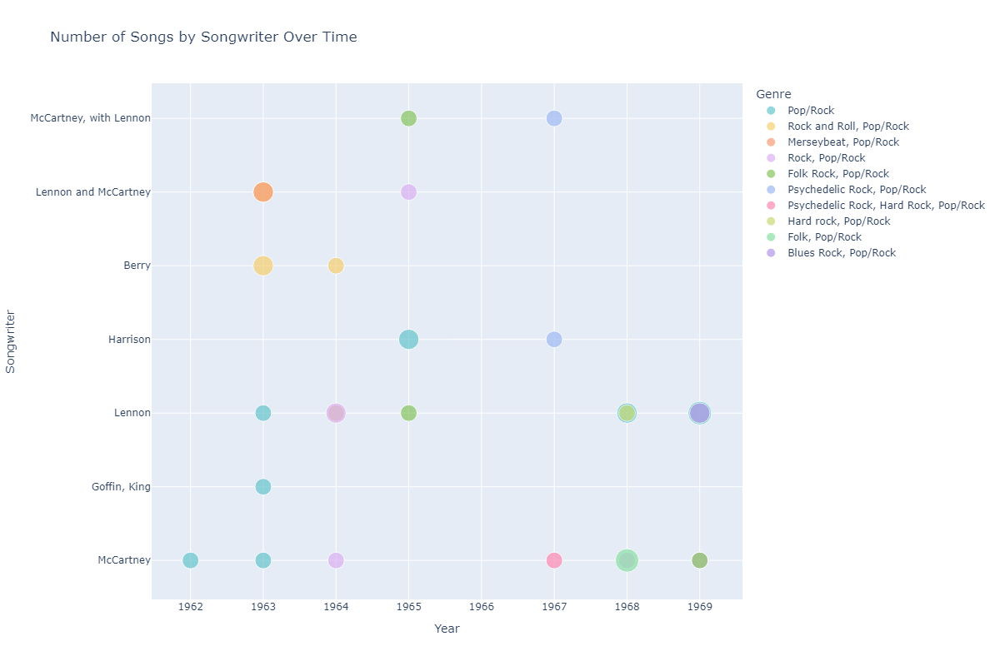

<br>


### Axis Scaling:  Linear or Logarithmic?

Normally numerical values are shown on a linear scale.  But it's possible to use logarithmic scales, too.  To use a logarithmic scale on the y axis, for instance, pass the following argument to the function: `log_y=True`.  Learn more at [Plotly Express](https://plotly.com/python/log-plot/)

<Details>
<Summary> Sample Code to Adjust Axis Scaling </Summary>

```python
# This is a generic example, since we don't have anything logarithmic in our datasets.

fig = px.scatter(x=[1, 2, 3], y=[10, 100, 1000],
                log_y=True)
# Show the plot
fig.show()
```
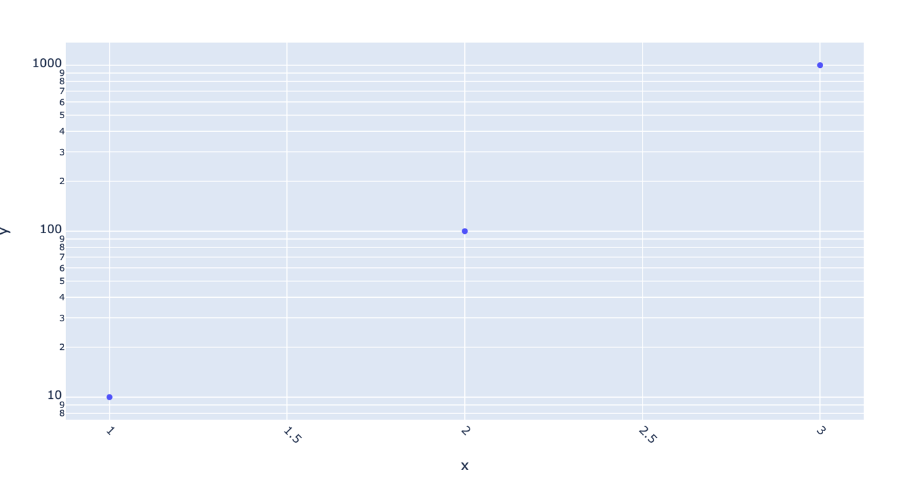

</Details>

<br>


### Adding Titles

To give your chart or graph an overall title, include `fig.update_layout(title_text="My Chart's Title")`. You can also customize your x and y-axis titles. Learn more via the [Plotly Express documentation](https://plotly.com/python/figure-labels/).


<details><summary>Add Titles</summary>

```python
 # Create histogram of song energy
fig = px.histogram(
    beatles_spotify,
    x='energy',
    nbins=5,
    labels={'energy': 'Energy (0 = calm, 1 = intense)'},
    template='plotly_white'
)

fig.update_layout(
    title_text = 'New Title: Distribution of Energy in Beatles Songs', # Changes the text that is displayed at the top of the plot
    xaxis_title = 'Energy (0 = calm, 1 = intense)', # Changes the x-axis title
    yaxis_title = 'Count', # Changes the y-axis title
    width=800,  # Set width to 800px
    height=600,  # Set height to 600px
)

fig.show()
```

</details>

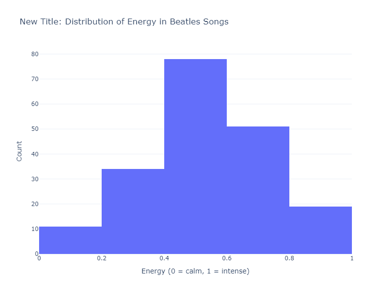

<br>

### Labels and Legends 

You can label data so that each point or category is identified with a particular color, which is then explained in a legend at the side of the chart. Learn more via the [Plotly Express documentation](https://plotly.com/python/figure-labels/).


<Details>
<Summary> Sample Code to Add Legend and Data Labels </Summary>

```python
import pandas as pd
import plotly.express as px
fig = px.scatter(data_df,
                x='energy', y = 'loudness',
                color = 'artist_name')

fig.show()
```
</Details>

<br>


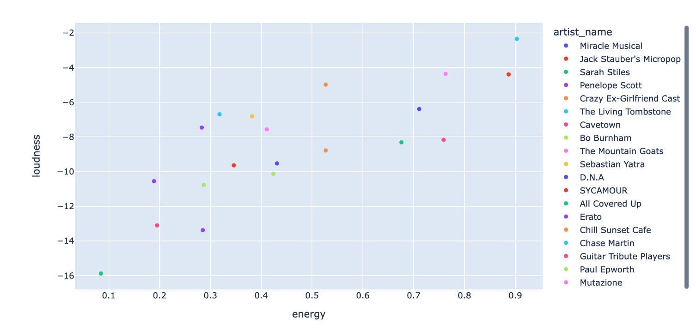


### X and Y Axis Tickmarks

The content of the x and y axes are termined via variables passed in when you create your plot.  But the orientation, size and other graphical aspects of the scales themselves are determined via 'tickmark' adjustments.  One useful technique when dealing with song titles from Spotify information is to angle the X-axis tickmarks by updating the figure with `fig.update_xaxes(tickangle=45)
`. You can easily adjust many other aspects of the tickmarks and labelling style. See more at [Plotly Express](https://plotly.com/python/axes/)


<Details>
<Summary> Sample Code to Adjust Tickmark Angle </Summary>

```python
import pandas as pd
import plotly.express as px

# create figure using selected columns from the dataframe
fig = px.scatter(sample_df,
                 x="track_title", y='tempo')

# update layout of title labels for the x axis
fig.update_xaxes(tickangle=45)

# sort the titles alphabetically
fig.update_xaxes(categoryorder='category ascending')

fig.show()
```
</Details>

<br>


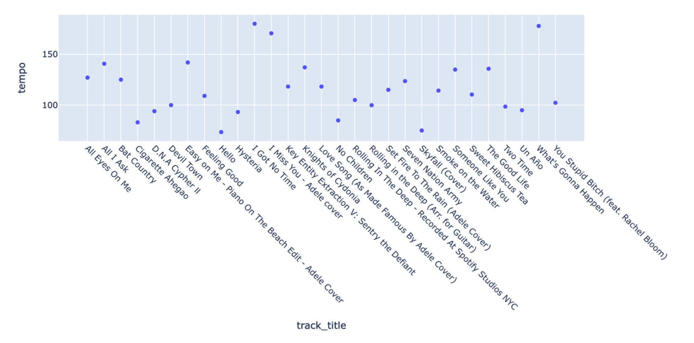


### Hover to Show Data Points

Include a list of `hover_data` columns when you create the Plotly Express figure.  Learn more via the [Plotly Express documentation](https://plotly.com/python/hover-text-and-formatting/), and see the example below.


<Details>
<Summary> Sample Code to Add Hover Data </Summary>

```python
import pandas as pd
import plotly.express as px
fig = px.scatter(data_df,
                x='energy', y = 'loudness',
                hover_data = ['artist_name', 'track_title', 'track_id'])

fig.show()
```
</Details>
<br>

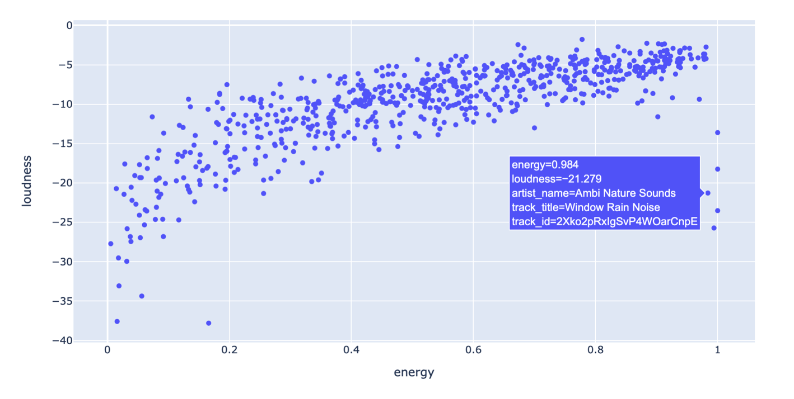


| [Pandas Basics][pandas-basics] | [Clean Data][pandas-clean] | [Tidy Data][pandas-tidy] | [Filtering, Finding, and Grouping][pandas-filter-find-group] | **Graphs and Charts** | [Networks][pandas-networks] |
|--------|--------|--------|--------|-------|-------|

[pandas-basics]: 04_Pandas_Basics.md
[pandas-clean]: 05_Pandas_Clean_Data.md
[pandas-tidy]: 06_Pandas_Tidy_Data.md
[pandas-filter-find-group]: 07_Pandas_Filter_Find_Group.md
[pandas-networks]: 09_Pandas_Networks.md


## Credits and License

Resources from **Music 255:  Encoding Music**, a course taught at Haverford College by Professor Richard Freedman.

Special thanks to Haverford College students Charlie Cross, Owen Yaggy, Harrison West, Edgar Leon and Oleh Shostak for indispensable help in developing the course, the methods and documentation.

Additional thanks to Anna Lacy and Patty Guardiola of the Digital Scholarship team of the Haverford College libraries, to Adam Portier, systems administrator in the IITS department, and to Dr Daniel Russo-Batterham, Melbourne University.

This work is licensed under CC BY-NC-SA 4.0 

