# Charts and Plots with Plotly Express
Our main resource is the [Plotly Express](https://plotly.com/python/plotly-express) library, which allows for interactive visualizations and more complex/powerful graphs with less code. . The Plotly Express documentation details the very wide range of bar charts, histograms, scatter plots, heat maps, polar (radar) figures you can create, and various ways of adding captions, legends, colors, etc.

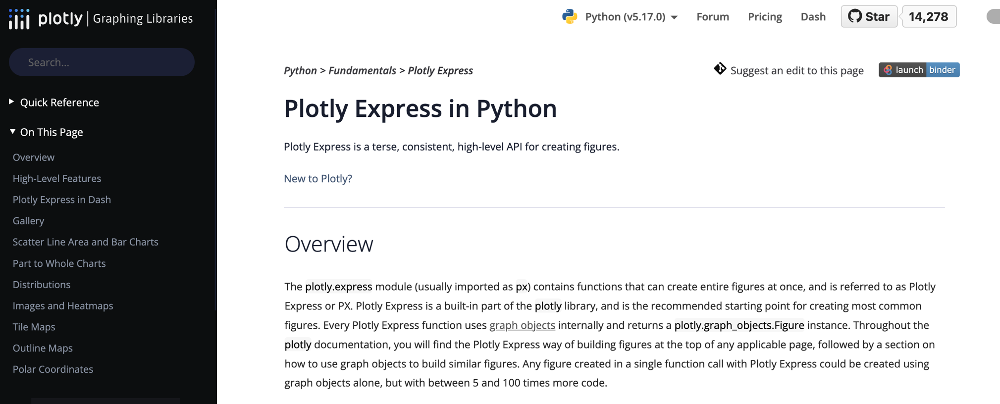

## Table of Contents:
  - [Bar Charts](#bar-charts)
  - [Histograms](#histograms)
  - [Scatter Plots](#scatter-plots)
  - [Radar or Spider Plots](#radar-or-spider-plots)
  - [Correlation Plots](#correlation-plots)
  - [Correlation does not equal causation](#correlation-does-not-equal-causation)
  - [Adjusting Chart Size](#adjusting-size-of-the-image)
  - [Pick Custom Color Scheme](#pick-custom-color-scheme)
  - [Adjusting Axes](#axis-scaling--linear-or-logarithmic)
  - [Adding a Title](#adding-a-title)
  - [Labels and Legends](#labels-and-legends)
  - [X and Y Axis Tickmarks](#x-and-y-axis-tickmarks)
  - [Hover Data](#hover-to-show-data-points)

---

The first step is always to import the relevant library:

```python
import plotly.express as px
```

From here you will normally:

- Define a figure by passing a dataframe to a method (such as `fig = px.histogram(df_hist(df)`)
- Specify special labels, formatting, or other features
- Show the figure with `fig.show()`, or specify a file name if you would prefer to save it.

## Bar Charts

Bar charts are used to display categorical data. They consist of vertical or horizontal bars that represent different categories and their corresponding values. Bar charts are excellent for comparing data across different categories.  Learn more at [Plotly Express](https://plotly.com/python/bar-charts/)

Here's an example of a bar chart showing the sales of different products:

<Details>
<Summary> Sample Bar Chart Code </Summary>

```python
# import libraries
import pandas as pd
import plotly.express as px
# Create a DataFrame for bar chart
bar_data = {'categories': ['Product A', 'Product B', 'Product C'],
            'sales': [100, 150, 120]}
df_bar = pd.DataFrame(bar_data)

# The barchart with Plotly Express specifying the source df, the columns to use as x and y axes, 
# labels to use for those axes, and an overall title for the figure that will serve as your caption
fig = px.bar(df_bar, 
             x = 'categories', y= 'sales', 
             labels={'categories': 'Product Category', 'sales': 'Sales'},
             title='Figure 1: Sales Report'
            )
# Set width and height in pixels
fig.update_layout(width=600, height=400) 
fig.show()
```

</Details>
<br>

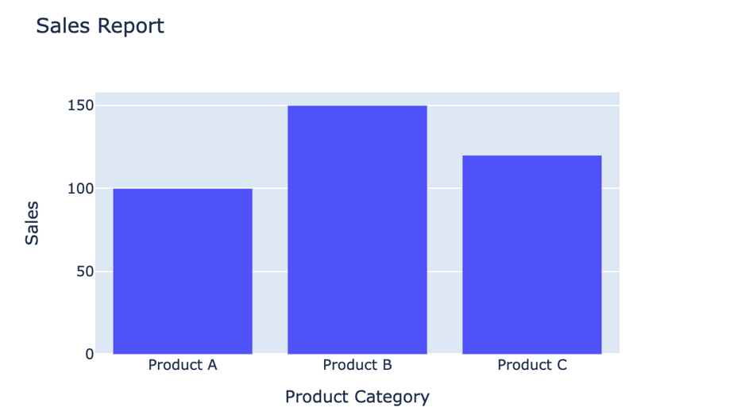


## Histograms
Histograms are used to display the distribution of numerical data. They consist of a series of adjacent rectangles (bins) that represent the frequency or proportion of data falling within specific intervals. Histograms help us understand the shape and spread of data.  Learn more at [Plotly Express](https://plotly.com/python/histograms/)

Here's an example of a histogram displaying the distribution of exam scores:

<Details>
<Summary> Sample Histogram Code </Summary>

```python
import pandas as pd
import plotly.express as px

# Create a DataFrame for bar chart
hist_data = {'scores': [80, 85, 90, 70, 75, 88, 82, 95, 92, 78, 87, 80, 85, 90, 73, 79, 83]}
df_hist = pd.DataFrame(hist_data)

# The histogram with Plotly Express specifying the source df, the column to use for the histogram,
# and title for the 
fig = px.histogram(df_hist, 
                   "scores",
                   labels={'scores': 'Test Scores'},
                   title="Score Distribution")

# option to rename the y axis
fig.update_yaxes(title_text='Count of Scores')

# Set width and height in pixels
fig.update_layout(width=600, height=400) 
fig.show()
```

</Details>

<br>

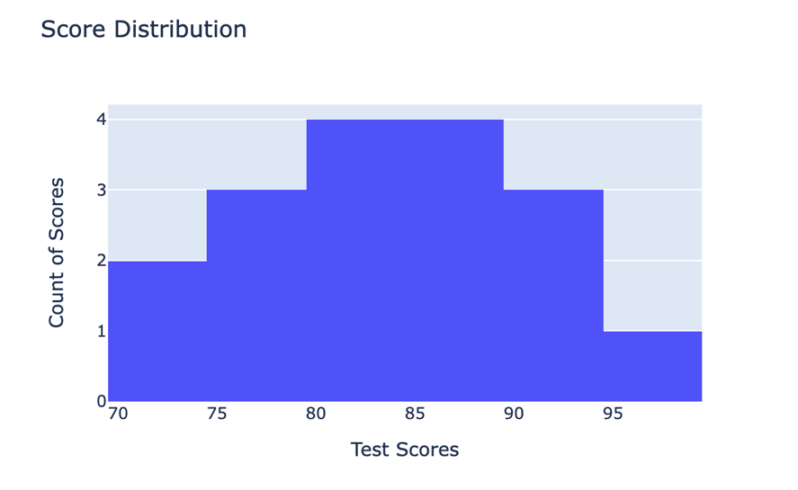

## Scatter Plots
Scatter plots are used to display the relationship between two numerical variables. Each point on the plot represents the values of the variables. Scatter plots are useful for identifying patterns, trends, and outliers in the data.  Learn more at [Plotly Express](https://plotly.com/python/line-and-scatter/)

Here's an example of a scatter plot showing the relationship between study hours and exam scores:

<Details>
<Summary> Sample Scatter Plot Code </Summary>

```python
# Plotly
import pandas as pd
import plotly.express as px

# Create a DataFrame for scatter plot
scatter_data = {'study_hours': [3, 4, 2, 5, 6, 5, 3, 4, 2, 6],
                'exam_scores': [70, 80, 65, 90, 95, 85, 75, 80, 70, 90]}
df_scatter = pd.DataFrame(scatter_data)

# Plotly Scatter Plot
# Note that here we include a Trend Line calculated using the Ordinary Least Squares (ols) method.
# There are other methods, see documentation
# also note options to change opacity of the plot points and the color of the trend line.
fig_scatter = px.scatter(df_scatter,
                         x = 'study_hours', y = 'exam_scores',
                         opacity=1.00, 
                         trendline='ols', 
                         trendline_color_override='red',
                        labels={'study_hours': 'Study Hours', 'exam_scores' : "Examination Scores"},
                        title = "Scatter Plot of Study Hours vs Exam Scores, with Regression Line")

fig_scatter.show()
```

</Details>

<br>


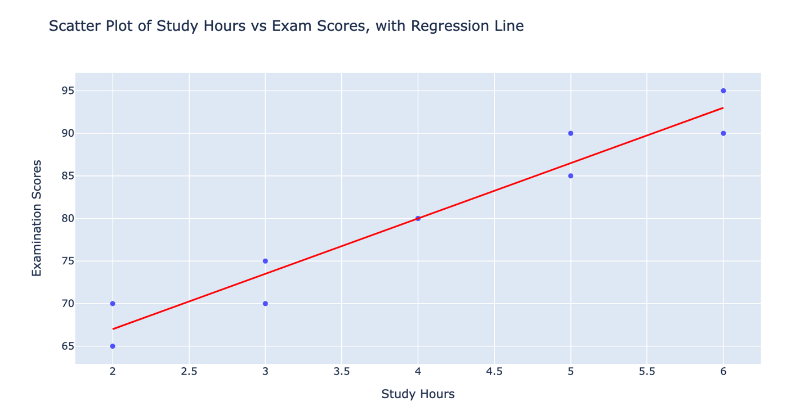

[See More Info on Regressions, here](Regressions.md)


## Radar or Spider Plots

Radar (or Polar) plots are a useful way to represent multiple variables at once, putting each of several variables around a central point:  the distance from the center indicates the strength of that feature.  There are many types of polar (radar) plots available in Plotly Express.  Here we use the `line_polar` plot.  Read more about the various features via [Plotly Express](https://plotly.com/python/radar-chart/).  

It is helpful in this instance to use the Pandas `melt` method to transform our 'wide' data (with multiple columns for the individual audio features) into 'long' form data (with each feature represented as an individual row: 

```python
pd.melt(sample, id_vars=['track_title'], value_vars=feature_list)
```

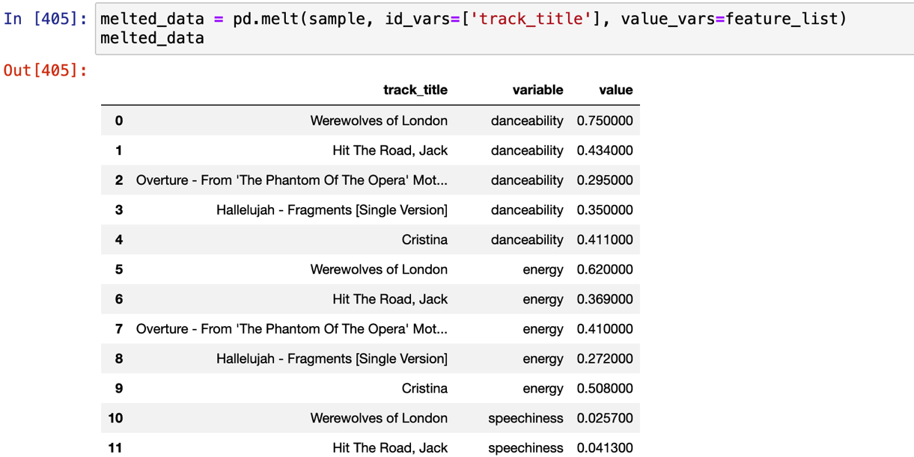

The [Plotly Express](https://plotly.com/python/polar-chart/#polar-chart-with-plotly-express) `line_polar` method in turn can easily read these long-form data to produce the feature-based plots. Here we define a function that takes in the original dataframe of audio features, a list of feature columns to plot, and a name for the final chart.  

<Details>
<Summary>Sample Radar Plot Code</Summary>

```python
# first declare feature list:
# feature_list = ["danceability", "energy", "speechiness", "liveness", "instrumentalness", "valence", "danceability"]

def audio_feature_radar(audio_feature_data, feature_list, chart_title):
    melted_data = pd.melt(audio_feature_data, id_vars=['track_title'], value_vars=feature_list)
    fig = px.line_polar(melted_data, r='value', theta='variable', color='track_title', labels = {'track_title' : "Track Title"})
    fig.update_layout(title=chart_title)
    fig.show()
```
</Details>

<br>

Typical usage:

```python
feature_list = ["danceability", "energy", "speechiness", "liveness", "instrumentalness", "valence", "danceability"]
spotify_tools.audio_feature_radar(audio_feature_data, feature_list, "My Radar Plot")
```

<Details>
<Summary>Image of Sample Output</Summary>

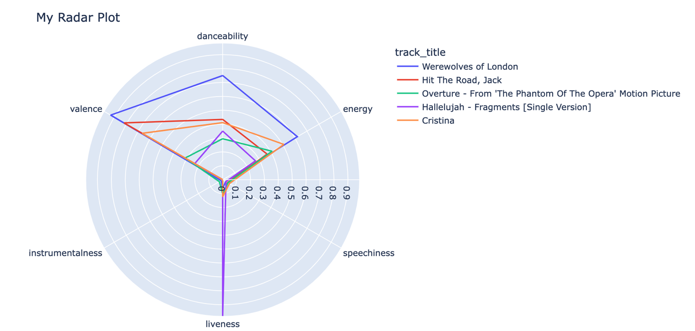

</Details>

<br>


## Correlation Plots and Heatmaps
Correlation plots are used to visualize the strength and direction of the relationship between two numerical variables. They provide a numerical measure called the correlation coefficient, which ranges from -1 to 1. A value close to -1 indicates a strong negative correlation, a value close to 1 indicates a strong positive correlation, and a value close to 0 indicates no or weak correlation.

One way to do this is via the `scatter_matrix` function in Plotly Express, which produces an individual scatterplot of all pairs of values in each pair of variables in your data.  Here is an example using audio feature data from Spotify.   Learn more at [Plotly Express](https://plotly.com/python/splom/)


Note that to show trend lines as noted above, you would need to produce an individual scatterplot for each pair of variables.

<Details>
<Summary> Sample Correlation Plot Code </Summary>

```python
import pandas as pd
import plotly.express as px

audio_features = {
    'danceability': [0.227, 0.832, 0.689, 0.654, 0.442, 0.351, 0.576, 0.352, 0.607, 0.664],
    'energy': [0.431, 0.346, 0.676, 0.285, 0.527, 0.903, 0.759, 0.424, 0.411, 0.283],
    'acousticness': [0.0432, 0.036, 0.288, 0.0375, 0.0314, 0.0681, 0.0599, 0.0394, 0.0414, 0.0498],
    'instrumentalness': [0.575, 0.688, 0.865, 0.148, 0.453, 0.354, 0.501, 0.141, 0.412, 0.558],
    'speechiness': [0.126, 0.0945, 0.0481, 0.105, 0.297, 0.252, 0.121, 0.0664, 0.103, 0.345]
}
audio_feature_df = pd.DataFrame(audio_features)


# fig = px.scatter_matrix(correlation_matrix)
fig = px.scatter_matrix(audio_feature_df, dimensions=audio_feature_df.columns)

# fig.update_yaxes(tickangle=90)
fig.update_layout(title=f'Audio Feature Correlation: {correlation:.2f}')
fig.show()

```

</Details>

<br>

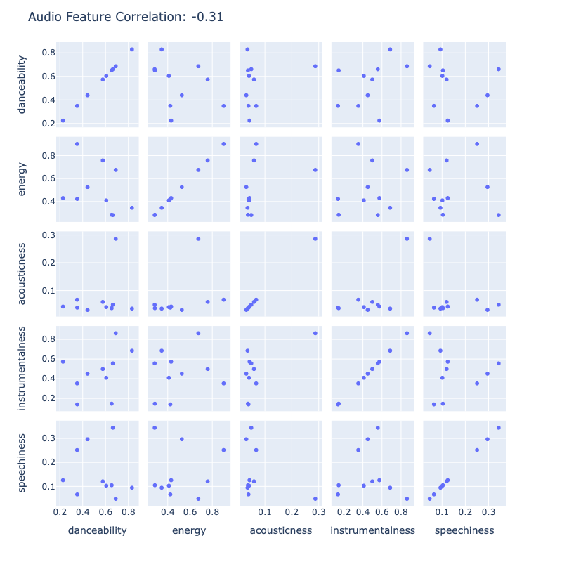


Another way to get a good sense of the high-level correlations among variables is by first making a correlation matrix with Pandas (that is:  `correlation_matrix = data_to_correlate.corr()`) and then passing that result to the Plotly Express `imshow()` method, as seen below.  Learn more at [Plotly Express](https://plotly.com/python/heatmaps/)

<Details>
<Summary> Sample Code to Show Correlation Matrix as Plotly Heatmap </Summary>

```python
import pandas as pd
import numpy as np
import plotly.express as px

data = {
    'danceability': [0.227, 0.832, 0.689, 0.654, 0.442, 0.351, 0.576, 0.352, 0.607, 0.664],
    'energy': [0.431, 0.346, 0.676, 0.285, 0.527, 0.903, 0.759, 0.424, 0.411, 0.283],
    'acousticness': [0.0432, 0.036, 0.288, 0.0375, 0.0314, 0.0681, 0.0599, 0.0394, 0.0414, 0.0498],
    'instrumentalness': [0.575, 0.688, 0.865, 0.148, 0.453, 0.354, 0.501, 0.141, 0.412, 0.558],
    'speechiness': [0.126, 0.0945, 0.0481, 0.105, 0.297, 0.252, 0.121, 0.0664, 0.103, 0.345]
}
data_to_correlate = pd.DataFrame(data)

correlation_matrix = data_to_correlate.corr()

fig = px.imshow(correlation_matrix)

fig.update_layout(title=f'Correlation: {correlation:.2f}')
fig.show()

```

</Details>

<br>

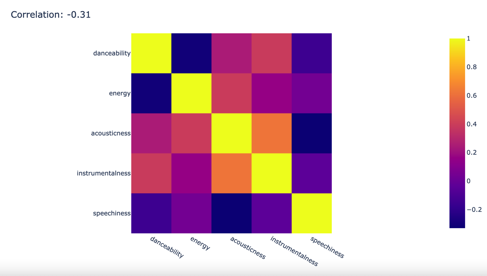


### Correlation Does Not Equal Causation
It's crucial to understand that correlation does not imply causation. Just because two variables are correlated does not mean that one variable causes the other. Correlation measures the statistical relationship between variables but cannot determine cause and effect.

Always exercise caution when interpreting correlations and avoid making causal claims based solely on correlation. Other factors, such as confounding variables, might be influencing the observed relationship.

Remember, correlation is not causation!

For example: 

Image Source: [Spurious Correlations by Tyler Vigen](https://www.tylervigen.com/spurious-correlations)

Although these two are strongly correlated, married couples that eat more margarine are not guaranteed to get divorced.

## Adjusting the Size, Title, Color, and Labels in Plotly Express Charts

In Plotly Express there are various ways to change the size of your final image, provide a title, adjust the scale of the X and Y axes, and provide special labels for the items noted each axis.  It's also possibe to provide additional data in 'pop-up' lists that appear when the user hovers over individual points on the chart.

The Plotly Express documentation explains the main options.  Here we summarize a few of the most important.

### Adjusting Size of the Image

Adjust the size by adding `fig.update_layout(width=600, height=400)` on the penultimate line of your chart code (immediately before `fig.show()`. The values for width and height are expressed in pixels.  Learn more at [Plotly Express](https://plotly.com/python/setting-graph-size/)

<Details>
<Summary> Sample Code to Adjust Size of Plotly Express Figure </Summary>

```python
import pandas as pd
import plotly.express as px

# Create a DataFrame for bar chart
hist_data = {'scores': [80, 85, 90, 70, 75, 88, 82, 95, 92, 78, 87, 80, 85, 90, 73, 79, 83]}
df_hist = pd.DataFrame(hist_data)

# Create the Figure
fig = px.histogram(df_hist, 
                   "scores",
                   labels={'scores': 'Test Scores'},
                   title="Score Distribution")

# Set width and height in pixels
fig.update_layout(width=600, height=400) 
fig.show()
```

</Details>

<br>

### Pick Custom Color Scheme

You can select an overall color palette from among several options.  Here you need to add `color_discrete_sequence=px.colors.qualitative.Pastel` when you create the charrt.  Learn more at [Plotly Express](https://plotly.com/python/discrete-color/)

<Details>
<Summary> Sample Code to Adjust Color Palette  </Summary>

```python
# Load the gapminder dataset
df = px.data.gapminder()

# Create a histogram of life expectancy, colored by continent
fig = px.histogram(df, x="lifeExp", nbins=50, color="continent",
                   color_discrete_sequence=px.colors.qualitative.Pastel,
                   title="Histogram of Life Expectancy, Colored by Continent")

# Display the figure
fig.show()
```
</Details>

<br>

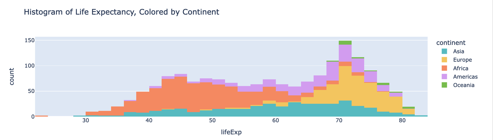

### Axis Scaling:  Linear or Logarithmic?

Normally numerical values are shown on a linear scale.  But it's possible to use logarithmic scales, too.  To use a logarithmic scale on the y axis, for instance, pass the following argument to the function: `log_y=True`.  Learn more at [Plotly Express](https://plotly.com/python/log-plot/)

<Details>
<Summary> Sample Code to Adjust Axis Scaling </Summary>

```python
import pandas as pd
import plotly.express as px

fig = px.scatter(x=[1, 2, 3], y=[10, 100, 1000],
                log_y=True)
# Show the plot
fig.show()
```
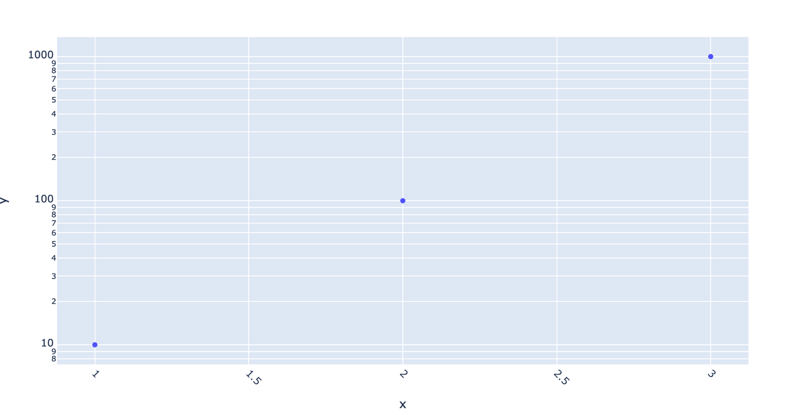

</Details>

<br>

### Adding a Title

To give your chart or graph an overall title, include `fig.update_layout(title_text="My Chart's Title")`. Learn more via the [Plotly Express documentation](https://plotly.com/python/figure-labels/).

<Details>
<Summary> Sample Code to add Figure Title </Summary>

```python
import pandas as pd
import plotly.express as px

# Create the bar chart
fig = px.bar(x=[1, 2, 3], y=[10, 11, 12])])

# Add a title
fig.update_layout(title_text="Sales by Product")

# Show the chart
fig.show()
```

</Details>

<br>


### Labels and Legends 

You can label data so that each point or category is identified with a particular color, which is then explained in a legend at the side of the chart. Learn more via the [Plotly Express documentation](https://plotly.com/python/figure-labels/).

<Details>
<Summary> Sample Code to Add Legend and Data Labels </Summary>

```python
import pandas as pd
import plotly.express as px
fig = px.scatter(data_df,
                x='energy', y = 'loudness',
                color = 'artist_name')

fig.show()
```
</Details>

<br>


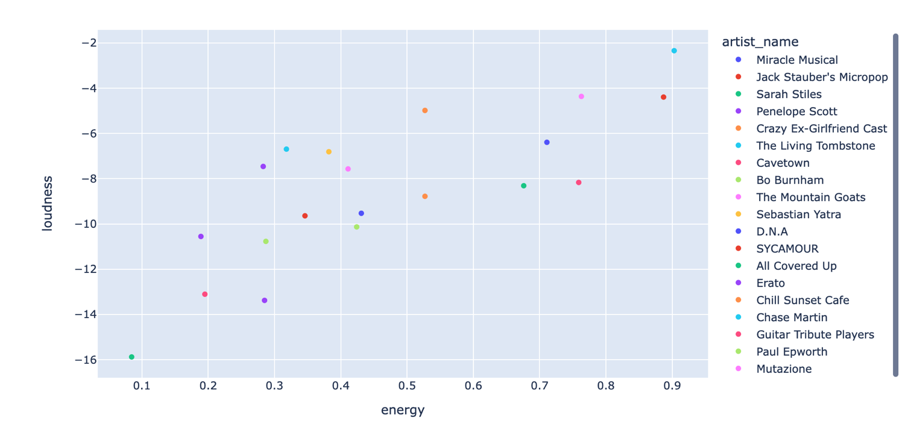


### X and Y Axis Tickmarks

The content of the x and y axes are termined via variables passed in when you create your plot.  But the orientation, size and other graphical aspects of the scales themselves are determined via 'tickmark' adjustments.  One useful technique when dealing with song titles from Spotify information is to angle the X-axis tickmarks by updating the figure with `fig.update_xaxes(tickangle=45)
`. You can easily adjust many other aspects of the tickmarks and labelling style. See more at [Plotly Express](https://plotly.com/python/axes/)

<Details>
<Summary> Sample Code to Adjust Tickmark Angle </Summary>

```python
import pandas as pd
import plotly.express as px

# create figure using selected columns from the dataframe
fig = px.scatter(sample_df,
                 x="track_title", y='tempo')

# update layout of title labels for the x axis
fig.update_xaxes(tickangle=45)

# sort the titles alphabetically
fig.update_xaxes(categoryorder='category ascending')

fig.show()
```
</Details>

<br>


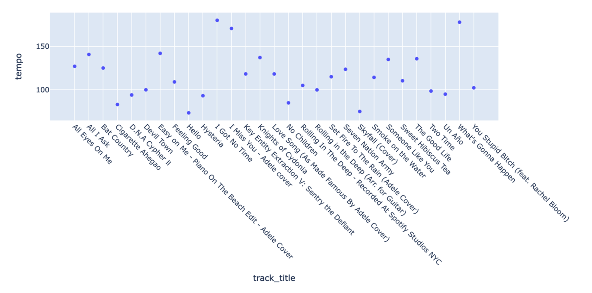

### Hover to Show Data Points

Include a list of `hover_data` columns when you create the Plotly Express figure.  Learn more via the [Plotly Express documentation](https://plotly.com/python/hover-text-and-formatting/), and see the example below.

<Details>
<Summary> Sample Code to Add Hover Data </Summary>

```python
import pandas as pd
import plotly.express as px
fig = px.scatter(data_df,
                x='energy', y = 'loudness',
                hover_data = ['artist_name', 'track_title', 'track_id'])

fig.show()
```
</Details>
<br>

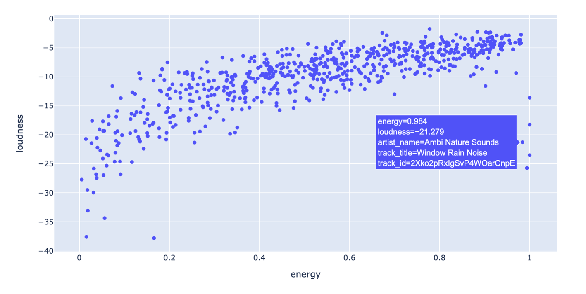

