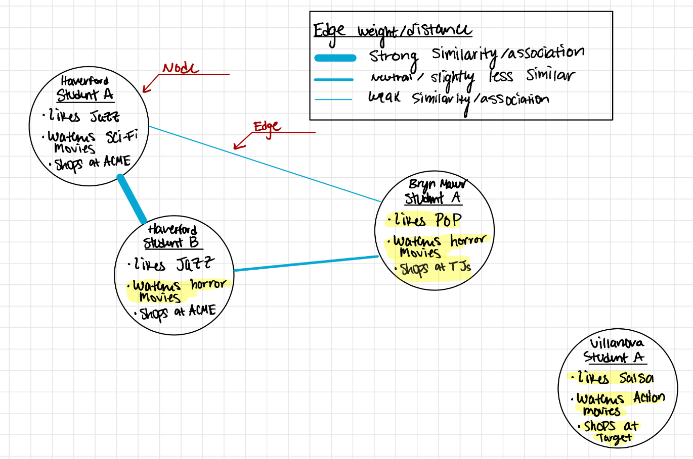
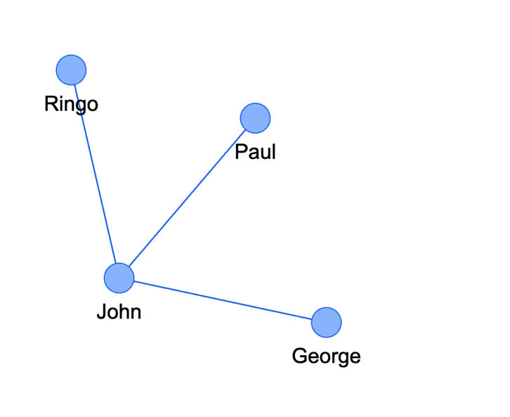

| [Pandas Basics][pandas-basics] | [Clean Data][pandas-clean] | [Tidy Data][pandas-tidy] | [Filtering, Finding, and Grouping][pandas-filter-find-group] | [Graphs and Charts][pandas-graphs] | **Networks** |
|--------|--------|--------|--------|-------|-------|

# All About Networks

In this tutorial you will learn about networks, and how to build them with Python, Pandas, and Pyvis.

Note that for some of the demonstrations offered below you will be working with The Beatles Spotify and Billboard data. These are already available as CSV files.  For other projects you will need to bring your own data, either from Spotify or from some other project.

|    | Contents of this Tutorial               | 
|----|-----------------------------------------|
| 1. |[**Networks:  Basic Concepts and Methods**](#networks--basic-concepts-and-methods) |
| 2. | [**A Simple Network of Students**](#a-simple-example--a-network-of-students) |
| 3. | [**Pyvis and NetworkX:  Python Tools for Networks**](#pyvis-and-networkx--python-tools-for-networks) |
| 4. | [**Networks: Billboard Data to Edge Pairs with Groupby and Explode**](#from-dataframe-to-edge-pairs--groupby-and-explode) |
| 5. | [**Networks with Spotify Data Two Ways:  Binned and Continuous**](#spotify-networks-with-categorical-binned-and-continuous-scalar-data) |
| 6. | [**Complex Networks: Spotify Recommended Artists**](#social-networks--spotifys-recommended-artists) |
| 7. | [**Complex Networks: Spotify Recommended Songs**](#social-networks--spotifys-recommended-songs) |
| 8. | [**Louvain Community Detection:  The Ghost in the Machine**](#louvain-community-detection--the-ghost-in-the-machine) |

## Networks:  Basic Concepts and Methods 

In the field of data science, networks (also known as graphs) are powerful tools used to represent and study relationships between entities. A network is composed of **nodes** (also called vertices) and **edges** (also called links). Each node represents an entity, while each edge represents a relationship between two entities.

### Nodes
**Nodes are the fundamental building blocks of a network.** Think of them as the entities or objects you want to study. In a social network, nodes could represent individuals, while in a transportation network, nodes could represent cities.  You could even have different **kinds** of nodes in the same network--for instance some nodes representing musical works and others representing the groups that performed them. These could be distinguished by color or shape.

### Edges
**Edges are the connections between nodes.** They show how the entities are related to each other. In a social network, edges could represent friendships, and in a transportation network, edges could represent roads connecting cities.

### Weights
**Edges can have an associated weight**. The weight of an edge represents the strength or intensity of the relationship between the connected nodes. For example, in a network of academic writings, the weights could represent the number of times authors cited each other. In the transporation network, the weights could represent the number of journeys taken between each pair of places. 

### How are Two Things more Related than Others?
Determining the strength of the relationship between two nodes depends on the context of the network. For example, in a social network, the frequency and duration of interactions, mutual friends, and common interests can help establish the strength of friendships. In other cases, such as a transportation network, the distance between nodes could be a factor in determining the weight of the edges.

### Centrality as a Key Concept in Networks

By design, network visualization tools arrange the nodes so that those with the greatest number of connections to other nodes appear at the center of a two-dimensional field.  Conversely nodes with only a few connections to other nodes wind up at the periphery. Such representations thus reveal "communities". And indeed, there are special algorithms, like *Louvain Community Detection*, that help us discover neighborhoods in complex networks.

### More about Network Theory
You can learn more about [Network Theory](https://en.wikipedia.org/wiki/Network_theory) and explore Network Graphs [here](https://en.wikipedia.org/wiki/Graph_(discrete_mathematics)).

## A Simple Example:  A Network of Students


In the Network graph above, the highlighted characteristics represent the differences between Haverford student A and every other student. We see that Haverford student A & B only have one difference, so the edge weight is strong and the nodes are closer together. Haverford student B and Bryn Mawr student A have two differences, so the edge weight is _relatively_ weaker. We also see a node in our graph that has no connection and has no similarity to the other three nodes.

Why is Bryn Mawr Student A connected and not Villanova Student A if they both have no similarities to Haverford Student A?

#### Reason One
Bryn Mawr student A watches horror movies and Haverford student B also watches horror movies, so they are connected.

#### Reason Two (less obvious without context)
Haverford and Bryn Mawr are part of the tri-co! Often in network graphs and in data science, machines find an abstract connection between vast amounts of data, often clustering data or nodes together, but that may not always mean that it is directly evident as to what these clusters or connections represent. For example, none of our node bullet points have "_is part of the tri-co_" as a characteristic, but perhaps there is some underlying bias or evidence that may not be evident to us that _is_ evident to machines which allows them to cluster or connect otherwise "different" data. 

## Pyvis and NetworkX:  Python Tools for Networks

Generally speaking, a network graph is a visual structure designed to emphasize connections between discrete entities. It consists of Nodes and Edges, which represent a system of connected or related elements, and is largely studied within Network Theory. 

We are lucky to have Python-friendly tools designed to help us create and display networks. Such work is in fact done in stages:  

* **NetworkX** is used to build up the list of nodes and edges as a "graph" object (see the excellent [tutorial for NetworkX](https://networkx.org/documentation/stable/tutorial.html) for more assistance).  
* **Pyvis** is used to display the graph, and we can in fact control this representation in various ways, each with its own mathematical basis for the physics that determines the placement of the nodes and edges.  Pyvis and NetworkX are normally used together.
* **Louvain Community Detection** can also be applied to help us partition the network into subgroups.  See more below.

Here is code that will **build, populate, and show a simple Network Graph** using **NetworkX** and **Pyvis**. This sample network consists of just two nodes and one edge to connect them.


```python
# import libraries; here we need only three of them
import pyvis
from pyvis import network as net
import networkx as nx

# create empty graph
G = nx.Graph()

# add nodes from a list of values
G.add_nodes_from(["John", "Paul"])

# add edges between any pair of nodes that are connected
G.add_edge("John", "Paul")

# render with pyvis
pyvis_graph = net.Network(notebook=True, width="800", height="800", bgcolor="white", font_color="black")
pyvis_graph.from_nx(G)
pyvis_graph.show('my_graph.html')
```
<br>
Here is the result:


<br>

#### Adding Nodes and Edges in One Step

Such a simple network graph above is not very informative:  of course we know that Lennon and McCartney are connected--they were collaborators and band mates! 

You could of course add any number of new nodes and edges to a given network using the same approach:  first make a list of notes, then pass along a series of tuples representing each edge.  But in fact it's possible to add nodes *at the same time you add the edges*, simply by passing a list of tuples that represent the edges.  The networkX graph object (`G = nx.Graph()`) has a method that allows us to do just this:  `G.add_edges_from()`.  For example:

```python
# import libraries; for this project we only need three of them:
import pyvis
from pyvis import network as net
import networkx as nx

# define a list of tuples for the nodes and edges
# notice that repeating a node is fine; doing so simply adds another edge to the given node
my_edge_list = [("John", "Paul"), ("John", "Ringo"), ("John", "George")]

# create empty graph
G = nx.Graph()

# add the nodes and edges
G.add_edges_from(my_edge_list)

# render with pyvis, and define layout and color
pyvis_graph = net.Network(notebook=True, 
width="800", 
height="800", 
bgcolor="white", 
font_color="black")

pyvis_graph.from_nx(G)
pyvis_graph.show('my_graph.html')
```
<br>


Here is the result:




<br>

And so with `G.add_edges_from()` it should be possible to easily transform tabular data (for instance, a pair of values in each row) as a list of tuples, and pass these directly to NetworkX.  

For additional information on adding attributes to nodes and edges (such as color, size, or pop ups, see the NetworkX documentation cited above.)

One convenient way to do this is to great a dataframe consisting of two columns: 

* a list of all the edges (and thus nodes), expressed as tuples
* the 'counts' of each tuple (which provides the edge weights) 

Imagine this:


*But how do we get from Pandas dataframes to a table of edge pairs and counts like this one?*  

----
## From DataFrame to Edge Pairs:  Groupby and Explode


Deriving a table of edge pairs from your original dataframe takes some knowledge of several key Pandas and Python methods.  If you don't recall the first and second of these, review them in the relevant tutorial!

* **Groupby** (the 'groups' provide the basis of the edges, since all the items in a given group share some characteristic with each other)
* **Explode** (since once we aggregate the groups into a single new dataframe, and all of the tuples for each group into a single column, we need to 'tidy' them in order to simply the process of using `G.add_edges_from()`).
* **Combinations** (a method available in the 'itertools' library, which helps us build up pairs of all of the items in each group; these will be our tuples, and in turn our edges.)


Let's look at these steps in detail using the **Beatles Billboard** data. There are some 300 songs in this dataset, if we imagine a network with 300 nodes, it would almost certainly be too complex to interepret. But the Billboard dataset also includes some 'genre' labels, and it could be interesting to see how these genres fall into families. They might not reveal a lot about the songs, but they would definitely tell us something about the folks who assigned the labels in the first place!


## Meet the Beatles (Again) 

We continue with our data about The Beatles:

* A set from **Spotify** includes information about 193 songs, albums, years, plus other acoustic ratings that Spotify uses to characterize tracks. View these data as a [Google spreadsheet](https://docs.google.com/spreadsheets/d/1CBiNbxqF4FHWMkFv-C6nl7AyOJUFqycrR-EvWvDZEWY/edit#gid=953807965).

* A set of **Billboard** data compiled by a team at the **University of Belgrade (Serbia)** that contains information about over 300 Beatles songs:  author(s), lead singer(s), album, musical genre(s), and standing in the Top 50 Billboard charts.  View these data on [Github]('https://github.com/inteligentni/Class-05-Feature-engineering/blob/master/The%20Beatles%20songs%20dataset%2C%20v1%2C%20no%20NAs.csv').

We will work with both of these sets, and in the process learn how to clean and 'tidy' the data in preparation for other operations.

Get the Spotify data:

```python
import pandas as pd
beatles_spotify_csv = 'https://docs.google.com/spreadsheets/d/e/2PACX-1vRCv45ldJmq0isl2bvWok7AbD5C6JWA0Xf1tBqow5ngX7_ox8c2d846PnH9iLp_SikzgYmvdPHe9k7G/pub?output=csv'

beatles_spotify = pd.read_csv(beatles_spotify_csv)
```

and the Billboard data:

```python
beatles_billboard_csv = 'https://raw.githubusercontent.com/inteligentni/Class-05-Feature-engineering/master/The%20Beatles%20songs%20dataset%2C%20v1%2C%20no%20NAs.csv'

beatles_billboard = pd.read_csv(beatles_billboard_csv)
```

## But Wait!  Are the Data Clean?

The first thing to notice, however, is that the individual cells of the 'Genre' column consist of long strings, such as `Psychedelic Rock, Art Rock, Pop/Rock`. Performing a groupby operation on these long strings will not reveal much, since all of the subgenre will be embedded in these long strings. So some data-cleaning is needed as a preliminary step. We need to *clean the data*, *split the lists*, and *regularize the terms* in order to make a useful network. So you might need to go back to Pandas Tutorial B and remind yourself of how to do this.

For purposes of this network demonstration, we can take care of these steps with the following code:

<Details>

<Summary> Get Code for Initial Clean up and Tidy Functions </Summary>

```python
# import library (this would have been done at the time we created the Beatles df in any case!)

import pandas as pd

# make everything lowercase, remove leading/trailing spaces, and fill nas
beatles_billboard['Genre'] = beatles_billboard['Genre'].str.lower().str.strip().fillna('')
# split the long strings into a list of strings in each cell
beatles_billboard['Genre'] = beatles_billboard['Genre'].str.split(',')
# # explode the data
beatles_billboard_exploded = beatles_billboard.explode('Genre').reset_index(drop=True)
# # and clean whitespace and odd characters again
beatles_billboard_exploded['Genre'] = beatles_billboard_exploded['Genre'].str.strip()

# # clean individual problems in the exploded data with str.replace()
beatles_billboard_exploded['Genre'] = beatles_billboard_exploded['Genre'].str.replace('acid rock[', 'acid rock')
beatles_billboard_exploded['Genre'] = beatles_billboard_exploded['Genre'].str.replace('pop/rock', 'pop rock')
beatles_billboard_exploded['Genre'] = beatles_billboard_exploded['Genre'].str.replace('r&b', 'rhythm and blues')
beatles_billboard_exploded['Genre'] = beatles_billboard_exploded['Genre'].str.replace('rock and roll', 'rock')
beatles_billboard_exploded['Genre'] = beatles_billboard_exploded['Genre'].str.replace('experimental music', 'experimental')
beatles_billboard_exploded['Genre'] = beatles_billboard_exploded['Genre'].str.replace("children's music", "children's")
beatles_billboard_exploded['Genre'] = beatles_billboard_exploded['Genre'].str.replace("stage&screen", "stage and screen")
```
</Details>

<br>

The result is a dataframe in which the "Genre" column contains just one label per row.  The song titles repeat, but this does not need to worry us:  Groupby will take care of the rest.


## Finding Pairs of Related Genres

So far we have **cleaned** up the data, and **exploded** the genre terms into manageable form. 

Now we need to find **every pair of genre terms that apply to a given song**, since these will form the **nodes** and **edges** of our genre network. 

Here is how to do it:

* **group** the tidy data by **song title**, and **return all of the genre labels as a list**. This might seem to have been already available to us after the `split(',')` operation above. But remember that we still had various issues with whitespaces, trailing characters, and variant spellings or terms! This will be a new dataframe.
* **from each list of genre labels create a new list of pairs of labels**.  These tuples will provide the basis of the nodes and edges. 
* **count** the occurences of each pair of labels, and return the results as a new dataframe:  pairs and counts.  This will be passed directly to networkX to populate the graph.

### Step 1: The Groupby Operation:


From this we see that for each song title, we have a list of genre labels:


<Details>

<Summary>Groupby Code</Summary>

```python
# for this we only need one library:
import pandas as pd

# copy of our data, so we don't accidentally alter it
df = beatles_billboard_exploded

# select the columns to use
feature_to_groupby = 'Title' # <-- this is the original df column that will provide the basic control; could even be a list of columns
column_for_list_of_edges = 'Genre' # <-- this is the original df column that will contain the list of features that will become the nodes and edges

# Group by 'feature_to_groupby' and extract a 'column_for_list_of_edges'
grouped_feature_with_edges = df.groupby
```

</Details>

<br>

### Step 2: Find the Combinations of Genre Labels for Each Group, and Count Them

For *each of these lists of titles*, we need to find all of the `pairs` of titles, which will serve as our network edges. This is easily done with a special Python library called `collections`, and within that the `combinations` method.

For "A Day in the Life", for instance (this is Index #1 in the dataframe), we find the following list of genre labels: `['psychedelic rock', 'art rock', 'pop rock']`

The `combinations` method will return a new list consisting of all the unique pairs of values in that list.  Each pair will be a tuple.  (Note:  three items in the list, we find the total combinations as `n(n-1)/2`.  five items will give us ten pairs since `(3*2)/2 = 3`).  

This is what this looks like for a single list of genre labels in one row:

```python
# make sure you have imported the relevant library, itertools, and of course pandas
import pandas as pd
import itertools
# now a sample list and the resulting combinations
sample_list = ['psychedelic rock', 'art rock', 'pop rock']
pairs = list(combinations(sample_list, 2))
pairs

[('psychedelic rock', 'art rock'),
 ('psychedelic rock', 'pop rock'),
 ('art rock', 'pop rock')]
 ```

#### Running the `combinations` method over each row of the exploded dataframe, we in turn create a new dataframe with `all_pairs` of genres.  


<Details>

<Summary>Combinations and Pairs Code</Summary>

```python
# make sure you have imported the relevant library, itertools, and of course pandas
import pandas as pd
import itertools

# Generate all pairs edges for each group
all_pairs = []
for _, row in grouped_feature_with_edges.iterrows():
    pairs = list(combinations(row[column_for_list_of_edges], 2))
    all_pairs.append((row[feature_to_groupby], pairs))

# Create a new DataFrame with the results
edge_pair_name = column_for_list_of_edges + "_Pairs"
edge_pair_df = pd.DataFrame(all_pairs, columns=[feature_to_groupby, edge_pair_name])
# adjust for a threshold of genres per piece. should be > 0 
edge_pair_df_filtered = edge_pair_df[edge_pair_df[edge_pair_name].apply(len) > 0]
```

</Details>

<br>

#### And this, in turn, we `explode` in order to create a dataframe of genre pairs for each title.  


</Details>

<br>

#### Finally, we will `count` the occurences of each edge pair, so that we can show a weighted network.


### Step 3: Make Network from the Edge Pairs

#### At last we are ready to build our network from the dataframe of edge pairs and their corresponding weights, which was our original goal! 


<br>

<Details>
<Summary>Code to Create Network from Dataframe of Edge Tuples and Counts</Summary>

```python
# import libraries
import pandas as pd
import numpy as np
import networkx as nx
from pyvis import network as net
from itertools import combinations
from community import community_louvain
from copy import deepcopy

# allow a filter for the number of times a given pair of genres occurs
# this works with the original series of pair counts, not the df

minimum_count_for_pair = 1

pair_counts_filtered = pair_counts[pair_counts >= 1]

# set graph options:
graph_height = 800
graph_width = 800
detect_louvain_communities = True
add_forceAtlas2Based_physics = True

# Create an empty NetworkX graph
G = nx.Graph()

# Add nodes and assign weights to edges
for pair, count in pair_counts_filtered.items():
    # Directly unpacking the tuple into node1 and node2
    node1, node2 = pair
    # Adding nodes if they don't exist already
    if node1 not in G.nodes:
        G.add_node(node1)
    if node2 not in G.nodes:
        G.add_node(node2)
    # Adding edge with weight
    G.add_edge(node1, node2, weight=count)

# Adjusting edge thickness based on weights
for edge in G.edges(data=True):
    edge[2]['width'] = edge[2]['weight']
    
# Adding Louvain Communities

if detect_louvain_communities == True:
    def add_communities(G):
        G = deepcopy(G)
        partition = community_louvain.best_partition(G)
        nx.set_node_attributes(G, partition, "group")
        return G
        
    G = add_communities(G)

# set display parameters
network_graph = net.Network(notebook=True,
                   width=graph_height,
                   height=graph_height,
                   bgcolor="black", 
                   font_color="white")

# Set the physics layout of the network

if add_forceAtlas2Based_physics == True:

    network_graph.set_options("""
    {
    "physics": {
    "enabled": true,
    "forceAtlas2Based": {
        "springLength": 1
    },
    "solver": "forceAtlas2Based"
    }
    }
    """)

network_graph.from_nx(G)
# # return the network
network_graph.show("network_graph.html")
```

</Details>

<br>


#### Option A. Basic Network of Genres with NetworkX and Pyvis

The simplest version of the NetworkX and Pyvis tools result in a rather dense (and thus difficult to interpret) network of genres:


#### Option B. Network of Genres with Updated Physics for Legibility

Adding some updated physics to the network spread things out so they are more legible, and includes the relative weights of the edges.  Learn more about the various options for adjusting the 'repulsion' among the various nodes [here on the Pyvis documentation site](https://pyvis.readthedocs.io/en/latest/documentation.html#pyvis.network.Network.force_atlas_2based)

```python
network_graph.set_options("""
    {
    "physics": {
    "enabled": true,
    "forceAtlas2Based": {
        "springLength": 1
    },
    "solver": "forceAtlas2Based"
    }
    }
    """)
```


#### Option C. Network of Genres with Louvain Community Detection

Finally, we reveal 'communities' via color highlights, using the Louvain Community Detection Algorithm. Learn more [here](#louvain-community-detection--the-ghost-in-the-machine).

```python
# import the relevant libraries
from community import community_louvain
from copy import deepcopy

# function to add the communities
def add_communities(G):
        G = deepcopy(G)
        partition = community_louvain.best_partition(G)
        nx.set_node_attributes(G, partition, "group")
        return G
        
    G = add_communities(G)
```


### The Complete Code for Beatles Billboard Network

Here we assume that you have already [cleaned and exploded your original dataframe as explained above](#but-wait--are-the-data-clean).

You also need to know which column will serve as your `groupby` basis and which column will be used to build the `edge_pairs`.

There are also various settings that allow you to control the size and other features of the graph.

You will need to supply:

* a cleaned df
* feature to group by
* the column that will determine the edges
* options to select graph size, Louvain, and advanced physics

#### Example 1: A Network of Genres (the nodes) Linked by Songs (the edges)

Here we group by the 'Title', creating a list of genres that are relevant for each.  The genres then become the nodes, and the edges link genres that are associated with the same song.  The width of the edges indicates how frequently any pair of genres is linked to the same song. Colors reveal communities of genres. 

```python
df = beatles_billboard_exploded
feature_to_groupby = 'Title'
column_for_list_of_edges = 'Genre'
```

<Details>

<Summary> Complete Code for Network of Genres </Summary>

```python
# import libraries
import pandas as pd
import numpy as np
import networkx as nx
from pyvis import network as net
from itertools import combinations
from community import community_louvain
from copy import deepcopy
# copy of our data, so we don't accidentally alter it

df = beatles_billboard_exploded

#  select the columns to use; these will be determined by your original df
# use the 
feature_to_groupby = 'Title' # <-- this is the original df column that will provide the basic control; could even be a list of columns
column_for_list_of_edges = 'Genre' # <-- this is the original df column that will contain the list of features that will become the nodes and edges

# Group by 'feature_to_groupby' and extract a 'column_for_list_of_edges'
grouped_feature_with_edges = df.groupby(feature_to_groupby)[column_for_list_of_edges].unique().reset_index(name=column_for_list_of_edges)

# Generate all pairs edges for each group
all_pairs = []
for _, row in grouped_feature_with_edges.iterrows():
    pairs = list(combinations(row[column_for_list_of_edges], 2))
    all_pairs.append((row[feature_to_groupby], pairs))

# Create a new DataFrame with the results
edge_pair_name = column_for_list_of_edges + "_Pairs"
edge_pair_df = pd.DataFrame(all_pairs, columns=[feature_to_groupby, edge_pair_name])
# adjust for a threshold of genres per piece. should be > 0 
edge_pair_df_filtered = edge_pair_df[edge_pair_df[edge_pair_name].apply(len) > 0]

# explode the edge pair df
exploded_edge_pairs = edge_pair_df_filtered.explode(edge_pair_name)

# get the pair counts
pair_counts = exploded_edge_pairs[edge_pair_name].value_counts()

# allow a filter for the number of times a given pair of genres occurs
# this works with the original series of pair counts, not the df

minimum_count_for_pair = 1

pair_counts_filtered = pair_counts[pair_counts >= 1]

# set graph options:
graph_height = 800
graph_width = 800
detect_louvain_communities = True
add_forceAtlas2Based_physics = True

# Create an empty NetworkX graph
G = nx.Graph()

# Add nodes and assign weights to edges
for pair, count in pair_counts_filtered.items():
    # Directly unpacking the tuple into node1 and node2
    node1, node2 = pair
    # Adding nodes if they don't exist already
    if node1 not in G.nodes:
        G.add_node(node1)
    if node2 not in G.nodes:
        G.add_node(node2)
    # Adding edge with weight
    G.add_edge(node1, node2, weight=count)

# Adjusting edge thickness based on weights
for edge in G.edges(data=True):
    edge[2]['width'] = edge[2]['weight']
    
# Adding Louvain Communities

if detect_louvain_communities == True:
    def add_communities(G):
        G = deepcopy(G)
        partition = community_louvain.best_partition(G)
        nx.set_node_attributes(G, partition, "group")
        return G
        
    G = add_communities(G)

# set display parameters
network_graph = net.Network(notebook=True,
                   width=graph_height,
                   height=graph_height,
                   bgcolor="black", 
                   font_color="white")

# Set the physics layout of the network

if add_forceAtlas2Based_physics == True:

    network_graph.set_options("""
    {
    "physics": {
    "enabled": true,
    "forceAtlas2Based": {
        "springLength": 1
    },
    "solver": "forceAtlas2Based"
    }
    }
    """)

network_graph.from_nx(G)
# # return the network
network_graph.show("network_graph.html")
```

</Details>

<br>

The complete network of genres looks like this:


### Interpreting the Genre Network

Networks can *look* appealing, even mesmerizing.  But how do we interpret them?  One way is by exploring connections, and in turn thinking about the implications of things that are associated with each other (and things that are not).

Our Beatles Genre data are of course hardly objective:  they represent attributes made by others (the Belgrade team who first compiled the Billboard data?) about the objects in question.  But the genre tags associated with each other can in turn reveal something about their assumptions (and in turn ours).  Here are some 'communities' identified by our network.  Among the most creative aspects of the Beatles as a group was their capacity to 'mash up' genres of different kinds, or to cross boundaries in unexpected ways.  The community of tags in which pieces are *both psychedelic and vaudeville or music hall* is revealing, for it suggests that the old can be new, and even extreme, if treated in the right way:


On the other hand, we see a more obvious affinity among rock, the blues, and so-called 'progressive' rock, with it's influences from jazz, classical, and even avant-garde musics:


#### Example 2: A Network of Titles (the nodes) Linked by Genres (the edges)

Here we will build a network from the opposite standpoint, grouping by the 'genre', creating a list of songs that are relevant for each.  The songs then become the nodes, and the edges link songs that have the same genre tag.  The width of the edges indicates how frequently any pair of songs is linked by a common genre. Colors reveal communities of songs. 

Note:  with 300 songs in the Beatles Billboard dataset, we will need to filter the data in order to have a network that is even remotely meaningful!  So here we give an example for songs released in 1967 only!

```python
df = beatles_billboard_exploded[beatles_billboard_exploded['Year'] == 1967]
feature_to_groupby = 'Genre'
column_for_list_of_edges = 'Title'
```

<Details>

<Summary> Complete Code for Network of Titles Linked by Genre </Summary>

```python
# import libraries
import pandas as pd
import numpy as np
import networkx as nx
from pyvis import network as net
from itertools import combinations
from community import community_louvain
from copy import deepcopy
# copy of our data, so we don't accidentally alter it

df = beatles_billboard_exploded[beatles_billboard_exploded['Year'] == 1967]

#  select the columns to use; these will be determined by your original df
# use the 
feature_to_groupby = 'Genre' # <-- this is the original df column that will provide the basic control; could even be a list of columns
column_for_list_of_edges = 'Title' # <-- this is the original df column that will contain the list of features that will become the nodes and edges

# Group by 'feature_to_groupby' and extract a 'column_for_list_of_edges'
grouped_feature_with_edges = df.groupby(feature_to_groupby)[column_for_list_of_edges].unique().reset_index(name=column_for_list_of_edges)

# Generate all pairs edges for each group
all_pairs = []
for _, row in grouped_feature_with_edges.iterrows():
    pairs = list(combinations(row[column_for_list_of_edges], 2))
    all_pairs.append((row[feature_to_groupby], pairs))

# Create a new DataFrame with the results
edge_pair_name = column_for_list_of_edges + "_Pairs"
edge_pair_df = pd.DataFrame(all_pairs, columns=[feature_to_groupby, edge_pair_name])
# adjust for a threshold of genres per piece. should be > 0 
edge_pair_df_filtered = edge_pair_df[edge_pair_df[edge_pair_name].apply(len) > 0]

# explode the edge pair df
exploded_edge_pairs = edge_pair_df_filtered.explode(edge_pair_name)

# get the pair counts
pair_counts = exploded_edge_pairs[edge_pair_name].value_counts()

# allow a filter for the number of times a given pair of genres occurs
# this works with the original series of pair counts, not the df

minimum_count_for_pair = 1

pair_counts_filtered = pair_counts[pair_counts >= 1]

# set graph options:
graph_height = 800
graph_width = 800
detect_louvain_communities = True
add_forceAtlas2Based_physics = True

# Create an empty NetworkX graph
G = nx.Graph()

# Add nodes and assign weights to edges
for pair, count in pair_counts_filtered.items():
    # Directly unpacking the tuple into node1 and node2
    node1, node2 = pair
    # Adding nodes if they don't exist already
    if node1 not in G.nodes:
        G.add_node(node1)
    if node2 not in G.nodes:
        G.add_node(node2)
    # Adding edge with weight
    G.add_edge(node1, node2, weight=count)

# Adjusting edge thickness based on weights
for edge in G.edges(data=True):
    edge[2]['width'] = edge[2]['weight']
    
# Adding Louvain Communities

if detect_louvain_communities == True:
    def add_communities(G):
        G = deepcopy(G)
        partition = community_louvain.best_partition(G)
        nx.set_node_attributes(G, partition, "group")
        return G
        
    G = add_communities(G)

# set display parameters
network_graph = net.Network(notebook=True,
                   width=graph_height,
                   height=graph_height,
                   bgcolor="black", 
                   font_color="white")

# Set the physics layout of the network

if add_forceAtlas2Based_physics == True:

    network_graph.set_options("""
    {
    "physics": {
    "enabled": true,
    "forceAtlas2Based": {
        "springLength": 1
    },
    "solver": "forceAtlas2Based"
    }
    }
    """)

network_graph.from_nx(G)
# # return the network
network_graph.show("network_graph.html")
```

</Details>

<br>


Here is the complete network:


<br>

### Interpreting the Title Network

Even viewing titles from *a single year* in the Beatles discography is daunting!  There are simply too many nodes and connections for us to make easy sense of what is going on.  But looking at a single piece ("A Day in the Life") can begin to reveal its *generic* affinities (in the estimation of the team who compiled the Beatles Billboard data) with other pieces from the same period.  

One way of simplifyings would be to filter the results (for the full Beatles Billboard data, or even for the year 1967) to show only a particular subset of genres.  Here we will return to "A Day in the Life", a piece that seems to straddle some genres we might not think of as existing in the same piece:  "psychedelic rock", "art rock", and "pop/rock":


<br>

If we filter the full dataset for 1967 *and* these genre terms:

```python
# filter by year
df = beatles_billboard_exploded[beatles_billboard_exploded['Year'] == 1967]
# filter by genre terms associated with chosen song
df = df[df['Genre'].isin(['psychedelic rock', 'art/rock', 'pop/rock'])]
```

We can start to see something that makes more sense, putting "A Day in the Life" in the midst of a network of pieces with which it shares (in the estimation of the team who built the Billboard dataset) various tendencies.  This, in turn, could prompt some other discussion of the place of our song in the *sequence* of pieces in an albumn, its place in the development of the Beatles' style, or an analysis of the specific features that allow these songs to exist at the boundaries of various generic types.


## Spotify Networks with Categorical (Binned) and Continuous (Scalar) Data

Now let's see what Networks can show us about Beatles Spotify Audio Feature data, which are derived based on various proprietary algorithms.  They include some categorical labels for key (0=C), and mode (1=major, 0=minor). But there are floats features like 'loudness' (which is in decibels) and tempo (beats per minute) and scalars (floats from 0 to 1) for things things like 'danceability', 'acousticness', and 'valence'.  Learn more from Spotify [here](https://developer.spotify.com/documentation/web-api/reference/get-audio-features).

With continuous data we could of course simply organize our data via `df['selected_feature_column']sort_values()` to see the ranking of pieces according to a particular audio feature.  Or we could show a scatterplot of the feature values in a particular albumn or set of tunes.  But what would a network of continous values look like?  If pieces are the nodes, what would form the edges, and what would they reveal?

Here we take a 'threshold' approach to the creation of the edges.  That is:  for each piece, we find the value of its 'chosen audio feature', then we find all the pieces whose chosen audio feature is within a threshold of "X" of the given value.  These 'matching' pieces are in turn used to our edges.  

Result is a tapestry of nodes that seem to flow from one extreme of our continuum to the other.  The colors (created with Louvain Community algorithm) highlight various subsets of pieces that share a large number of connections with each other.  In this case we have used the **valence** audio feature as the basis of report.  Spotify characterizes valence as "the musical positiveness conveyed by a track. Tracks with high valence sound more positive (e.g. happy, cheerful, euphoric), while tracks with low valence sound more negative (e.g. sad, depressed, angry)."


<br>

At the low end of the scale we find some of the most melancholy of the songs created by the band:


<br>

And at the high end, some of their most manic pop and blues songs:


<br>

Here is the code to produce this, including various functions that identify the value for each piece, its neighboring 'matches', and in turn the network graph:.

<Details>

<Summary>Complete Code for Network of Continuous Values</Summary>

```python
# import libraries
from pyvis import network as net
import networkx as nx
from community import community_louvain
import pandas as pd
from itertools import combinations
from copy import deepcopy

def find_matches(row, feature, df, threshold=0.05):
    feature_value = row[feature]
    song = row['song']
    return df.loc[(abs(df[feature] - feature_value) <= threshold) & (df['song'] != song)]['song'].tolist()

def add_weights(row, max_weight):
    u = row['edge'][0]
    v = row['edge'][1]
    w = (1 - (row['weight'] / max_weight)) * 5
    return (u, v, w)

def add_communities(G):
    G = deepcopy(G)
    partition = community_louvain.best_partition(G)
    nx.set_node_attributes(G, partition, "group")
    return G

def feature_network(feature, threshold=0.05, output_name='feature_network.html'):
    if not output_name[-5:] == '.html':
        raise TypeError('Your output file must end in .html')
    
    beatles_spotify_csv = 'https://docs.google.com/spreadsheets/d/e/2PACX-1vRCv45ldJmq0isl2bvWok7AbD5C6JWA0Xf1tBqow5ngX7_ox8c2d846PnH9iLp_SikzgYmvdPHe9k7G/pub?output=csv'
    beatles_spotify = pd.read_csv(beatles_spotify_csv)

    # beatles_spotify = beatles_spotify.sample(50).copy
    
    if not feature in beatles_spotify.columns:
        raise KeyError(f"Not a valid feature. Features are: {str(beatles_spotify.iloc[:, -7:-1].columns.tolist()).strip('[').strip(']')}")
    
    beatles_spotify[feature] = beatles_spotify[feature].astype('float64')

    bsv = beatles_spotify[['song', 'album', feature]]

    bsv['matches'] = bsv.apply(lambda row: find_matches(row, feature, bsv, threshold), axis=1)

    bsv_exploded = bsv.explode('matches')

    bsv_exploded = bsv_exploded.dropna(subset=['matches'])

    bsv_exploded['edge'] = list(zip(bsv_exploded['song'], bsv_exploded['matches']))

    bsv_exploded['edge'] = bsv_exploded['edge'].apply(lambda x: tuple(sorted([str(e) for e in x])))

    bsv_edges = bsv_exploded.drop_duplicates(subset='edge')[['song', 'edge', feature]]

    bsv_edges['weight'] = bsv_edges['edge'].apply(lambda match: abs(bsv.drop_duplicates(subset='song').set_index('song').loc[match[0], feature] - bsv.drop_duplicates(subset='song').set_index('song').loc[match[1], feature]))

    max_weight = bsv_edges['weight'].max()
    bsv_edges['weighted_edge'] = bsv_edges.apply(lambda row: add_weights(row, max_weight), axis=1)

    G = nx.Graph()
    G.add_nodes_from(bsv_exploded['song'])
    G.add_weighted_edges_from(bsv_edges['weighted_edge'])
    G = add_communities(G)
    for node in G.nodes():
        G.nodes[node]['title'] = f"{feature}: {bsv_exploded.loc[bsv_exploded['song'] == node, feature].iloc[0]}"
    network_graph = net.Network(
        bgcolor="black",
        font_color="white"
    )
    network_graph.set_options("""
        {
        "physics": {
        "enabled": true,
        "forceAtlas2Based": {
            "springLength": 1
        },
        "solver": "forceAtlas2Based"
        }
        }
        """)
    network_graph.from_nx(G)
    network_graph.save_graph(output_name)

# run the functions and return the graph:

feature_network('valence', 0.1, 'valence.html')
```
</Details>

<br>


### Spotify Audio Features as Categorical (Binned) Data

The continuous network is certainly revealing.  But what would it look like if we 'binned' the audio features (into a half dozen segments, for example, each determined by the overall range of values for our feature).  Remember that we can do this with the `cut` and `q_cut` methods.  The result is a dataframe in which selected features are 'binned' into a series of descrete segments, in this case numbered from 1=low to 6=high, each of equal size, since we use the q-cut method.  


As we might expect, the resulting network shows a half-dozen descrete families of pieces.  


But why is there one piece that seems to be linked to TWO groups?  


It turns out that "Yellow Submarine" was in fact released twice--as part of Revolver and as part of the album that bears its name.  But this is not simply a 'duplicate' for Spotify's Audio Feature algorithm has given it two slightly different ratings, which in turn fall across _two_ bins! 


#### A Network with More Than One Bin at Once?

A network based on a single binned category is not very interesting.  But what if we include _more than one_ category as part of our network?  After all, two songs might each have a low rating for acousticness, but _different_ ratings for danceability.  Played out across many pieces, this reveal some interesting connections otherwise not obvious from different kinds of charts or plots.


The full results for all 190+ songs in the Beatles Spotify dataset are too complex for us to make much sense of, although the network itself is certainly pretty:


<br>

But if we filter the data for a pair of pivotal years in the Beatles output (1966 and 1967) we can see some very interesting results:


<br>

`df = beatles_spotify_binned[(beatles_spotify_binned['year'] >= 1966) & (beatles_spotify_binned['year'] <= 1967)].copy()`


<br>

And focussing further on "A Day in the Life", we see it as a centrum of an entire set of tunes with which it shares both acousticness and valence ratings.  It would be interesting to compare this to what we learn from the "Continous" network we created above, and to claims about genre from earlier in this tutorial.

<Details>

<Summary> Code to Create Networks from Binned Spotify Data </Summary>

```python
# First We Transform Scalar Ratings to Categoricals
binned_cols = ['danceability', 'acousticness']
# now make a copy of the dataframe
selected_album = beatles_spotify

# selected_album = beatles_spotify[beatles_spotify['album'] == 'Rubber Soul'].copy()
# label the bins and count the number of labels for use below
labels = ['1', '2', '3', '4', '5', '6']
bin_count = len(labels)
# loop over the columns and 'cut' the data, returning new columns with the individual rows labeled
# note that here we need to `drop` items that might be duplicated across bins
for column in binned_cols:
    selected_album[f"{column}_q_binned"] = pd.qcut(selected_album[column], 
                                                 q=bin_count,
                                                labels = labels,
                                                duplicates='drop')
beatles_spotify_binned = selected_album
# select columns to show
cols_to_view = ['year', 'album', 'song','danceability', 'acousticness','valence', 'danceability_q_binned','acousticness_q_binned','valence_q_binned']
beatles_spotify_binned[cols_to_view]

# copy of our data, so we don't accidentally alter it
# filter it by year, or some other criteria
df = beatles_spotify_binned[(beatles_spotify_binned['year'] >= 1966) & (beatles_spotify_binned['year'] <= 1967)].copy()

# select the binned features (this could be a list of one or more)
features = ['valence_q_binned', 'acousticness_q_binned']

# define pair and edge lists
all_pairs = []
edge_pair_dfs = []

# group function, which iterates through the selected feature(s)
for feature_to_groupby in features: 

    # column for the edges
    column_for_list_of_edges = 'song' # <-- this is the original df column that will contain the list of features that will become the nodes and edges
    
    # Group by 'feature_to_groupby' and extract a 'column_for_list_of_edges'
    grouped_feature_with_edges = df.groupby(feature_to_groupby)[column_for_list_of_edges].unique().reset_index(name=column_for_list_of_edges)
    
    # Generate all pairs edges for each group
    for _, row in grouped_feature_with_edges.iterrows():
        pairs = list(combinations(row[column_for_list_of_edges], 2))
        all_pairs.append((row[feature_to_groupby], pairs))

    # Create a new DataFrame with the results
    edge_pair_name = column_for_list_of_edges + "_Pairs"
    edge_pair_df = pd.DataFrame(all_pairs, columns=[feature_to_groupby, edge_pair_name])
    # adjust for a threshold of genres per piece. should be > 0 
    edge_pair_df_filtered = edge_pair_df[edge_pair_df[edge_pair_name].apply(len) > 0]
    edge_pair_dfs.append(edge_pair_df_filtered)

edge_pair_df_filtered = pd.concat(edge_pair_dfs)
# explode the edge pair df
exploded_edge_pairs = edge_pair_df_filtered.explode(edge_pair_name)

# get the pair counts
pair_counts = exploded_edge_pairs[edge_pair_name].value_counts()

# allow a filter for the number of times a given pair of genres occurs
# this works with the original series of pair counts, not the df

minimum_count_for_pair = 1
pair_counts_filtered = pair_counts[pair_counts >= 1]

# set graph options:
graph_height = 800
graph_width = 800
detect_louvain_communities = True
add_forceAtlas2Based_physics = True

# Create an empty NetworkX graph
G = nx.Graph()

# Add nodes and assign weights to edges
for pair, count in pair_counts_filtered.items():
    # Directly unpacking the tuple into node1 and node2
    node1, node2 = pair
    # Adding nodes if they don't exist already
    if node1 not in G.nodes:
        G.add_node(node1)
    if node2 not in G.nodes:
        G.add_node(node2)
    # Adding edge with weight
    G.add_edge(node1, node2, weight=count)

# Adjusting edge thickness based on weights
for edge in G.edges(data=True):
    edge[2]['width'] = edge[2]['weight']
    
# Adding Louvain Communities
if detect_louvain_communities == True:
    def add_communities(G):
        G = deepcopy(G)
        partition = community_louvain.best_partition(G)
        nx.set_node_attributes(G, partition, "group")
        return G      
    G = add_communities(G)

# set display parameters
network_graph = net.Network(notebook=True,
                   width=graph_height,
                   height=graph_height,
                   bgcolor="black", 
                   font_color="white")

# Set the physics layout of the network
if add_forceAtlas2Based_physics == True:
    network_graph.set_options("""
    {
    "physics": {
    "enabled": true,
    "forceAtlas2Based": {
        "springLength": 1
    },
    "solver": "forceAtlas2Based"
    }
    }
    """)

network_graph.from_nx(G)
# # return the network
network_graph.show("network_graph.html")
```

</Details>

<br>


<!--- 
7/21/24>


5. RILM concept networks


--->


## Social Networks:  Spotify's Recommended Artists  

Now, we'll get into slightly more complicated things.

Spotify API provides a way to **get related artists** given an Artist ID. According to Spotify, this method returns a collection of artists "similar to a given artist", and the **"similarity is based on analysis of the Spotify community's listening history"**.  Note that these connections are **social and collaborative**, and *not* based on the **audio feature** data explored above.

Learn more about Spotify's [Related Artists method](https://developer.spotify.com/documentation/web-api/reference/#/operations/get-an-artists-related-artists).

Reflecting this method, Spotipy conveniently has *spotipy_client.artist_related_artists*, which returns a collection of artists related to an artist. Making use of this method, one could think of a function that would go through a number of related artists (**limit**) and add graph Nodes and Edges corresponding to the newly discovered related artists. We will also **size nodes** based on popularity.

Here's what such a function could look like (add this to your Notebook):

<Details>

<Summary>Function to Add Spotify Recommended Artists</Summary>

```python
import pandas as pd
import spotipy
from spotipy.oauth2 import SpotifyClientCredentials
import spotify_tools

# storing the credentials:
CLIENT_ID = "your_spotify_id"
CLIENT_SECRET = "your_spotify_secret"


# instantiating the client
# source: Max Hilsdorf (https://towardsdatascience.com/how-to-create-large-music-datasets-using-spotipy-40e7242cc6a6)
client_credentials_manager = SpotifyClientCredentials(client_id=CLIENT_ID, client_secret=CLIENT_SECRET)
sp = spotipy.Spotify(client_credentials_manager=client_credentials_manager)

# define function to obtain artist recommendations from Spotify
def add_related_artists(starting_artist_name, starting_artist_id, existing_graph, limit, spotipy_client, order_group=None):
    # get artists related to the current artist
    current_artist_related = pd.DataFrame(spotipy_client.artist_related_artists(starting_artist_id)["artists"])
    # loop through the related artists, add nodes and edges
    for i in range(limit):
        # check if node already exists
        if current_artist_related.loc[i]["name"] not in existing_graph.get_nodes():
            if order_group:
                existing_graph.add_node(current_artist_related.loc[i]["name"], value=int(current_artist_related.loc[i]["popularity"]), group=order_group)
            else:
                existing_graph.add_node(current_artist_related.loc[i]["name"], value=int(current_artist_related.loc[i]["popularity"]), group=(i + 1))
        # add edge
        existing_graph.add_edge(starting_artist_name, current_artist_related.loc[i]["name"])
```

</Details>

<br>


### Get Recommended Artists (for One Generation)

In the cell below, we will make use of the function we just defined. Using this function and some basic information, we will **produce a Network Graph for two generations (circles) of artists related to The Beatles**. 

As noted, we will start with Beatles (Artist ID = "3WrFJ7ztbogyGnTHbHJFl2", Name = "The Beatles")

<Details>

<Summary> Code to Get Recommended Artists </Summary>

```python

# set graph options:
graph_height = 800
graph_width = 800
detect_louvain_communities = True
add_forceAtlas2Based_physics = True

## First, we need to record the information about The Beatles as 'center artist' of the graph
center_artist_id = "3WrFJ7ztbogyGnTHbHJFl2"
center_artist_name = "The Beatles"
center_artist_popularity = 120

# get df of related artists from Spotify based on center artist
center_artist_related = pd.DataFrame(sp.artist_related_artists(center_artist_id)["artists"])

# set parameters
limit = 5
order_group=None

# Create an empty NetworkX graph
G = nx.Graph()

# create initial centrum
G.add_node(center_artist_name, value=center_artist_popularity, color="#fffff", group=0)

# get the related artists and their popularity rating
for i in range(limit):
        # check if node already exists
        if center_artist_related.loc[i]["name"] not in G.nodes():
            if order_group:
                G.add_node(center_artist_related.loc[i]["name"], value=int(center_artist_related.loc[i]["popularity"]), group=order_group)
            else:
                G.add_node(center_artist_related.loc[i]["name"], value=int(center_artist_related.loc[i]["popularity"]), group=(i + 1))
        # add edge
        G.add_edge(center_artist_name, center_artist_related.loc[i]["name"])

# set display parameters
network_graph = net.Network(notebook=True,
                   width=1000,
                   height=1000,
                   bgcolor="white", 
                   font_color="black")

# Set the physics layout of the network

if add_forceAtlas2Based_physics == True:

    network_graph.set_options("""
    {
    "physics": {
    "enabled": true,
    "forceAtlas2Based": {
        "springLength": 50
    },
    "solver": "forceAtlas2Based"
    }
    }
    """)

network_graph.from_nx(G)
# # return the network
network_graph.show("network_graph.html")   
```

</Details>

<br>


### Get Recommended Artists (for Multiple Generations)

In order to further complicate our lives, we can **add one more generation of recommended artists** (think friends of friends):

<Details>

<Summary>View Code for Multi-Generational Recommendations</Summary>

```python
# Running through the once-related artists
for i in range(limit):
    add_related_artists(center_artist_related.loc[i]["name"], center_artist_related.loc[i]["id"], artist_network, limit, sp, (i+1))

# Showing the Network Graph
artist_network.show("artist_example.html")
```

</Details>

<br>


<br>

As you can see, the Network Graph above provides some very interesting information and prompts some very important thoughts. Think about: 
* Why are the nodes located the way they are located? 
* Who are the artists we've missed? 
* How are these people related?

## Social Networks:  Spotify's Recommended Songs 

Similarly to Recommended Artists, Spotify API has a way of **recommending songs** based on a "seed" of tracks. Acording to the API Documentation, "recommendations **are generated based on the available information for a given seed entity and matched against similar artists and tracks**".

You can read more about Spotify's Recommendations [here](https://developer.spotify.com/documentation/web-api/reference/#/operations/get-recommendations).

This method is mirrored by Spotipy  specifically, in the *sp.recommendations* method. One could think of a function that would **get a generation of recommended songs and add them to a Network Graph** (scaled by popularity). Using this function and some basic information, we will **produce a Network Graph for two generations (circles) of recommended songs based on McCartney and Lennon's "A Day in the Life". 

As noted, we will start with "A Day in the Life" (Song ID = "0hKRSZhUGEhKU6aNSPBACZ")

<Details>
<Summary>Code for Recommended Songs</Summary>

```python
# function to get recommended songs
def add_related_songs(starting_song_name, starting_artist_name, starting_song_id, existing_graph, limit, spotipy_client, first_gen=True, order_group=None):
    current_song_related = pd.DataFrame(spotipy_client.recommendations(seed_tracks=[starting_song_id])["tracks"])
    for i in range(limit):
        if str(current_song_related.loc[i]["artists"][0]["name"] + ": " + current_song_related.loc[i]["name"]) not in existing_graph.get_nodes():
            if order_group:
                existing_graph.add_node(str(current_song_related.loc[i]["artists"][0]["name"] + ": " + current_song_related.loc[i]["name"]), value=int(current_song_related.loc[i]["popularity"]), group=order_group)
            else:
                existing_graph.add_node(str(current_song_related.loc[i]["artists"][0]["name"] + ": " + current_song_related.loc[i]["name"]), value=int(current_song_related.loc[i]["popularity"]), group=(i+1))
        existing_graph.add_edge(str(starting_artist_name + ": " + starting_song_name), str(current_song_related.loc[i]["artists"][0]["name"] + ": " + current_song_related.loc[i]["name"]))
    return current_song_related


# now, we need to record the information about our first song, A Day in the Life
center_song = sp.track("0hKRSZhUGEhKU6aNSPBACZ")

# Or Mahler 1
# center_song = sp.track("7vZoMrrqsqfO96vortxxjn")

# Or Orlando di Lasso
# center_song = sp.track("4CAp8WXEotxJLE5A2c3Yup")

center_song_id = center_song["id"]
center_song_artist = center_song["artists"][0]["name"]
center_song_name = center_song["name"]
center_song_popularity = int(center_song["popularity"])

# limit: how many recommended songs per generation we are interested in
limit = 5
order_group=None

# Create an empty NetworkX graph
G = nx.Graph()

add_forceAtlas2Based_physics = True

# create initial centrum
G.add_node((str(center_song_artist + ": " + center_song_name)), value=center_song_popularity, color="#fffff", group=0)

# Getting the first circle of related artists:
recommended_songs = add_related_songs(center_song_name, center_song_artist, center_song_id, G, limit, sp)

# set display parameters
network_graph = net.Network(notebook=True,
                   width=1000,
                   height=1000,
                   bgcolor="white", 
                   font_color="black")

# Set the physics layout of the network

if add_forceAtlas2Based_physics == True:

    network_graph.set_options("""
    {
    "physics": {
    "enabled": true,
    "forceAtlas2Based": {
        "springLength": 50
    },
    "solver": "forceAtlas2Based"
    }
    }
    """)

network_graph.from_nx(G)
# # return the network
network_graph.show("network_graph.html")
```

</Details>

<br>


<br>

### Get Recommended Songs (for Multiple Generations)

Similarly to Recommended Artists, we will further complicate our lives by **adding one more generation of recommended songs** (with no extra seed knowledge):


<br>

Interestingly, Spotify's recommendations for songs **change every time you run your code**. We encourage you to re-run  the previous two cells a few times! Just like the Related Artists graph, the Network Graph above provides some very interesting information and prompts some very important thoughts. Think about: 
* Why are the nodes located the way they are located? 
* Who are the artists we've missed? 
* How are these people related?

<br>


----

## Louvain Community Detection:  The Ghost in the Machine


In the last part of this guide, we will briefly explore **Louvain Community Detection**. In short, this is a method that allows us to visually identify communities of discrete entities that share a common attribute. In simpler terms, it helps identify clusters or communities of related nodes.

You can learn more about the mathematics behind the Louvain algorithm [here](https://towardsdatascience.com/louvain-algorithm-93fde589f58c), explore its documentation [here](https://networkx.org/documentation/stable/reference/algorithms/generated/networkx.algorithms.community.louvain.louvain_communities.html), read about its applications [here](https://towardsdatascience.com/louvains-algorithm-for-community-detection-in-python-95ff7f675306).


### How the Louvain Algorithm Works

1. **Step 1: Initialization**
   - Each node is initially assigned to its own community.

2. **Step 2: Iterative Optimization**
   - The algorithm iteratively tries to improve the modularity of the network. Modularity is a measure of how well the nodes are grouped into communities.
   - It does this by attempting to move nodes between communities to increase the overall modularity.

3. **Step 3: Community Aggregation**
   - Once no more improvements can be made, the algorithm aggregates the communities found in the previous step and treats them as individual nodes in a new network.

4. **Step 4: Repeat**
   - The algorithm repeats steps 2 and 3 on the new network until a high modularity value is achieved.

### Why Modularity Matters
Modularity measures how well a network is divided into communities. Higher modularity values indicate better community structures. The Louvain algorithm aims to maximize the modularity by rearranging nodes into communities where they are more densely connected with each other and less connected with nodes in other communities.

### The Ghost In the Machine:

The key thing is that **Louvain does NOT know about the lists**!  It creates the commmunities **only on the basis of edges**!

| [Pandas Basics][pandas-basics] | [Clean Data][pandas-clean] | [Tidy Data][pandas-tidy] | [Filtering, Finding, and Grouping][pandas-filter-find-group] | [Graphs and Charts][pandas-graphs] | **Networks** |
|--------|--------|--------|--------|-------|-------|

[pandas-basics]: 04_Pandas_Basics.md
[pandas-clean]: 05_Pandas_Clean_Data.md
[pandas-tidy]: 06_Pandas_Tidy_Data.md
[pandas-filter-find-group]: 07_Pandas_Filter_Find_Group.md
[pandas-graphs]: 08_Pandas_Graphs_and_Charts.md
[pandas-networks]: 09_Pandas_Networks.md