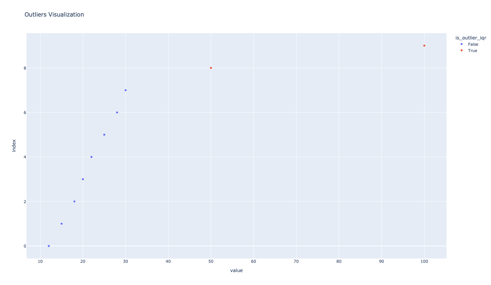

# Math and Statistics

## Introduction to Regressions

Regression analysis is a statistical technique used to model the relationship between one or more independent variables (also known as predictors or features) and a dependent variable (also known as the target or outcome). It helps us understand how changes in the independent variables are associated with changes in the dependent variable. Regressions are commonly used for predictive modeling, identifying patterns, and making inferences about the data.

## Types of Regressions

There are several types of regressions, each suited for different scenarios and data types:

1. **Linear Regression**: This is the simplest form of regression, where the relationship between the independent variables and the dependent variable is assumed to be linear. It helps us identify a straight line that best fits the data.

2. **Multiple Regression**: Similar to linear regression, but it involves two or more independent variables. It helps us understand how multiple factors influence the dependent variable simultaneously.

3. **Polynomial Regression**: In this type, the relationship between variables is modeled as an nth-degree polynomial. It can capture more complex patterns than linear regression.

4. **Logistic Regression**: Unlike linear regression, logistic regression is used for binary classification problems. It predicts the probability of an event occurring (e.g., yes or no, true or false).

5. **Ridge Regression and Lasso Regression**: These are variations of linear regression that include regularization techniques to prevent overfitting and handle multicollinearity.

## Interpreting Regression Results

Regression analysis provides valuable insights into the data:

1. **Coefficients**: The coefficients of independent variables indicate their impact on the dependent variable. A positive coefficient means an increase in the independent variable leads to an increase in the dependent variable, and vice versa for a negative coefficient.

2. **Intercept**: The intercept represents the value of the dependent variable when all independent variables are zero. It is the starting point of the regression line.

3. **R-squared (R²)**: R-squared measures the goodness of fit, indicating how well the regression line explains the variance in the dependent variable. Higher R-squared values (close to 1) indicate a better fit.

4. **p-values**: The p-values assess the statistical significance of each coefficient. Lower p-values indicate more reliable relationships between independent and dependent variables.

## Interpretation Considerations

When interpreting regression results, keep the following in mind:

1. **Correlation vs. Causation**: Regression identifies correlations, but it doesn't imply causation. Additional research is needed to establish causal relationships.

2. **Outliers**: Outliers can significantly impact regression results. Identifying and addressing outliers is crucial for accurate interpretations.

3. **Multicollinearity**: When independent variables are highly correlated, it can lead to misleading coefficient estimates. Detecting multicollinearity is important for reliable results.

4. **Overfitting**: Complex models can overfit the data and perform poorly on new data. Balancing model complexity and generalization is essential.

## Correlation Coefficient
The correlation coefficient is a statistical measure of the strength of the relationship between two (or more) variables.

[Image Source](https://www.cuemath.com/data/how-to-calculate-correlation-coefficient/)


## Standard Deviation

The **standard deviation** is a statistical measure that quantifies the amount of variation or dispersion in a set of data points. It indicates how spread out the values in a dataset are around the mean (average) value. A higher standard deviation suggests greater variability, while a lower standard deviation indicates less variability. It is calculated using the following formula:

σ = √(Σ(xi - μ)² / N)

Where:
- σ (sigma) is the standard deviation.
- Σ is the sum symbol.
- xi represents individual data points.
- μ (mu) is the mean of the dataset.
- N is the total number of data points.

```python
import pandas as pd
import numpy as np

# Create a sample DataFrame
data = {'value': [12, 15, 18, 20, 22, 25, 28, 30, 50, 100]}
df = pd.DataFrame(data)

# Calculate the mean and standard deviation
mean_value = df['value'].mean()
std_deviation = df['value'].std()

print(f"Mean: {mean_value:.2f}")
print(f"Standard Deviation: {std_deviation:.2f}")
```

## Outliers

**Outliers** are data points that significantly deviate from the rest of the dataset. They can distort statistical analyses and lead to inaccurate conclusions. Outliers can occur due to various reasons, such as measurement errors, data entry mistakes, or genuinely anomalous observations. It's important to identify and handle outliers appropriately.

Common methods for identifying outliers include:
- **Z-Score**: Measures how many standard deviations a data point is away from the mean.
- **IQR (Interquartile Range)**: The range between the first quartile (25th percentile) and the third quartile (75th percentile). Data points beyond a certain threshold from this range are considered outliers.
- **Visualization**: Creating scatter plots, box plots, or histograms can help visually identify data points that are far from the rest.

Outliers can be treated by either removing them if they are due to errors or extreme values, or by applying appropriate transformations to make them conform to the rest of the data.

```python
import pandas as pd
import numpy as np

# Create a sample DataFrame
data = {'value': [12, 15, 18, 20, 22, 25, 28, 30, 50, 100]}
df = pd.DataFrame(data)

# Calculate Z-scores
z_scores = (df['value'] - mean_value) / std_deviation

# Identify outliers using Z-score method
outliers_zscore = df[abs(z_scores) > 2]  # Threshold of 2 standard deviations

print("\nOutliers using Z-score:")
print(outliers_zscore)

# Calculate IQR (Interquartile Range)
q1 = df['value'].quantile(0.25)
q3 = df['value'].quantile(0.75)
iqr = q3 - q1

# Identify outliers using IQR method
lower_bound = q1 - 1.5 * iqr
upper_bound = q3 + 1.5 * iqr
outliers_iqr = df[(df['value'] < lower_bound) | (df['value'] > upper_bound)]

print("\nOutliers using IQR:")
print(outliers_iqr)

```
## Visualize the Outliers


<Details>

<Summary>Code to Produce Graphs</Summary>

```python
import pandas as pd
import numpy as np
import plotly.express as px

# Create a sample DataFrame
data = {'value': [12, 15, 18, 20, 22, 25, 28, 30, 50, 100]}
df = pd.DataFrame(data)

# Calculate the mean and standard deviation
mean_value = df['value'].mean()
std_deviation = df['value'].std()

# Calculate Z-scores
z_scores = (df['value'] - mean_value) / std_deviation

# Identify outliers using Z-score method
df['is_outlier_zscore'] = abs(z_scores) > 2  # Threshold of 2 standard deviations

# Create a scatter plot to visualize the outliers
fig = px.scatter(df, x='value', title='Outliers Visualization', color='is_outlier_zscore')

# Show the plot
fig.show()

# Calculate IQR (Interquartile Range)
q1 = df['value'].quantile(0.25)
q3 = df['value'].quantile(0.75)
iqr = q3 - q1

# Identify outliers using IQR method
lower_bound = q1 - 1.5 * iqr
upper_bound = q3 + 1.5 * iqr
df['is_outlier_iqr'] = (df['value'] < lower_bound) | (df['value'] > upper_bound)


# Create a scatter plot to visualize the outliers
fig = px.scatter(df, x='value', title='Outliers Visualization', color="is_outlier_iqr")


# Show the plot
fig.show()
```

</Details>

## Conclusion

Regression analysis is a powerful tool for understanding and interpreting data relationships. By fitting a regression line to the data, we can identify how changes in independent variables impact the dependent variable. However, it's essential to consider the limitations and assumptions of different regression techniques and validate findings with additional analyses. Used correctly, regressions provide valuable insights that aid decision-making and predictive modeling in various fields.

Sources:

1. [Introduction to Regression Analysis - Penn State University](https://online.stat.psu.edu/stat501/lesson/2)
2. [Interpreting Regression Coefficients - Duke University](https://stat.duke.edu/~mc301/notes/regression.pdf)
3. [Understanding R-squared - Investopedia](https://www.investopedia.com/terms/r/r-squared.asp)
4. [Interpreting Regression Analysis - UCLA Institute for Digital Research and Education](https://stats.idre.ucla.edu/stata/output/regression-analysis/)
5. [Linear Regression - Wikipedia](https://en.wikipedia.org/wiki/Linear_regression)
6. [Multiple Regression - Wikipedia](https://en.wikipedia.org/wiki/Multiple_regression)
7. [Polynomial Regression - Wikipedia](https://en.wikipedia.org/wiki/Polynomial_regression)
8. [Logistic Regression - Wikipedia](https://en.wikipedia.org/wiki/Logistic_regression)
9. [Ridge Regression - Wikipedia](https://en.wikipedia.org/wiki/Ridge_regression)
10. [Lasso Regression - Wikipedia](https://en.wikipedia.org/wiki/Lasso_(statistics))

