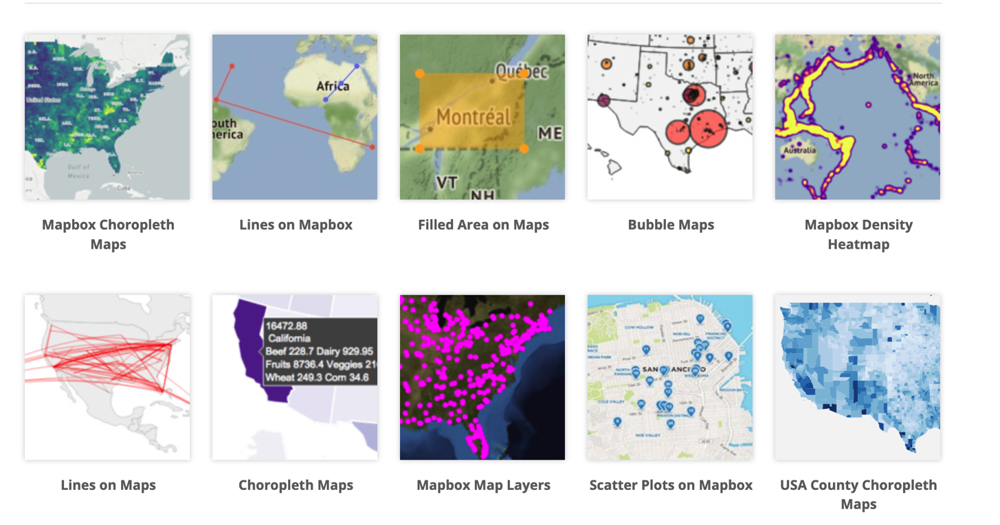
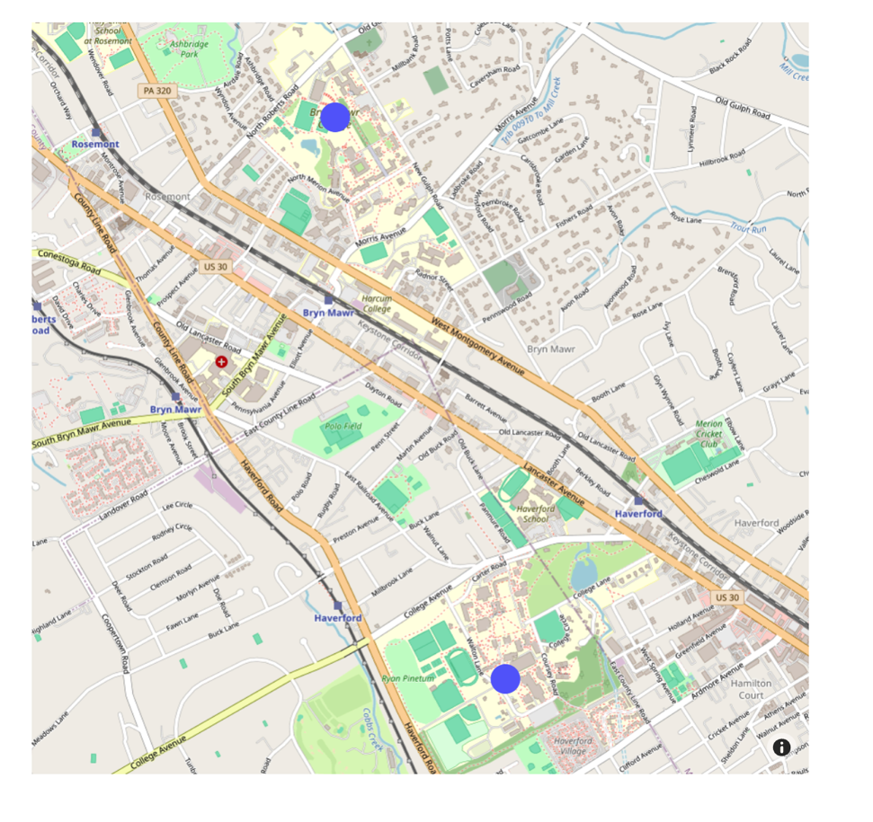
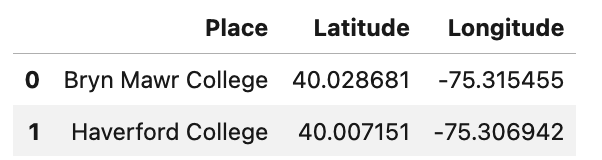
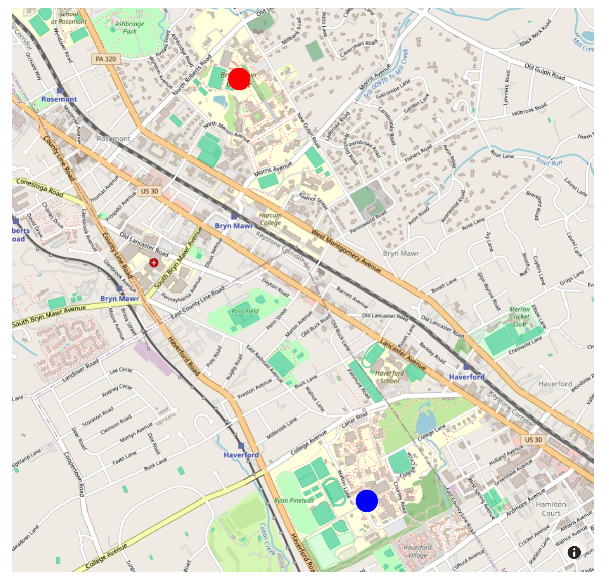
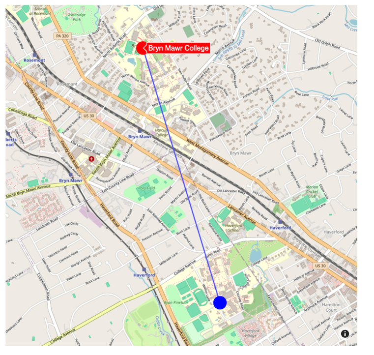
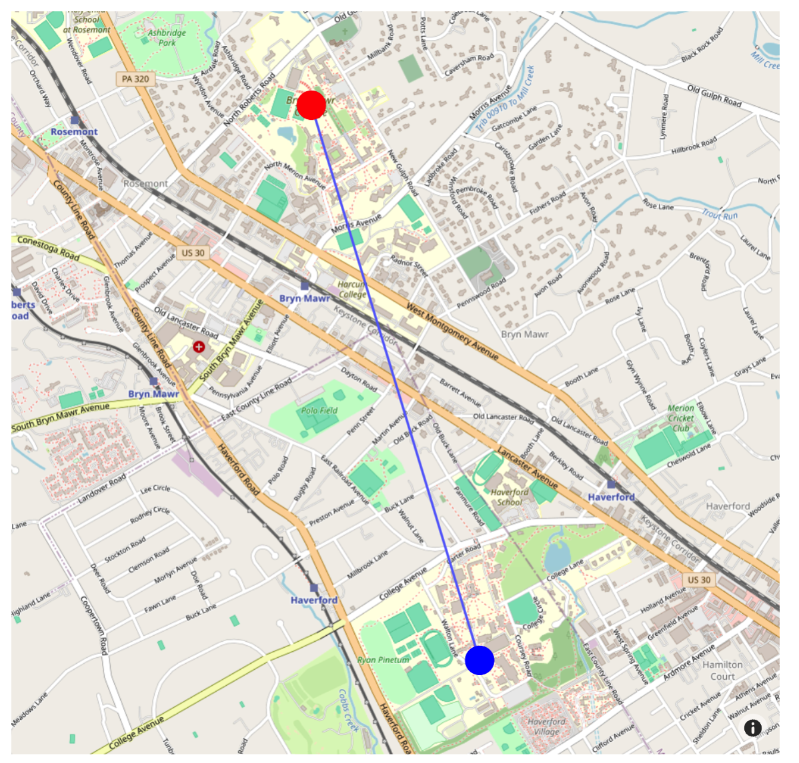
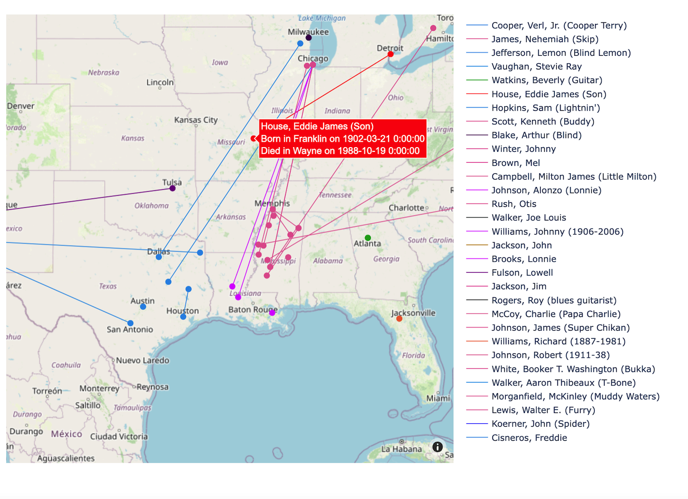
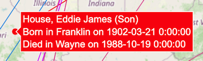

# All About Maps

In this tutorial you will learn about maps, and how to build them with Python, Pandas, and Plotly.

Note that for some of the demonstrations offered below you will be working with some pre-defined data derived from the RILM project. For other projects you will need to bring your own data.

## Maps with Plotly

Our main [Plotly](https://plotly.com/python/maps/) library supports a wide variety of maps.  





We will focus on only some basic types that will help us put institutions, people, and events in geographical space.

Normally we have been using Plotly Express as the basis of our charts, but here we need to use a related library: [Plotly Graph Objects](https://plotly.com/python/graph-objects/).  In fact Plotly Express is built *on top* of Graph Objects, and is generally simpler to use.  

The "objects" in Graph Objects are known as 'traces' and can contain a wide variety of quite specific datatypes. They are thus more complex than the dictionaries we have been passing to Plotly Express. The code shown below will show how to create these traces, and in turn the various **markers**, **lines**, **hover data**, **zoom level** and other features of our maps.  

## Import Libraries

Here are the libraries you will need:


```
python
import requests
import pandas as pd
import plotly as plt
import plotly.express as px
import plotly.graph_objects as go

from itertools import tee, combinations

import numpy as np

# set up for Jupyter Notebook on Server:

import plotly.io as pio
pio.renderers.default = "plotly_mimetype+notebook_connected"

# supress warnings
import warnings
warnings.filterwarnings('ignore')

```

## A Simple Map with Two Places

Here we build a simple map containing two places:  Haverford and Bryn Mawr College.  The locations are formulated as a `(latitude, longitude)` tuple:

```python
haverford_coords = (40.0071506, -75.30694232576307)
bryn_mawr_coords = (40.028680800000004, -75.31545509261818)
```



In turn we pass these coordinates as to the `go.Figure()` as two Python lists--one for the latitudes and one for the longtitudes:

``` python
lon=[bryn_mawr_coords[1], haverford_coords[1]],  # Longitudes, as a list
lat=[bryn_mawr_coords[0], haverford_coords[0]],  # Latitudes, as a list
```

Here is how we did it:

<Details>

<Summary>Code for Simple Map with Two Markers</Summary>

```python

# import the libraries
import plotly.graph_objects as go
from geopy.geocoders import Nominatim
import pandas as pd
import plotly as plt
import plotly.express as px
import plotly.graph_objects as go
from itertools import tee, combinations


# create some coordinates (we can look these up using GeoPy, as explained below), but for now we will simply delcare them as tuples--one Haverford College, the other for Bryn Mawr:

haverford_coords = (40.0071506, -75.30694232576307)
bryn_mawr_coords = (40.028680800000004, -75.31545509261818)

# get the mean values of the latitudes and longitudes, so we can 'center' the map

center_lat = (bryn_mawr_coords[0] + haverford_coords[0])/2
center_lon = (bryn_mawr_coords[1] + haverford_coords[1])/2

# create the figure
fig = go.Figure()


# Create the map by , and set the marker size
fig = go.Figure(data=go.Scattermapbox(
    lon=[bryn_mawr_coords[1], haverford_coords[1]],  # Longitudes, as a list
    lat=[bryn_mawr_coords[0], haverford_coords[0]],  # Latitudes, as a list
    mode='markers', # the kind of indicator.  could also be 'markers+lines'
    marker=go.scattermapbox.Marker(size=25) # sets the marker size.  could also include color attributes
))

# update the figure, now setting a center, zoom level, and size for output

fig.update_layout(mapbox_style="open-street-map", 
                  mapbox_zoom=13.5, # sets initial zoom level
                  mapbox_center_lon=center_lon, # sets initial 'center' longitude
                  mapbox_center_lat=center_lat, # sets initial 'center' latitude
                  width=800, # width of rendered map
                  height=800, # height of rendered map
                 )

# Display the map
fig.show()

```

</Details>

<br>

## Getting Lat/Long Coordinates Automatically from GeoPy with Nominatim API

The **GeoPy** library and **Nominatim** API allow us to interact with geolocation data. They need
to be used sparingly, and according to their rules about the number of requests that can be made in a short time-frame. But they provide a convenient 'tutorial' access token that allows us to harvest some basic data for this demonstration. 

In the following function, we pass in the a list of geographical entities(in this case, our colleges!) to the API and return the latitude and longtitude of each entity as a tuple.

We can in turn transform this list of tuples as a dataframe, resulting in something like this:




Here is how we did it:

<Details>

<Summary>Function to Fetch Lat/Long Tuples for a List of Entities</Summary>

```python

# Function to get coordinates from address
# Function to get coordinates from address
def get_coordinates(address):
    geolocator = Nominatim(user_agent="tutorial")
    location = geolocator.geocode(address)
    return (location.latitude, location.longitude)

list_of_places = ["Bryn Mawr College", "Haverford College"]

list_of_results = []
for place in list_of_places:
    these_coordinates = get_coordinates(place)
    list_of_results.append([place, *these_coordinates])  # Append place name and coordinates as a list

# build df from the list of results
df = pd.DataFrame(list_of_results, columns=["Place", "Latitude", "Longitude"])
df
```

</Details>

<br>


## The Finer Points

### Map Type, Size, Center and Zoom

Depending on your particular needs, you will need to specify:

- **the 'style' of map** (street, topgraphic, political, etc; `mapbox_style="open-street-map"` is a good choice, since it does not require an access token; learn more [here](https://plotly.com/python/mapbox-layers/#openstreetmap-tiles-no-token-needed) )
- **the initial 'center'** (a nominal 'average' latitude and longitude, so the data are centered, or users begin at a particular orientation; `mapbox_center_lon=-98` and `mapbox_center_lat=39` would put the map more or less at the geographical center of the USA, for example.  Below we show how to figure a 'mean' value from your data.)
- **the initial 'zoom'** (so that all your data are visible, or so you user can see key features at the outset; a value of 5 would show the entire Northeast US; 10 would show the greater Philadelphia region, and 15 would show something the size of the Haverford College campus).
- **the dimensions of the image** created in your notebook or other resource (normally expressed in pixels)

Control these features with `fig.update_layout` at the very end of your map code, just before you display the image:

```python

# get the mean values of the latitudes and longitudes, so we can 'center' the map
center_lat = (bryn_mawr_coords[0] + haverford_coords[0])/2
center_lon = (bryn_mawr_coords[1] + haverford_coords[1])/2

# specify map type, initial zoom, center, and size with these dictionary-like elements
fig.update_layout(mapbox_style="open-street-map", 
                  mapbox_zoom=13.5, # sets initial zoom level
                  mapbox_center_lon=center_lon, # sets initial 'center' longitude using value from above
                  mapbox_center_lat=center_lat, # sets initial 'center' latitude using value from above
                  width=800, # width of rendered map
                  height=800, # height of rendered map
                 )

# display the image
fig.show()
```
<br>

## Marker Size and Color

In our first example, simple allowed Plotly Graph Objects to assign a default color (blue) to both our markers.  But we can control the size and color of these in various ways.  Depending on your project, you might want to:

- make markers that share some characteristic share the same color (see below for an illustration)
- adjust the size of markers to reflect the size of some attribute (the larger the population, the larger the marker, for example)

You can specifiy ("hard code") these attributes as strings or lists with the `marker=go.scattermapbox.Marker(size='', color='')` element in our `go.Figure()`.  Here is a simple illustration in which we specifiy the *same* size but *different* colors for the markers representing Bryn Mawr and Haverford.  




<br>

The order of the elements in the `color` list will be used according to the order in which our `lat` and `lon` values were determined.  So the length of these lists need to match!  As we will discover in the **From Dataframe to Map** section below, there is an easy way to manage all of this with Pandas!

Also note that in this case we specify the colors by their English-language names.  But these could also be hex values, or even rbg tuples.  Plotly Express and Graph Objects include many built-in color scales; learn more [here](https://plotly.com/python/builtin-colorscales/).

```python
# specifying marker size (same) and color (different)
fig = go.Figure(data=go.Scattermapbox(
    lon=[bryn_mawr_coords[1], haverford_coords[1]],  # Longitudes, as a list
    lat=[bryn_mawr_coords[0], haverford_coords[0]],  # Latitudes, as a list
    mode='markers', # just a simple marker  could also be 'markers+lines'
    marker=go.scattermapbox.Marker(size=25, # just one size in this instance
                                  color=['red', 'blue']) # a list of colors
))
```

<br>


## Hover Data

By default, when a user 'hovers' over a marker with a mouse or trackpad pointer, the map show the latitude and longitude values associated with it. But it is often useful to let users see some underlying data about the individual points on your map. We set these with the `hovertext` and `hoverinfo` objects.  



<br>

Here is how to do it for a simple pair:

```python
# Create the map, and set the marker size
fig = go.Figure(data=go.Scattermapbox(
    lon=[bryn_mawr_coords[1], haverford_coords[1]],  # Longitudes, as a list
    lat=[bryn_mawr_coords[0], haverford_coords[0]],  # Latitudes, as a list
    mode='markers+lines', # the kind of indicator.  could also be 'markers+lines'
    marker=go.scattermapbox.Marker(size=25,
                                  color=['red', 'blue']), # sets the marker size.  could also include color attributes
    hovertext=['Bryn Mawr College', 'Haverford College'],  # sets the text for each marker, as a list
    hoverinfo='text' # show the hover text in the object just created above
    )
)
```

As we will discover in the **From Dataframe to Map** section below, there is an easy way to populate these hovertext values for each marker with Pandas!

<br>

## Connect Markers with Lines

Perhaps you want to show some relationship between certain markers.  We can do this by modifying the `go.Figure(mode=)` object.  



Here is how to do use `mode='markers+lines'`.

``` python
# Create the map, and set the marker size
fig = go.Figure(data=go.Scattermapbox(
    lon=[bryn_mawr_coords[1], haverford_coords[1]],  # Longitudes, as a list
    lat=[bryn_mawr_coords[0], haverford_coords[0]],  # Latitudes, as a list
    mode='markers+lines', # we add the lines here
    marker=go.scattermapbox.Marker(size=25) # sets the marker size.  could also include color attributes
))
```

In the case of a map with only two markers, it might be obvious that we want the lines to connect them.  But in a more complex map you might want to connect only a subset of markers with each other (for instance to reflect some journey, or related places).  We can do this easily with Pandas, as explained below.

## From Dataframe to Map

Building up a complex map in the ways explained above would be tedious at best, and involve a lot of careful work to make sure that any custom sizes, colors, and connecting lines were done correctly.

But there is a better way to do this:  populate your map coordinates and features from a **dataframe**, since it is likely that you will gathered your data in a JSON-like dictionary, and then enriched the data with various attributes (for instance, color, or size of each place). Provided that you have carefully checked the data for NANs or other irregularities, you can simply **pass each column to relevant Graph Object** and create the map.

### A Simple Example:  Two-College Dataframe

Let's return to the df created above:


Now let's pass each of these columns into the Plotly Graph Object. 

- In this case the Graph Objects `lon` and `lat` take in tuples. We can do this with `df['Longitude'].values` and `df['Latitude'].values`.  Technically, these are numpy arrays, but Graph Objects interprets them as tuples.
- Meanwhile the `hovertext` value for each marker is provided by the corresponding `Place` value in our dataframe.  Since this column is the same length as the `Latitude` and `Longtitude` columns, we know that the data will align.

Here is the relevant part of the `go.Figure()`:

```python

# here we assume the df has the columns:  "Place", "Longitude", and "Latitude", as shown in the sample above
fig = go.Figure(data=go.Scattermapbox(
    lon=df['Longitude'].values,  # all the longitudes as tuple, from df
    lat=df['Latitude'].values,  # all atitudes, as tuple from df
    mode='markers',  # Mode to display markers
    marker=go.scattermapbox.Marker(
        size=25,  # Size of the markers
        color=['red', 'blue']  # Color of the markers; these are hard coded
    ),
    hoverinfo='text',  # Type of information to show on hover
    hovertext=df['Place']  # Text to show on hover, pulled from df
))
```

In this instance we are passing the `color` attributes as *a hard-coded list inside* the `Figure` dictionary.  But if our dataframe had contained a specific column for this attribute (or for the relative `size` of the marker [such as "endowment per student"], we could have used `size=df['endow_per_student'].values` and `color=df['color'].values`) to set these features, too.

Setting **connecting lines** in this way, however, will not work, since the columns don't tell us which markers are connected with each other!

For a solution to this problem, see the following example.

## A More Complex Example: Pairs of Related Places

The **RILM Bio Card** project data assembles biographical information about musicians and musicologists who are cited in the RILM Abstracts and other databases. The BioCards contain information about places and dates of births and deaths for each person. How can we build a map that reveals useful connections among the persons in this set. Here we will consider the example of "Blues Guitarist", one of the 'roles' available via the RILM API.  

It is a truism of the Blues history that many Southern Black musicians (along with millions of other Black families) made their way to northern urban centers during the Great Migration in search of employment, opportunity, and escape from the explicit racism of the Jim Crow South.  Can our map help us see these patterns?

The RILM BioCard data includes:

- name, birthdate, deathdate
- birthplace and deathplace (with separate columns for the city, county, and state of each, plus the latitude and longtitude of the city)

We could:

- create a marker for the place of each musician's birth and death
- connect those two places with a line
- color the markers according to the name of the state in which they were born
- add 'hoverdata' to the markers, to show the name, birth and death date of each musician associated with a given place, as well as the names of the locations themselves

The result is revealing, for it shows some striking parallels as musicians from the Missisippi Delta mainly going to Chicago (and some to New York or Philadelphia), while musicians from East Texas and Oklahoma heading to the West Coast. But of course there are some exceptions, since we also see (by hovering!) that Blind Lemon Jefferson also went from Texas to Chicago. 

Such patterns of migration follow similar trajectories among non-musicians, of course. But connections could be arrayed against other evidence about musical style and influence. 




Here is how we did it.  Along the way, you will see that we:

- used a **Plotly Express color palette** to help us build a set of custom colors with hex values--one for each state in the original DF.  We added stored these color values in a df['color'] column, and then retrieved them as we built our markers, passing them to the `go.Figure(color="")` Graph Object.
- used a Python convention called an `f-string`(learn more [here](https://www.w3schools.com/python/python_string_formatting.asp)) to populate the `hovertext` Graph Object with a complex set of data drawn from the df. This could be customized with any fields you choose, and could even include urls that linked to an external resource (assuming your DF included these as a column).  In our case, the `f-string` builds up a short biographical summary:

<br>

```python
hovertext=f"{row['name']}<br>Born in {row['b_place_uplvl1']} on {row['born_dt']}<br>Died in {row['d_place_uplvl1']} on {row['died_dt']}"
```
<br>


This is rendered as:

<br>




<br>

<Details>

<Summary>Code to Populate Map from RILM Bio Card DF</Summary>

#### get the data (we have already cleaned things up!):

``` python
rilm_guitarists = "https://docs.google.com/spreadsheets/d/e/2PACX-1vRiOkecfOnabVh-de6xDBvU6rts6WwuXXpjOKPaeMV7DvTovOXMfUq5vSYi1c47PM9SPgSU7elDfJoi/pub?output=csv"

rilm_df = pd.read_csv(rilm_guitarists)
```

#### check the columns:

``` python
rilm_df.columns.tolist()
['name',
 'born_dt',
 'died_dt',
 'nationality',
 'b_placename',
 'b_place_uplvl1',
 'b_place_uplvl2',
 'b_lat_decimal',
 'b_long_decimal',
 'd_lat_decimal',
 'd_long_decimal',
 'd_placename',
 'd_place_uplvl1',
 'd_place_uplvl2']
```

#### get a list of the unique birth states

These are stored in a column called `'b_place_uplvl2`.

``` python
# give the data a generic name, so we can reuse this code
data = rilm_df
# and get the place names
unique_birthplaces = data[pd.notnull(data['b_place_uplvl2'])]['b_place_uplvl2'].unique()
```

#### And assign a unique color--one for each state, and store them in the df :

``` python
# select palette
color_palette = px.colors.qualitative.Dark24

# creating a color mapping for each state
state_color_dict = {state: color_palette[i % len(color_palette)] for i, state in enumerate(unique_birthplaces)}

# store color values in new df column, row for row
# a temporary fix for NA values in state column!  We need to clean the data!
data['color'] = data['b_place_uplvl2'].map(state_color_dict).fillna('#440154')
```

#### get lat, long, and name columns for the markers and lines, and the cities for hoverdata

Here are the columns we need:

-   name = 'name'
-   latitude of birthplace = 'b_lat_decimal'
-   longitude of birthplace = 'b_long_decimal'
-   latitude of deathplace = 'd_lat_decimal'
-   longitude of deathplace = 'd_long_decimal'
-   birthdate = 'born_dt'
-   deathdate = 'died_dt'
-   birthplace = 'b_place_uplvl2'
-   deathplace = 'd_place_uplvl1'
-   color for markers and lines = 'color'

We will pass these into our Graph Objects, and add the marker and lines as shown in the code below using the `iterrows` method from the **itertools** Python library.  And this is how we add lines between each 'pair' of locations in each row.  We are adding the `mode='lines'` at the same time we create the pair of markers (each with their own latitude and longitude).  

Our `df.iterrows()` object is a list, which we loop through, using each `row` but discarding a temporary variable `_` that we might otherwise have created with some kind of function in other contexts.  But we pass the data in each `row` to `fig.add_trace()` and build up the appropriate pairs and their attributes.

Here is how we did it:

```python
# create the figure
fig = go.Figure()

# here we create the lines, with endpoints determined by the lat/long pairs
# we also assign colors (by state) and names for the legend at the right
for _, row in df.iterrows():
    fig.add_trace(go.Scattermapbox(
        lat=[row['b_lat_decimal'], row['d_lat_decimal']],  # use birth and death latitude from df
        lon=[row['b_long_decimal'], row['d_long_decimal']],  # use birth and death longitude from df
        mode='lines',  # connect birth and death locations with a line
        hoverinfo='skip',  # do not show hover info right now
        line=dict(width=1, color=row['color']),  # apply the color from the df
        name=row['name']  # use the person's name from df for the map legend shown at right
    ))

# here we add markers for birth and death locations
# colors match those used for the lines
# and we add hover data for each marker, with name, dates, and place names
for _, row in df.iterrows():
    fig.add_trace(go.Scattermapbox(
        lat=[row['b_lat_decimal'], row['d_lat_decimal']], # use birth and death latitude from df
        lon=[row['b_long_decimal'], row['d_long_decimal']], # use birth and death longitude from df
        mode='markers', # how we are just making markers for each place
        marker=go.scattermapbox.Marker(size=9, color=row['color']),  # apply the color from the df
        hoverinfo='text', # now we add the hover data below
        hovertext=f"{row['name']}<br>Born in {row['b_place_uplvl1']} on {row['born_dt']}<br>Died in {row['d_place_uplvl1']} on {row['died_dt']}", # this complex 'f-string' populates the hovertext with various strings and line breaks
        showlegend=False, # the legend was already created ih the `fig.add_trace()` step above
    ))


# update layout, as usual, now using the 'mean' value of all lat and long figures in our df to center the map
fig.update_layout(mapbox_style="open-street-map", 
                    mapbox_zoom=4, 
                    mapbox_center_lat=df['b_lat_decimal'].mean(), # center via mean value of all lats
                    mapbox_center_lon=df['b_long_decimal'].mean(), # center via mean value of all longs
                    width=1000,
                    height=800,)

fig.show()
```

You can adapt this process for your own data, and make use of the many options for modifying the appearance and behavior of your map.
