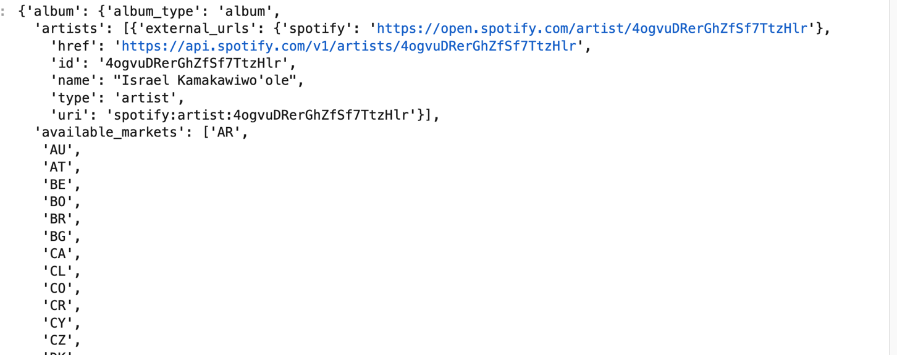
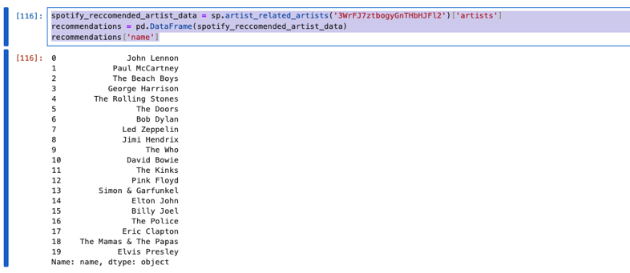
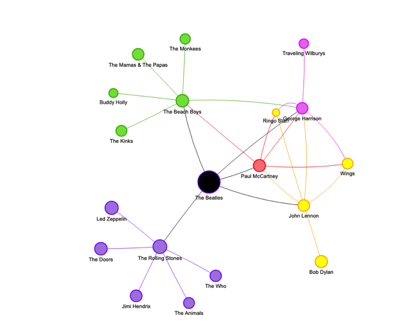
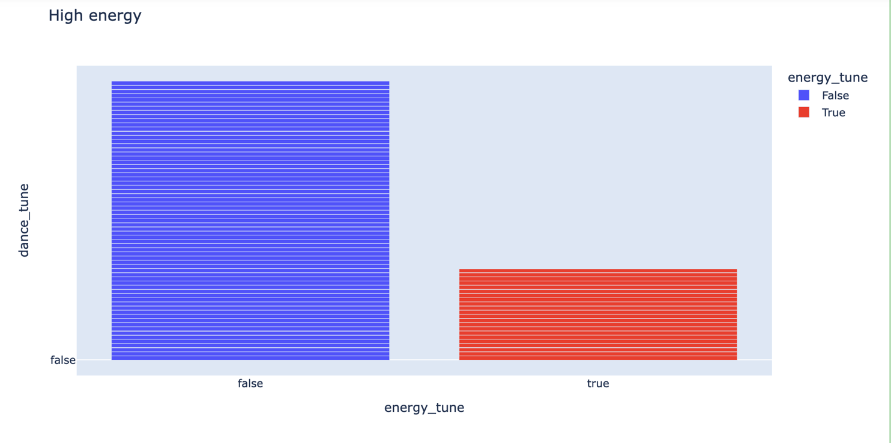
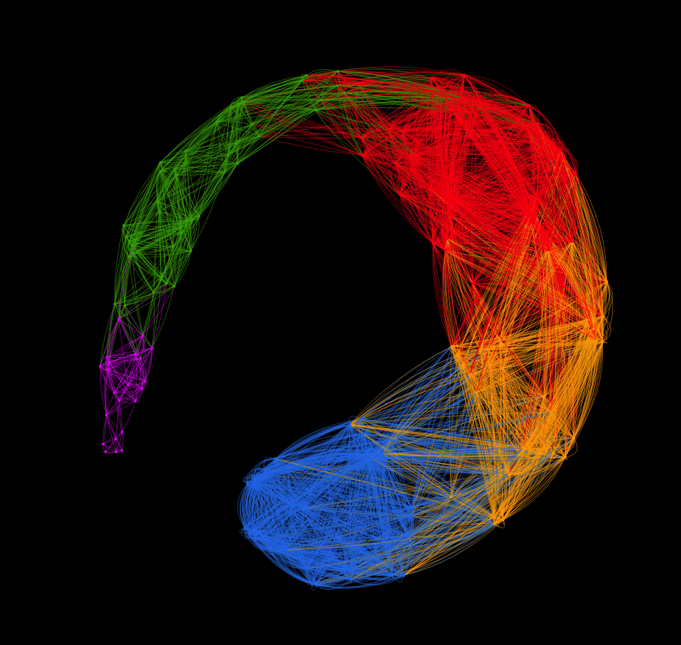
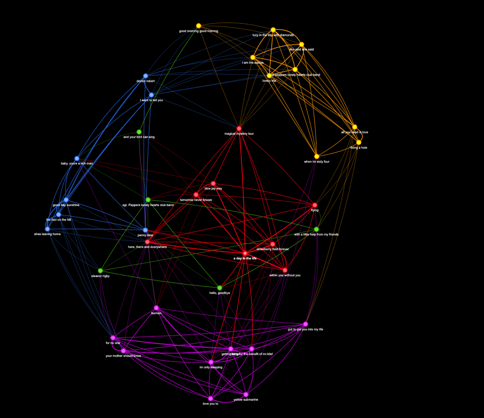

# Spotify Functions for the Encoding Music Course

|    | Contents of this Tutorial               | 
|----|-----------------------------------------|
| 1. | [**Brief Introduction: Spotify, APIs, Spotify API, and Spotipy**](#brief-introduction-spotify-apis-spotify-api-and-spotipy) |
| 2. | [**Installing SpotiPy, The Encoding Music Spotify Tools, and other Libraries**](#installing-spotipy-the-encoding-music-spotify-tools-and-other-libraries) |
| 3. | [**Import Libraries**](#import-libraries) |
| 4. | [**Establish Credentials for the Spotify API**](#establish-credentials-for-the-spotify-api) |
| 5. | [**Get Basic Metadata for One or More Tracks**](#get-basic-metadata-for-one-or-more-tracks) |
| 6. | [**Get Audio Features for a Single Playlist (or Song)**](#get-audio-features-for-a-single-playlist-or-song) |
| 7. | [**Get Audio from Multiple Playlists**](#get-audio-from-multiple-playlists) |
| 8. | [**Get All of a Particular User's Tracks**](#get-all-of-a-particular-users-tracks) |
| 9. | [**Recommended Artists and Songs and Genres**](#recommended-artists-and-songs-and-genres) |
| 10. | [**Charting Data:  Scatterplots, Correlations and Radar Plots**](#charting-data--scatterplots-correlations-and-radar-plots) |
| 11. | [**Categories and Bins:  From Continuous to Discrete Variable**](#categories-and-bins--from-continuous-to-discrete-variables)
| 12. | [**Networks of Songs and Artists with Spotify Data**](#networks-of-songs-and-artists-with-spotify-data) |


## Brief Introduction: Spotify, APIs, Spotify API, and Spotipy

**Spotify** is a paid music streaming web application launched in 2006. The service has about 182 million subscribers and hosts more than 70 million tracks. In 2014, Spotify released **Spotify API**, a web-based interface that allows anyone with a Spotify account to search, analyze, and manipulate Spotify's music metadata. In short, **an API** is a piece of software that enables two or more programs to talk to each other. You can learn more about APIs [here](https://en.wikipedia.org/wiki/API).

As this tutorial explains, you'll be able to request Spotify API access for your personal notebook and perform all sorts of analyses on the tracks, users, artists, albums, and playlists of your interest. 

Thanks to [Max Hilsdorf](https://towardsdatascience.com/how-to-create-large-music-datasets-using-spotipy-40e7242cc6a6), whose Spotipy library does the heavy lifting of bringing Spotify data to your Notebook. 


## Installing SpotiPy, The Encoding Music Spotify Tools, and other Libraries

SKIP THIS STEP if you are working with the Encoding Music Jupyter Hub! 

Note that as part of the **Encoding Music** course, we have created a special `spotipy_tools.py` library that includes all of the key functions explained below.  This library is _already_ part of the Encoding Music Jupyter Hub.  But if you create your own local JupyterLab via Anaconda, then you will need to install this library (among others).  Here is how to do it:

* **Launch Anaconda** and **open the environment** you are using for your work (this will be the same one in which you installed all the other required libraries used in the course)
* Open a new **terminal session** (this could be done from the Anaconda Navigator page, or from a Launcher within JupyterLab.)
* type the folowing two commands:

```python
pip install git+https://github.com/RichardFreedman/Encoding_Music.git@main
pip install spotipy
pip install time
pip install pyvis
```

Now you should be ready to use the tools as explained below!


4. Now follow the **Import Libraries** and **Establish Credential** steps bel


## Import Libraries 

In order to make use of the Spotify data, you will need the following libraries:

<Details>

<Summary>List of Libraries to Import</Summary>

```python
import pandas as pd
import numpy as np
import random
# import plotly.graph_objects as go
import requests
import inspect
import spotipy
from spotipy.oauth2 import SpotifyClientCredentials
import spotify_tools
import networkx as nx
import networkx.algorithms.community as nx_comm
# import matplotlib.cm as cm
# import matplotlib.pyplot as plt
import plotly.express as px
import pyvis
from pyvis import network as net
from itertools import combinations
from community import community_louvain
from copy import deepcopy
import time
```
</Details>

<br>

## Establish Credentials for the Spotify API

In order to utilize the functionality of Spotify's API, you'll need to establish a connection between the local endpoint (your laptop) and the API (cloud). To do that, you'll need to create a **web client** (read more [here](https://en.wikipedia.org/wiki/Client_(computing))).

A web client typically requires authentication parameters **(key and secret)**. Spotify API uses OAuth2.0 authorization scheme. You can learn more about authentication [here](https://en.wikipedia.org/wiki/OAuth).

To create your own key and secret, you will need to:

* Log in to Spotify with your personal account
* Visit the [Spotify for Developers](https://developer.spotify.com/dashboard/create) page
* Provide information about an 'app' you are developing.  This does not need to be a real app (yet), but simply provide a `name` ("my_M255_project" will do), and some `website` url (this could be any URL, for instance your github address), and a `redirect` URI (which could be the same address).
* After entering these, Spotify will provide you with a **key** and **secret**. Make a note of these some place secure!  You will need them, and **you should not share them**!  Don't include them in any code you store on GitHub!


#### Add Your Credentials to a Notebook on Encoding Music JupyterHub (Recommended)

You will need to include your "Client_ID" and "Client_Secret" in your Notebook.  Make a dedicated cell for these using the following code. You will replace the "MY_ID" (and other similar unique strings) your own!

Here is the code for this special authentication cell:

```python
# storing the credentials you just created
CLIENT_ID = "MY_ID"
CLIENT_SECRET = "MY_SECRET"
my_username = "my_spotify_name"

# instantiating the client.  This 'sp' version of the client is used repeatedly below
# source: Max Hilsdorf (https://towardsdatascience.com/how-to-create-large-music-datasets-using-spotipy-40e7242cc6a6)
client_credentials_manager = SpotifyClientCredentials(client_id=CLIENT_ID, client_secret=CLIENT_SECRET)
sp = spotipy.Spotify(client_credentials_manager=client_credentials_manager)
```

#### Query Spotify API Directly (Optional for those Working Outside Encoding Music Jupyterhub)

The following is needed **only if you are using direct requests with the API**.   It is NOT needed for the Spotify Tools used in this documentation.

<Details>

<Summary>Code to Query Spotify API Directly</Summary>


```
AUTH_URL = 'https://accounts.spotify.com/api/token'

# POST
auth_response = requests.post(AUTH_URL, {
    'grant_type': 'client_credentials',
    'client_id': CLIENT_ID,
    'client_secret': CLIENT_SECRET,
})

# convert the response to JSON
auth_response_data = auth_response.json()

# save the access token
access_token = auth_response_data['access_token']
```

</Details>

<br>

At this point, you should be able to access the API! Now we move on to scraping and analyzing music metadata.


##  Get Basic Metadata for One or More Tracks

The Spotify API returns a rather large range of metadata, including not only Audio Features (more on that below) but also information about the artist, release dates, countries of availability, album art, and so on. The Spotipy Client can return these as shown below. 

### Get a Playlist

To use this function, you need the **username of the person who created the playlist** and the **playlist ID** itself 

For example: [Our Voyager Playlist](https://open.spotify.com/playlist/75OAYmyh848DuB16eLqBtk)

#### How to Find the `creator_id`

This is the id of the user who made the playlist. It's *not* the same as the client_id for the Spotify API above.

```python
creator_id = "rich6833spot"
```

#### How to Find the `playlist_id`

For instance if you "copy the link" to the playlist in the Spotify webapp or player:

`https://open.spotify.com/playlist/3LssUmwJxSBf3WoEz4aJuC?si=4f43a41aed8a43d1`

The playlist_id is the **string of characters between the "/" and "?"**:

```python
playlist_id = "3LssUmwJxSBf3WoEz4aJuC"
```

#### Pass These to the Spotipy Client Function to Return the Full Metadata for this Playlist

The Spotipy `user_playlist_tracks` function takes in two variables, like this:  `sp.user_playlist_tracks("creator_id", "playlist_id")`.  We pass the results of this to the `pd.DataFrame` function in order to create a table (dataframe) of the results:


```python
creator_id = "rich6833spot"
playlist_id = "3LssUmwJxSBf3WoEz4aJuC"
playlist_tracks = pd.DataFrame(sp.user_playlist_tracks(creator_id, playlist_id))
playlist_tracks
```


<br>

#### Individual Tracks are JSON Objects

```python
sample_track = playlist_tracks.iloc[0]["items"]["track"]
sample_track
```




<Details>

<Summary> View Full JSON output of Data for One Track</Summary>

```python
{'preview_url': 'https://p.scdn.co/mp3-preview/48126df9def0947e4479b7655e69e6d06150d7d8?cid=922db1c93c90406fb8608e2729577cf4',
 'available_markets': ['AR',
  'AU',
  'AT',
  'BE',
  'BO',
  'BR',
  'BG',
  'CA',
  'CL',
  'CO',
  'CR',
  'CY',
  'CZ',
  'DK',
  'DO',
  'DE',
  'EC',
  'EE',
  'SV',
  'FI',
  'FR',
  'GR',
  'GT',
  'HN',
  'HK',
  'HU',
  'IS',
  'IE',
  'IT',
  'LV',
  'LT',
  'LU',
  'MY',
  'MT',
  'MX',
  'NL',
  'NZ',
  'NI',
  'NO',
  'PA',
  'PY',
  'PE',
  'PH',
  'PL',
  'PT',
  'SG',
  'SK',
  'ES',
  'SE',
  'CH',
  'TW',
  'TR',
  'UY',
  'US',
  'GB',
  'AD',
  'LI',
  'MC',
  'ID',
  'JP',
  'TH',
  'VN',
  'RO',
  'IL',
  'ZA',
  'SA',
  'AE',
  'BH',
  'QA',
  'OM',
  'KW',
  'EG',
  'MA',
  'DZ',
  'TN',
  'LB',
  'JO',
  'PS',
  'IN',
  'BY',
  'KZ',
  'MD',
  'UA',
  'AL',
  'BA',
  'HR',
  'ME',
  'MK',
  'RS',
  'SI',
  'KR',
  'BD',
  'PK',
  'LK',
  'GH',
  'KE',
  'NG',
  'TZ',
  'UG',
  'AG',
  'AM',
  'BS',
  'BB',
  'BZ',
  'BT',
  'BW',
  'BF',
  'CV',
  'CW',
  'DM',
  'FJ',
  'GM',
  'GE',
  'GD',
  'GW',
  'GY',
  'HT',
  'JM',
  'KI',
  'LS',
  'LR',
  'MW',
  'MV',
  'ML',
  'MH',
  'FM',
  'NA',
  'NR',
  'NE',
  'PW',
  'PG',
  'PR',
  'WS',
  'SM',
  'ST',
  'SN',
  'SC',
  'SL',
  'SB',
  'KN',
  'LC',
  'VC',
  'SR',
  'TL',
  'TO',
  'TT',
  'TV',
  'VU',
  'AZ',
  'BN',
  'BI',
  'KH',
  'CM',
  'TD',
  'KM',
  'GQ',
  'SZ',
  'GA',
  'GN',
  'KG',
  'LA',
  'MO',
  'MR',
  'MN',
  'NP',
  'RW',
  'TG',
  'UZ',
  'ZW',
  'BJ',
  'MG',
  'MU',
  'MZ',
  'AO',
  'CI',
  'DJ',
  'ZM',
  'CD',
  'CG',
  'IQ',
  'LY',
  'TJ',
  'VE',
  'ET',
  'XK'],
 'explicit': False,
 'type': 'track',
 'episode': False,
 'track': True,
 'album': {'available_markets': ['AR',
   'AU',
   'AT',
   'BE',
   'BO',
   'BR',
   'BG',
   'CA',
   'CL',
   'CO',
   'CR',
   'CY',
   'CZ',
   'DK',
   'DO',
   'DE',
   'EC',
   'EE',
   'SV',
   'FI',
   'FR',
   'GR',
   'GT',
   'HN',
   'HK',
   'HU',
   'IS',
   'IE',
   'IT',
   'LV',
   'LT',
   'LU',
   'MY',
   'MT',
   'MX',
   'NL',
   'NZ',
   'NI',
   'NO',
   'PA',
   'PY',
   'PE',
   'PH',
   'PL',
   'PT',
   'SG',
   'SK',
   'ES',
   'SE',
   'CH',
   'TW',
   'TR',
   'UY',
   'US',
   'GB',
   'AD',
   'LI',
   'MC',
   'ID',
   'JP',
   'TH',
   'VN',
   'RO',
   'IL',
   'ZA',
   'SA',
   'AE',
   'BH',
   'QA',
   'OM',
   'KW',
   'EG',
   'MA',
   'DZ',
   'TN',
   'LB',
   'JO',
   'PS',
   'IN',
   'BY',
   'KZ',
   'MD',
   'UA',
   'AL',
   'BA',
   'HR',
   'ME',
   'MK',
   'RS',
   'SI',
   'KR',
   'BD',
   'PK',
   'LK',
   'GH',
   'KE',
   'NG',
   'TZ',
   'UG',
   'AG',
   'AM',
   'BS',
   'BB',
   'BZ',
   'BT',
   'BW',
   'BF',
   'CV',
   'CW',
   'DM',
   'FJ',
   'GM',
   'GE',
   'GD',
   'GW',
   'GY',
   'HT',
   'JM',
   'KI',
   'LS',
   'LR',
   'MW',
   'MV',
   'ML',
   'MH',
   'FM',
   'NA',
   'NR',
   'NE',
   'PW',
   'PG',
   'PR',
   'WS',
   'SM',
   'ST',
   'SN',
   'SC',
   'SL',
   'SB',
   'KN',
   'LC',
   'VC',
   'SR',
   'TL',
   'TO',
   'TT',
   'TV',
   'VU',
   'AZ',
   'BN',
   'BI',
   'KH',
   'CM',
   'TD',
   'KM',
   'GQ',
   'SZ',
   'GA',
   'GN',
   'KG',
   'LA',
   'MO',
   'MR',
   'MN',
   'NP',
   'RW',
   'TG',
   'UZ',
   'ZW',
   'BJ',
   'MG',
   'MU',
   'MZ',
   'AO',
   'CI',
   'DJ',
   'ZM',
   'CD',
   'CG',
   'IQ',
   'LY',
   'TJ',
   'VE',
   'ET',
   'XK'],
  'type': 'album',
  'album_type': 'compilation',
  'href': 'https://api.spotify.com/v1/albums/6LX6cgc3VpmVozT2wz83yy',
  'id': '6LX6cgc3VpmVozT2wz83yy',
  'images': [{'height': 640,
    'url': 'https://i.scdn.co/image/ab67616d0000b27382fb8c08c86da7f2c0dda823',
    'width': 640},
   {'height': 300,
    'url': 'https://i.scdn.co/image/ab67616d00001e0282fb8c08c86da7f2c0dda823',
    'width': 300},
   {'height': 64,
    'url': 'https://i.scdn.co/image/ab67616d0000485182fb8c08c86da7f2c0dda823',
    'width': 64}],
  'name': 'The Raga Guide',
  'release_date': '1999-08-10',
  'release_date_precision': 'day',
  'uri': 'spotify:album:6LX6cgc3VpmVozT2wz83yy',
  'artists': [{'external_urls': {'spotify': 'https://open.spotify.com/artist/0LyfQWJT6nXafLPZqxe9Of'},
    'href': 'https://api.spotify.com/v1/artists/0LyfQWJT6nXafLPZqxe9Of',
    'id': '0LyfQWJT6nXafLPZqxe9Of',
    'name': 'Various Artists',
    'type': 'artist',
    'uri': 'spotify:artist:0LyfQWJT6nXafLPZqxe9Of'}],
  'external_urls': {'spotify': 'https://open.spotify.com/album/6LX6cgc3VpmVozT2wz83yy'},
  'total_tracks': 74},
 'artists': [{'external_urls': {'spotify': 'https://open.spotify.com/artist/7CozfB3IEACZpAelpwkUon'},
   'href': 'https://api.spotify.com/v1/artists/7CozfB3IEACZpAelpwkUon',
   'id': '7CozfB3IEACZpAelpwkUon',
   'name': 'Hariprasad Chaurasia',
   'type': 'artist',
   'uri': 'spotify:artist:7CozfB3IEACZpAelpwkUon'}],
 'disc_number': 1,
 'track_number': 10,
 'duration_ms': 232333,
 'external_ids': {'isrc': 'GBAJU9400617'},
 'external_urls': {'spotify': 'https://open.spotify.com/track/0ISjaw8I4cQ5NNN2u9BMRr'},
 'href': 'https://api.spotify.com/v1/tracks/0ISjaw8I4cQ5NNN2u9BMRr',
 'id': '0ISjaw8I4cQ5NNN2u9BMRr',
 'name': 'Bhairavi',
 'popularity': 16,
 'uri': 'spotify:track:0ISjaw8I4cQ5NNN2u9BMRr',
 'is_local': False}
```

</Details>

<br>


As you can see, tracks are stored as **JSON objects** (think Dictionaries), which you can read more about [here](https://developer.mozilla.org/en-US/docs/Web/Juser_2cript/Reference/Global_Objects/JSON). 

Each Track object has many attributes, including "album", "artists", "id", "duration", "popularity", "name" etc. Some of these are extremely useful to us! You can learn more about Spotify's Track features [here](https://developer.spotify.com/documentation/web-api/reference/#/operations/get-track).


##  Get Audio Features for a Single Playlist (or Song)

So far we have gathered a lot of contextual information about the items in our playlist.  But Spotify also offers information about what they call the **Audio Features** of each track. These are derived using advanced signal analysis, including information about tempo, loudness, key, and even some strangely abstract concepts like the 'danceability' or 'energy' of a track. 

These data are stored in complex and nested JSON objects for each track, at least as they are returned by the Spotify API.  Fortunately, the **spotify_tools.py** library (created by Edgar Leon and Oleh Shostak at Haverford College) simplify this complex JSON, return only the audio features, in this case as a Pandas dataframe.  This function is based on [Max Hilsdorf's article](https://towardsdatascience.com/how-to-create-large-music-datasets-using-spotipy-40e7242cc6a6), and returns a dataframe showing *just* the audio features of the given playlist.  

With **spotify_tools.py** you can build a dataframe that includes the following for a single playlist (or even a collection of them):

- Artist
- Album
- Track Name
- Track ID
- Danceablility
- Energy
- Key
- Loudness
- Mode
- Speechiness
- Instrumentalness
- Liveness
- Valence
- Tempo
- Durations (in ms)
- Time Signature

### How To Use spotify_tools

As explained above, you will need a **playlist_id** and **creator_id** (that is, the id of the person who made the list). You'll need a plys

For example: [Our Voyager Playlist](https://open.spotify.com/playlist/75OAYmyh848DuB16eLqBtk)

```python
creator_id = "rich6833spot"
playlist_id = "3LssUmwJxSBf3WoEz4aJuC"
playlist_tracks = pd.DataFrame(sp.user_playlist_tracks(creator_id, playlist_id))
```
<br>

#### Get Audio Features for One Playlist


Spotify has recently implemented various 'rate limits' on requests from their API.  They don't tell us explicitly how many requests are "too many", but if you exceed their limit, your account will be blocked for hours at a time.  And so we have added a **time delay** feature to our function that 'gets audio features slowly'.  You can adjust this delay (at your own risk!), but we suggest "2" seconds, since this seems to avoid angering the Spotify data police.

Here is now to 'get audio features slowly':  Note that you must pass in the **playlist tracks** obtained above, the **time delay** (normally `2`, since this is needed to prevent errors from Spotify), and the **spotify client** created above (`sp`)

```python
# get the playlist tracks
creator_id = "rich6833spot"
playlist_id = "3LssUmwJxSBf3WoEz4aJuC"
playlist_tracks = pd.DataFrame(sp.user_playlist_tracks(creator_id, playlist_id))

# pass the playlist_tracks df to the `get_audio_features_slowly` function
time_delay = 2
playlist_audio_features = spotify_tools.get_audio_features_slowly(playlist_tracks, time_delay, sp) 

# show the results
playlist_audio_features.head() 
```

<br>

<Details>
<Summary>Full Code from Spotify Tools for Reference</Summary>

You don't need to add this function, since it is already part of Spotify Tools.  Just for reference!

```python
def get_audio_features_slowly(playlist_tracks, time_delay, sp):
    track_info = playlist_tracks.apply(lambda row: row["items"]["track"], axis=1).to_list()
    track_dict_list = []
    for track in track_info:
        try:
            time.sleep(time_delay)
            this_track_dict = {
                'track_id' : track['id'],
                'track_title' : track['name'],
                'artist_name' : track['artists'][0]['name']}
            audio_features_temp = sp.audio_features(track['id'])[0]
            # test for missing values
            this_track_dict.update(audio_features_temp)
            track_dict_list.append(this_track_dict)
        except Exception as e:
            print(e, track['id'])
    audio_features = pd.DataFrame(track_dict_list)
    return audio_features
```
</Details>

### Sample Result


#### Audio Features for One Track from that List

Use `iloc` to see just one row from that dataframe:

```python
sample_track = playlist_audio_features.iloc[1]
sample_track
```


<br>

As you can see, each track has **a large number of recorded audio features**. These are typically generated by Spotify and cover various musical aspects, ranging from Loudness to Liveness, from Danceability to Duration, and from Tempo to Time Signature. 

The feature values are of different **data types**: "key" is an **Integer**, "energy" is a **Float**, "id" is a **String**, and "mode" is a **Boolean** represented as Integer. As you work your way through this guide, you will discover many options to count, bin, sort, graph, and connect variables and values of different types.

---
## Get Audio from Multiple Playlists

This function returns the same data frame as the function from above, but allows you to **analyze multiple playlists**. To use this function, you need to create a **dictionary of playlists**. To do so, see the example code below.

```python
playlist_dict = {
    "PLAYLIST NAME HERE": ("CREATOR_ID HERE", "PLAYLIST_ID HERE")
}
```

#### For example:


```python
playlist_dict = {
    "granade_essay" : ("rich6833spot", "1AvFUOC33oJjidGfNLzf29"), 
    "phrygian" : ("rich6833spot", "3LssUmwJxSBf3WoEz4aJuC")
    #Follow the same format to add more playlists
}
```

---

Note that the 'key' of each dictionary entry (in the example above, this would be "voyager" and "phyrgian") will appear as a separate column in the resulting combined dataframe, thus identifying the data from each original playlist.  You will of course need to make sure that these names are unique!

Pass that **playlist dictionary**, the **time delay** (`2` is good) and the **spotify client** established above to the function.
Now that we have created our playlist dictionary, we can call the function <span style="color:olive">analyze_playlist_dict</span> to analyze the audio features of the songs in multiple playlists.

```python
time_delay = 2
multiple_playlist_data_frame = spotify_tools.get_multiple_audio_features_slowly(playlist_dict, time_delay, sp)
multiple_playlist_data_frame.head()
```

<br>

Note the playlist 'name' in the last column at the right!


<br>

<Details>
<Summary>Full Code from Spotify Tools for Reference</Summary>

You don't need to add this function, since it is already part of Spotify Tools.  Just for reference!


```python
def get_multiple_audio_features_slowly(playlist_dict, time_delay, sp):
    list_of_audio_dfs = []
    for playlist_name, value in playlist_dict.items():
        time.sleep(30)
        print(f"Getting tracks for playlist {playlist_name}")
        playlist_tracks = pd.DataFrame(sp.user_playlist_tracks(value[0], value[1]))
        if playlist_tracks is None:
            continue
        try:
            audio_features_this_playlist = spotify_tools.get_audio_features_slowly(playlist_tracks, time_delay, sp)
            audio_features_this_playlist["playlist_title"] = playlist_name
            audio_features_this_playlist.to_csv(f"{playlist_name}.csv")
            list_of_audio_dfs.append(audio_features_this_playlist)
        except Exception as e:
            print(e)
    combined_audio_features = pd.concat(list_of_audio_dfs)
    return combined_audio_features
```
</Details>

---

## Get All of a Particular User's Tracks 

This function allows you to obtain and analyze all the tracks from a user's followed public playlists. To use this function, you need to have the **Spotify username** of the user whose tracks you want to analyze.

```python
my_username = 'rich6833spot'
```

Now that we have the user's Spotify username, we can call the function <span style="color:olive">get_all_user_tracks</span> to analyze all tracks.

```python
spotify_tools.get_user_playlists(my_username, spotify_client)
```
This will return a dictionary of playlists, as shown above, which in turn can be used with `get_multiple_audio_features_slowly`


<Details>
<Summary>Full Code from Spotify_Tools for Reference</Summary>

You don't need to add this function, since it is already part of Spotify Tools.  Just for reference!


```python
def get_user_playlists(user_id, spotify_client):
    playlists = spotify_client.user_playlists(user_id)
    playlist_dictionary = {}
    for playlist in playlists['items']:
        playlist_dictionary[playlist['name']] = (user_id, playlist['id'])
    return playlist_dictionary

```
</Details>

<br>


## Recommended Artists and Songs and Genres


Of course one of the key attractions (and curiosities) of Spotify is its capacity to 'recommend' new tracks to users.  Audio Feature data is only part of the story here.  More important for Spotify (as we learn) are various algorithms generally known as "Collaborative Filtering", which involves some complicated matrix mathematics and descrete algebra in order to 'discover' latent similarities among users and tracks.

The Spotify API allows us to retrieve recommended **artists, tracks, and genres**.  Note that they will normally be different every time you run the queries!

### Recommended Artists

Using Max Hildorff's Spotipy.py library, use the `artist_related_artists` function to request the data.  The result is a complex (and highly nested) JSON file. We simplify this somewhat by appending `['artists]` to the request, which returns a list of dictionaries--one for each recommended artist.

```python
# we start with The Beatles
starting_artist_id = '3WrFJ7ztbogyGnTHbHJFl2'

# and pass that id to the spotipy function
spotify_recommended_artist_data = sp.artist_related_artists('3WrFJ7ztbogyGnTHbHJFl2')['artists']
```

A single entry in this *list of dictionaries* (for John Lennon) looks like this:

```python
[{'external_urls': {'spotify': 'https://open.spotify.com/artist/4x1nvY2FN8jxqAFA0DA02H'},
  'followers': {'href': None, 'total': 6091727},
  'genres': ['classic rock', 'rock'],
  'href': 'https://api.spotify.com/v1/artists/4x1nvY2FN8jxqAFA0DA02H',
  'id': '4x1nvY2FN8jxqAFA0DA02H',
  'images': [{'height': 640,
    'url': 'https://i.scdn.co/image/ab6761610000e5eb207c6849d1a1f4480e6aa222',
    'width': 640},
   {'height': 320,
    'url': 'https://i.scdn.co/image/ab67616100005174207c6849d1a1f4480e6aa222',
    'width': 320},
   {'height': 160,
    'url': 'https://i.scdn.co/image/ab6761610000f178207c6849d1a1f4480e6aa222',
    'width': 160}],
  'name': 'John Lennon',
  'popularity': 68,
  'type': 'artist',
  'uri': 'spotify:artist:4x1nvY2FN8jxqAFA0DA02H'},
  ```

The *main keys*, in brief are:

```python
['external_urls',
 'followers',
 'genres',
 'href',
 'id',
 'images',
 'name',
 'popularity',
 'type',
 'uri']
 ```


We can assemble the *complete results as a Pandas dataframe* as follows:

```python
spotify_recommended_artist_data = sp.artist_related_artists('3WrFJ7ztbogyGnTHbHJFl2')['artists']
recommendations = pd.DataFrame(spotify_recommended_artist_data)
```


And then *retrieve any of the nested data*, such as:


The *name* of each artist:



<br>

As we explain in the [Encoding Music Tutorial for Pandas Networks](09_Pandas_Networks.md), we can even imagine retrieving _generations_ of artists, and showing "networks" of recommended creators:




### Recommended Genres

One of the strange biases built in to the Spotify system is that **genre is associated with an artist but not a track**.  Such pigeon-holing seems a bizarre from a listener's (or composer's standpoint), even if it makes sense to marketers and record labels.

The *genres* with which each artist is associated (according to Spotify):


<br>


By default Spotify returns 20 names for each request.

### Recommended Songs

Again, Hilsdorf's Spotipy library helps us with a dedicated function:


```python
# select a starting point-in this case "A Day in the Life"
starting_song_id = '0hKRSZhUGEhKU6aNSPBACZ'

# pass that id to the spotify function, and return the 'tracks' json
current_song_related = pd.DataFrame(sp.recommendations(seed_tracks=[starting_song_id])["tracks"])
```

This returns a list of dictionaries (JSON), with the following keys:

```python
current_song_related.columns.to_list()
['album',
 'artists',
 'available_markets',
 'disc_number',
 'duration_ms',
 'explicit',
 'external_ids',
 'external_urls',
 'href',
 'id',
 'is_local',
 'name',
 'popularity',
 'preview_url',
 'track_number',
 'type',
 'uri']
```

These could, in turn, be used to obtain various lists of songs, artists, or other data:

#### Names of Recommended Tracks:

```python
current_song_related['name'].tolist()
['I Feel the Earth Move',
 'Monkberry Moon Delight - Remastered 2012',
 "Ain't No Mountain High Enough",
 'Sweet Emotion',
 'Twist And Shout - Remastered 2009',
 'Well I Wonder - 2011 Remaster',
 'Me and Bobby McGee',
 'Wave Of Mutilation - UK Surf',
 'Homeward Bound',
 'Live Forever',
 "Everybody's Talkin'",
 'Breakfast In America - 2010 Remastered',
 'A Rose For Emily',
 "Who'll Stop The Rain",
 "Don't Let Me Down - Remastered 2009",
 'Happy Together',
 'Take It Easy - 2013 Remaster',
 'Uncle Albert / Admiral Halsey - Medley / 2012 Remaster',
 'This Night Has Opened My Eyes - 2011 Remaster',
 'Walk On the Wild Side']
```

#### Or Artists Who Wrote or Performed those Tracks


This JSON is itself nested:


```python
['artists'].tolist()
[{'external_urls': {'spotify': 'https://open.spotify.com/artist/319yZVtYM9MBGqmSQnMyY6'},
   'href': 'https://api.spotify.com/v1/artists/319yZVtYM9MBGqmSQnMyY6',
   'id': '319yZVtYM9MBGqmSQnMyY6',
   'name': 'Carole King',
   'type': 'artist',
   'uri': 'spotify:artist:319yZVtYM9MBGqmSQnMyY6'}],
 [{'external_urls': {'spotify': 'https://open.spotify.com/artist/4STHEaNw4mPZ2tzheohgXB'},
   'href': 'https://api.spotify.com/v1/artists/4STHEaNw4mPZ2tzheohgXB',
   'id': '4STHEaNw4mPZ2tzheohgXB',
   'name': 'Paul McCartney',
   'type': 'artist',
   'uri': 'spotify:artist:4STHEaNw4mPZ2tzheohgXB'},
  {'external_urls': {'spotify': 'https://open.spotify.com/artist/6QEKXJs8gQCiyBq5L8knco'},
   'href': 'https://api.spotify.com/v1/artists/6QEKXJs8gQCiyBq5L8knco',
   'id': '6QEKXJs8gQCiyBq5L8knco',
   'name': 'Linda McCartney',
   'type': 'artist',
   'uri': 'spotify:artist:6QEKXJs8gQCiyBq5L8knco'}]
```


And so finding the name of a given artist will take some care in unpacking the nested data.  Here is how to find the data for the first artist in the list above:

```python
current_song_related['artists'][0]
{'external_urls': {'spotify': 'https://open.spotify.com/artist/319yZVtYM9MBGqmSQnMyY6'},
 'href': 'https://api.spotify.com/v1/artists/319yZVtYM9MBGqmSQnMyY6',
 'id': '319yZVtYM9MBGqmSQnMyY6',
 'name': 'Carole King',
 'type': 'artist',
 'uri': 'spotify:artist:319yZVtYM9MBGqmSQnMyY6'}
```


And their 'name':

```python
current_song_related['artists'][0][0]['name']
'Carole King'
```

As we explain in the [Encoding Music Tutorial for Pandas Networks](09_Pandas_Networks.md), we can even imagine retrieving _generations_ of recommended songs, and showing "networks" of related items:


##  Charting Data:  Scatterplots, Correlations and Radar Plots

Now that we have a collection of data points that represent different feature values for one complete playlist, we should be able to graph our findings using the [Plotly Express](https://plotly.com/python/plotly-express) library, which allows for interactive visualizations and more complex/powerful graphs with less code. The Plotly Express documentation details the very wide range of **bar charts, histograms, scatter plots, heat maps, polar (radar) figures** you can create, and various ways of adding **captions, legends, colors, hover data**, etc.  Visit the [Graphs and Charts Tutorial](08_Pandas_Graphs_and_Charts.md) to learn more. Please pay special attention to the need for **captions and titles** to indentify and describe the charts you include in your Notebook and Quarto publications.  

Networks are another important resource for analysis of similarity, difference and classification.  Read more about these via the [Networks Tutorial](09_Pandas_Networks.md).

Here we illustrate just some of the many possibilities for visualizations with Spotify data.  You can adapt these, or think of others!

- Scatter Plots
- Correlation Heatmaps
- Radar (Polar) Plots
- Histograms
- Networks


While there are many available charts, we will start with graphing **one feature's values for every item (track) in the series**. 

### A Scatterplot of a Playlist (based on one audio feature)

To illustrate this concept, we will use the *scatter* chart feature of Plotly Express to show the tempo of each track:


<Details>
<Summary>Sample Code</Summary>

```python
import pandas as pd
import plotly.express as px

sample_df = multiple_playlist_data_frame
fig = px.scatter(sample_df,
                 x="track_title", y='tempo',
                title="Tempo for Selected Tracks")

# adjust size
fig.update_layout(width=1000, height=800)
# update layout for track titles
fig.update_xaxes(tickangle=45)
fig.show()
```
</Details>

<br>

By default Plotly Express preserves the original order of the items in the dataframe.  But we can easily sort them another way. For instance, here we sort the track titles alphabetically.  Of course you could also sort the dataframe some other way *in advance* of making the chart.


<br>

<Details>
<Summary>Sample Code</Summary>

```python
import pandas as pd
import plotly.express as px
sample_df = multiple_playlist_data_frame

#sort by tempo
sample_df = sample_df.sort_values(by='tempo', ascending=True)

# create the plot
fig = px.scatter(sample_df,
                 x="track_title", y='tempo',
                title="Tempo for Selected Tracks")

# adjust size
fig.update_layout(width=1000, height=800)
# update layout for track titles
fig.update_xaxes(tickangle=45)

fig.show()
```

</Details>

<br>


### Correlation Matrix and Heatmap


It is surprisingly easy to produce a quick and overview of the correlations among *all* of the numerical variables in any dataframe.  These can in turn easily be plotted in an interactive graphical form (with the option to hover over individual items to view the underlying correlations).

Note that it is also possible to apply different standard correlation measurements to the data. 


<Details>
<Summary>Sample Code</Summary>

```python
# make the matrix (and ignore non-numerical columns)
multiple_playlist_data_frame.corr(numeric_only=True)()
```

</Details>

<br>


#### Scatterplot Correlation Matrix

Show an 'scatter matrix' of all the possible correlations among pairs of audio feature variables:


<Details>

<Summary>Sample code to Create Scatterplot Correlation Matrix</Summary>

```python
# make the matrix (and ignore non-numerical columns)
correlation_matrix = multiple_playlist_data_frame.corr(numeric_only=True)

# create the figure
fig = px.scatter_matrix(audio_feature_df, dimensions=audio_feature_df.columns)

fig.update_layout(title="Correlation Matrix of My Playlist")
fig.update_layout(width=1000, height=800)
fig.show()
```
</Details>

<br>


#### Heatmap Correlation Matrix

Or render a graphical **heatmap** with Plotly Express. Learn more at [Plotly Express](https://plotly.com/python/splom/)

Note that in the Encoding Music Juypyter Hub installation you might need to *save* the resulting file as HTML, then view it via the folder on the left of your browser.  It when you open this, the system might prompt you to 'trust html'.  Accept that!


<Details>
<Summary>Sample Code for Heatmap</Summary>

```python
correlation_matrix = multiple_playlist_data_frame.corr(numeric_only=True)
fig = px.imshow(correlation_matrix,
               title="Correlation Matrix of Audio Features")
fig.update_layout(width=1000, height=800)
fig.show()
```

</Details>

<br>


#### Scatterplot of One Pair of Variables

Another useful way to visually illustrate a correlation between two variables (think DataFrame columns) is **constructing a scatterplot using two data ranges**. 

In general, a Scatterplot requires **two variables (data ranges)** that will be mapped according to their corresponding values. For example, consider **"energy"** and **"loudness"**.  The chart shows how these compare for each song.

In the example below, we are using **audio_features_df** as the data source, **"energy"** as the x (horizontal variable) and **"loudness"** as the y (vertical variable). Let's take a look at the result:


<Details>
<Summary>Sample Code for Paired Scatterplot</Summary>

```python
import pandas as pd
import plotly.express as px
fig = px.scatter(multiple_playlist_data_frame,
                x='loudness', y = 'energy',
                hover_data = ['artist_name', 'track_title', 'track_id'])
fig.update_layout(title="Correlation of Loudness and Energy on My Playlist")
fig.update_layout(width=1000, height=800)
fig.show()
```

</Details>

<br>

### Scatterplot Comparing Two Playlists

Another useful chart would be **charting every track's energy and color-coding the data points** based on what playlist they are in.

Add the `hover_data` parameter and list of columns to show selected metadata about each track when the user pauses over the individual point.  Here we display the track name, artist, and playlist name; you could add any other relevant metadata here from the original dataframe.  We also add `color` to include a legend that helps us identify playlists.


<Details>
<Summary>Sample Code for Two Playlist Comparison</Summary>

```python
import pandas as pd
import plotly.express as px

fig = px.scatter(multiple_playlist_data_frame,
                x='loudness', y = 'energy', 
                hover_data = ['artist_name', 'track_title', 'track_id'],
                color = 'playlist_title')

fig.update_layout(title="Correlation of Loudness and Energy in Two Playlists")
fig.update_layout(width=800, height=600)
fig.show()
```

</Details>

<br>


#### More about Correlations

As you can see in the example above, "energy" and "loudness" tend to have somewhat of a **corresponding upward trend**: for items with higher "energy", "valence" tends to be higher, too. This, in turn, corresponds to our natural hypothesis: one could normally expect a higher-energy track to be louder. Mathematically, the relationship between these two variables could be described as one having **positive correlation**. 

Learn [more about correlations](https://www.washington.edu/assessment/scanning-scoring/scoring/reports/correlations/).  Also see Edgar Leon's [regressions tutorial](https://github.com/RichardFreedman/Encoding_Music/blob/dev_Edgar/Regressions.md)

Using Pandas' built-in *pandas.Series.corr()* method, it is extremely easy to obtain the **Correlation Coefficient** for the two variables:

```python
playlist_audio_features['energy'].corr(playlist_audio_features['loudness'])
```

    0.5252140232410945


---


### Radar (or Polar) Plots

Radar (or Polar) plots are a useful way to represent multiple variables at once, putting each of several variables around a central point:  the distance from the center indicates the strength of that feature.  There are many types of polar (radar) plots available in Plotly Express.  Here we use the `line_polar` plot.  Read more about the various features via [Plotly Express](https://plotly.com/python/radar-chart/).  

It is helpful in this instance to use the Pandas `melt` method to transform our 'wide' data (with multiple columns for the individual audio features) into 'long' form data (with each feature represented as an individual row):


<Details>

<Summary> Code to Melt Audio Feature Playlist DF</Summary>


```python
feature_list = ['danceability',
 'energy',
 'loudness',
 'speechiness',
 'acousticness',
 'instrumentalness',
 'liveness',
 'valence',
 'tempo']
melted_df = pd.melt(multiple_playlist_data_frame, id_vars=['track_title'], value_vars=feature_list)
```


</Details>

<br>

The [Plotly Express](https://plotly.com/python/polar-chart/#polar-chart-with-plotly-express) `line_polar` method in turn can easily read these long-form data to produce the feature-based plots. Here we define a function that takes in the original dataframe of audio features, a list of feature columns to plot, and a name for the final chart.  


Clearly in the case of our two sample playlists, the profiles of these pieces are _very_ different from each other, and fall into two quite contrasting groups!

<Details>
<Summary>Code for Reference</Summary>

No need to add this function to your notebook--just for reference!

```python
# first declare feature list:

feature_list = ["danceability", "energy", "speechiness", "liveness", "instrumentalness", "valence", "danceability"]

# now the function

def audio_feature_radar(audio_feature_data, feature_list, chart_title):
    melted_data = pd.melt(audio_feature_data, id_vars=['track_title'], value_vars=feature_list)
    fig = px.line_polar(melted_data, r='value', theta='variable', color='track_title', labels = {'track_title' : "Track Title"})
    fig.update_layout(title=chart_title)
    fig.show()
```
</Details>

<br>

Typical usage:

```python
feature_list = ["danceability", "energy", "speechiness", "liveness", "instrumentalness", "valence", "danceability"]
spotify_tools.audio_feature_radar(audio_feature_data, feature_list, "My Radar Plot")
```

<br>

## Categories and Bins:  From Continuous to Discrete Variables 

To categorize your tracks, you would sometimes need to map their values from a continuous range onto a discrete range. Typically, we call this process **"binning"**. Binning usually involves creating a new column within the existing (or in a new) DataFrame such that the new column's values correspond to the discretely defined categories of the item (based on some threshold value). 

Learn how to use `cut` (for bins of equal numerical ranges) and `qcut` (for bins in which the _distribution_ of items is equal across the categories) via the Encoding Music [Pandas Filter, Find, and Group Tutorial](07_Pandas_Filter_Find_Group.md).

Read more about [continuous and discrete variables](https://en.wikipedia.org/wiki/Continuous_or_discrete_variable).

You can, in turn, create various charts and graphs from the binned data, such as:


<br>




<br>

## Networks of Songs and Artists with Spotify Data


In the field of data science, networks (also known as graphs) are powerful tools used to represent and study relationships between entities. A network is composed of **nodes** (also called vertices) and **edges** (also called links). Each node represents an entity, while each edge represents a relationship between two entities.

Learn more via the Encoding Music [Network Tutorial](09_Networks.md).

Here are some sample networks created from Spotify Data:

A network of all the Beatles Songs, here represented as a continous web of adjacent songs based on their 'valence' audio feature values:




Or a network based on binned (categorical) treatment of the same information, here for the years 1967-1968:



Learn more about [Network Graphs](/09_Pandas_Networks.md)