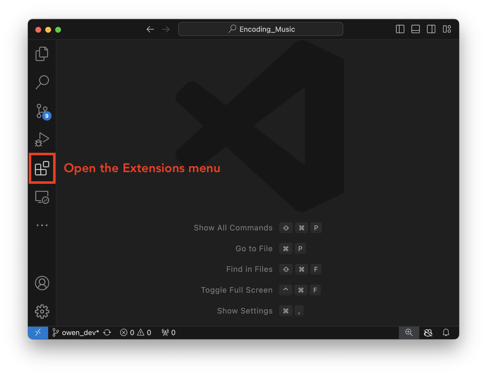
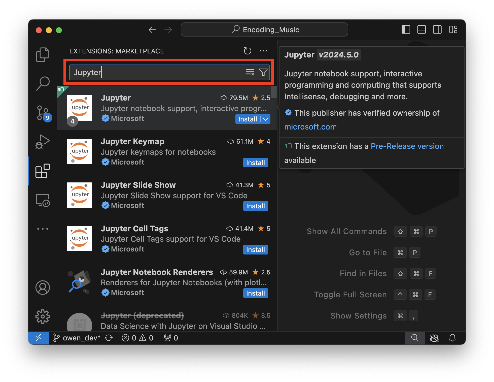
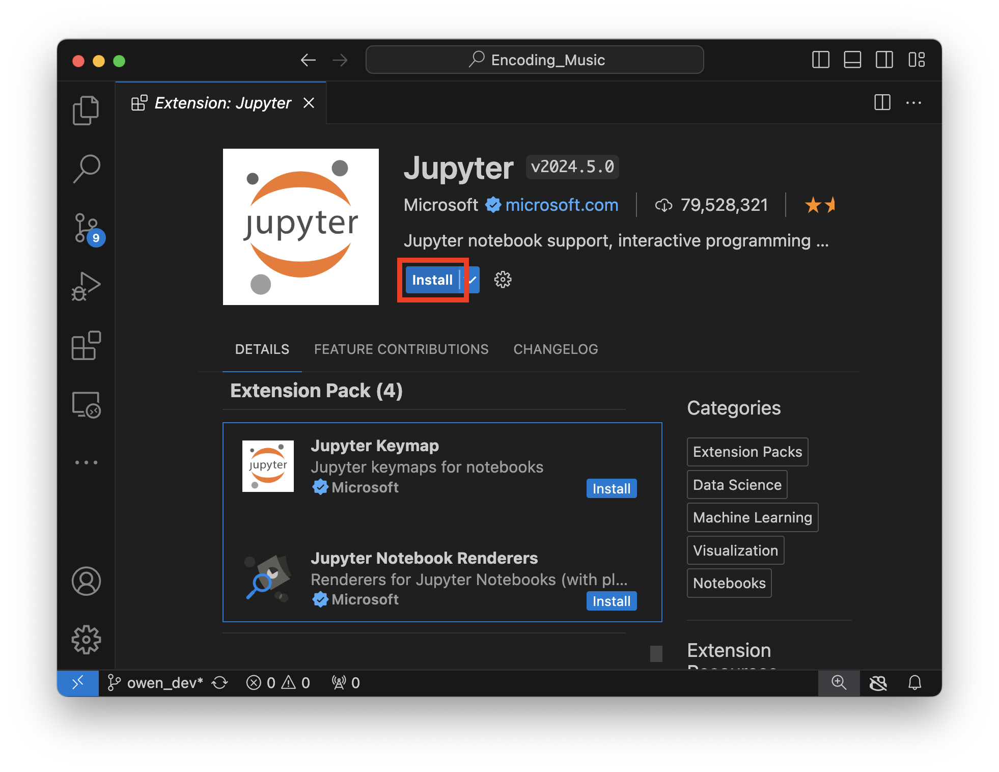
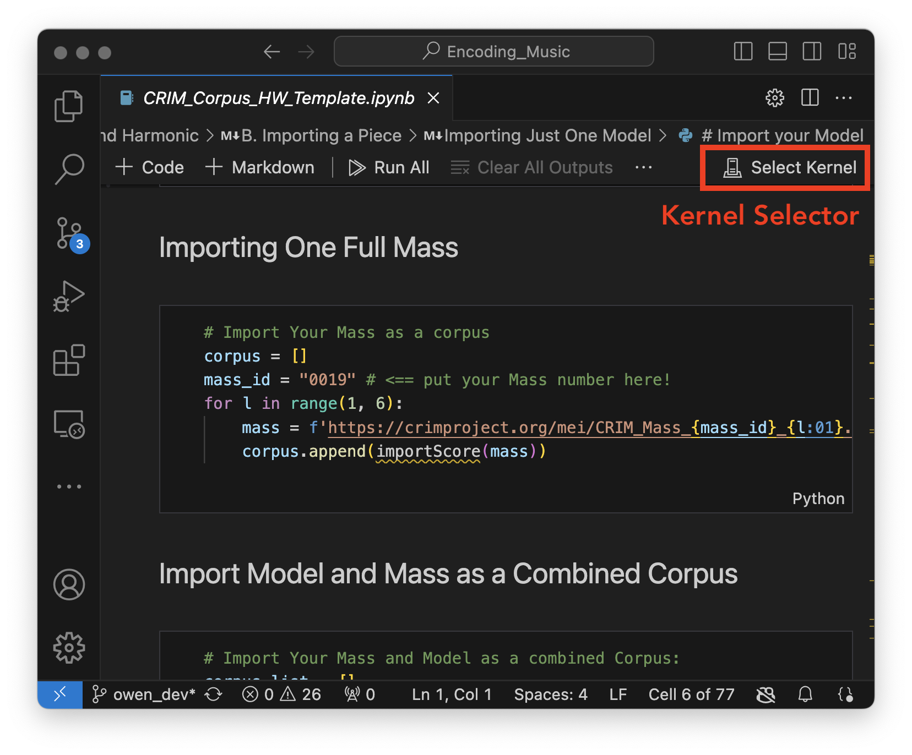
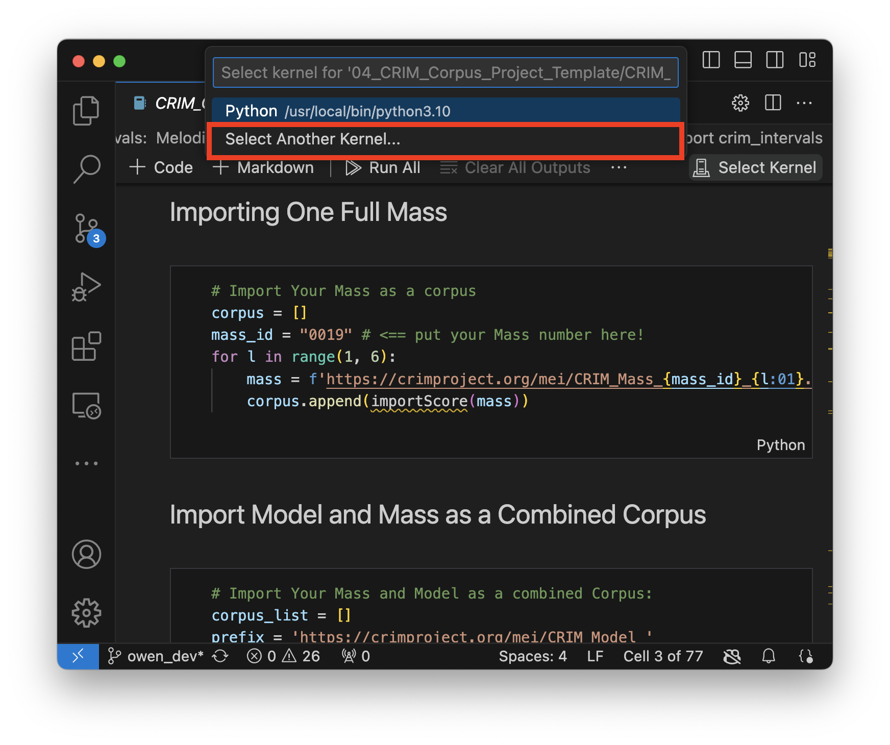
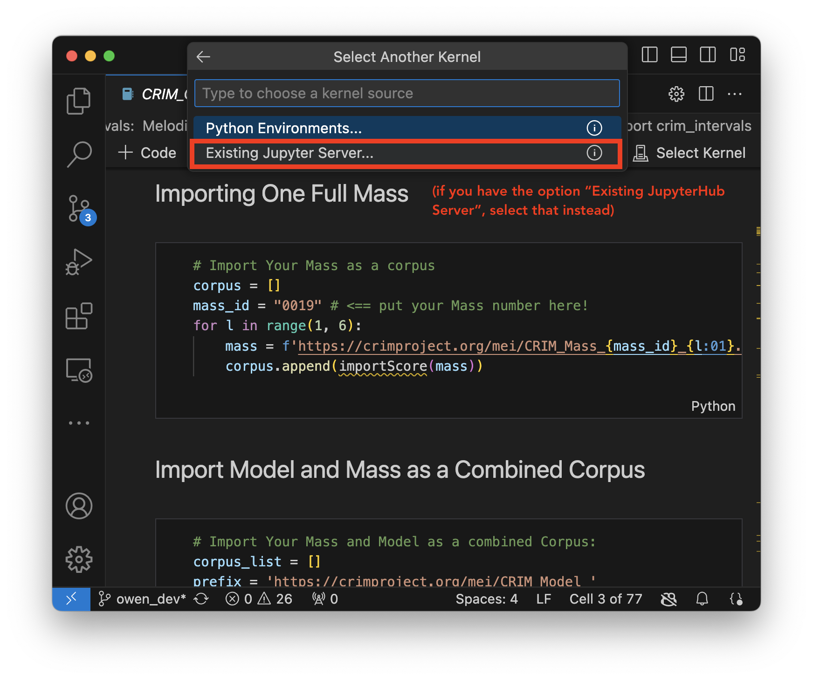
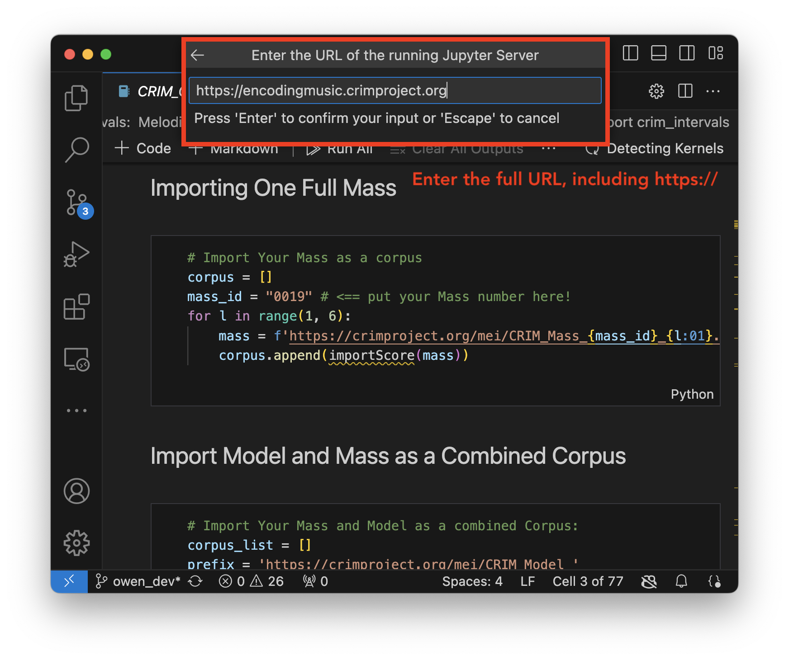
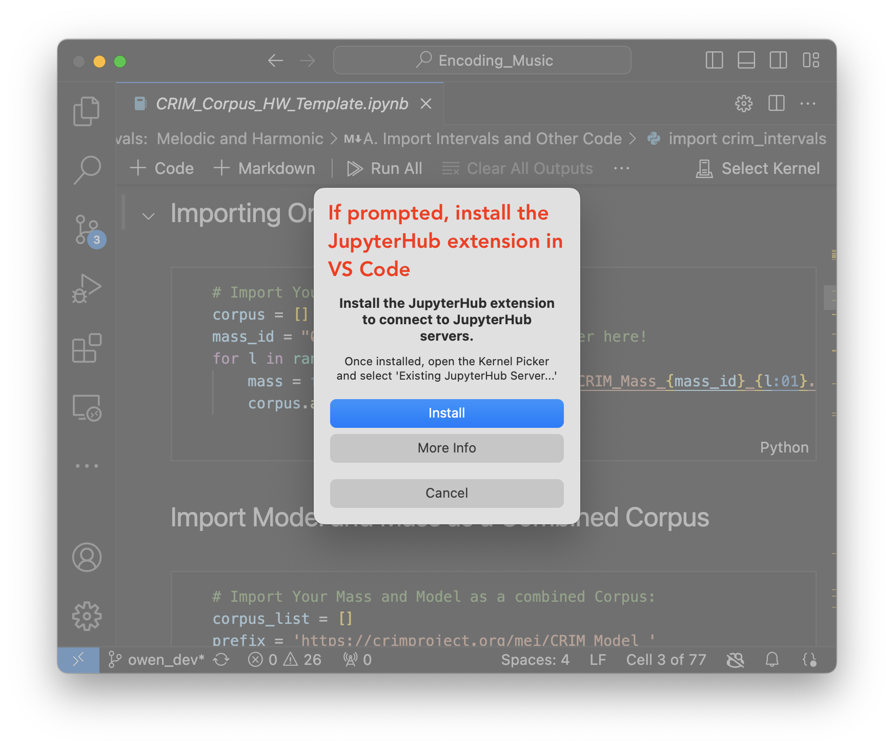

# Connecting Visual Studio Code to the Encoding Music JupyterHub Server

To run code in Jupyter Notebooks in VS Code, you need to have an environment set up with the right version of Python and all the necessary libraries installed. One easy way to do this is connecting directly to the Encoding Music JupyterHub server, which already has a fully set up environment.

## Install Jupyter Extension

If you haven't already, first install the Jupyter Extension in VS Code.

### Open the Extensions Menu

### Search for Jupyter in the Extensions Marketplace

### Install the Jupyter Extension

## Connecting to the Encoding Music JupyterHub Server

First, open up a Jupyter notebook. If you don't already have one, you can create a new `.ipynb` file. Click on the "Select Kernel" button.

Then press "Select Another Kernel"

Press "Existing Jupyter Server"

Enter the **full** URL of the Encoding Music JupyterHub server, `https://encodingmusic.crimproject.org`

You should install the JupyterHub extension if prompted.

When prompted, enter your username and password for the Encoding Music server. You can then select the Encoding Music kernel, called "Python 3 (ipykernel).