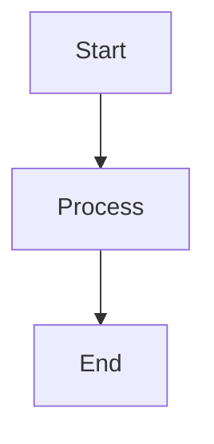
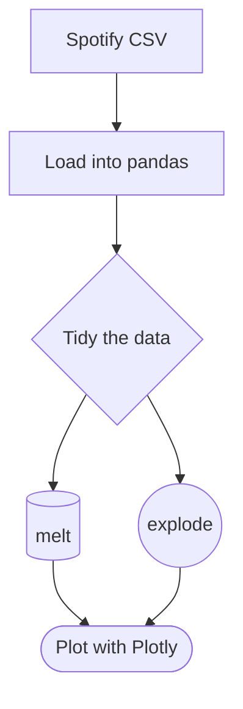
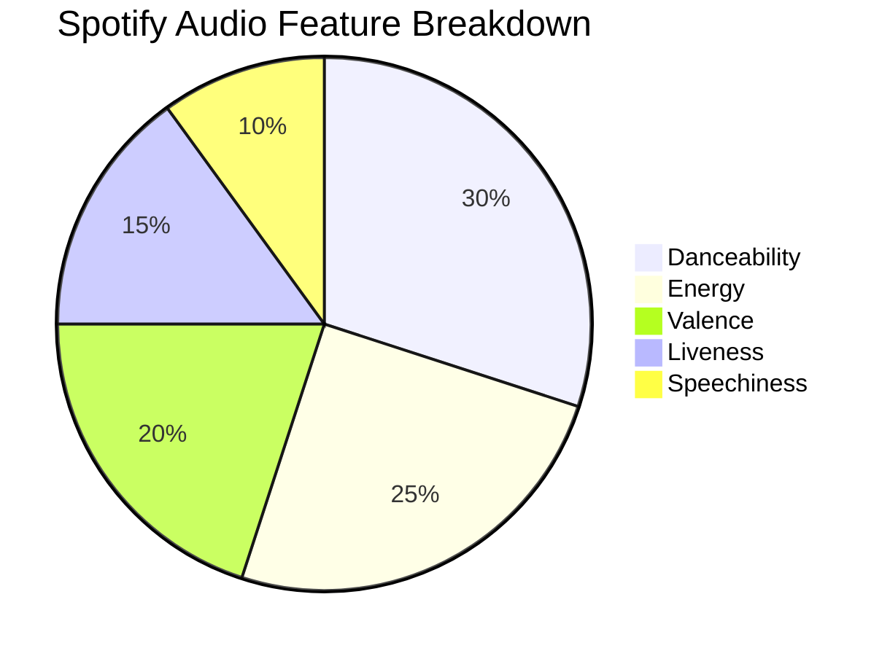

# Introduction to Mermaid Diagrams in Markdown

**[Mermaid Markdown](https://mermaid.js.org/)** allows you to create diagrams and flowcharts in Markdown-style text. It can be a great tool for visually explaining your processes to the reader. Don't think of this as a coding tool to show your data visually like Plotly, rather a tool to explain your methods in your markdown cells. 


## How to Use Mermaid in Markdown

To create a Mermaid diagram, wrap your code block in triple backticks and specify `mermaid` as the language.
 
````

````

You can choose the shape of each box:
- `[text]` = Rectangle
- `{text}` = Diamond
- `([text])` = Oval (stadium-shape)
- `[(text)]` = Cylinder
- `((text))` = Circle
- And many more. See a full list in the **[documentation](https://mermaid.js.org/syntax/flowchart.html)**.


### Common Diagram Types in Mermaid

| Diagram Type       | Mermaid Keyword    | Use Case Example                                 |
|--------------------|--------------------|--------------------------------------------------|
| Flowchart          | `graph TD`         | Visualize  steps                  |
| Pie Chart          | `pie`              | Show distributions                               |
| Sequence Diagram   | `sequenceDiagram`  | Illustrate sequences                             |
| Gantt Chart        | `gantt`            | Plan  timelines or schedules      |
| Class Diagram      | `classDiagram`     | Represent structures or  relationships |


## Example: Simple Data Flow for Music Analysis

````
```mermaid
graph TD   # Flowchart
  A[Spotify CSV] --> B[Load into pandas]
  B --> C{Tidy the data}    # Diamond Shape
  C --> D[(melt)]   # Cylinder
  C --> E((explode))   # Circle shape
  D --> F([Plot with Plotly])  # Oval / Stadium Shape
  E --> F
```
````




## Example: Pie Chart of Audio Feature Importance

````

````


Though you have the ability to make pie charts in mermaid, most of the time you will be working with dataframes and should use the Plotly library to make your actual data-backed visuals.


## Tips for Using Mermaid 

- Once integrated in Jupyter, you should be able to include this markdown code right in your markdown cells.
- Use short, clear node labels to avoid clutter.
- Use `graph TD` for top-to-bottom diagrams, or `graph LR` for left-to-right.
- Use the `pie` chart for simple percentage-based data.
- Test and preview diagrams using the [Mermaid Live Editor](https://mermaid.live).
- Avoid special characters. In our first example, if we wrote melt() instead of melt, it would have thrown an error.
- View the Mermaid Markdown tutorials page [here](https://mermaid.js.org/ecosystem/tutorials.html).
