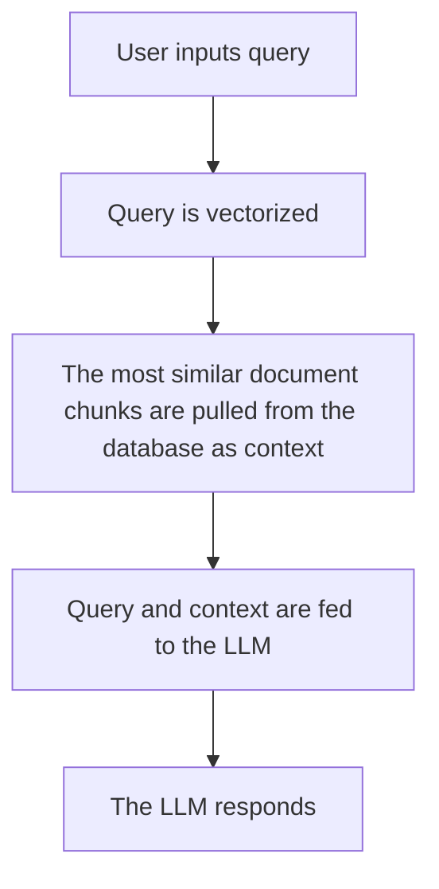

# AI Tutorial: Retrieval-Augmented Generation (RAG)
What is RAG? How do you use it? How do you build a RAG app?

## A Conceptual Introduction to RAG
When using Large Language Models (LLMs), you have probably discovered that they can be quite helpful when working with large amounts of text. At some point, you've probably used an LLM to summarize a large chapter of a textbook, debug your code, or read your email draft. 

A RAG app takes this concept and applies it to a massive amount of data, often unstructured. When your data is neatly structured, like everything you've worked with in Encoding Music labs so far, it's easy enough to make queries with basic code. But, when you have thousands of PDF pages as your data source rather than a neatly structured spreadsheet, you can't do much with just Python and Pandas. That's where an LLM comes in.

But, how do you upload 1000 pages to ChatGPT all at once? After all, when using their API, OpenAI charges you based on how much content you send to it. Well, you don't - that's where R (Retrieval) of R.A.G. comes in. Rather than attempting to give the LLM all of the context at once, a RAG app retrieves the most relevant chunks of documents and feeds them to the LLM with the question, then returns the answer. Here is a visual representation of the most basic process. More steps can be added along the way 



### Vector Databases and Embeddings
How does a RAG know which chunks of documents are most relevant? Well, it stores them in a vector database. 

When adding a document to a vector database, an LLM's embeddings model assigns each document a vector based on it's content and metadata. 

Let's look at an example. Pretend one document is simply "I had cereal for breakfast this morning." Let's generate some digits for our vector, as an LLM would.
* Let's make the first digit "morningness". This seems like it'd be pretty associated with the morning, so we'll give it a value of 9. Our vector is now 9.
* Our second digit can be "milkness". Since cereal is often associated with milk, this will be pretty high too - maybe a 7. Our sentence is now 97.
* Let's add 3 more: foodiness (8), energy (3), and happiness (6). Our one sentence document is now stored as the vector 97836.
* This value would sit close to another source in the database like "I dropped my carton of eggs on the way back from the store" (56972), but would be further away from a source like "I like to run a mile every evening"(11287).

Now, imagine the same process but with 2000-character documents, and 15,000 digit vectors for each chunk. This is how RAG systems store your document chunks, using cosine similarity to determine which documents are close and far from each other. 

## Setting up a RAG app with Langchain

Let's build a RAG for the Haverford College Concert Programs Archive. For this example, we will be using OpenAI's API for the LLM and Embeddings, and ChromaDB as our vector database. We will also be using LangGraph, a framework for building RAG apps with Langchain.

1. Set up your LLM and vector database
2. Load your documents
3. Break your documents into chunks
4. Create embeddings and upload into the vector database
5. Set up your query functions and LangGraph
6. Test your RAG app

### Setting up your LLM and vector database

An API essentially allows you to use a service without having to run it on your own computer. In this case, we will be using OpenAI's API to access their LLM and embeddings model, and ChromaDB as our vector database. There are a few important things to understand about using APIs:
* You need an API key to access certain API's, especially ones that cost money per call. This "key" is a unique identifier that allows you to use the service and is often tied to your account, and sometimes even your credit card.
    * When using an API key, it is really important to avoid storing it anywhere in your code. If you find yourself pasting the key directly into your code, you've done something wrong. Nobody should be able to access your key, even if they look at your code. 
    * The standard approach is storing it as an environmental variable on your computer that your code can access. 
        * To permanently create an environmental variable on windows, you can open the terminal app or powershell and run  ```setx VARIABLE_NAME "value"```. For OpenAI with Langchain, name it ```OPENAI_API_KEY```.
    * If you're unable to do this, you can have your code call for the key each time. Here's some sample code that checks for an environmental variable, and asks for the key if it can't find it. When you run the code, a window will pop up, and you can enter your key.


```python
import getpass
import os

if not os.environ.get("OPENAI_API_KEY"):
  os.environ["OPENAI_API_KEY"] = getpass.getpass("Enter API key for OpenAI: ")
```

It is also important to set up a persistent directory for Chroma to store your vector database locally. This ensures that you don't have to make a new one each time you restart the kernel - rather, you can restore it from the directory.

In this step, you'll choose your chat model and embedding model too. Start small. For embeddings, if you switch to large, you'll have to redo your whole database - you can't mix and match embedding models. Your chat model, however, if an easy switch if you need more performance.

Here's my full setup code for this example:

<details><summary>Code</summary>

```python
# Setting up chat model
import getpass
import os

if not os.environ.get("OPENAI_API_KEY"):
  os.environ["OPENAI_API_KEY"] = getpass.getpass("Enter API key for OpenAI: ")

from langchain.chat_models import init_chat_model

llm = init_chat_model("gpt-4o-mini", model_provider="openai")
```

```python
# Setting up embeddings
import getpass
import os

if not os.environ.get("OPENAI_API_KEY"):
  os.environ["OPENAI_API_KEY"] = getpass.getpass("Enter API key for OpenAI: ")

from langchain_openai import OpenAIEmbeddings

embeddings = OpenAIEmbeddings(model="text-embedding-3-small")
```

```python
# Setting up chroma
from langchain_chroma import Chroma

vector_store = Chroma(
    collection_name="example_collection",
    embedding_function=embeddings,
    persist_directory="./chroma_langchain_db",  # Where to save data locally
)
```
</details>

### Loading Files

For most cases, the metadata will all be within the PDF's already. In this case, we added some external metadata like "ensemble type" from a CSV. So, we'll import the PDFs and CSV, then merge them.

Here's the full code:

<details><summary>Loading the CSV</summary>

```python
# Setting up csv loading

from langchain_community.document_loaders.csv_loader import CSVLoader

def loadCSV(filepath: str) -> list:
    loader = CSVLoader(file_path=filepath, source_column="Filename",
    metadata_columns=["Category","Year","Term"])
    data = loader.load()
    return data
```
```python
# Load CSV

csv_metadata = loadCSV(r"filepath") # r converts the string to a "raw string", 
# so that it doesn't read slashes in filepaths as escape characters.
print(csv_metadata[0].metadata['source'])
print(csv_metadata[1].metadata['Category']) # Always good to test as you go
```
</details>
<br>
<details><summary>Loading PDFs</summary>

```python
from pathlib import Path
from langchain.document_loaders import PDFPlumberLoader

async def loadPDF(filepath: str) -> list:
    loader = PDFPlumberLoader(filepath) # There are many options for the loader here
    pages = []
    async for page in loader.alazy_load():
        pages.append(page)   
    return pages


def get_files_from_directory(directory_path: str) -> list[str]:
    directory = Path(directory_path)
    file_paths = [str(file) for file in directory.iterdir() if file.is_file()]
    return file_paths


directory_path:str = r"C:\Users\charl\Documents\VSCode\HC All Programs\Files\PDFs"
files: list[str] = get_files_from_directory(directory_path)


# Load PDFs w/out metadata
loaded_PDFs: list = []
for file in files:
    pages = await loadPDF(file)
    loaded_PDFs.append(pages)


# Check PDF content to see if all loaded correctly
for i in range(3):
    document = loaded_PDFs[i]
    print(f"Document {i} \n")
    document_content: str = ""
    for document_page in document:
        document_content += document_page.page_content
    print(document_content + "\n \n")
```

</details>
<br>
<details><summary>Merging Metadata</summary>

Now, since we're merging metadata, we should check what is already in the PDF. 

```python
# Check PDF metadata
for i in range(3):
    document = loaded_PDFs[i]
    print(f"Document {i} \n")
    document_metadata: list = []
    for document_page in document:
        document_metadata += document_page.metadata.items()
    print(document_metadata)
```

So, some of this info is useful and some isn't.

We should keep:
* Source (but clean it so it's just the filename)
* Filepath
* Page
* Total pages
* Title
* CreationDate

We should remove:
* Author (not relevant)
* Subject (blank)
* Producer (not relevant)
* Creator (not relevant)
* ModDate (not relevant)
* Keywords (empty)

Essentially, we want to preserve the fields that will help the embeddings model place these documents in the vector database, but remove extra fields that will confuse the model.

```python
# Cleaning the sources to match with the CSV source names
for source in loaded_PDFs:
    for page in source:
        page.metadata['source'] = page.metadata['source'].replace("C:\\Users\\charl\Documents\\VSCode\\HC All Programs\\Files\PDFs\\","")
        print(page.metadata['source'])
```
```python
# Checking lengths
print(len(csv_metadata))
print(len(loaded_PDFs))

# Sorting both the CSV and PDF metadata to match
csv_metadata.sort(key=lambda x: x.metadata['source'])
loaded_PDFs.sort(key=lambda x: x[0].metadata['source'])
```
```python
# Use assert to ensure the sources match
for i in range(len(csv_metadata)):
    assert csv_metadata[i].metadata['source'] == loaded_PDFs[i][0].metadata['source'], f"Mismatch at index {i}: {csv_metadata[i].metadata['source']} != {loaded_PDFs[i][0].metadata['source']}"
```
```python
# Merging metadata and removing extra fields
irrelevant_metadata = ['Author', 'Subject', 'Producer', 'ModDate', 'Keywords', 'Creator', 'Title']

for i in range(len(loaded_PDFs)):
    document = loaded_PDFs[i]
    for page in document:
        for key in irrelevant_metadata:
            if key in page.metadata:
                del page.metadata[key]
        # Add the category and year from the CSV metadata
        assert page.metadata['source'] == csv_metadata[i].metadata['source'], "Source mismatch between PDF and CSV metadata"
        page.metadata['Ensemble_Type'] = csv_metadata[i].metadata['Category']
        page.metadata['Year'] = csv_metadata[i].metadata['Year']
        page.metadata['Term'] = csv_metadata[i].metadata['Term']
        print(page.metadata)
```
</details>
<br>
<details><summary>Tidy the PDFs into one object per source</summary>
Right now, each PDF is a nested list of pages. We want a list of overall PDFs so we can easily break them into chunks instead of splitting only each page. 

```python
# Convert each sublist into a single document
from langchain.schema import Document
def convert_list_to_document(pages: list) -> Document:
    document_content: str = ""
    for page in pages:
        document_content += page.page_content
    document: Document = Document(
        page_content=document_content,
        metadata=pages[0].metadata  # Use the metadata from the first page
    )
    return document

# Convert loaded PDFs to documents
docs = []
for source in loaded_PDFs:
    doc = convert_list_to_document(source)
    docs.append(doc)  # Append the single Document object
```

Be sure to double check the page content and metadata was done correctly before chunking or uploading.
</details>

### Chunking Documents
There are a lot of libraries that do this, but the basic LangChain library works well for most purposes. For character-based chunking, you determine the max number of characters for each chunk, plus an overlap. Having overlap is important to preserve context. Here's how the splitter works:
* First, it looks for paragraph gaps around the limit.
* If it can't find a good paragraph break, it look for a gap between sentences.
* If that fails, it goes to words, then characters as a last resort. 

<details><summary>Code</summary>

```python
from langchain_text_splitters import RecursiveCharacterTextSplitter

text_splitter = RecursiveCharacterTextSplitter(
    chunk_size=1000,  # chunk size (characters)
    chunk_overlap=200,  # chunk overlap (characters)
    add_start_index=True,  # track index in original document
)
all_splits = text_splitter.split_documents(docs)

print(f"Split {len(docs)} PDFs into {len(all_splits)} sub-documents.")
```
</details>

### Embedding and loading documents into the vector database
**This API call costs money!! Before doing this, double check everything!**
* Also, **DO NOT run this again** after the first time. It will charge you again and cause duplicates. If your kernel restarts and you lose variables, we'll create code to run to reestablish without charging you later on. 

```python
document_ids = vector_store.add_documents(documents=all_splits) 
print(document_ids[:3])
```

### Setting up the RAG System
```python
from langchain_core.documents import Document
from typing_extensions import List, TypedDict
from langchain_core.prompts import ChatPromptTemplate
```

As a RAG app runs through steps, it stores each steps data in a State class. If you have never worked with classes before, you're essentially setting up a custom datatype with set parameters. Think of this one like a custom dictionary that you're filling in and passing along to each function.

```python
class State(TypedDict):
    question: str
    context: List[Document]
    answer: str
```

#### Retrieval: Similarity search
Now that you've established a vector database, you can similarity search. These calls are free. Essentially, you can input a question or phrase, and it'll pull the specified number of the most similar document chunks. For this example, we could do something like
```python
vector_store.similarity_search("Who was the principle trumpet player in the Haverford-Bryn Mawr Orchestra in 2019?", 
k=4, filter={"Ensemble_Type": "Orchestra"})
```
Since the k value is 4, it'll pull the four most similar document chunks. We can also add filters here based on metadata. We will use similarity search for the Retrieval part of Retrieval Augmented Generation. A full retrieval function looks something like this:

```python
def retrieve(state: State):
    retrieved_docs = vector_store.similarity_search(state["question"], k = 10)
    return {"context": retrieved_docs}
```

With a lot of data, 10 is a good starting k value. If you're not working with much data, try a lower number like 5. You want to balance cost and performance here, as each token (4 characters) fed to the model is a fraction of a cent. Most models charge a few dollars per 1 million tokens. 

#### Generation

First, you define your prompt. You must include a "system" message. This is where you give your instructions to the LLM. The most basic system message is in this example. You can also define what the "human" is sending it, like what you'd type into ChatGPT on the website. This is usually the context and the question. 

```python
prompt = ChatPromptTemplate.from_messages([
    ("system", "You are a helpful assistant. Use only the information provided in the context below to answer the question. If the answer is not in the context, say 'I don't know' or 'The information is not available.'"),
    ("human", "Context:\n{context}\n\nQuestion: {question}")
])
```
Next, we need to set up our generate function. Again, it takes the State class as its only input. This version of the function is as simple as it gets: 
* Merges all of the document chunks as the context with 2 line breaks between each chunk.
* Calls the prompt object we established earlier with ```prompt.invoke``` and gives it the question and context.
* Calls the LLM with ```llm.invoke```, feeding it the "message" we just created.
* Returns its response.

This can be customized to add the title or other metadata before each chunk for the LLM, but it depends on your needs.

```python
def generate(state: State):
    docs_content = "\n\n".join([doc.page_content for doc in state["context"]])
    message = prompt.invoke({"question": state["question"], "context": docs_content})
    response = llm.invoke(message)
    return {"answer": response.content}
```

#### Linking it all together with LangGraph
LangGraph does a lot of the heavy lifting once you have written your functions. It is able to execute them in the correct order and store the State as it goes. You only have to set up your sequence (with each function) and add an edge for your first function. 

```python
from langgraph.graph import START, StateGraph

graph_builder = StateGraph(State).add_sequence([retrieve, generate])
graph_builder.add_edge(START, "retrieve")
graph = graph_builder.compile()
```

### Creating a single cell to reestablish your RAG
When your kernel dies or you lose variables, it is important to reestablish without spending. Here's everything we need to reestablish:
* Our Chroma Database (from persist directory)
* Our Chat Models and API Key
* Our LangGraph and sub-functions

Here is what the full cell would look like for this example:

<details><summary>Run this cell to reestablish our RAG</summary>

```python
# Setting up chat model
import getpass
import os

if not os.environ.get("OPENAI_API_KEY"):
  os.environ["OPENAI_API_KEY"] = getpass.getpass("Enter API key for OpenAI: ")

from langchain.chat_models import init_chat_model

llm = init_chat_model("gpt-4o-mini", model_provider="openai")

# Setting up embeddings
import getpass
import os

if not os.environ.get("OPENAI_API_KEY"):
  os.environ["OPENAI_API_KEY"] = getpass.getpass("Enter API key for OpenAI: ")

from langchain_openai import OpenAIEmbeddings

embeddings = OpenAIEmbeddings(model="text-embedding-3-large")

# Reestablishing up our persist directory for Chroma
from langchain_chroma import Chroma

vector_store = Chroma(
    collection_name="example_collection",
    embedding_function=embeddings,
    persist_directory="./chroma_langchain_db",  # Where we stored our data before
)

# Reestablishing retrieval and generation functions
from langchain_core.documents import Document
from typing_extensions import List, TypedDict

from langchain_core.prompts import ChatPromptTemplate

prompt = ChatPromptTemplate.from_messages([
    ("system", "You are a helpful assistant. Use only the information provided in the context below to answer the question. If the answer is not in the context, say 'I don't know' or 'The information is not available.'"),
    ("human", "Context:\n{context}\n\nQuestion: {question}")
])

class State(TypedDict):
    question: str
    context: List[Document]
    answer: str

def retrieve(state: State):
    retrieved_docs = vector_store.similarity_search(state["question"], k = 10)
    return {"context": retrieved_docs}

def generate(state: State):
    docs_content = "\n\n".join([doc.page_content for doc in state["context"]])
    message = prompt.invoke({"question": state["question"], "context": docs_content})
    response = llm.invoke(message)
    return {"answer": response.content}

# Reestablishing langgraph
from langgraph.graph import START, StateGraph

graph_builder = StateGraph(State).add_sequence([retrieve, generate])
graph_builder.add_edge(START, "retrieve")
graph = graph_builder.compile()
```
</details>

### Testing Queries
Use ```graph.invoke({"question" : "this is my question"})``` to make a call.

You'll always want to print your answer, and sometimes the context too if you want to check your model. You can also customize your context, like printing the document titles only to see what the generate step pulled.

```py
# Print full context
result = graph.invoke({"question": "Who has conducted the Chamber Singers over the years?"})

print(f'Answer: {result["answer"]}')
print(f'Context: {result["context"]}\n\n')
```
```
Answer: The Chamber Singers have been conducted by Thomas Lloyd, Ng Tian Hui, and Nathan Zullinger.
Context: [Document(id='13720808-826c-45c8-b6...
```

```py
# Print doc titles

result = graph.invoke({"question": "Who are some trumpet players in the haverford-bryn mawr orchestra?"})

print(f'Answer: {result["answer"]}')
print("\nSources:")
for source in result["context"]:
    print(f'Source: {source.metadata["source"]}')
```
```
Answer: Some trumpet players in the Haverford-Bryn Mawr Orchestra include:

- Christian Fagre HC ’16
- Brian Rascon
- Sam Istvan HC ’21
- Andrew Cornell HC ’20
- Gary Gordon COMM

Sources:
Source: 19. Chorale Program Spring 2013.pdf
Source: 9. Chorale Program Fall 2011.pdf
Source: 6. Chorale Program Fall 2012.pdf
Source: HC Family Weekend 08 program.pdf
Source: 8. Chorale Program Fall 2019.pdf
Source: 7. Orchestra Program Fall 2018.pdf
Source: 2. Family Weekend Choral Program-2013.pdf
Source: 10. Chorale Program Fall 2010.pdf
Source: 8. Chorale Program Fall 2018.pdf
Source: HC Family Weekend 08 program.pdf
```

## Running into issues? RAG Improvements
* Adding metadata filters!! (Easy, and huge improvements; example below)
* Increasing your k value (Easy)
* Upgrading your chat model (Easy)
* Increasing chunk size or overlap or upgrading embedding model (requires redoing vector database) (Easy)
* Adding self-check steps (choose one or two from [here](https://langchain-ai.github.io/langgraph/tutorials/rag/langgraph_self_rag/)) (Medium difficulty)
* Adding content-aware filters (Difficult)
* For big-picture questions: Implementing RAPTOR (Recursive Abstractive Processing for Tree Organized Retrieval) (Difficult)

### Example: Metadata filters on concert programs

<details><summary>Code Setup</summary>

```py
from langchain_core.documents import Document
from typing_extensions import List, TypedDict, Optional
from langchain_core.prompts import ChatPromptTemplate

prompt = ChatPromptTemplate.from_messages([
    ("system", "You are a helpful assistant. Use only the information provided in the context below to answer the question. If the answer is not in the context, say 'I don't know' or 'The information is not available.'"),
    ("human", "Context:\n{context}\n\nQuestion: {question}")
])

class State(TypedDict):
    question: str
    filter: Optional[dict]
    context: List[Document]
    answer: str

# New step
def apply_filter(state: State):
    """
    Apply a filter to the state based on the user's input.
    Removes keys with None values. Sets filter to None if empty.
    """
    filter_dict = state.get("filter")
    if filter_dict:
        cleaned_filter = {}
        for k, v in filter_dict.items():
            if v is not None:
                cleaned_filter[k] = v
        state["filter"] = cleaned_filter or None
    else:
        state["filter"] = None
    return state

def retrieve(state: State):
    filter_dict = state["filter"] if state.get("filter") else None
    retrieved_docs = vector_store.similarity_search(state["question"], k=10, filter=filter_dict)
    return {"context": retrieved_docs}

def generate(state: State):
    docs_content = "\n\n".join([doc.page_content for doc in state["context"]])
    message = prompt.invoke({"question": state["question"], "context": docs_content})
    response = llm.invoke(message)
    return {"answer": response.content}

# LangGraph
from langgraph.graph import START, StateGraph

graph_builder = StateGraph(State).add_sequence([apply_filter, retrieve, generate])
graph_builder.add_edge(START, "retrieve")
graph = graph_builder.compile()

```
</details>
<br>
<details><summary>Calling with graph.invoke</summary>
<br>


```py
result = graph.invoke({
    "question": "Who played trumpet for the orchestra in the year 2019?", "filter": {"Ensemble_Type": "Orchestra"}})

print(f'Answer: {result["answer"]}')
print("\n\nSources:")
for i, source in enumerate(result["context"]):
    print(f'Source {i+1}: {source.metadata["source"]}')
```
```
Answer: I don't know.


Sources:
Source 1: 21. Orchestra Program-Spring 2012.pdf
Source 2: 17. Orchestra Program Spring 2013.pdf
Source 3: 9. Orchestra Program Fall 2010.pdf
Source 4: 19. Orchestra Program Spring 2016.pdf
Source 5: Fall 11-19-21 Orchestra Program Fall 2021.pdf
Source 6: 7. Orchestra Program Fall 2011.pdf
Source 7: 4. Orchestra Program Fall 2012.pdf
Source 8: 5. Orchestra Program Fall 2014.pdf
Source 9: 8. Orchestra Program Fall 2016.pdf
Source 10: 27. Orchestra Program-Spring 2011.pdf
```

Here, one filter isn't enough, so we call two with ```$and```.

```py
result = graph.invoke({
    "question": "Who played trumpet for the haverford-bryn mawr orchestra in 2019?",
    "filter": {"$and": [{"Ensemble_Type": "Orchestra"}, {"Year": "2019"}]}
})

print(f'Answer: {result["answer"]}')
print("\n\nSources:")
for i, source in enumerate(result["context"]):
    print(f'Source {i+1}: {source.metadata["source"]}')
```
```
Answer: The principal trumpet for the Haverford-Bryn Mawr College Orchestra in 2019 was Sam Istvan, HC ’21. Additionally, Jackie Toben, BMC ’22, served as co-associate principal trumpet.


Sources:
Source 1: 7. Orchestra Program Fall 2019.pdf
Source 2: 7. Orchestra Program Fall 2019.pdf
Source 3: 18. Orchestra Program Spring 2019.pdf
Source 4: 7. Orchestra Program Fall 2019.pdf
Source 5: 18. Orchestra Program Spring 2019.pdf
Source 6: 18. Orchestra Program Spring 2019.pdf
Source 7: 7. Orchestra Program Fall 2019.pdf
Source 8: 7. Orchestra Program Fall 2019.pdf
Source 9: 18. Orchestra Program Spring 2019.pdf
Source 10: 18. Orchestra Program Spring 2019.pdf
```
