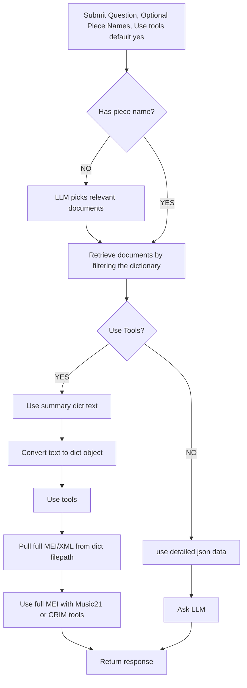

# Tool Calling with LangChain

LLM's are great at a lot of things, but sometime, there are steps along the way that they need a little help with. 

A basic example: LLM's suck at doing math. So, what's the solution? Rather than forcing an LLM to do shaky math mid-solution, we can give them some code to run on your computer / server instead! See the code below of an example tool:

```py
from langchain_core.tools import tool

@tool
def multiply(a: int, b: int) -> int:
    """Multiply integers a and b.
    a: First integer to be multipled.
    b: second integer to be multiplied
    returns: the product of a and b"""
    return a * b

tools = [add]
```

As you can see, there are a few specific practices we need to adhere to:
* `@tool`: It is super important to include this decorator above your function, or LangChain will be unable to recognize this as a tool.
* **Specifying Types:** It is important to define the input and output types for each tool. Here, we declare a and b as integers with `a: int` and `b: int`, and we declare the return type as an integer with `-> int`.
* **Describing your function:** Believe it or not, the LLM will actually read your docstring descriptions to decide whether to use the tool or not. Thus, it's important to be accurate and descriptive. Here, I described the function's purpose, both parameter, and what it returns.
* **Including the tool in the tools list:** Later, we will give this list to the LLM. If we forget any tools, the LLM won't have access to them.

## Setting up an LLM with tools in Python

<details><summary>Imports cell</summary>

```python
# Standard library imports
import ast
import getpass
import io
import json
import os
import re
from collections import Counter
from pathlib import Path
import xml.etree.ElementTree as ET

# Third-party imports
import pandas as pd
from music21 import converter, metadata, note

from typing import List, Optional, Union
from typing_extensions import TypedDict

from langchain.agents import initialize_agent, AgentType
from langchain.chat_models import init_chat_model
from langchain_core.documents import Document
from langchain_core.prompts import ChatPromptTemplate
from langchain.tools import tool

from langchain_community.document_loaders import TextLoader
from langchain_experimental.tools.python.tool import PythonREPLTool

from langgraph.graph import START, StateGraph
```
</details>

</br>

Before we can implement tools, we have to set up an LLM within our code environment. 

First step: Set up the API key. See the API keys tutorial if you haven't worked with API keys before. **Never put your API key anywhere in your code!!** If it's not stored as an environmental variable, a window will pop up for you enter it once.
```py
if not os.environ.get("OPENAI_API_KEY"):
  os.environ["OPENAI_API_KEY"] = getpass.getpass("Enter API key for OpenAI: ")
```

Next, we can choose our chat model. There many options here, but I'd generally stick to either the standard gpt-4o (or gpt-5o) or its mini version, depending on the intensity of the task. For almost all applications, the mini models are just as effective and 10x cheaper, so start small, and upgrade if it's causing problems.

```py
llm = init_chat_model("gpt-4o", model_provider="openai")
llm_mini = init_chat_model("gpt-4o-mini", model_provider="openai")
```

Next, we can initialize the *agent*, which connects the LLM's intentions to the actual python code in your server. *Note: turn on verbose=true when testing or debugging to get detailed output.*

```py
agent = initialize_agent(
    tools=tools,             # your local tool functions like count_notes
    llm=llm,                 # your ChatOpenAI or init_chat_model(...)
    agent=AgentType.OPENAI_FUNCTIONS,
    verbose=False,
)
```

Next, we can configure our chat model using LangChain's ChatPromptTemplate. We do this by estabishing a few things (feel free to copy-paste the code below and change the system message to fit your project):
* **System prompt:** This tells the llm what its job is. This is the most powerful change you can make in your workflow. If your app is working but the llm is struggling to give you accurate results, the issue will be your system prompt 99% of the time. See the system prompt below as an example.
* **Question / Context Template:** You can copy and paste this as is. It's just setting up formatting for later.

Sometimes, LLM-apps require an LLM to perform mutiple jobs (in different steps). If that's the case, you can simply make a second ChatPromptTemplate with a different system prompt.

<details><summary>Configuring the Model</summary>

```py
# Main template for the chat prompt
template = ChatPromptTemplate([
    ("system", """You are an expert on music analysis. 
You are analyzing two-part scores using tools. 
You are going to be given various scores as `context`. When a tool calls for `full_context`,
input all of the text from the human question and context.
Only use the information provided in `data`. If you have uncertainty, express it. If you use a tool and it gives you an exception or error, include the exception or error in your response."""),
    
    ("human", "Question: {question}\n\nContext:\n{context}")
])

# Secondary template for choosing relevant score names
secondary_template = ChatPromptTemplate([
    ("system", "Your job is to choose the relevant score names from the provided context based on the question. The score names are the keys in the full context dictionary. For example, 'Bach_BWV_0772' is a score name. You are to return each relevant score name with a comma between each name and no spaces. If you see no relevant score names, return an empty string."),
    ("human", "Question: {question}\n\nContext:\n{context}\n\nPlease return the relevant score names as a comma-separated list without spaces.")
])
```

</details>

Since most apps have multiple steps, it's helpful to store each step's data in a State class. If you have never worked with classes before, you're essentially setting up a custom datatype with set parameters. Think of this one like a custom dictionary that you're filling in and passing along to each function. Even if you only have one step in your app, it's still nice to set this up for organizational purposes. Any data you plan to use, you add as another row (including optional ones)

```py
class State(TypedDict):
    question: str
    context: dict
    answer: str
    score_name: Optional[list[str]] 
    use_tools: Optional[bool] 
```

### Setting up Steps
The steps for an LLM app generally look something like this:</br>
Query (User's Question) -> Retrieve (get our data) -> Generate (Ask the LLM) -> Return

We can chain these steps together with our State object using the library LangGraph. LangGraph is great for the basics, like this, but also can handle apps with much more complexity. See an example of a complex music analysis app below.

<details><summary>Music Analysis App Summer 2025</summary>



</details>
</br>

See an example of code for each step in a basic LLM app below.

<details><summary>Retrieve</summary>

If the user manually inputs a file or text as the context, this is pretty simple - you just return it. But if you have a list of files stored in a database, usually you want an LLM to choose which sources to use as context. See an example of a retrieve step, when the user inputs the names of pieces to use in a database.

```py
def retrieve(state: State):
    print(f"Scores chosen: {state['score_name']}")
    data_source = all_scores # Defined previously as our database
    selected_scores = state["score_name"]  # User inputted data sources

    if selected_scores:  # If the user inputs score names, use them
        pieces = ((name, data_source[name]) for name in selected_scores if name in data_source) # Zip together the names of the sources and the contents
    else:
        pieces = data_source.items() # If no pieces were specified, use em all!

    context = "\n".join(f"Piece: {name}\n{data}" for name, data in pieces) # Format them nicely
    state["context"] = context # Update the state object for the next step
    return {"context": context} # Standard return format for LangGraph
```

</details>

<details><summary>Generate</summary>

Here we use that prompt template we set up earlier (the system prompt), and add in our context and question. Then, we send it along, and return its answer.

```py
def ask_llm(state: State):
    prompt = template.invoke(
        {"question": state["question"], "context": state["context"]}
    )  # Add our question and context to the prompt template we set up earlier

    # OpenAIFunctions agent usually returns {"output": "..."}
    response = agent.invoke({"input": prompt})
    answer_text = (
        response["output"] if isinstance(response, dict) else response
    ) # If it's in that format, we want to only return that response. Else, we can return the entire output to debug.

    # Return a partial‑state update
    return {"answer": answer_text}
```

</details>

At this point, we have a working structure and can combine the steps in LangGraph. 

<details><summary>Code</summary>

```py
graph_builder = StateGraph(State).add_sequence([llm_filter, retrieve, ask_llm])
graph_builder.add_edge(START, "llm_filter")
graph = graph_builder.compile()

def run_graph(question: str, score_names: Optional[Union[str, list[str]]] = None, use_tools: Optional[bool] = True):
    if isinstance(score_names, str):
        score_names = [score_names]

    return graph.invoke({
        "question": question,
        "score_name": score_names,
        "use_tools": use_tools,
        "context": {},
        "answer": ""
    })
```

</details>

And, here's how you call the LLM after setting up your `run_graph` function.

```py
result_state = run_graph(
    "Return tabular data on the following piece of music. That is, return a table of how many of each notes there is throughout the piece.",
    "Bach_BWV_0772",
    use_tools=True,
)

print(result_state["answer"]) 
```
