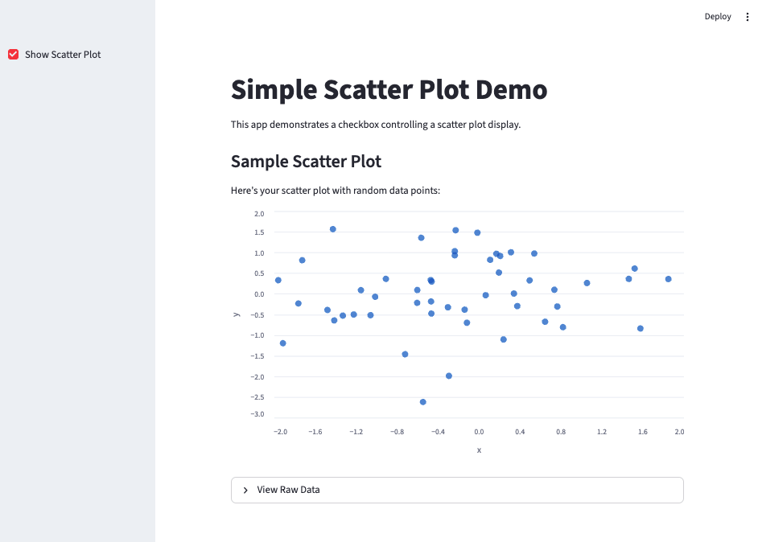

# Streamlit Tutorial

This tutorial introduces [Streamlit](https://streamlit.io/), a Python library for building interactive web applications for data science and machine learning projects. Streamlit allows you to create web apps with minimal code, making it easy to share your work with others.	

4. Learn more via the Streamlit [API reference](https://docs.streamlit.io/library/api-reference).	

## Key Steps

- A. Local Installation of Anaconda Navigator
- B. Creating a New Environment with Streamlit
- C. Writing a Simple Streamlit App
- D. Running the Streamlit App Locally
- E. Deploying the Streamlit App Online with Streamlit Cloud via GitHub


## A. Local Installation of Anaconda Navigator

1. Download and install Anaconda Navigator from the [official website](https://www.anaconda.com/products/distribution).
2. Follow the installation instructions for your operating system (Windows, macOS, or Linux).
3. Open Anaconda Navigator after installation.

## B. Creating a New Environment with Streamlit

1. In Anaconda Navigator, go to the "Environments" tab.
2. Click on "Create" to create a new environment.


3. Name your environment (e.g., "streamlit_env") and select Python version 3.8 or higher.
4. After creating the environment, select it and click on "Open Terminal".


5. In the terminal, install Streamlit by running:
   ```python
   pip install streamlit
   ```


6. Depending on your project needs, you may also want to install additional libraries such as pandas, numpy, or matplotlib:
   ```python
   pip install pandas numpy matplotlib
   ```


## C. Writing a Simple Streamlit App

1. Open a text editor or IDE (e.g., VSCode, PyCharm, or Jupyter Notebook).
2. Create a new Python file (e.g., `my_app.py`).
3. Write a simple Streamlit app using the following code:
   ```python
   import streamlit as st
   import pandas as pd
   import numpy as np
   # Set up the page
	st.title("Simple Scatter Plot Demo")
	st.write("This app demonstrates a checkbox controlling a scatter plot display.")

	# Create a checkbox in the sidebar
	show_plot = st.sidebar.checkbox("Show Scatter Plot")

	# Generate some simple sample data
	np.random.seed(42)  # For reproducible results
	n_points = 50
	data = pd.DataFrame({
		'x': np.random.randn(n_points),
		'y': np.random.randn(n_points)
	})

	# Conditionally show the scatter plot based on checkbox state
	if show_plot:
		st.subheader("Sample Scatter Plot")
		st.write("Here's your scatter plot with random data points:")
		
		# Display the scatter plot
		st.scatter_chart(
			data,
			x='x',
			y='y',
			width="stretch",
			height=400
		)
		
		# Optional: Show the data table as well
		with st.expander("View Raw Data"):
			st.dataframe(data)
	else:
		st.write("👈 Check the box in the sidebar to display the scatter plot!")
		```

## D. Running the Streamlit App Locally

1. With your environment activated (via the Anaconada Navigator "Environments" page, or from VS Code), open a New Terminal
2. At the prompt, type `streamlit run my_app.py` (or whatever you have called your application)
3. Your default web browser should open automatically to `http://localhost:8501`, displaying your Streamlit app.
4. If the browser does not open automatically, you can manually navigate to `http://localhost:8501` to view your app.
5. To stop the app, return to the terminal and press `Ctrl + C`.
6. You can modify your `app.py` file, and Streamlit will automatically update the app in the browser (be sure to click "Rerun" at the top right of the app in the browser if necessary).





## E. Deploying the Streamlit App Online with Streamlit Cloud via GitHub
1. Create a GitHub repository for your Streamlit app.
2. Push your `my_app.py` file and any other necessary files (e.g., `requirements.txt` if you have additional dependencies) to the repository.
3. Go to [Streamlit Cloud](https://streamlit.io/cloud) and sign in with your GitHub account.
4. Click on "New app" and select the repository and branch where your app is located.
5. Specify the main file path (e.g., `my_app.py`).
6. Click "Deploy" to launch your app online.
7. Once deployed, you will receive a unique URL that you can share with others to access your Streamlit app.
8. Alternatively you can also deploy directlyt from your local machine via the Deploy button in the Streamlit toolbar at the top right of your app in the browser.


## Credits and License

Resources from **Music 255:  Encoding Music**, a course taught at Haverford College by Professor Richard Freedman.

Special thanks to Haverford College students Charlie Cross, Owen Yaggy, Harrison West, Edgar Leon and Oleh Shostak for indispensable help in developing the course, the methods and documentation.

Additional thanks to Anna Lacy and Patty Guardiola of the Digital Scholarship team of the Haverford College libraries, to Adam Portier, systems administrator in the IITS department, and to Dr Daniel Russo-Batterham, Melbourne University.

This work is licensed under CC BY-NC-SA 4.0 