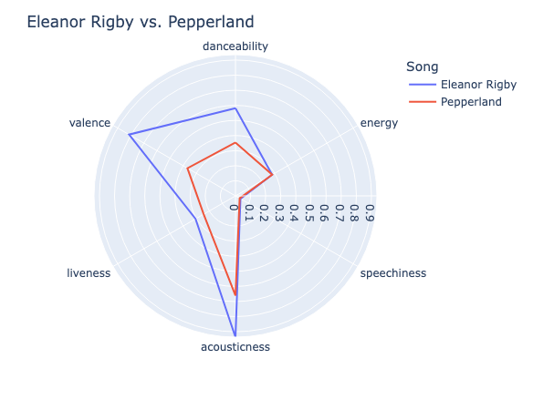

# Computing Similarity

As we work with data, making **comparisons** is a common occurence. For instance, in our Beatles data, we may want to compare two songs. We can make comparisons of varying complexity. We can simply compare two songs based on one attribute, like "valence". But it is also possible to compute similarity based on several attributes at once. This tutorial will explain two key methods for computing similarity, **cosine similarity** and **Euclidean distance**, and provide code examples for computing each.

## Cosine Similarity

Let's consider three songs from our Beatles spotify dataset: Eleanor Rigby, When I'm Sixty Four, and Back in the USSR. For the purposes of this tutorial, these may be abbreviated as ERY, WSF, and BUR, respectively.

Imagine we want to compare these three songs. The simplest way to compare the songs is based on a single attribute, say, "energy".

| Song	                | Energy    |
|-----------------------|-----------|
| Eleanor Rigby	        | 0.280	    |
| When I'm Sixty Four   | 0.241	    |
| Back in the USSR	    | 0.969	    |

We can do this visually using a bar chart:


We could evaluate similarity in a few ways, like finding the difference in energy between two songs, or the ratio of energy - none too complicated.

But what if we want to compare songs using more than one attribute? Let's now consider "valence", in addition to "energy".

| Song	                 | Energy    | Valence	|
|-----------------------|-----------|---------|
| Eleanor Rigby	        | 0.280	    | 0.8130	 |
| When I'm Sixty Four   | 0.241	    | 0.6610	 |
| Back in the USSR	     | 0.969	    | 0.4940	 |

We can imagine each song as a point on a graph, with the x-value representing energy and the y-value representing valence. We could choose any number of dimensions, but it is easiest to visualize a 2-dimensional graph.

> Note: Eleanor Rigby has a valence value of 0.8130. If you listen to Eleanor Rigby, would you agree with that value for valence? This attribute brings up a key factor: understanding the nature of the data we're working with. Not all of these values make sense!

https://github.com/user-attachments/assets/dc9d4d31-157d-488d-a5dc-d0630cf6d45f

As the values of energy and valence change, the position of the point will change on the graph. If we draw a line from the origin to this point (a **vector**), we can also see that the changing energy and valence will change the **direction** one must travel from the origin to reach the point. Thus, we can use **direction** (measured as angles $` \theta `$ and $` \phi `$ from the horizontal) as a single value to compare two multi-faceted data points.

https://github.com/user-attachments/assets/5c772430-f211-4116-844d-28ec6b77303b

The method of **cosine similarity** will compare the directions of the two vectors, producing a single value measuring how similar those directions are. If the directions are identical, cosine similarity will be `1`. If they are perpendicular, cosine similarity will be `0`.

**[VIZ: points perpendicular, cosine sim 0, points overlaid, cosine sim 1]**

As an example, we can compute the cosine similarity between Eleanor Rigby (ERY) and Back in the USSR (BUR).

<details>
 <summary><strong>Python will compute cosine similarity for us, but if you're curious, click here for a cosine similarity formula breakdown</strong>
 </summary>
 
<br>

Cosine similarity is computed between two vectors, say vector $`\vec{A}`$ and vector $`\vec{B}`$. We're working with 2-dimensional vectors right now (dimensions "energy" and "valence"), but this method works with n-dimensions.

Represent the vectors in terms of their components:

```math
 \vec{A: } \begin{bmatrix}
 a_1 \\
 a_2
 \end{bmatrix}
 
 \hspace{1cm}
 
 \vec{B: } \begin{bmatrix}
 b_1 \\
 b_2
 \end{bmatrix}
 ```

The formula for cosine similarity is:

```math
{\vec{A} \cdot \vec{B} \over \|\vec{A}\| \|\vec{B}\|}
```

where $` \vec{A} \cdot \vec{B} `$ represents the **dot product** of vectors $`\vec{A}`$ and $`\vec{B}`$, and $`\|\vec{A}\| \|\vec{B}\|`$ represents the product of the **magnitudes** of vectors $`\vec{A}`$ and $`\vec{B}`$ (the magnitude of $`\vec{A}`$ is $`\|\vec{A}\|`$).

The dot product is a method of measuring the degree to which the direction of one vector is similar to another.

There is a shortcut for computing the dot product: multiply the corresponding components of each vector and sum the products. Therefore:

```math
\vec{A} \cdot \vec{B} = \begin{bmatrix}
a_1 \\
a_2
\end{bmatrix}
\cdot
\begin{bmatrix}
b_1 \\
b_2
\end{bmatrix} = a_1 b_1 + a_2 b_2
```

Khan Academy has an article covering dot products [here][khan-academy-dot-products].

The magnitude of a vector, $`\|\vec{A}\|`$, is the distance between its initial and terminal points. In our case, all vectors simply extend from the origin. We can compute magnitude with a method based on the Pythagorean theorem:

```math
\|\vec{A}\| = \sqrt{a_1^2 + a_2^2}
```

Khan Academy has a video covering vector magnitudes [here][khan-academy-vector-magnitudes].

</details>

The cosine similarity of Eleanor Rigby and Back in the USSR, based on energy and valence, is `0.720`.

**[VIZ: angle between ERY and BUR, cosine similarity labeled]**

We can't make much sense of this because we haven't seen any other computed cosine similarities, but it does make sense that these tracks have a cosine similarity noticeably lower than `1.000` (perfect similarity).

Let's now compare When I'm Sixty Four and Back in the USSR.

**[VIZ: angle between WSF and BUR, cosine similarity labeled]**

The cosine similarity of these tracks is `0.732`. This differs slightly from the ERY-BUR comparison, but by a tiny amount. Why is this?

When we use cosine similarity, we represent each song as a vector, and then compare the **directions** of these vectors. However, this ignores the second aspect of vectors: their **magnitude**, or how long they are. We can see this even more clearly when comparing ERY and WSF. We have to zoom in to even see the angle between them! **[TODO: replace video with updated version if necessary]**

https://github.com/user-attachments/assets/ec329b3d-5807-432c-8bbb-2413d6bc2a88

Despite having somewhat different vectors, Eleanor Rigby and When I'm Sixty Four have a cosine similarity of `0.964`.

With cosine similarity, you can get some sense of the similarity of two songs, but the method can be flawed: if two songs have attributes in a similar **ratio** to each other, their vector directions will also be very similar, even if the magnitudes of these attributes are quite different.

Let's see another example: comparing the songs Eleanor Rigby and Pepperland using cosine similarity, taking into account six types of Spotify feature data (danceability, energy, speechiness, acousticness, liveness, and valence). We can visualize the two songs on a radar plot:



These songs look relatively different from each other. Yet their cosine similarity is nearly identical: `0.976`!

This is because their features are in similar proportion to each other - on the radar plot, the lines take an almost identical shape. You could imagine scaling up the graph for Pepperland, and it would overlap very well onto the graph of Eleanor Rigby.

You may decide this is a useful comparison to make. Cosine similarity allows you to compare data without considering size, which can be helpful in some cases! However, if you want to focus more on comparing the quantities of a song's attributes, consider using **Euclidean distance**.

## Euclidean Distance

Euclidean distance is a method for measuring the distance between two points in n-dimensional space. In our 2-dimensional example with energy and valence, this is the distance between two points on a graph. We will explore the same 2-D example, but helpfully, Euclidean distance can be used to compare any number of attributes.

Previously, we have imagined songs as **vectors**. With Euclidean distance, we no longer care about direction, just the position of each song on the plane. So let's re-visualize our graph as a collection of points:

**[VIZ: graph as points]**

Euclidean distance is a relatively straightforward method of comparison: how far are two points from each other?

Using a method based on the Pythagorean Theorem, we can easily evaluate this.

<blockquote><details><summary>Python can also implement Euclidean distance for us, but click here to learn more about the formula</summary>

In two dimensions, the Euclidean distance between points $p$ and $q$ is represented as follows:

```math
\sqrt{(p_1 - q_1)^2 + (p_2 - q_2)^2}
```

where $`p_1`$ and $`p_2`$ represent the $`x`$ and $`y`$ coordinates of point $`p`$, and likewise for point $`q`$.

In $`n`$ dimensions, the Euclidean distance between points $`p`$ and $`q`$ is represented as follows:

```math
\sqrt{(p_1 - q_1)^2 + (p_2 - q_2)^2 + ... + (p_n - q_n)^2}
```

</details></blockquote>

With Euclidean distance, you take into account the magnitudes of all the attributes of two songs, and the differences between them. This helps provide more clarity in our example with Eleanor Rigby, When I'm Sixty Four, and Back in the USSR:

**[VIZ: euclidean distances between ERY, WSF, BUR]**

Similar to cosine similarity, Euclidean distance works with any number of attributes. This means you could easily make comparisons across a wide number of Spotify attributes using Euclidean distance.

However, you have to keep in mind the pitfalls of Euclidean distance. Unlike cosine similarity, where all values are computed on the same scale, Euclidean distance simply finds the magnitude of the distance between two points. So in this case, **lower numbers indicate higher similarity**, while higher numbers indicate less similarity. There is no cap to the potential "greatest distance" between two points, so take care to **normalize** your data. Trying to keep all data points on a consistent scale (like `0`-`1`) will prevent unusually large numbers from having an outsize impact, like the value for `'duration_ms'`.

## Implementing Cosine Similarity and Euclidean Distance in Python

Thankfully, Python libraries exist to simplify our computations of cosine similarity and Euclidean distance.

First, we need to import libraries:

```python
from sklearn.metrics.pairwise import cosine_similarity, euclidean_distances
import numpy as np
```

### Simple Example

First, we'll go over a simple example of comparing two songs:

| Song | danceability | energy | speechiness | acousticness | liveness | valence |
|-|-|-|-|-|-|-|
| Boys | `0.402` | `0.860` | `0.0504` | `0.607` | `0.736` | `0.822` |
| Till There Was You | `0.727` | `0.338` | `0.0454` | `0.790` | `0.105` | `0.646` |

1. Create a list with attributes for each song:

    ```python
    boys = [0.402, 0.860, 0.0504, 0.607, 0.736, 0.822]
    till = [0.727, 0.338, 0.0454, 0.790, 0.105, 0.646]
    ```

2. Convert each list to a special format to use with the `cosine_similarity` and `euclidean_distances` functions:

    ```python
    boys = np.array(x).reshape(1, -1)
    till = np.array(y).reshape(1, -1)
    ```

3. Compute the values:

    + Cosine similarity:

        ```python
        cosine_similarity(boys, till)
        ```

        <table border="0">
            <tr>
                <th valign="top">Output:</th>
                <td>
                    <pre style="white-space: pre;">array([[0.81389584]])</pre>
                </td>
            </tr>
        </table>

    + Euclidean distance:

        ```python
        euclidean_distances(boys, till)
        ```

        <table border="0">
            <tr>
                <th valign="top">Output:</th>
                <td>
                    <pre style="white-space: pre;">array([[0.91692966]])</pre>
                </td>
            </tr>
        </table>


        You should clean up the format of your output by adding `[0][0]` to the end of the line, for example, `cosine_similarity(boys, till)[0][0]`. This will mean the output is just a number, without the brackets and `array` datatype, and can be more easily saved to a variable. Try it!

### Using Cosine Similarity and Euclidean Distance with Pandas

You can also use the `cosine_similarity` and `euclidean_distances` methods on your Pandas dataframes to create lots of comparisons very quickly.

Let's use the example of the `beatles_spotify` dataset. First import Pandas:

```python
import pandas as pd
```

And import the Beatles Spotify dataset:

```python
beatles_spotify_csv = 'https://docs.google.com/spreadsheets/d/e/2PACX-1vRCv45ldJmq0isl2bvWok7AbD5C6JWA0Xf1tBqow5ngX7_ox8c2d846PnH9iLp_SikzgYmvdPHe9k7G/pub?output=csv'

beatles_spotify = pd.read_csv(beatles_spotify_csv)
```

Let's decide which attributes you want to include when computing similarity. The easiest ones to use will be `'danceability'`, `'energy'`, `'speechiness'`, `'acousticness'`, `'liveness'`, and `'valence'`, since they're all rated on the same scale (`0`-`1`). To work with the methods for computing similarity, we need to translate just those attributes to a NumPy array:

```python
attributes = beatles_spotify[['danceability', 'energy', 'speechiness', 'acousticness', 'liveness', 'valence']].to_numpy()
```

Here is where we let our similarity computation methods work their magic: in just one line, we can create a dataframe in which **every song** is compared to **every other song** using our chosen method.

```python
# Perform cosine similarity comparisons
cosine_sim_df = pd.DataFrame(cosine_similarity(attributes), index=beatles_spotify['song'], columns=beatles_spotify['song'])

# Perform Euclidean distance comparisons
euclid_dist_df = pd.DataFrame(euclidean_distances(attributes), index=beatles_spotify['song'], columns=beatles_spotify['song'])
```

The result is a square table, where each row represents a song, and each column represents a song. For example, as you go down the row for `"eleanor rigby"`, each cell represents the comparison (either cosine similarity or euclidean distance) between `"eleanor rigby"` and the song labeled in that column.

We can use `.iloc` to see an excerpt of a few rows and columns from the dataframes:

```python
cosine_sim_df.iloc[82:87, 103:108]
```

<table border="0">
    <tr>
        <th valign="top">Output:</th>
        <td>
            <table border="1">
            <thead>
                <tr style="text-align: right;">
                <th>song</th>
                <th>being for the benefit of mr.kite!</th>
                <th>within you without you</th>
                <th>when im sixty four</th>
                <th>lovely rita</th>
                <th>good morning good mornng</th>
                </tr>
                <tr>
                <th>song</th>
                <th></th>
                <th></th>
                <th></th>
                <th></th>
                <th></th>
                </tr>
            </thead>
            <tbody>
                <tr>
                <th>run for your life</th>
                <td>0.930658</td>
                <td>0.770031</td>
                <td>0.778433</td>
                <td>0.976672</td>
                <td>0.866748</td>
                </tr>
                <tr>
                <th>taxman</th>
                <td>0.919839</td>
                <td>0.857034</td>
                <td>0.766162</td>
                <td>0.961830</td>
                <td>0.961051</td>
                </tr>
                <tr>
                <th>eleanor rigby</th>
                <td>0.906773</td>
                <td>0.838166</td>
                <td>0.964172</td>
                <td>0.761517</td>
                <td>0.743661</td>
                </tr>
                <tr>
                <th>im only sleeping</th>
                <td>0.975058</td>
                <td>0.903786</td>
                <td>0.882474</td>
                <td>0.968913</td>
                <td>0.947792</td>
                </tr>
                <tr>
                <th>love you to</th>
                <td>0.942388</td>
                <td>0.850944</td>
                <td>0.921329</td>
                <td>0.826849</td>
                <td>0.757408</td>
                </tr>
            </tbody>
            </table>
        </td>
    </tr>
</table>

```python
euclid_dist_df.iloc[82:87, 103:108]
```

<table border="0">
    <tr>
        <th valign="top">Output:</th>
        <td>
            <table border="1">
            <thead>
                <tr style="text-align: right;">
                <th>song</th>
                <th>being for the benefit of mr.kite!</th>
                <th>within you without you</th>
                <th>when im sixty four</th>
                <th>lovely rita</th>
                <th>good morning good mornng</th>
                </tr>
                <tr>
                <th>song</th>
                <th></th>
                <th></th>
                <th></th>
                <th></th>
                <th></th>
                </tr>
            </thead>
            <tbody>
                <tr>
                <th>run for your life</th>
                <td>0.460338</td>
                <td>0.782970</td>
                <td>0.801886</td>
                <td>0.326353</td>
                <td>0.735168</td>
                </tr>
                <tr>
                <th>taxman</th>
                <td>0.446877</td>
                <td>0.590346</td>
                <td>0.793619</td>
                <td>0.324571</td>
                <td>0.490573</td>
                </tr>
                <tr>
                <th>eleanor rigby</th>
                <td>0.656752</td>
                <td>0.831812</td>
                <td>0.429158</td>
                <td>0.931319</td>
                <td>1.039502</td>
                </tr>
                <tr>
                <th>im only sleeping</th>
                <td>0.231732</td>
                <td>0.444603</td>
                <td>0.554768</td>
                <td>0.256579</td>
                <td>0.589390</td>
                </tr>
                <tr>
                <th>love you to</th>
                <td>0.426561</td>
                <td>0.657262</td>
                <td>0.479238</td>
                <td>0.689563</td>
                <td>0.966851</td>
                </tr>
            </tbody>
            </table>
        </td>
    </tr>
</table>

Or you could just get the comparison of two songs using `.loc`:

```python
cosine_sim_df.loc['eleanor rigby', 'when im sixty four']
```

<table border="0">
    <tr>
        <th valign="top">Output:</th>
        <td>
            <pre>
0.9641715334882657</pre>
        </td>
    </tr>
</table>

```python
euclid_dist_df.loc['eleanor rigby', 'when im sixty four']
```

<table border="0">
    <tr>
        <th valign="top">Output:</th>
        <td>
            <pre>
0.42915788469979127</pre>
        </td>
    </tr>
</table>

### Using the Results

You can now generate cosine similarity and Euclidean distances between data points. But what can you do with that? True, you know the extremes:

* Cosine similarity of `1` indicates complete similarity
* Cosine similarity of `0` indicates complete opposition
* Euclidean distance of `0` indicates complete similarity

But data rarely exists on these extremes. You have to decide **how to interpret** these similarity ratings. What is the threshold for similarity?

To give you some help, you can calculate statistics on the comparison dataframes. `cosine_sim_df.describe()` and `euclid_dist_df.describe()` will give insight into key figures, like the mean and standard deviation. These can help you interpret your data.

And always remember:

* These results are based on Spotify data - is that data a good assessment?
* "Similar" according one method might not be "similar" according to another, as we have seen.

### Things You Need to Consider

In this example, we didn't clean our data. This could present problems down the line, particularly since we used the entries in the `'song'` column as our indices in our comparison table. Here are potential issues to consider:
* Song titles have inconsistent formatting, e.g. capitalization
* Some songs have duplicate entries from different albums, e.g. `"yellow submarine"`
* Not all attributes are normalized (`0`-`1`), e.g. `'duration_ms'`, and this could influence your result

## Summary

**Cosine Similarity vs. Euclidean Distance**

Cosine Similarity:
* Computes similarity on a consistent scale
* More similar = **higher** number
* Only considers vector **direction**, not **magnitude**

Euclidean Distance:
* Doesn't compute similarity on a consistent scale
* More similar = **lower** number
* Takes vector direction **and** magnitude into account

When comparing two songs through several attributes, cosine similarity provides a viable method for creating a uniform "similarity rating". However, there are some instances where cosine similarity is demonstrably inadequate. Thus, Euclidean distance is another (and perhaps better) method to consider. One could also imagine combining these or other methods in some way to form your own "similarity rating".

## Links

https://scikit-learn.org/stable/modules/generated/sklearn.metrics.pairwise.euclidean_distances.html

https://scikit-learn.org/stable/modules/generated/sklearn.metrics.pairwise.cosine_similarity.html

[khan-academy-dot-products]: https://www.khanacademy.org/math/multivariable-calculus/thinking-about-multivariable-function/x786f2022:vectors-and-matrices/a/dot-products-mvc
[khan-academy-vector-magnitudes]: https://www.khanacademy.org/math/precalculus/x9e81a4f98389efdf:vectors/x9e81a4f98389efdf:vec-mag/v/finding-vector-magnitude-from-components
