# The Global Jukebox:  Guide to the Project and Data

## About the Global Jukebox

The **Global Jukebox** (https://www.theglobaljukebox.org/) builds on the work of [**Alan Lomax**](https://en.wikipedia.org/wiki/Alan_Lomax) (1915-2022), a musician, folklorist, and activist.  He was a key figure in the American and British folk-music revivals of the 1940s through 1960s, and a key figure at the Library of Congress and Smithsonian Institution.  


As a scholar and archivisit, Lomax formulated a rich scheme for the systematic study of musical style and context:  [Cantometrics](https://en.wikipedia.org/wiki/Cantometrics), which seeks to catalog the diversity of human musical expression through patterns of melody, rhythm, sound ideal, and (especially) social organization and purpose.  Judged by today's methods in ethnography (which often explain musical expression through its particularity), Lomax and his collaborators were curious to know the *universals* of human expression--the ways in which similar social structures (egalatarian, or not) might give rise to similar musical structures (preferences for certain kinds of interplay, or sounds).  

Lomax's work continues through the **[Cultural Equity](https://www.culturalequity.org/)** project, which is directed by his daughter, Anna Lomax, through the **[Alan Lomax Collection and Archive](https://www.loc.gov/collections/alan-lomax-manuscripts/about-this-collection/)** (a vast repository of recordings and writings, now at the Library of Congress), and  **[The Global Jukebox](https://theglobaljukebox.org/)**, a digital project created by folks at Cultural Equity that aims to explore the sonic archive he created through the lens of the various geographical, cultural, and musical facets that Lomax cataloged.  Theirs is truly a global vision of musical style.


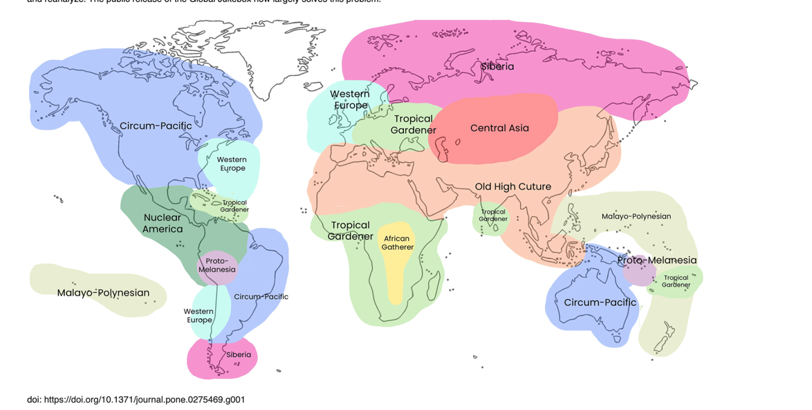

From [Lomax, et al, 2022](https://journals.plos.org/plosone/article/figure?id=10.1371/journal.pone.0275469.g001)

## Exploring Cantometrics and the Global Jukebox

You will need to **create a login with GJ** for the best results.

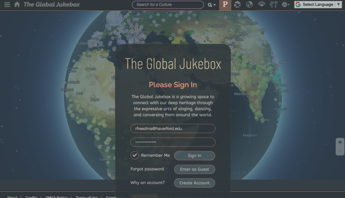

As you will learn, there are many ways for you to explore this site, as you search by cultural group, musical genre, or place.  These in turn lead to you find connections among disparate group, and think about the ways in which social and musical forms interact with each other.

It's important to understand that the recordings assembled here were collected over many decades, and indeed many of them are many decades old (they represent, after all, Lomax's own journeys, and are often the same ones he included on the famous *Smithsonian Folkways* recording series (we own many of these here in the Harris Music Library) he directed).  They definitely don't represent _all_ musical traditions, nor do they represent current-day trends in commerical popular music, much less the extremely rapid hybridization of forms and practices we witness in a digital world. 


## An Ethnographic Spotify?

As Anna Lomax and her colleagues describe in a [recent report](https://journals.plos.org/plosone/article?id=10.1371/journal.pone.0275469) the **Global Jukebox** returns to the original **Cantometrics** dataset, which explored over 5700 traditional songs from over 1000 distinct societies.  These are indexed according to a 'controlled vocabulary' of **37 different types of musical or social features** (like the rhythmic flow of the music, or the economic basis of the society), each of which was coded using an elaborate system of up to **13 different categorical values** that describe the particular characteristic of that feature (a slow piece might have one value, a highly varied piece might have another, etc).  

The basic coding for these took place decades ago on punch cards (more on the legacy data structure below), but for the digital update modern researchers were carefully trained in the methods and reviewed to validate the original ratings. 

To these are now appended seven additional datasets coding and describing instrumentation, conversation, popular music, vowel and consonant placement, breath management, social factors, and societies. All digitized Global Jukebox data are being made available in open-access, downloadable format on [Github](https://github.com/theglobaljukebox), linked with [streaming audio recordings](theglobaljukebox.org) to the maximum extent allowed while respecting copyright and the wishes of culture-bearers.

See the full list of datasets [here](https://journals.plos.org/plosone/article/figure?id=10.1371/journal.pone.0275469.t001).  

Learn more about *Cantometrics* and *The Global Jukebox* here:

Wood, Anna Lomax, Roswell Rudd, and Alan Lomax. 2021. *Songs of Earth : Aesthetic and Social Codes in Music : Based upon Alan Lomax’s Cantometrics : An Approach to the Anthropology of Music*  Jackson: University Press of Mississippi, 2021.  Available at **Harris Music Library**:   ML3799 S66 2021

In the course of working on any particular set of genres or examples, you will probably want to focus on a subset of the huge range of data available through the Global Jukebox (see below).  Consider, for example, Anna Lomax's advice on how to think about **Lullabies**, which afford some interesting possibilities for study.  Read [here]('https://docs.google.com/document/d/1S1M5p9Zfkdft5IQlTM0p-liNrNj83yh6UeQ1yL6TtfY/edit?usp=sharing').  We show how to create this kind of data subset below.

## The Global Jukebox Data Types

The Global Jukebox data are on Github in a series of CSV files, each containing a distinct 'data type'.  It might at first seem confusing to have information about the recordings separate from the information about the societies, and each of these separate from the explanation of the rating system and categories.  But this is the basis of a *relational database*, after all, and we often need to coordinate data across many 'tables' in this context.  Fortunately, Pandas can make short work of merging and combining data, or filtering one table on the basis of information gleaned from another.  So in the course of your work with Global Jukebox Data you will often need to coordinate and combine data from the following sets:

- **Canto** = the ratings for the individual songs, with about 37 different musical features in all.  
- **Societies** = data about the ethnic and social groups represented in the survey.  These are linked to the Canto data via group ids.
- **Songs** = more data about the recording themselves, also with data about the societies, but in addition information about the source recording and genres they represent.
- **Codes** = for each music feature, there are a dozen possible ratings.  They are given as integers but really represent complex combinations of social and sonic features.  This dataset explains the meanings represented by each value.
- **Raw Codes** = Since each song can in fact have more than one 'musical code' associated with it (as when it's slow at the start but fast at the end), the GJ team in fact uses a sophisticated system to encode more than one code with a single integer.  See below on this **Power of 2** method.
- **Lines Explained** = detailed explanation of the categories of musical features (texture, rhythm, melody, timbre, etc).  Read about these [here]('https://docs.google.com/document/d/1Ga7qxbWV1UaD8wPABYORpJc2_4WPwimIv-zQCbl_v0U/edit?usp=sharing')


```python
canto = 'https://raw.githubusercontent.com/theglobaljukebox/cantometrics/main/raw/data.csv'
societies = 'https://raw.githubusercontent.com/theglobaljukebox/cantometrics/main/raw/societies.csv'
songs = 'https://raw.githubusercontent.com/theglobaljukebox/cantometrics/main/raw/songs.csv'
codes = 'https://raw.githubusercontent.com/theglobaljukebox/cantometrics/main/etc/codes.csv'
raw_codes = 'https://raw.githubusercontent.com/theglobaljukebox/cantometrics/main/etc/raw_codes.csv'
lines_explained = 'https://raw.githubusercontent.com/theglobaljukebox/cantometrics/main/etc/variables.csv'
```

### Initial Cleanup of Files

The raw files from Github include 'non breaking spaces' ('\xa0') that we need to clean up so that we can work with the contents more easily.  You can do this with a simple function at the time you import the files:

```python
# List of URLs to the data files
data_files_list = [
    'https://raw.githubusercontent.com/theglobaljukebox/cantometrics/main/raw/data.csv',
    'https://raw.githubusercontent.com/theglobaljukebox/cantometrics/main/raw/societies.csv',
    'https://raw.githubusercontent.com/theglobaljukebox/cantometrics/main/raw/songs.csv',
    'https://raw.githubusercontent.com/theglobaljukebox/cantometrics/main/etc/codes.csv',
    'https://raw.githubusercontent.com/theglobaljukebox/cantometrics/main/etc/variables.csv',
    'https://raw.githubusercontent.com/theglobaljukebox/cantometrics/main/etc/raw_codes.csv'
]

# Short names for DataFrames
short_names = ['canto', 'societies', 'songs', 'codes', 'lines_explained', 'raw_codes']

# Initialize empty variables for each DataFrame
canto = None
societies = None
songs = None
codes = None
lines_explained = None
raw_codes = None

# Loop through the list of URLs and short names
for url, short_name in zip(data_files_list, short_names):
    # Read the CSV file from the URL into a DataFrame
    df = pd.read_csv(url)
    
    # Replace non-breaking spaces in column names with regular spaces
    df.columns = df.columns.str.replace('\xa0', ' ')
    
    # Iterate over each column to replace non-breaking spaces in cell values
    for col in df.columns:
        # Check if the column contains string values
        if df[col].dtype == 'object':
            df[col] = df[col].str.replace('\xa0', ' ')
    
    # Assign the modified DataFrame to the corresponding variable
    globals()[short_name] = df
```


Now you can access each DataFrame directly by its name:  `canto.head()`, `societies.head()`, `songs.head()`, `codes.head()`, `lines_explained.head()`, `raw_codes.head()`


## A Closer Look at the Global Jukebox Data

Now that we have imported and cleaned up the data, let's take a close look at each table. Some are much more complicated to understand than others!  The **canto** is a logical place to start, this is where the 'observational ratings' made by the Global Jukebox researchers come together with references to the individual song ids and the social groups who made them.


### The Canto Table

Here for instance we see the start of the **canto** table.  

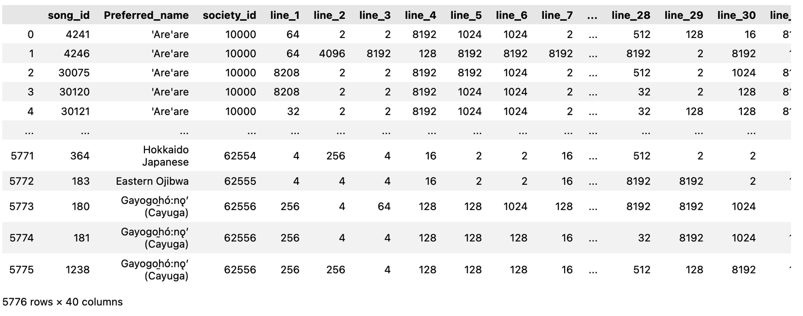

The first three columns identify:

- the **song_id** (details about the date, place, and performers involved will be found in the **songs** table)
- the **preferred_name** of the social group (details in the **societies** table)
- the **society_id** of that group (also in the **societies** table)

The subsequent columns (**line_1**, **line_2**, etc) contain the observational 'ratings'. 

- each **line** represents one musical or social feature; there are 37 features in all (learn about the meaning of each line in the **lines_explained** dataset below)
- each **cell** contains a numerical value representing the consensus view of that feature.  (**Important**:  the values appear to be scalars, but they are NOT!  More on this in the discussion of **codes** and **raw_codes** tables below.)

### The Lines_Explained Table

Of course the individual "cantometric lines" in these tables represent very different things--some are what we would call "audio features" (like tempo, or the level of ornamentation). Others concern the number and relation of performers (the presence of a vocal soloist, or the role of an accompanying chorus).  Still others concern the social setting or organization where the performance was heard or recorded.  The meaning of each is detailed in the **lines_explained** table:

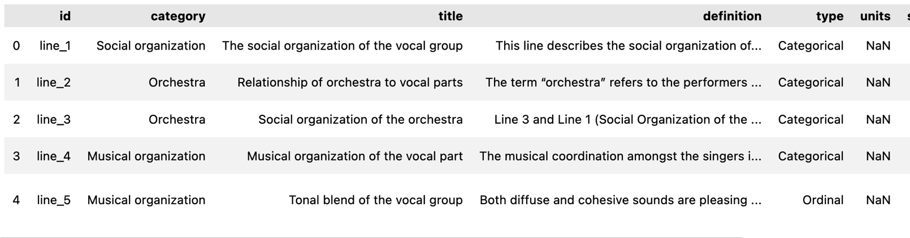

As we see, this table contains not only a verbal description of the kind of feature or context, but also information about:

- a more general 'category' (or class) of features to which it belongs (here we see some are part of class called Social Organization, or Musical Organization)
- a 'type' column that characterizes the data--an ordinal (or scalar), a categorical, etc


With Pandas we could easily group or filter these lines to show those belonging to a particular class. Here, for instance, are all the 'lines' that belong to the Musical Organization class, which we found by filtering the original df:  `lines_explained_df[lines_explained_df['category'] == "Ornament"]`.  From here you could read each of the 'definitions' in detail to understand how the Global Jukebox team understands this feature.

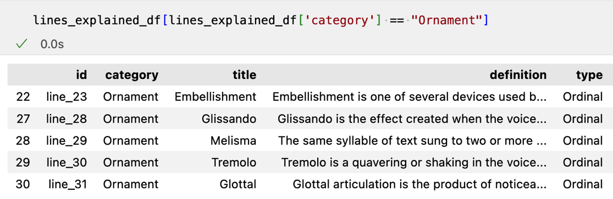

<br>

Since it will be useful later, here is a dictionary of the lines and their corresponding short_titles.  This will allow us to easily rename any dataframe we create from the canto data.

```python
my_dict = pd.Series(lines_explained.short_title.values, index=lines_explained.id).to_dict()
my_dict
```

It would certainly be overwhelming to consider 37 different dimensions of musical recordings at once.  More reasonable--as part of your plan to answer a particular research question--would be to on data of a particular type.  If you wanted to look at melodic style across some corpus, these would be the among the features you would want to consider.  Here is a quick list of all the 'categories' in the **lines_explained** table:


```python
# make a list of the unique values in this column
lines_explained['category'].unique().tolist()

# the list
['Social organization',
 'Orchestra',
 'Musical organization',
 'Metrical pattern',
 'Rhythmic relationship',
 'Melodic form',
 'Articulation',
 'Musical characterstics',
 'Ornament',
 'Dynamics',
 'Vocal noise']
```

<br>

Below we show an example of how you might filter the canto data down to a set of dimensions particularly relevant for the study of Lullabies.

```python
canto_name_dict = {'line_1': 'Social_Org_Group', 
'line_10': 'Repetition',
'line_11': 'Vocal_Rhythm',
'line_16': 'Melodic_Form',
'line_18': 'Number_Phrases',
'line_20': 'Melodic_Range',
'line_24': 'Tempo',
'line_25': 'Volume',
'line_26': 'Vocal_Rubato',
'line_28': 'Glissando'}
```

### The Codes and Raw_Codes Tables


### Canto Codes:  37 features 'lines':  12 categoricals and 25 ordinals

The 'codes' tell us what the ratings actually mean for each line (musical type). These are integers for each of the 37 possible lines for each table.

**But the meaning of the codes change from line to line!**.  

#### Ordinal (Scalar) Features

About two dozen of them are **ordinals**:  scalars for things can be directly counted or measured in a quantitative way.

```python
ordinals = lines_explained[lines_explained['type'] == 'Ordinal']
ordinals.drop(['units', 'source', 'changes', 'notes', 'short_title'], axis=1)
```

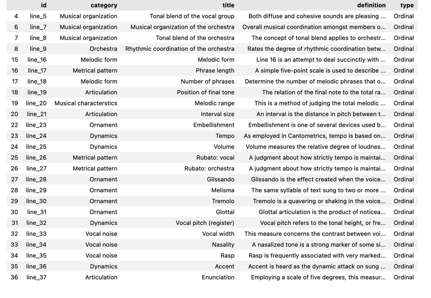

<br>


As we see, these include things like melodic range, dynamics, metrical flow and organization, and degree of embellishment; but also degree of organization or blend.


#### Categorical Features

Another dozen are **categoricals**.  These are also coded as integers, but they are NOT simply scalars!  Instead they represent 'categorical' concepts.

```python
categoricals = lines_explained[lines_explained['type'] == 'Categorical']
categoricals.drop(['units', 'source', 'changes', 'notes', 'short_title'], axis=1)
```

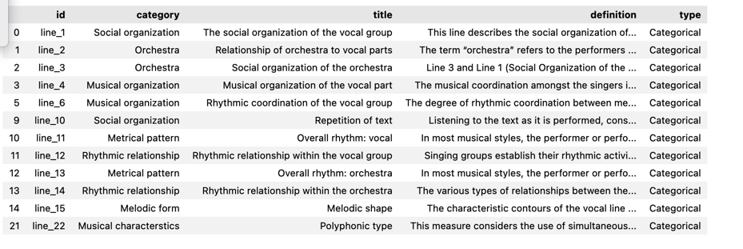

<br>

Consider, for instance, **line 1 ('Social Organization of the Vocal Group')** and **line 2 ('Social Organization of the Orchestra')**.  

- In the case of the former, a code of "1" means 'no singer'.  
- In the case of the latter, the same code of "1" means 'no accompaniment'.  

<br>

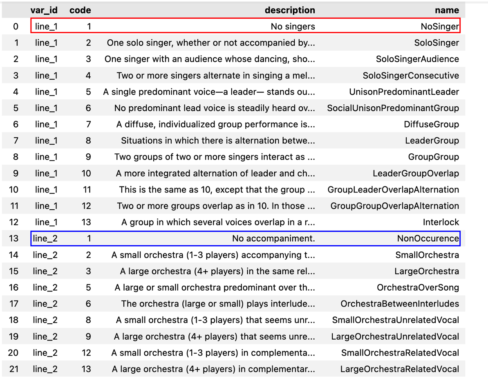

<br>


As we look through the other codes for lines 1 and 2 (remember that there are 37 lines in all!) we can see how the **indicated value sometimes represents an 'ordinal' (scalar) meaning and sometimes represents a 'categorical' meaning**.  A verbal summary of each  that appears in the 'description' column.  

### But Wait, There's More:  'Powers of 2' and the raw_code Table

In practice if we look at the **canto** table, we will find that the the 'codes' recorded for **line_1 of the very first song is "64"**.  How can this be?  "64" is *not* among the **codes** for line 1 that we just reviewed above!  The answer is (in the parlance of the Global Jukebox project) **"the powers of 2"**.  

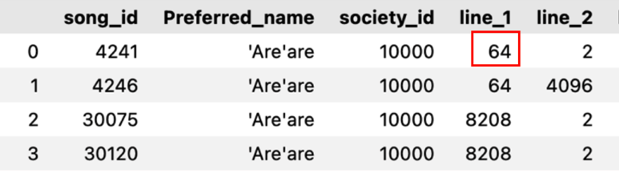


The answer to this riddle begins with the fact not all performances fit neatly into a single ordinal or categorical rating.  A particular song, for example, might have a *slow introduction* and a *fast conclusion*.  And so analysts might want to tag a given piece with **more than one** code.

The Global Jukebox team came up with a clever mathematical solution for this riddle, which they call **The Powers of 2**.  The approach, in brief: 

- If you have just **ONE rating to apply**, then take the original 'code' from the relevant line in your table.  **If that code was "4", then 2 to the 4th power = 16.**  That's the integer recorded in the canto data
- but **if TWO codes apply to the same piece** , then **find each of the original codes, use them each as a power of 2, and then add them together!**  

    - For example:  if for 'line_1' musical feature (the one relating the solo singers) you see a code of "20", that means the analyst noticed *both* the original code "2" (two squared is "4") AND original code "4" (four squared is "16").  And so 16 + 4 = 20.  The **raw_codes** table explains the 'hidden' meaning of these seemingly large values.  As you can see, there are _many_ of these Powers of 2 values to unpack.  Here are just the first 25 of them for line 1 alone!

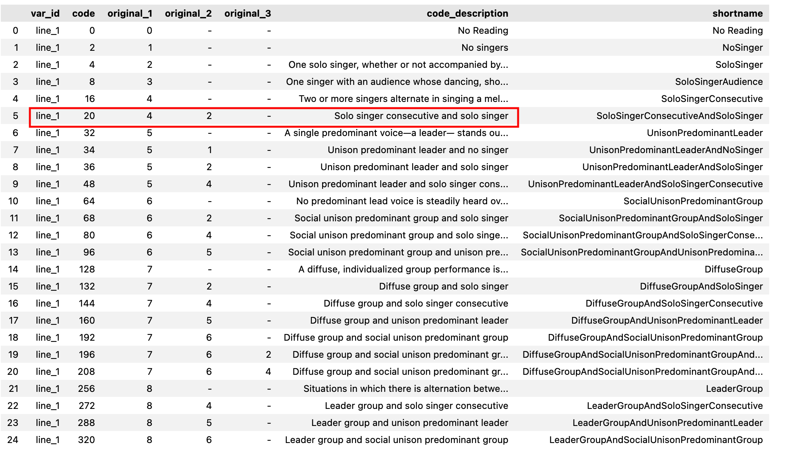

<br>

### Raw Codes Unpacked!

Fortunately the Encoding Music team has a solution to this complicated situation.  We can unpack these Powers of 2 values and create dataframes that break out each of the musical features embedded in the sums of exponiated codes.  Here is how we do it:

- Here we build out all the possible values for powers of 2 from 1 to 13
- And also build out all the unique sums of combinations of 1, 2, or 3 of these integers (since the GJB analysts use as many as _three_ Powers of 2 values in formulating their final codes.
- This in turn will allow us to retrieve the original codes from the combined numbers found in the canto data set


#### Breaking Down the Exponentiated Numbers 

```python

powers = [2**n for n in range(1, 14)] # 2 to the n for all n values from 1 to 13
combo_list = list(combinations(powers, 1)) + list(combinations(powers, 2)) + list(combinations(powers, 3)) # make a list of all combinations of the previous, for 1, 2, and 3 numbers
sums = [{"sum" : sum(t), "full_tuple": t} for t in combo_list]  # a dictionary that maps the original sums to the combinations
sums_df = pd.DataFrame(sums) # as a df
sums_df['sorted_original_values'] = sums_df.full_tuple.apply(lambda x: tuple(sorted([np.log2(value) for value in x], reverse=True))) # sort 
sums_df.sort_values(by="sum") # final sort
```

- The 'sum' represents the code you will find in the canto data.  The 'full_tuple' is the series of Powers of 2 value that were added together to get the sum. 
- The 'sorted_orginal_values' are the *original codes* that were combined through exponentiation and addition!  So now we know the meaning of the individual sums, and we can look these up in the codes table to understand the ratings for each musical or social dimension (the 'line').

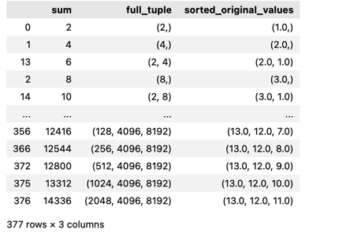

With these will create a dictionary that maps the summed values to their original meanings:

```python
dictionary_of_value_sets = dict(zip(sums_df["sum"], sums_df["sorted_original_values"]))
```

And then we will use that dictionary to 'unpack' all of the 'line data' in the original canto table, transforming it from a "Powers of 2" table into one in which we can directly read the original codes for each 'line'.  As an added step, we will also rename all the 'line' columns with the more meaningful short_title names from the canto table.


Here is the complete process:

```python
short_title_dict = pd.Series(lines_explained.short_title.values, index=lines_explained.id).to_dict() # the dictionary of lines and short_titles
canto_transformed_features = canto.iloc[:, 3:].applymap(lambda x : dictionary_of_value_sets.get(x, 0)) # unpacks the sums for all 'line' columns
canto_unpacked = pd.concat([canto.iloc[:, :3], canto_transformed_features], axis="columns") # puts the transformed columns back in place
canto_renamed = canto_unpacked.rename(columns=my_dict) # renames the columns with short_title dictionary
canto_renamed
```


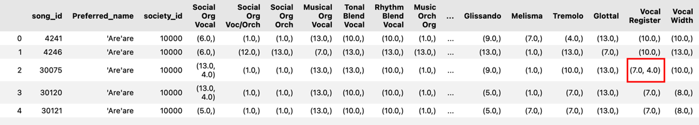


Now we can decode the complex codes in the canto data.  In the highlighted example above, the "Vocal Register" column shows TWO original (unexponentiated) values:  7 and 4.  "Vocal Register is the short_title for 'line_32' in the `code` table.  Let's see what they are:

```python
codes[codes['var_id'] == 'line_32']
```


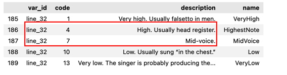

**Finally it's Clear!**  Here we learn that 4 represents "High. Usually head register" and 7 represents "Mid-voice".  So **both** of these features are present in the given recording.

But how do we learn more about the recording and the people who made it?  That is revealed in the songs and societies tables, as we now explain.


#### The Songs and Societies Tables


SHOW SHORT SLICE OF EACH?  BELOW THE DESCRIPTIONS ABOVE?

DATA CLEANUP OF SELECTED COLUMNS TO REMOVE NON-BREAKS

EXPLAIN THE LINES

EXPLAIN THE CODES AND POWER OF 2 SYSTEM

THEN A SAMPLE SUBSET


### Understanding the 'Lines'

- Load lines to df
- Clean up columns (replace the non-breaks)
- Variable Types

### A Sample Subset:  Lullabies

Let's consider the Lullaby. The genre is certainly universal (every child needs to be calmed from time to time), and we might well expect to find various commonalities in music with such a defined purpose. 

- probably slow
- probably repetitive, extensible
- probably vocal, and with a relatively narrow range
- probably consistently quiet
- probably heard in a domestic context

As far as texts go, lullabies are curious in that their intented audience is unlikely to understand them.  It's the manner that matters more than the subject matter or substance of what is being sung!

With these generalities in mind, it might be helpful (as Anna Wood suggests) to focus on a subset of the 37 cantometrics categories that suit the purpose.  Looking at the complete list of columns


# cantometrics data contain the ratings for each item
# here we are making a 'short' df of the columns suggested by A Wood for the Lullaby project

canto_df = pd.read_csv(canto)
canto_df.columns.to_list()

# canto songid is a number not string, so fix it
canto_df['song_id'] = canto_df['song_id'].astype('str')

# rename columns with real names of the categories
# dict to rename columns
canto_name_dict = {'line_1': 'Social_Org_Group', 
'line_10': 'Repetition',
'line_11': 'Vocal_Rhythm',
'line_16': 'Melodic_Form',
'line_18': 'Number_Phrases',
'line_20': 'Melodic_Range',
'line_24': 'Tempo',
'line_25': 'Volume',
'line_26': 'Vocal_Rubato',
'line_28': 'Glissando'}
canto_renamed = canto_df.rename(columns=canto_name_dict)

# Now we select only the columns (lines) that Anna suggests are relevant to the Lullaby Project

canto_short = canto_renamed.iloc[:,[0, 1, 2, 3, 12, 13, 20, 22, 26, 27, 28, 30]]
canto_lullaby_features = canto_short.drop(columns="society_id")
# canto_lullaby_features.iloc[0]['Vocal_Rhythm']
canto_lullaby_features.head()


