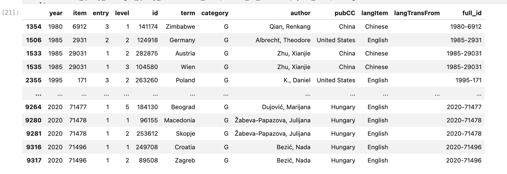

## RILM:  The World's Writings on a World of Music

**RILM** is the **Répetoire Internationale de Littérature Musicale**.  It is the leading international database of writings about all forms of music, across time and place.  Based in New York, the RILM team includes dozens of librarians, musicologists, and information technologists around the globe who work to index writings about music in hundreds of journals, books, and other materials that appear annually. Their flagship product is called [**RILM Abstracts of Music Literature**](https://www.rilm.org/abstracts/), and currently includes over 1.6 million items published during the last 75 years.

Haverford, Bryn Mawr, and Swarthmore College subscribe to this database, which you can search via our EBSCO interface (visit the [Music Library Resources](https://guides.tricolib.brynmawr.edu/music) page to find it).

**Note**:  the complete code for the functions described here appears at the [end of this tutorial](#all-the-rilm-functions-code)


## What do RILM Abstracts Look Like?

Let's take a single entry in RILM as a point of departure.  What kinds of information do we find here?  Here is an item returned from a search for `symphonies, no. 9, op. 125`. 

It is an essay about an important commemorative performance of the Beethoven Ninth Symphony held a year after the attack on New York on September 11, 2001:


The EBSCO interface presents the record as a series of nicely formatted blocks:

- **document** type (in this case an article in a periodical)
- **authors** (just one in the case: Peter Tregear) 
- **major subject heading** (it begins with a category number, then a description; it drawn from a 'controlled vocabulary' of terms that RILM maintains, so that they indexing is consistent)
- **a series of 'subject entries'** (more on these below)
- an **abstract** (a narrative description of the item; normally there are in English even if they publication is not)
- **publication date**
- the **'source' of the publication** (in this case: a periodical called Beethoven Forum; also volume and page information, since it is a periodical)
- **country and language of publication**
- a **url** (not all publications have these, but this is available online)
- something called the '**ISSN**' (the International Series number, which is a unique identifier for the Beethoven Forum)
- a **RILM 'accession' number** (their unique identifier for it in the RILM database; the first four numbers correspond to the year of publication)

#### Subject Entries Up Close

These RILM entries are rich with detail.  The **abstract** provides a great way to understand the gist of an article, even if you cannot read it in the original language.  But from the standpoint of our interest in data about music, the **subject entries** are particularly important.  In this case there six of them, each with a different 'top level' term:

- **Beethoven, Ludwig van** (the composer, of course!)
- **reception** (the general term for the kind of historical or critical study of how some idea or work of art is understood in different ways across time or place)
- wars and catastrophes (sadly, we know what these are, and music is often connected with them)
- **Adorno, Theodor W**. (an important German music philosopher and critic of the 20th century; he emigrated to the USA during the Nazi period)
- **Mann, Thomas** (an equally important German author of the 20th century; he also emigrated to the USA)
- **Taruskin, Richard** (a very important musicologist and critic; he taught for many years at the University of California, Berkeley)

Each of these top-level terms is in turn followed by a cascade of lower-level terms, each more specific than the next. In the first, for instance:

"Beethoven==>reception==>symphonies, no.9, op. 125==>relationship to 9/11 terrorist attacks"
Meanwhile the second is a slight variation on the first, switching the first two levels around, so that we move from 'reception' to 'Beethoven' and not the other way around. The point here is to understand each of these as a hierarchy of terms that would allow researchers starting at different points of entry to find their way not only to *this* item, but also to all the *other* items that might deal with a similar subject from a related perspective.

And to do this, the RILM team have devised what is called a **'controlled vocabulary'** of terms:  uniform ways of naming a particular person, work, place, or idea.  This is what makes RILM so powerful, and what will make our exploration of the relationship among these 'entities' so interesting.

## From RILM Search to DataFrame

We are fortunate that the RILM team (Freedman is a member of the Board of Directors) is also interested to see what students in Encoding Music can help them discover about their data:

- Looking for changing trends in musicological discourse
- Creating knowledge graphs that show the connections among different topics, people, and places

We manage all this via an 'key' (the 'Bearer Token') allows us to access their database directly via a special API that they have created for us. Your instructor will provide the key as needed in class for you to use.

Note that *this key is just for use in the context of our class, and not to be published or shared*.  

*DO NOT post the Bearer Token to any code you keep on Github or any public resource!*

In brief, our `get_query_data` function allows us to:

- post a request to the API
- return matching results as json
- constrain the search to certain years, RILM categories, and subject term
- load the json as a dataframe
- clean up the RILM column names to something more useful

Our `get_query_data` function takes in a search term and two optional lists:  selected years, and selected categories (more about the latter below).  The `clean_query_data` function takes in the first function, and takes care of the cleanup of column names.  Here is what a full search **Beethoven's Ninth** looks like without any constraints: 

```python
search_term = 'symphonies, no. 9, op. 125'
year_list = None
categories = None
limit_to_entries=False
results = clean_query_data(get_query_data(search_term, limit_to_entries), year_list, categories)
```

The resulting dataframe is more than 5,000 lines long! Of course there does not mean there are 5,000 individual writings about the Ninth.  


We could figure that out by checking the `nunique()` of the 'full_id' column:

`results['full_id'].nunique()`

There are 416 unique items in this case!

Now let's have a look at *just* the article by Peter Tregear we discussed above.  We can find it this way:

```python
df = pd.DataFrame(data)
filtered_df = df[(df['ry'] == 2003) & (df['author'] == 'Tregear, Peter')]
filtered_df
```

<br>


<br>

What do we see here?  The next section explains the meaning of the columns, and how to understand the hierarchical data organized here.

### A Guide to the RILM Column Headings

#### `year`, `item`, and `full_id`

These are the **year** of publication and a **RILM "item" number** for that year (these repeat from year to year). We also combine these to make a **full_id**, which is a unique identifier for each publication abstract.

#### `entry` and `level` values

Now we begin to understand how the data are organized.  Each 'row' corresponds to  *one level* of *one subject entry* for that article. And so if we further limit these results to only those where the `entry` value is "1", we will find a tiny dataframe that includes (in order) each of the successive "levels" for that entry (see the `level` column).  

<br>

```python
entry_1 = filtered_df[filtered_df['entry'] == 1]
entry_1
```

<br>


<br>

From this we see that:  

- An 'entry' can have more than one 'level'  
- A given 'level' can only belong to one 'entry'


Meanwhile, reading *down* the `level` column would allow us to reconstruct the entire subject entry:

"Beethoven==>reception==>symphonies, no.9, op. 125==>relationship to 9/11 terrorist attacks".

Of course not every entry in the RILM subject terms for a given article or book will contain every term. So for a more focused way of working with results, we can adjust our original search to show *only those 'subject entries' that contain our original search term*.  In the case of Tregear's article, we would see *only 'level 3' of the results shown above.

```python
search_term = 'symphonies, no. 9, op. 125'
year_list = None
categories = None
limit_to_entries=True
results = clean_query_data(get_query_data(search_term, limit_to_entries))
results
```

As we explain below, it is also possible to constrain these results by **year** and **RILM term category**.


#### Controlled Vocabulary:  the `id` Value

The `id` column is not the identifier of the *article*, but instead the **unique identifier of the particular term in the controlled vocabulary**.  For example:

- The `id` for "reception" is 191504.  
- The `id` for Beethoven's Ninth is 358192.  

And so on.

#### Result String and Category:  the `term`  and `category` Values

The `term` column is the term for that particular level of a given entry. 

There is another important column associated with these:  `category`. As the title suggests, this is a 'categorical' that helps us understand the *kind* of information conveyed in the corresponding `term` field in the same row.  We can use these to refine our searches, or to perform various kinds of groupBy operations on the results.

Here are some of the typical `category` values you wil encounter (and what they mean): 
 

```
B = broadcasts, radio, TV, and podcasts
C = title of choreographic work
D = dictionary
E = ethnic group
F = films and videos
G = geographic name
I = instrument
L = literary work (poetry and prose)
M = margin
N = personal name
O = Organization (other than a school)
P =  periodical
Q = databases
R = treatise
S = school
T = topic
V = visual art
W = work title
```


The most important are probably:

- G = geographic name
- N = personal name
- W = work titleW
- T = topic

### Constrain by Year and Category

Of course with Pandas it is possible to filter our search results in all kinds of ways using the various columns and rows.

But we can also use our original functions to limit the data in the first place.  

- **Constrain by Year**:  The default value is `None`, which means all years will be returned.  But pass in a list of years as integers to constrain results to just those years.  Below we do this with a range function, taking only every fifth year in the range between 1980 and 2021 (remember that the end number in these range functions is _exclusive_, so if we want to include 2020 we will to put our upper limit as 2021).  The "entries" will include all levels, but only entries from the given year will be shown.

- **Constrain by Category**: The default value is `None`, which means that all RILM Term Categories will be returned.  But pass in a list of Term Labels (the letters noted above) only the 'levels' with matching labels will be returned.  In the example below, we would expect to have a dataframe of Geographical Terms only.

Remember also that we can narrow our results at the time we call the `get_query_data()` by adding making `limit_to_entries=True`.  This will constrain the results so that the only "entries" shown are those explicitly containing our given search term(s).  

*Note that these limits will interact with each other!*  If `limit_to_entries=True` AND `categories = ["G"]` you would expect to have no results!  Why?  Because entry levels that match 'symphonies, no. 9, op. 125' will NOT be Geographical Terms! 

```python
search_term = 'symphonies, no. 9, op. 125'
year_list = [*range(1980, 2021, 5)]
categories = ["G"]
limit_to_entries=False
results = clean_query_data(get_query_data(search_term, limit_to_entries), year_list, categories)
results
```

Here is the result:



## Multi-Term Search

Here we show how to search for more than one term, then assemble the results into a single dataframe.

```python
# Set the search terms and other variables here
search_terms = ['travel explorations', "explorers and travelers", "travel writings"] # a list of terms
year_list = [*range(2000, 2024, 1)] # every year between 2000 and 2023 (inclusive)
categories = ["G", "T"] # just place names and concepts
limit_to_entries = True # constrain to levels where the original terms appear
network_file_name = "Tina's Travelogue" # name for the network image

# iterate through the list and collect results as a list of dfs
list_results = []
for term in search_terms:
    temp_results = get_query_data(term, limit_to_entries)
    if temp_results is not None: 
        results = clean_query_data(temp_results, year_list, categories)
        list_results.append(results)

# concatenate the list of final_results
final_results = pd.concat(list_results)
if len(final_results) < 1:
    print("There were no results for any terms in your search")

# print result
else: 
final_results
```

You can in turn pass these final results to the histogram method explained elsewhere in this tutorial:

```python
# histogram count
num_hist_terms = 20
# show network
term_hist(final_results, num_terms=num_hist_terms)
```

Or show a network:

```python
# weights for network (1 is default)
weight_threshold=1
# name for 
network_file_name = 'my_network'
concept_map_name = network_file_name + ".html"
create_concept_map(final_results, weight_threshold=weight_threshold).show(concept_map_name)

```

</Details>

<br>

## Author Search

It is also possible to search RILM by **author** of the various articles and books. Here is how to do it:

```python
my_author_results = author_search("Taruskin, Richard")
```

And of course we could filter or group these results in any way we like with Pandas. Or pass them to the **Charts** and **Networks** methods explained below.  

## Charts and Networks with RILM Data--Subject and Authors

We can also render the results of our search in various kinds of charts and networks that will help us see the changing character of research. Here, for instance we have the results of a function that will create a **histogram** of the "X" most frequently occuring terms in **writings about the Beethoven Ninth**. In this case we produce three different charts: one for 1900-1950, one for 1950-2000 and one for 2000 to the present.  Here is how we run one of these:

```python
search_term = 'symphonies, no. 9, op. 125'# the search term
year_list = [*range(2000, 2024, 1)] # set year range
categories = ['G', "N", "W", "T"] # select categories
num_hist_terms = 20 # number of terms to show in histogram

# get results 
results = clean_query_data(get_query_data(search_term), year_list, categories)

# make the chart
term_hist(results, num_terms=num_hist_terms)
```

<br>

And the results for the three date-ranges:

<br>


<br>


<br>


In these we can see the rise of terms like 'reception' and the relative decline of a concern for 'creative process'.

<br>


### A Network of Concepts, People, Places, and Works

Finally, we can also use **networkX** and **Pyvis** to create a revealing network of related terms (learn more about Network theory [here](https://github.com/RichardFreedman/Encoding_Music/blob/main/01_Tutorials/09_Pandas_Networks.md)). 

- Each top-level search term becomes a node.  
- Each time two of these top-level terms occur in the _same_ publication they are connected with an edge.  
- Each 'category' of term (People, Geographical entities, Works, and Terms [abstract concepts]) gets a distinctive color.

We also need to add a `weight_threshold` value, which represents the _proportion_ of that term among the graphed results.  1 is the default, but depending on how many results you return, this could be a very dense or very sparse graph.  If too dense, use a higher number.  If too sparse, make it lower.  It could be "5" or "0.3", for instance.

Here we look at just the years between 2000 and 2004, in order to take a measure of where our Tregear article fits in.

- size of nodes = how many times that term appears
- color of nodes = Place, Person, or Term
- thickness of edges = how often those terms appear in the same item

```python
search_term = 'symphonies, no. 9, op. 125'
year_list = [*range(2000, 2005, 1)]
categories = ['G', "N", "W", "T"]
weight_threshold=2
concept_map_name = "concept_map.html"

results = clean_query_data(get_query_data(search_term), year_list, categories)
create_concept_map(results, weight_threshold=weight_threshold).show(concept_map_name)
```

<br>

Here is the big picture:


<br>


And the local area where our article is manifest as a series of connected 'nodes' relating to politics and reception:

<br>


<br>


### One Author Graph

It's possible to return the results for _all_ items by a particular author, then make a graph of these.  Here is how you would do it:

```python
# author
author_name = "Vendrix, Philippe"
results = author_search(author_name)
one_author_graph(author_name, results)
```

You could begin with a _subject search_, then explore which authors seem most important to that topic with `results`['author'].value_counts()`.Remember that for still other refinement you could 'limit' the search to top-level entries for a broader view of the subject.

From here you might choose to show a graph for just one author.  Here is how to do it:

```python
# select search term,  then author
limit_to_entries = True
year_list = None
categories = None
search_term = "religion and religious music--Judaism"
results = clean_query_data(get_query_data(search_term), year_list, categories)

# select author, and pass in their name and the results created above
author_name = "Kosskoff, Ellen"
one_author_graph(author_name, results)
```

Sample Results


<br>

## Network of Authors

- Here we find terms shared by several authors. The authors become the nodes.  The shared terms become the edges.
- There can be hundreds (even thousands) of authors for a given initial search.  One way to limit the number of nodes is to return only authors who are prominent in a given field.  This is the `author_impact_ratio`.  
- Thus number could vary, from <b>1.0</b> (which means that you will authors whose work represents 1% or more of the field) for a field with lots of authors to  <b>0.3</b> or less (which means their work is 0.3% of the total.  We find this by counting the total number of authors and total number of unique articles/books, and the total per author.  The latter pair provides a ratio.
- You also need to provide a name for the graph.  This can be anything meaningful to you!

Sample usage:

```python
# select search term
search_term = "religion and religious music--Judaism"
limit_to_entries = True
year_list = None
categories = None
author_impact_ratio = 0.7
results = clean_query_data(get_query_data(search_term), year_list, categories)
graph_name = "jewish studies authors"

graph_author_communities(results, author_impact_ratio, graph_name)
```

Sample Network:


## All the RILM Functions Code

Get all the functions here and add them to your notebook.

<Details>


```python


BASE = "https://api-ibis.rilm.org/200/haverford/"

# this will need to be supplied for authorized user
BEARER_TOKEN="my_secret"  # replace with real token

URLS = {
    "year": BASE + "rilm_index_RYs",
    "terms": BASE + "rilm_index_top_terms",
    "index": BASE + "rilm_index",
    "author" : BASE + "rilm_index_by_author"
}

HEADERS = {
    "Authorization": f"Bearer {BEARER_TOKEN}"
}
# a function to deal with pairs
def pairwise(iterable):
    "s -> (s0,s1), (s1,s2), (s2, s3), ..."
    a, b = tee(iterable)
    next(b, None)
    return tuple(zip(a, b))

def author_search(author_name):
    
    params = {
            "authorName": author_name,
            "includeAuthors": True
        }

    # and get the response
    response = requests.get(
        URLS["author"], 
        headers=HEADERS, 
        params=params
    )

    # get the data
    data = response.json()
    results = pd.DataFrame(data)
    
    if len(results) > 0:
    # # combines year and accession number to make unique id for each item
        results = results.fillna('')
        results['full_acc'] = results.ry.apply(str) + "-"  + results.ac.apply(str)
        results.rename(columns = {'ry':'year', 
                                  'ac': 'item', 
                                  'ent' : 'entry', 
                                  'lvl': 'level', 
                                  'name': 'term', 
                                  'cat': 'category', 
                                  'full_acc': 'full_id'}, inplace=True)
        
        
        return results
    else:
        return(print("SORRY! There were no results for the folowing author: " + author_name))
        return results

def simple_search(search_term, limit_to_entries=False):
    
    params = {
            "termName": search_term,
            "includeAuthors": True
        }

    # and get the response
    response = requests.get(
        URLS["index"], 
        headers=HEADERS, 
        params=params
    )

    # get the data
    data = response.json()
    results = pd.DataFrame(data)
    
    if len(results) > 0:
    # # combines year and accession number to make unique id for each item
        results = results.fillna('')
        results['full_acc'] = results.ry.apply(str) + "-"  + results.ac.apply(str)
        results.rename(columns = {'ry':'year', 
                                  'ac': 'item', 
                                  'ent' : 'entry', 
                                  'lvl': 'level', 
                                  'name': 'term', 
                                  'cat': 'category', 
                                  'full_acc': 'full_id'}, inplace=True)
        
        if limit_to_entries:
            results = _search_entry_items_only(results, search_term)
            return results
        elif not limit_to_entries:
            return results
    else:
        return(print("SORRY! There were no results for the folowing term: " + search_term))
        return results
    
# This function removes pairs of terms that are just the same term 2x, 
# or ones that are reverses of each other
# it's used below
def _clean_pairs(list_of_pairs): 
    pairs_no_reverse = [] 
    pairs_cleaned = []
    for item in list_of_pairs: 
        if set(item) not in pairs_no_reverse: 
            pairs_no_reverse.append(set(item))
    for pair in pairs_no_reverse:
        if len(set(pair)) > 1:
            pairs_cleaned.append(pair)
    pairs_cleaned = [tuple(s) for s in pairs_cleaned]
    return pairs_cleaned

# this function gets the top terms for the given author, along with counts and groups
# the returned values are then used to create nodes (the terms) and the edges (the pairs of terms)
def _get_author_terms_and_values(author_name, results):
    # select the author
    selected_results = results[results['author'] == author_name]
    # a dictionary of the nodes and their counts
    term_node_values = selected_results['term'].value_counts().to_dict()
    # limiting the dictionary to counts above X (5, for instance), in order to avoid a dense graph
    top_term_node_values = {key: value for (key, value) in term_node_values.items() if value > 2 }
    # and just the keys of that subset
    top_keys = top_term_node_values.keys()
    # now narrow the results so that we only see the top keys for our author
    top_keys_for_author = selected_results[selected_results['term'].isin(top_keys)]
    # and group them according to the bibliographical item and terem
    author_terms_grouped = top_keys_for_author.groupby(['full_id'])['term'].apply(list).reset_index()
    return author_terms_grouped, top_keys, top_term_node_values

def _get_pairs(author_terms_grouped): 
    pairs = author_terms_grouped['term'].apply(lambda x: list(combinations(x, 2)))
    unique_pairs = pairs.explode().dropna().unique()
    final_pairs = _clean_pairs(unique_pairs)
    return final_pairs

def add_communities(G):
    G = deepcopy(G)
    partition = community_louvain.best_partition(G)
    nx.set_node_attributes(G, partition, "group")
    return G

# Initialize size and color

def one_author_graph(author_name, results):
    author_terms_and_values = _get_author_terms_and_values(author_name, results)
    author_terms = author_terms_and_values[1]
    author_term_values = author_terms_and_values[2]
    author_terms_grouped = author_terms_and_values[0]
    final_pairs = _get_pairs(author_terms_grouped)
    network_graph = net.Network(notebook=True, width="1800", 
                          height="600", 
                          bgcolor="black", 
                          font_color="white")
    G = nx.Graph()

    # add nodes, and sizes, one at a time
    for node in author_terms:
        G.add_node(node, size=author_term_values[node])
    # add the edges
        G.add_edges_from(final_pairs)
    # visualize with pyvis
    G = add_communities(G)

    # update physics
    network_graph.set_options("""
    {
    "physics": {
    "enabled": true,
    "forceAtlas2Based": {
        "springLength": 1
    },
    "solver": "forceAtlas2Based"
    }
    }
    """)
    
    network_graph.from_nx(G)
    html_file_name = author_name + " graph.html"


    display(network_graph.show(html_file_name))  

def _author_pairs(results, author_impact_ratio):
#     author_impact_ratio = author_impact_ratio # <== put your ratio here .3 is about right to start.
    # a dictionary of the nodes and their counts
    author_node_values = results['author'].value_counts().to_dict()
    # find number of unique writings
    number_unique_ids = results['full_id'].nunique()
    # dictionary that tells us how many items each author wrote
    items_per_author = results.groupby(['author'])['full_id'].nunique().to_dict()
    # finding the 'top' authors, according to author_impact_ratio set above
    top_authors = []
    author_ratios = {}
    for author in items_per_author.items():
        author_ratio = (author[1]/number_unique_ids)*100
        author_ratios.update({author[0]:author_ratio})
        if author_ratio > author_impact_ratio:
            top_authors.append(author[0])
    # now narrow the results so that we only see the top keys for our author
    items_for_top_authors = results[results['author'].isin(top_authors)]
    # and group them:  for each 'term' in the results, make a list of authors connected with that term
    authors_by_term = items_for_top_authors.groupby(['term'])['author'].apply(list).reset_index()
    # create pairs for edges
    pairs = authors_by_term['author'].apply(lambda x: list(combinations(x, 2)))
    unique_pairs = pairs.explode().dropna().unique()
    final_author_pairs = _clean_pairs(unique_pairs)
    return top_authors, final_author_pairs, author_ratios
    
    
def _add_author_communities(G):
    G = deepcopy(G)
    partition = community_louvain.best_partition(G)
    nx.set_node_attributes(G, partition, "group")
    return G

# Initialize size and color
def graph_author_communities(results, author_impact_ratio, graph_name):
    top_author_pairs_and_names = _author_pairs(results, author_impact_ratio)
    top_authors = top_author_pairs_and_names[0]
    top_author_pairs = top_author_pairs_and_names[1]
    author_ratios = top_author_pairs_and_names[2]
    network_graph = net.Network(notebook=True, width="1800", 
                          height="800", 
                          bgcolor="black", 
                          font_color="white")
    G = nx.Graph()

    # add nodes, and sizes, one at a time
    for node in top_authors:
        G.add_node(node, size=(author_ratios[node]*25))
    # add the edges
        G.add_edges_from(top_author_pairs)
    # visualize with pyvis
    G = _add_author_communities(G)
    
    # update physics for legibility
    network_graph.set_options("""
    {
    "physics": {
    "enabled": true,
    "forceAtlas2Based": {
        "springLength": 1
    },
    "solver": "forceAtlas2Based"
    }
    }
    """)
    network_graph.from_nx(G)

    display(network_graph.show(graph_name + "_graph.html"))    

def _search_entry_items_only(results, search_term):
    # for items that match the search term, find pairs that represent the full_id and entry number to match the search
    filtered_results_1 = results[results["term"] == search_term]
    full_id_list = filtered_results_1['full_id'].to_list()
    entry_number_list = filtered_results_1['entry'].to_list() 
    item_entry_pairs = list(set((zip(full_id_list, entry_number_list))))
    # for every pair, make a group of the rows that match the ID and Entry Number, then append just those rows to the final list
    list_temp_results = []
    for pair in item_entry_pairs:
        temp_result = results[(results["full_id"].values == pair[0]) & (results["entry"].values == pair[1])]
        list_temp_results.append(temp_result)
    results = pd.concat(list_temp_results)
    return results

def get_query_data(search_term, limit_to_entries=False):
    """ Returns the results of an API query for the given search term """
    # query the API
    params = {
        "termName": search_term,
        "includeAuthors": True
    }

    # and get the response
    response = requests.get(
        URLS["index"], 
        headers=HEADERS, 
        params=params
    )

    # get the data
    data = response.json()
    results = pd.DataFrame(data)
    results = results.fillna('')
    if len(results) > 0:
    # # combines year and accession number to make unique id for each item
        results['full_acc'] = results.ry.apply(str) + "-"  + results.ac.apply(str)
        results.rename(columns = {'ry':'year', 
                                  'ac': 'item', 
                                  'ent' : 'entry', 
                                  'lvl': 'level', 
                                  'name': 'term', 
                                  'cat': 'category', 
                                  'full_acc': 'full_id'}, 
                       inplace=True)
        if limit_to_entries:
            results = _search_entry_items_only(results, search_term)
            return results
        elif not limit_to_entries:
            return results
    else:
        return(print("SORRY! There were no results for the folowing term: " + search_term))
        return results


def clean_query_data(results, year_list, categories):
    """
    Cleans the query results for a given a search term, list of years, and list of categories
    results : pandas dataframe containing the results from the API query
    year : list of ints
    category : list of strings
    """
    # parse results for corresponding entries
    if year_list is not None:
        results = results[results['year'].isin(year_list)]
    if categories is not None:
        # results = results[results['category'] == category]
        results = results[results['category'].isin(categories)]
    results = results.drop_duplicates(['term', 'full_id'])
    return results


def create_concept_map(results, weight_threshold=1):
    """
    Creates a concept map given cleaned query results
    results : pandas dataframe containing the results from the API query cleaned for a given a search term, list of 
                years, and list of categories
    """
    
    # get dictionary with key=full_id, value=list of unique terms
    terms_dict = {}

    past_id = results.iloc[0]['full_id']
    terms_list = []
    for index, row in results.iterrows():
        curr_id = row['full_id']
        if curr_id == past_id:
            terms_list.append(row['term'])
        else:
            terms_dict[past_id] = terms_list
            past_id = curr_id
            terms_list = [row['term']]
    terms_dict[past_id] = terms_list

    # get list of all combinations of pairs for each entry
    pairs_list = []
    for key, value in terms_dict.items():
        pairs_list += list(combinations(value, 2))
        
    # get edge weights and unique nodes
    for i, p in enumerate(pairs_list):
        pairs_list[i] = tuple(sorted(p))
        
    if weight_threshold == 0:
        weighted_plist = [[elem, count] for elem, count, in Counter(pairs_list).items() if count >= weight_threshold]
        nodes = results['term'].unique()
    else:
        nodes = set()
        weighted_plist = []
        for ele, count in Counter(pairs_list).items():
            if count >= weight_threshold:
                weighted_plist.append([ele, count])
                if weight_threshold > 0:
                    nodes.add(ele[0])
                    nodes.add(ele[1])
                    
    # get the information about each unique node [category, list of years, number of years]
    nodes_dict = {}
    for node in nodes:
        node_info = []
        node_info.append(results[results['term'] == node]['category'].unique()[0])
        node_info.append(results[results['term'] == node]['year'].unique())
        node_info.append(len(node_info[1]))
        nodes_dict[node] = node_info

    # create network
    G = nx.Graph()
    
    network_graph = net.Network(notebook=True,
                   width="1500px",
                          height="1500px",
                          bgcolor="black", 
                          font_color="white")
    # Set the physics layout of the network

    network_graph.set_options("""
    {
    "physics": {
    "enabled": true,
    "forceAtlas2Based": {
        "springLength": 1
    },
    "solver": "forceAtlas2Based"
    }
    }
    """)
    
    for name, info in nodes_dict.items():
        years = f"years: {*info[1],}"
        
        G.add_node(name, value=info[2], group=info[0], title=years)
        
    for pair, weight in weighted_plist:

        G.add_edge(pair[0], pair[1], value=weight, title=str(weight))
    network_graph.from_nx(G)
    # return the network
    return network_graph

def term_hist(cleaned_df, num_terms=5):
    """Creates, shows, and returns a histogram showing the number of times each term appears in the DataFrame using Plotly Express.
    
    @param cleaned_df: the cleaned DataFrame to count the term occurrences in
    @param num_terms: the number of terms to show on the histogram
    @return: the Plotly figure object of the histogram
    """
    # Count the occurrences of each term
    counts = dict(cleaned_df['term'].value_counts())
    # Create a DataFrame from the counts
    counts_frame = pd.DataFrame({'term': counts.keys(), 'occurences': counts.values()})
    # Sort the DataFrame by the number of occurrences in descending order
    counts_frame = counts_frame.sort_values(by='occurences', ascending=False)
    # Limit the DataFrame to the top num_terms terms
    counts_frame = counts_frame.head(num_terms)
    
    # Create the bar chart using Plotly Express
    fig = px.bar(counts_frame, x='term', y='occurences', title='Number of Occurences of Terms')
    
    # Update the layout to make the plot vertical and place the legend at the side
    fig.update_layout(
        legend=dict(orientation="v", yanchor="top", y=1.1, xanchor="right", x=1),
        autosize=True,
        margin=dict(l=50, r=50, t=50, b=100),
        height=600
    )
    fig.show()
    
    return fig

</Details>


