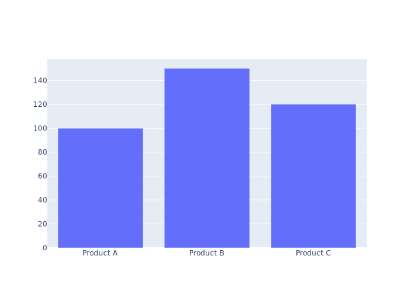
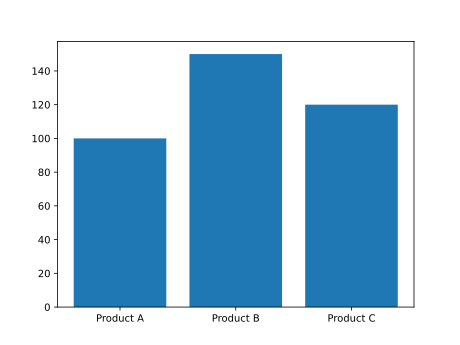
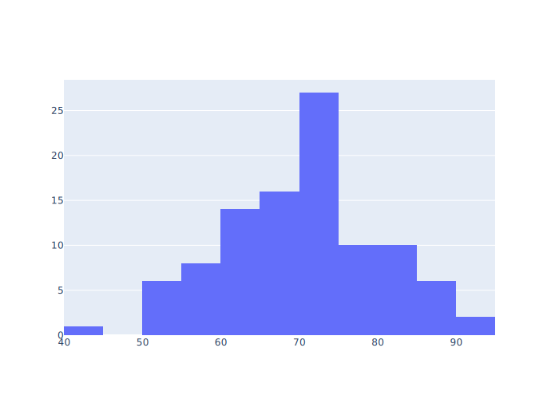
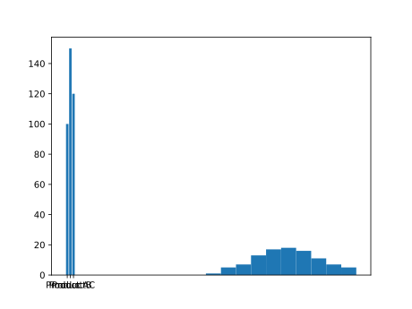
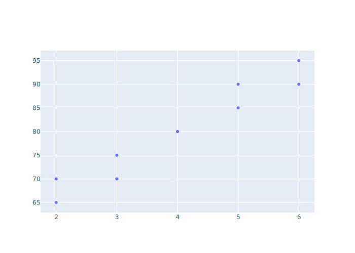
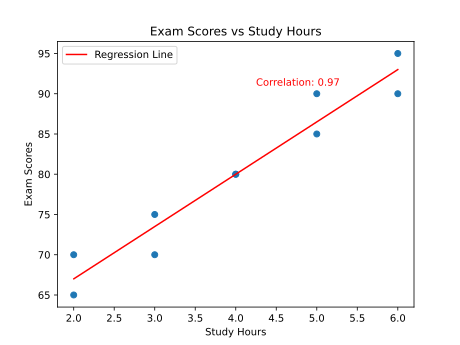
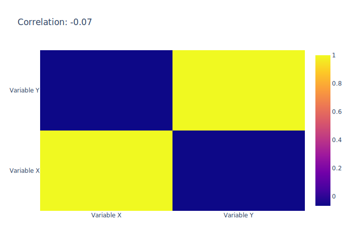
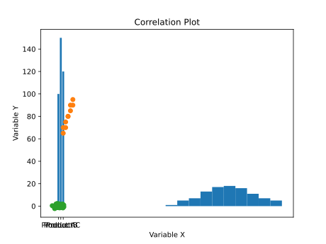

# Statistical Charts
We recommend using **Plotly** since it allows for interactive visualizations and more complex/powerful graphs with less code. [See more here](https://plotly.com/python/)

## Table of Contents:
  - [Bar Charts](#bar-charts)
  - [Histograms](#histograms)
  - [Scatter Plots](#scatter-plots)
  - [Correlation Plots](#correlation-plots)
  - [Correlation does not equal causation](#correlation-does-not-equal-causation)
  - [Adjusting Chart Size](#adjusting-size)
  - [Adjusting Axes](#axis-scaling-and-text-rotation)
  - [Adding a Title](#adding-a-title)
  - [Legend Customization](#legend-customization)

  
   
In this lesson, we will explore various statistical charts commonly used in data analysis. These charts provide visual representations of data and help us gain insights and draw conclusions. We'll cover how to generate each chart using Plotly, Matplotlib, and Altair. Let's dive in!

## Bar Charts

Bar charts are used to display categorical data. They consist of vertical or horizontal bars that represent different categories and their corresponding values. Bar charts are excellent for comparing data across different categories.

Here's an example of a bar chart showing the sales of different products:

```python
# Plotly
import plotly.graph_objects as go

categories = ['Product A', 'Product B', 'Product C']
sales = [100, 150, 120]

fig = go.Figure(data=[go.Bar(x=categories, y=sales)])

fig.show()
```



```python
# Matplotlib
import matplotlib.pyplot as plt

categories = ['Product A', 'Product B', 'Product C']
sales = [100, 150, 120]

plt.bar(categories, sales)
plt.show()
```


## Histograms
Histograms are used to display the distribution of numerical data. They consist of a series of adjacent rectangles (bins) that represent the frequency or proportion of data falling within specific intervals. Histograms help us understand the shape and spread of data.

Here's an example of a histogram displaying the distribution of exam scores:

```python
# Plotly
import plotly.graph_objects as go
import numpy as np

np.random.seed(0)
scores = np.random.normal(70, 10, 100)

fig = go.Figure(data=[go.Histogram(x=scores)])

fig.show()
```



```python
# Matplotlib
import matplotlib.pyplot as plt
import numpy as np

np.random.seed(0)
scores = np.random.normal(70, 10, 100)

plt.hist(scores)
plt.show()
```




## Scatter Plots
Scatter plots are used to display the relationship between two numerical variables. Each point on the plot represents the values of the variables. Scatter plots are useful for identifying patterns, trends, and outliers in the data.

Here's an example of a scatter plot showing the relationship between study hours and exam scores:

```python
# Plotly
import plotly.graph_objects as go

study_hours = [3, 4, 2, 5, 6, 5, 3, 4, 2, 6]
exam_scores = [70, 80, 65, 90, 95, 85, 75, 80, 70, 90]

fig = go.Figure(data=go.Scatter(x=study_hours, y=exam_scores, mode='markers'))

fig.show()
```


```python
# Matplotlib
import matplotlib.pyplot as plt

study_hours = [3, 4, 2, 5, 6, 5, 3, 4, 2, 6]
exam_scores = [70, 80, 65, 90, 95, 85, 75, 80, 70, 90]

plt.scatter(study_hours, exam_scores)
plt.show()
```




[See More Info on Regressions, here](Regressions.md)

## Correlation Plots
Correlation plots are used to visualize the strength and direction of the relationship between two numerical variables. They provide a numerical measure called the correlation coefficient, which ranges from -1 to 1. A value close to -1 indicates a strong negative correlation, a value close to 1 indicates a strong positive correlation, and a value close to 0 indicates no or weak correlation.

Here's an example of a correlation plot:
```python
# Plotly
import plotly.graph_objects as go
import numpy as np

np.random.seed(0)
x = np.random.rand(100)
y = np.random.rand(100)

correlation_matrix = np.corrcoef(x, y)
correlation = correlation_matrix[0, 1]

fig = go.Figure(data=go.Heatmap(z=correlation_matrix, x=['Variable X', 'Variable Y'], y=['Variable X', 'Variable Y']))
fig.update_layout(title=f'Correlation: {correlation:.2f}')
fig.show()
```



```python
# Matplotlib
import matplotlib.pyplot as plt
import numpy as np

np.random.seed(0)
x = np.random.normal(0, 1, 100)
y = np.random.normal(0, 1, 100)

plt.scatter(x, y)
plt.xlabel('Variable X')
plt.ylabel('Variable Y')
plt.title('Correlation Plot')
plt.show()
```



## Adjusting the Title, Size, and Axes in Statistical Charts

In general, it would be beneficial to provide users with information on adjusting the overall size of the chart images and the scaling of the axes. This can enhance the clarity of the visualization and help users focus on specific aspects of the data.

### Adjusting Size

#### Plotly Example:
```python
import plotly.graph_objects as go

# Create the figure
fig = go.Figure(data=[go.Bar(x=[1, 2, 3], y=[10, 11, 12])])

# Adjust the size
fig.update_layout(width=800, height=400) #width and height in pixels

# Show the figure
fig.show()
```
#### Matplotlib Example:
```python
import matplotlib.pyplot as plt

# Create the bar chart
plt.bar([1, 2, 3], [10, 11, 12])

# Adjust the size
plt.figure(figsize=(8, 4)) #width and height in inches

# Show the chart
plt.show()
```


### Axis Scaling and Text Rotation
Explaining how to modify the scale of the axes is important, especially when dealing with data that spans a wide range. Whether it's adjusting logarithmic scales or specifying custom ranges, including guidance on axis scaling can make charts more informative.
#### Plotly Example:
```python
import plotly.graph_objects as go

# Create the scatter plot
fig = go.Figure(data=go.Scatter(x=[1, 2, 3], y=[10, 100, 1000]))

# Adjust the y-axis to logarithmic scale
fig.update_yaxes(type="log")

# Adjust the rotational degree of text along the x-axis 
fig.update_xaxes(tickangle=45)

# Show the plot
fig.show()
```
#### Matplotlib Example:
```python
import matplotlib.pyplot as plt

# Create the scatter plot
plt.scatter([1, 2, 3], [10, 100, 1000])

# Adjust the y-axis to logarithmic scale
plt.yscale("log")

# Adjust the rotational degree of text along the x-axis 
plt.xticks(rotation=45)

# Show the plot
plt.show()
```


### Adding a title
#### Plotly Example:
```python
import plotly.graph_objects as go

# Create the bar chart
fig = go.Figure(data=[go.Bar(x=[1, 2, 3], y=[10, 11, 12])])

# Add a title
fig.update_layout(title_text="Sales by Product")

# Show the chart
fig.show()
```
#### Matplotlib Example:
```python
import matplotlib.pyplot as plt

# Create the bar chart
plt.bar([1, 2, 3], [10, 11, 12])

# Add a title
plt.title("Sales by Product")

# Show the chart
plt.show()
```

### Legend Customization
#### Plotly Example:
```python
import plotly.graph_objects as go

# Create the scatter plot
fig = go.Figure(data=go.Scatter(x=[1, 2, 3], y=[10, 11, 12], name="Data Series"))

# Customize legend position
fig.update_layout(legend=dict(x=0, y=1))

# Show the plot
fig.show()
```
#### Matplotlib Example:
```python
import matplotlib.pyplot as plt

# Create the scatter plot
plt.scatter([1, 2, 3], [10, 11, 12], label="Data Series")

# Customize legend position
plt.legend(loc="upper left")

# Show the plot
plt.show()
```

## Correlation Does Not Equal Causation
It's crucial to understand that correlation does not imply causation. Just because two variables are correlated does not mean that one variable causes the other. Correlation measures the statistical relationship between variables but cannot determine cause and effect.

Always exercise caution when interpreting correlations and avoid making causal claims based solely on correlation. Other factors, such as confounding variables, might be influencing the observed relationship.

Remember, correlation is not causation!


For example: 

Image Source: [Spurious Correlations by Tyler Vigen](https://www.tylervigen.com/spurious-correlations)

Although these two are strongly correlated, married couples that eat more margarine are not guaranteed to get divorced.

