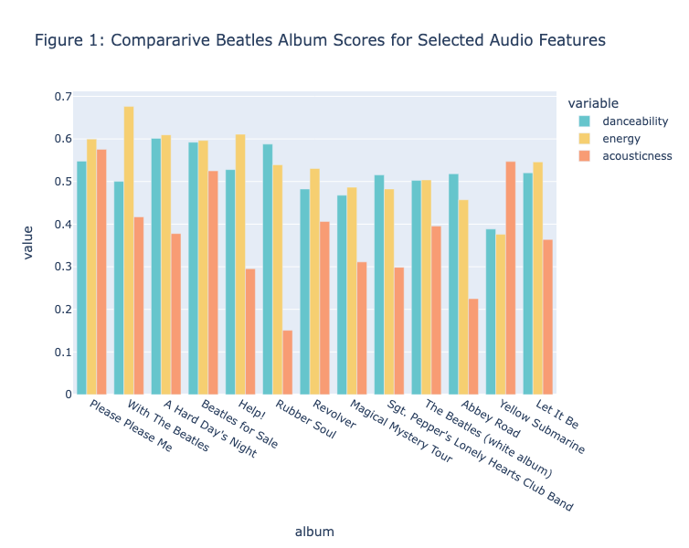
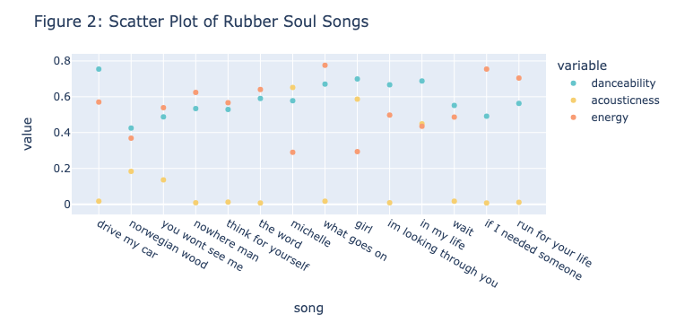

# Encoding Music Sample Homework Project
Richard Freedman
2024-06-25

# A Sample Homework Project

This sample homework project will show you in a nutshell what your work
for Encoding Music should look like. It follows the [Notebook Style
Guide](https://github.com/RichardFreedman/music_style_guide/blob/main/M255_Notebook_Style_Guide.md)
and [Music Style
Guide](https://github.com/RichardFreedman/music_style_guide). And it
also demonstrates the key sections of every notebook submitted for a
class assignment or project:

-   The preliminaries: Quarto YAML cell and code import statement
-   The three main sections: Motivation/Implementation/Interpretation
-   The bibliography of sources consulted

### 0. Quarto YAML cell and Import Statement

The Quarto YAML cell will contain the title, name of author(s) and date
for your assignment.

The Import Statement is just that: the code cell where you import all
relevant libraries for your work,

### 1. Motivation

What is your point of inquiry? What are you trying discover? What do you
*expect* to find? How do these questions relate to themes and problems
considered in the course so far?

What specific readings or musical repertories are involved, and why do
they matter in this context (be sure to cite them, and to follow the
Music Style Guide as you do so)?

### 2. Implementation

How did you put your query into practice? What did you need to do with
or to your data along the way?

-   What *logical* steps did you follow as you thought about getting
    there (expressed in pseudo code; perhaps in bullet-point form in
    your markdown cell)?
-   Which tools (or methods) did you select, and why were they right for
    the job?
-   If you chose to create some kind of visualization (a chart, network
    or map), how did you decide on the right representation for the task
    at hand?
-   What challenges did you face as you worked to put the steps into
    action in code? Did you need to clean or tidy your data? Filter,
    sort, or group it in some way?
-   What were the most important tools or approaches you deployed that
    others might like to know about?

Remember to use `verbatim code` or **block code** to show your work as
needed. Remember to add **comments** to your code to show the most
important steps.

If you learned from or adapted some code suggested in Encoding Music, or
another resource, it would be good to cite that documentation, too.

### 3. Interpretation

What did you learn from the results? How were your expectations
confirmed (or not)?

What limitations did the data or your methods impose on your capacity to
answer the questions you originally posed?

How do your results change your views of the readings or ideas that
motivated your work it the first place? How do your results shape your
listening experience of the music you considered? What next steps do you
imagine for future work?

### 4. Bibliography

A list of the sources consulted and cited during your work, including
class readings or code resources, Spotify lists, etc. See the [Notebook
Style
Guide](https://github.com/RichardFreedman/music_style_guide/blob/main/M255_Notebook_Style_Guide.md)
and [Music Style
Guide](https://github.com/RichardFreedman/music_style_guide) for details
about how to cite books, articles, internet resources, etc.

# 0. Import Libraries

Here I import the essential libraries for this assignment.

``` python
# import libraries
from community import community_louvain
from copy import deepcopy
from IPython.display import SVG
import altair as alt
import glob as glob
import numpy as np
import os
import pandas as pd
import re
import networkx as nx
import plotly.express as px
import requests

# setup plotting for quarto
alt.renderers.enable('default')
import plotly.io as pio
pio.renderers.default = "plotly_mimetype+notebook_connected"

# supress warnings
import warnings
warnings.filterwarnings('ignore')
```

# 1. Motivation

The Beatles are my favorite band, and I know that their music underwent
rapid and profound change during the 1960s. The albumns *Rubber Soul*
(1965) and *Revolver* (1966) held pivotal places in this evolution, as
Walter Everett explained in his excellent 1999 book, *The Beatles as
Musicians: Revolver to The Anthology*. So I was interested to see
whether this change was in any way evident in the kind of “music
feature” data derived from the recordings themselves, in this case by
Spotify.

Can we see any trends across the Beatles output based on the sound
itself? Can we find any albumns that stand out from others? And how
would the evidence provided by Spotify’s machine analysis tools align
with my own impressions of the music, or Everett’s?

# 2. Implementation

Prof. Freedman has conveniently assembled the Spotify data on all of the
Beatles albumns as a single CSV file. So this would be a simple starting
place. But since I am still a bit uncertain about the what Spotify’s
audio features are like, I thought the best first step would be to look
at the columns in that data set and see which of them might be good
candidates to tell me a bit more about the “range” of ratings for each.
If I am looking for change, then I need features (or combinations of
features) that have the widest possibility for variation.

I looked at the columns as a list: `beatles_spotify.columns`, which
yielded (among the music feature categories)
`['danceability', 'energy', 'speechiness','acousticness', 'liveness', 'valence']`.
Based on my exploration of the Spotify documentation and Nick Seaver’s
*Computing Taste Algorithms and the Makers of Music Recommendation* I
thought that ‘danceability’, ‘energy’, and ‘acousticness’ seemed the the
categores most likely to reveal the trends I was interested in,
particularly since (as I learned from Everett) the Beatles’ recordings
moved from a concert and dance music context to a contemplative,
narrative and listening one. I guessed that I might see a decline in
danceability over time and also a decline in acousticness (as more
studio techniques came to the fore).

As explained in the code cells below, I broke this down into several
exploratory steps:

2A. I looked at the range of data for each audio feature, in this case
by cutting the data for all tracks into ‘bins’ for each column using the
Pandas ‘cut’ method. There were some clear trends here, but since this
was at the *track* level it was hard for me to say much about individual
albumns over time.

2B. Then I came up with ways of aggregating the data for each album
using Pandas `groupby` operations. These are a bit tricky to understand,
but using this I was easily able to say something about each. The key
think with `groupby` is to remember that you need to pass in a *list* of
the columns, and then specify the function to apply to each of them (in
this case: `mean`. Resetting the index gets the year and album names
back in the dataframe and makes the whole easier to parse in subsequent
steps. The complete code is:

``` python
grouped_data = beatles_spotify.groupby(['year', "album"])[['danceability', 'energy', 'acousticness']].mean()
grouped_data = grouped_data.reset_index()
```

2C. The resulting dataframe of results was hard for me to interpret, so
I hit upon the idea of showing a kind of ‘triple bar chart’ for each
album, with a consistent color for each feature. This was useful, since
it allowed me to see what was distinctive about certain records as a
whole. *Rubber Soul* stood out on account of the *divergence* between
the audio features (it hasd a much *lower* score for ‘acousticness’ in
relation to the other features than any other album.

2D. This in turn prompted me to make a scatterplot for this album on its
own and then to test those results against my own impressions and those
of my authors.

The commented code for each of these appears in the relevant cells
below.

#### Getting the Data from the CSV

``` python
# the address of the shared CSV provided by Prof Freedman
beatles_spotify_csv = 'https://docs.google.com/spreadsheets/d/e/2PACX-1vRCv45ldJmq0isl2bvWok7AbD5C6JWA0Xf1tBqow5ngX7_ox8c2d846PnH9iLp_SikzgYmvdPHe9k7G/pub?output=csv'
# import that to a Pandas dataframe and name it
beatles_spotify = pd.read_csv(beatles_spotify_csv)
```

#### Checking the column names

``` python
# find the columns in the dataframe
beatles_spotify.columns
```

    Index(['id', 'year', 'album', 'song', 'danceability', 'energy', 'speechiness',
           'acousticness', 'liveness', 'valence', 'duration_ms'],
          dtype='object')

#### Clean up NaNs for now

``` python

# some precautionary cleanup in case of NAs
beatles_spotify.fillna('').head()
```

<div>
<style scoped>
    .dataframe tbody tr th:only-of-type {
        vertical-align: middle;
    }

    .dataframe tbody tr th {
        vertical-align: top;
    }

    .dataframe thead th {
        text-align: right;
    }
</style>

<table class="dataframe" data-quarto-postprocess="true" data-border="1">
<thead>
<tr class="header" style="text-align: right;">
<th data-quarto-table-cell-role="th"></th>
<th data-quarto-table-cell-role="th">id</th>
<th data-quarto-table-cell-role="th">year</th>
<th data-quarto-table-cell-role="th">album</th>
<th data-quarto-table-cell-role="th">song</th>
<th data-quarto-table-cell-role="th">danceability</th>
<th data-quarto-table-cell-role="th">energy</th>
<th data-quarto-table-cell-role="th">speechiness</th>
<th data-quarto-table-cell-role="th">acousticness</th>
<th data-quarto-table-cell-role="th">liveness</th>
<th data-quarto-table-cell-role="th">valence</th>
<th data-quarto-table-cell-role="th">duration_ms</th>
</tr>
</thead>
<tbody>
<tr class="odd">
<td data-quarto-table-cell-role="th">0</td>
<td>1</td>
<td>1963</td>
<td>Please Please Me</td>
<td>I Saw Her Standing There</td>
<td>0.491</td>
<td>0.801</td>
<td>0.0361</td>
<td>0.270</td>
<td>0.0665</td>
<td>0.971</td>
<td>173947</td>
</tr>
<tr class="even">
<td data-quarto-table-cell-role="th">1</td>
<td>2</td>
<td>1963</td>
<td>Please Please Me</td>
<td>Misery</td>
<td>0.591</td>
<td>0.605</td>
<td>0.0413</td>
<td>0.707</td>
<td>0.3090</td>
<td>0.882</td>
<td>108547</td>
</tr>
<tr class="odd">
<td data-quarto-table-cell-role="th">2</td>
<td>3</td>
<td>1963</td>
<td>Please Please Me</td>
<td>Anna</td>
<td>0.608</td>
<td>0.565</td>
<td>0.0336</td>
<td>0.635</td>
<td>0.0601</td>
<td>0.835</td>
<td>177133</td>
</tr>
<tr class="even">
<td data-quarto-table-cell-role="th">3</td>
<td>4</td>
<td>1963</td>
<td>Please Please Me</td>
<td>Chains</td>
<td>0.654</td>
<td>0.561</td>
<td>0.0304</td>
<td>0.608</td>
<td>0.1290</td>
<td>0.929</td>
<td>145080</td>
</tr>
<tr class="odd">
<td data-quarto-table-cell-role="th">4</td>
<td>5</td>
<td>1963</td>
<td>Please Please Me</td>
<td>Boys</td>
<td>0.402</td>
<td>0.860</td>
<td>0.0504</td>
<td>0.607</td>
<td>0.7360</td>
<td>0.822</td>
<td>146440</td>
</tr>
</tbody>
</table>

</div>

#### 2a: An informal way to review the range of values in each feature, over all albums

``` python
# and a very informal way to look at my columns to get a sense of the range of values across the albumns
# below I use the pandas "cut" method to split the data into 'bins' of similar values

# my preferred cols as a lis
column_list = ['danceability', 'energy', 'acousticness']
# a for loop
for col in column_list:
    # show the 'binned' values for each feature column
    print(pd.cut(beatles_spotify[col], bins=4).value_counts())
```

    danceability
    (0.513, 0.696]    93
    (0.33, 0.513]     62
    (0.145, 0.33]     19
    (0.696, 0.88]     19
    Name: count, dtype: int64
    energy
    (0.53, 0.749]     74
    (0.31, 0.53]      67
    (0.749, 0.969]    27
    (0.0893, 0.31]    25
    Name: count, dtype: int64
    acousticness
    (-0.000928, 0.243]    77
    (0.243, 0.486]        47
    (0.486, 0.728]        41
    (0.728, 0.971]        28
    Name: count, dtype: int64

#### 2b: Groupby operation using year/album, then the chosen audio features to find the mean values for each

``` python
grouped_data = beatles_spotify.groupby(['year', "album"])[['danceability', 'energy', 'acousticness']].mean()
grouped_data = grouped_data.reset_index()
grouped_data.style.set_caption("Table 1: Selected Mean Audio Feature Values for Beatles Albums").set_table_styles([{
    'selector': 'caption',
    'props': [
        ('color', 'black'),
        ('font-size', '18px')
    ]
}])
```

<style type="text/css">
#T_53880 caption {
  color: black;
  font-size: 18px;
}
</style>

<table id="T_53880" data-quarto-postprocess="true">
<thead>
<tr class="header">
<th class="blank level0" data-quarto-table-cell-role="th"> </th>
<th id="T_53880_level0_col0" class="col_heading level0 col0"
data-quarto-table-cell-role="th">year</th>
<th id="T_53880_level0_col1" class="col_heading level0 col1"
data-quarto-table-cell-role="th">album</th>
<th id="T_53880_level0_col2" class="col_heading level0 col2"
data-quarto-table-cell-role="th">danceability</th>
<th id="T_53880_level0_col3" class="col_heading level0 col3"
data-quarto-table-cell-role="th">energy</th>
<th id="T_53880_level0_col4" class="col_heading level0 col4"
data-quarto-table-cell-role="th">acousticness</th>
</tr>
</thead>
<tbody>
<tr class="odd">
<td id="T_53880_level0_row0" class="row_heading level0 row0"
data-quarto-table-cell-role="th">0</td>
<td id="T_53880_row0_col0" class="data row0 col0">1963</td>
<td id="T_53880_row0_col1" class="data row0 col1">Please Please Me</td>
<td id="T_53880_row0_col2" class="data row0 col2">0.547929</td>
<td id="T_53880_row0_col3" class="data row0 col3">0.599786</td>
<td id="T_53880_row0_col4" class="data row0 col4">0.575500</td>
</tr>
<tr class="even">
<td id="T_53880_level0_row1" class="row_heading level0 row1"
data-quarto-table-cell-role="th">1</td>
<td id="T_53880_row1_col0" class="data row1 col0">1963</td>
<td id="T_53880_row1_col1" class="data row1 col1">With The Beatles</td>
<td id="T_53880_row1_col2" class="data row1 col2">0.500357</td>
<td id="T_53880_row1_col3" class="data row1 col3">0.676143</td>
<td id="T_53880_row1_col4" class="data row1 col4">0.417071</td>
</tr>
<tr class="odd">
<td id="T_53880_level0_row2" class="row_heading level0 row2"
data-quarto-table-cell-role="th">2</td>
<td id="T_53880_row2_col0" class="data row2 col0">1964</td>
<td id="T_53880_row2_col1" class="data row2 col1">A Hard Day's
Night</td>
<td id="T_53880_row2_col2" class="data row2 col2">0.601462</td>
<td id="T_53880_row2_col3" class="data row2 col3">0.609538</td>
<td id="T_53880_row2_col4" class="data row2 col4">0.377900</td>
</tr>
<tr class="even">
<td id="T_53880_level0_row3" class="row_heading level0 row3"
data-quarto-table-cell-role="th">3</td>
<td id="T_53880_row3_col0" class="data row3 col0">1964</td>
<td id="T_53880_row3_col1" class="data row3 col1">Beatles for Sale</td>
<td id="T_53880_row3_col2" class="data row3 col2">0.592286</td>
<td id="T_53880_row3_col3" class="data row3 col3">0.596429</td>
<td id="T_53880_row3_col4" class="data row3 col4">0.525000</td>
</tr>
<tr class="odd">
<td id="T_53880_level0_row4" class="row_heading level0 row4"
data-quarto-table-cell-role="th">4</td>
<td id="T_53880_row4_col0" class="data row4 col0">1965</td>
<td id="T_53880_row4_col1" class="data row4 col1">Help!</td>
<td id="T_53880_row4_col2" class="data row4 col2">0.528000</td>
<td id="T_53880_row4_col3" class="data row4 col3">0.610929</td>
<td id="T_53880_row4_col4" class="data row4 col4">0.295386</td>
</tr>
<tr class="even">
<td id="T_53880_level0_row5" class="row_heading level0 row5"
data-quarto-table-cell-role="th">5</td>
<td id="T_53880_row5_col0" class="data row5 col0">1965</td>
<td id="T_53880_row5_col1" class="data row5 col1">Rubber Soul</td>
<td id="T_53880_row5_col2" class="data row5 col2">0.587786</td>
<td id="T_53880_row5_col3" class="data row5 col3">0.539357</td>
<td id="T_53880_row5_col4" class="data row5 col4">0.150806</td>
</tr>
<tr class="odd">
<td id="T_53880_level0_row6" class="row_heading level0 row6"
data-quarto-table-cell-role="th">6</td>
<td id="T_53880_row6_col0" class="data row6 col0">1966</td>
<td id="T_53880_row6_col1" class="data row6 col1">Revolver</td>
<td id="T_53880_row6_col2" class="data row6 col2">0.482429</td>
<td id="T_53880_row6_col3" class="data row6 col3">0.530571</td>
<td id="T_53880_row6_col4" class="data row6 col4">0.406135</td>
</tr>
<tr class="even">
<td id="T_53880_level0_row7" class="row_heading level0 row7"
data-quarto-table-cell-role="th">7</td>
<td id="T_53880_row7_col0" class="data row7 col0">1967</td>
<td id="T_53880_row7_col1" class="data row7 col1">Magical Mystery
Tour</td>
<td id="T_53880_row7_col2" class="data row7 col2">0.467727</td>
<td id="T_53880_row7_col3" class="data row7 col3">0.486545</td>
<td id="T_53880_row7_col4" class="data row7 col4">0.311273</td>
</tr>
<tr class="odd">
<td id="T_53880_level0_row8" class="row_heading level0 row8"
data-quarto-table-cell-role="th">8</td>
<td id="T_53880_row8_col0" class="data row8 col0">1967</td>
<td id="T_53880_row8_col1" class="data row8 col1">Sgt. Pepper's Lonely
Hearts Club Band</td>
<td id="T_53880_row8_col2" class="data row8 col2">0.515385</td>
<td id="T_53880_row8_col3" class="data row8 col3">0.482538</td>
<td id="T_53880_row8_col4" class="data row8 col4">0.298762</td>
</tr>
<tr class="even">
<td id="T_53880_level0_row9" class="row_heading level0 row9"
data-quarto-table-cell-role="th">9</td>
<td id="T_53880_row9_col0" class="data row9 col0">1968</td>
<td id="T_53880_row9_col1" class="data row9 col1">The Beatles (white
album)</td>
<td id="T_53880_row9_col2" class="data row9 col2">0.502567</td>
<td id="T_53880_row9_col3" class="data row9 col3">0.503810</td>
<td id="T_53880_row9_col4" class="data row9 col4">0.395290</td>
</tr>
<tr class="odd">
<td id="T_53880_level0_row10" class="row_heading level0 row10"
data-quarto-table-cell-role="th">10</td>
<td id="T_53880_row10_col0" class="data row10 col0">1969</td>
<td id="T_53880_row10_col1" class="data row10 col1">Abbey Road</td>
<td id="T_53880_row10_col2" class="data row10 col2">0.518000</td>
<td id="T_53880_row10_col3" class="data row10 col3">0.457176</td>
<td id="T_53880_row10_col4" class="data row10 col4">0.224964</td>
</tr>
<tr class="even">
<td id="T_53880_level0_row11" class="row_heading level0 row11"
data-quarto-table-cell-role="th">11</td>
<td id="T_53880_row11_col0" class="data row11 col0">1969</td>
<td id="T_53880_row11_col1" class="data row11 col1">Yellow
Submarine</td>
<td id="T_53880_row11_col2" class="data row11 col2">0.388462</td>
<td id="T_53880_row11_col3" class="data row11 col3">0.376046</td>
<td id="T_53880_row11_col4" class="data row11 col4">0.546945</td>
</tr>
<tr class="odd">
<td id="T_53880_level0_row12" class="row_heading level0 row12"
data-quarto-table-cell-role="th">12</td>
<td id="T_53880_row12_col0" class="data row12 col0">1970</td>
<td id="T_53880_row12_col1" class="data row12 col1">Let It Be</td>
<td id="T_53880_row12_col2" class="data row12 col2">0.520417</td>
<td id="T_53880_row12_col3" class="data row12 col3">0.545917</td>
<td id="T_53880_row12_col4" class="data row12 col4">0.364050</td>
</tr>
</tbody>
</table>

#### 2c: A Plotly barchart to show the comparative values for each in a graphical way

``` python
fig = px.bar(grouped_data,
             x='album',
             y=['danceability', 'energy', 'acousticness'],
             labels={'danceability': 'Danceability', 'energy': 'Energy', 'acousticness': 'Acousticness'},
             title='Figure 1: Compararive Beatles Album Scores for Selected Audio Features',
             color_discrete_sequence=px.colors.qualitative.Pastel)

# Update layout for better visualization
fig.update_layout(barmode='group', width=800, height=600)

# Show the figure
fig.show()
```

        <script type="text/javascript">
        window.PlotlyConfig = {MathJaxConfig: 'local'};
        if (window.MathJax && window.MathJax.Hub && window.MathJax.Hub.Config) {window.MathJax.Hub.Config({SVG: {font: "STIX-Web"}});}
        if (typeof require !== 'undefined') {
        require.undef("plotly");
        requirejs.config({
            paths: {
                'plotly': ['https://cdn.plot.ly/plotly-2.27.0.min']
            }
        });
        require(['plotly'], function(Plotly) {
            window._Plotly = Plotly;
        });
        }
        </script>
        



#### 2d: Exploring Rubber Soul Features

``` python
# filtering full dataset for just this album
rubber_soul = beatles_spotify[beatles_spotify['album'] == 'Rubber Soul']
# create table and caption
rubber_soul.style.set_caption("Table 2: Rubber Soul Audio Features").set_table_styles([{
    'selector': 'caption',
    'props': [
        ('color', 'black'),
        ('font-size', '18px')
    ]
}])
```

<style type="text/css">
#T_2d258 caption {
  color: black;
  font-size: 18px;
}
</style>

<table id="T_2d258" data-quarto-postprocess="true">
<thead>
<tr class="header">
<th class="blank level0" data-quarto-table-cell-role="th"> </th>
<th id="T_2d258_level0_col0" class="col_heading level0 col0"
data-quarto-table-cell-role="th">id</th>
<th id="T_2d258_level0_col1" class="col_heading level0 col1"
data-quarto-table-cell-role="th">year</th>
<th id="T_2d258_level0_col2" class="col_heading level0 col2"
data-quarto-table-cell-role="th">album</th>
<th id="T_2d258_level0_col3" class="col_heading level0 col3"
data-quarto-table-cell-role="th">song</th>
<th id="T_2d258_level0_col4" class="col_heading level0 col4"
data-quarto-table-cell-role="th">danceability</th>
<th id="T_2d258_level0_col5" class="col_heading level0 col5"
data-quarto-table-cell-role="th">energy</th>
<th id="T_2d258_level0_col6" class="col_heading level0 col6"
data-quarto-table-cell-role="th">speechiness</th>
<th id="T_2d258_level0_col7" class="col_heading level0 col7"
data-quarto-table-cell-role="th">acousticness</th>
<th id="T_2d258_level0_col8" class="col_heading level0 col8"
data-quarto-table-cell-role="th">liveness</th>
<th id="T_2d258_level0_col9" class="col_heading level0 col9"
data-quarto-table-cell-role="th">valence</th>
<th id="T_2d258_level0_col10" class="col_heading level0 col10"
data-quarto-table-cell-role="th">duration_ms</th>
</tr>
</thead>
<tbody>
<tr class="odd">
<td id="T_2d258_level0_row0" class="row_heading level0 row0"
data-quarto-table-cell-role="th">69</td>
<td id="T_2d258_row0_col0" class="data row0 col0">70</td>
<td id="T_2d258_row0_col1" class="data row0 col1">1965</td>
<td id="T_2d258_row0_col2" class="data row0 col2">Rubber Soul</td>
<td id="T_2d258_row0_col3" class="data row0 col3">drive my car</td>
<td id="T_2d258_row0_col4" class="data row0 col4">0.754000</td>
<td id="T_2d258_row0_col5" class="data row0 col5">0.571000</td>
<td id="T_2d258_row0_col6" class="data row0 col6">0.042100</td>
<td id="T_2d258_row0_col7" class="data row0 col7">0.017300</td>
<td id="T_2d258_row0_col8" class="data row0 col8">0.300000</td>
<td id="T_2d258_row0_col9" class="data row0 col9">0.820000</td>
<td id="T_2d258_row0_col10" class="data row0 col10">148893</td>
</tr>
<tr class="even">
<td id="T_2d258_level0_row1" class="row_heading level0 row1"
data-quarto-table-cell-role="th">70</td>
<td id="T_2d258_row1_col0" class="data row1 col0">71</td>
<td id="T_2d258_row1_col1" class="data row1 col1">1965</td>
<td id="T_2d258_row1_col2" class="data row1 col2">Rubber Soul</td>
<td id="T_2d258_row1_col3" class="data row1 col3">norwegian wood</td>
<td id="T_2d258_row1_col4" class="data row1 col4">0.425000</td>
<td id="T_2d258_row1_col5" class="data row1 col5">0.369000</td>
<td id="T_2d258_row1_col6" class="data row1 col6">0.037900</td>
<td id="T_2d258_row1_col7" class="data row1 col7">0.183000</td>
<td id="T_2d258_row1_col8" class="data row1 col8">0.112000</td>
<td id="T_2d258_row1_col9" class="data row1 col9">0.650000</td>
<td id="T_2d258_row1_col10" class="data row1 col10">124693</td>
</tr>
<tr class="odd">
<td id="T_2d258_level0_row2" class="row_heading level0 row2"
data-quarto-table-cell-role="th">71</td>
<td id="T_2d258_row2_col0" class="data row2 col0">72</td>
<td id="T_2d258_row2_col1" class="data row2 col1">1965</td>
<td id="T_2d258_row2_col2" class="data row2 col2">Rubber Soul</td>
<td id="T_2d258_row2_col3" class="data row2 col3">you wont see me</td>
<td id="T_2d258_row2_col4" class="data row2 col4">0.488000</td>
<td id="T_2d258_row2_col5" class="data row2 col5">0.539000</td>
<td id="T_2d258_row2_col6" class="data row2 col6">0.030400</td>
<td id="T_2d258_row2_col7" class="data row2 col7">0.136000</td>
<td id="T_2d258_row2_col8" class="data row2 col8">0.053800</td>
<td id="T_2d258_row2_col9" class="data row2 col9">0.473000</td>
<td id="T_2d258_row2_col10" class="data row2 col10">199960</td>
</tr>
<tr class="even">
<td id="T_2d258_level0_row3" class="row_heading level0 row3"
data-quarto-table-cell-role="th">72</td>
<td id="T_2d258_row3_col0" class="data row3 col0">73</td>
<td id="T_2d258_row3_col1" class="data row3 col1">1965</td>
<td id="T_2d258_row3_col2" class="data row3 col2">Rubber Soul</td>
<td id="T_2d258_row3_col3" class="data row3 col3">nowhere man</td>
<td id="T_2d258_row3_col4" class="data row3 col4">0.534000</td>
<td id="T_2d258_row3_col5" class="data row3 col5">0.624000</td>
<td id="T_2d258_row3_col6" class="data row3 col6">0.046200</td>
<td id="T_2d258_row3_col7" class="data row3 col7">0.007970</td>
<td id="T_2d258_row3_col8" class="data row3 col8">0.128000</td>
<td id="T_2d258_row3_col9" class="data row3 col9">0.687000</td>
<td id="T_2d258_row3_col10" class="data row3 col10">163693</td>
</tr>
<tr class="odd">
<td id="T_2d258_level0_row4" class="row_heading level0 row4"
data-quarto-table-cell-role="th">73</td>
<td id="T_2d258_row4_col0" class="data row4 col0">74</td>
<td id="T_2d258_row4_col1" class="data row4 col1">1965</td>
<td id="T_2d258_row4_col2" class="data row4 col2">Rubber Soul</td>
<td id="T_2d258_row4_col3" class="data row4 col3">think for
yourself</td>
<td id="T_2d258_row4_col4" class="data row4 col4">0.529000</td>
<td id="T_2d258_row4_col5" class="data row4 col5">0.567000</td>
<td id="T_2d258_row4_col6" class="data row4 col6">0.028200</td>
<td id="T_2d258_row4_col7" class="data row4 col7">0.012400</td>
<td id="T_2d258_row4_col8" class="data row4 col8">0.072900</td>
<td id="T_2d258_row4_col9" class="data row4 col9">0.799000</td>
<td id="T_2d258_row4_col10" class="data row4 col10">138520</td>
</tr>
<tr class="even">
<td id="T_2d258_level0_row5" class="row_heading level0 row5"
data-quarto-table-cell-role="th">74</td>
<td id="T_2d258_row5_col0" class="data row5 col0">75</td>
<td id="T_2d258_row5_col1" class="data row5 col1">1965</td>
<td id="T_2d258_row5_col2" class="data row5 col2">Rubber Soul</td>
<td id="T_2d258_row5_col3" class="data row5 col3">the word</td>
<td id="T_2d258_row5_col4" class="data row5 col4">0.590000</td>
<td id="T_2d258_row5_col5" class="data row5 col5">0.641000</td>
<td id="T_2d258_row5_col6" class="data row5 col6">0.041600</td>
<td id="T_2d258_row5_col7" class="data row5 col7">0.006820</td>
<td id="T_2d258_row5_col8" class="data row5 col8">0.055300</td>
<td id="T_2d258_row5_col9" class="data row5 col9">0.792000</td>
<td id="T_2d258_row5_col10" class="data row5 col10">163107</td>
</tr>
<tr class="odd">
<td id="T_2d258_level0_row6" class="row_heading level0 row6"
data-quarto-table-cell-role="th">75</td>
<td id="T_2d258_row6_col0" class="data row6 col0">76</td>
<td id="T_2d258_row6_col1" class="data row6 col1">1965</td>
<td id="T_2d258_row6_col2" class="data row6 col2">Rubber Soul</td>
<td id="T_2d258_row6_col3" class="data row6 col3">michelle</td>
<td id="T_2d258_row6_col4" class="data row6 col4">0.578000</td>
<td id="T_2d258_row6_col5" class="data row6 col5">0.290000</td>
<td id="T_2d258_row6_col6" class="data row6 col6">0.034100</td>
<td id="T_2d258_row6_col7" class="data row6 col7">0.652000</td>
<td id="T_2d258_row6_col8" class="data row6 col8">0.105000</td>
<td id="T_2d258_row6_col9" class="data row6 col9">0.666000</td>
<td id="T_2d258_row6_col10" class="data row6 col10">162373</td>
</tr>
<tr class="even">
<td id="T_2d258_level0_row7" class="row_heading level0 row7"
data-quarto-table-cell-role="th">76</td>
<td id="T_2d258_row7_col0" class="data row7 col0">77</td>
<td id="T_2d258_row7_col1" class="data row7 col1">1965</td>
<td id="T_2d258_row7_col2" class="data row7 col2">Rubber Soul</td>
<td id="T_2d258_row7_col3" class="data row7 col3">what goes on</td>
<td id="T_2d258_row7_col4" class="data row7 col4">0.670000</td>
<td id="T_2d258_row7_col5" class="data row7 col5">0.776000</td>
<td id="T_2d258_row7_col6" class="data row7 col6">0.074900</td>
<td id="T_2d258_row7_col7" class="data row7 col7">0.016800</td>
<td id="T_2d258_row7_col8" class="data row7 col8">0.073200</td>
<td id="T_2d258_row7_col9" class="data row7 col9">0.765000</td>
<td id="T_2d258_row7_col10" class="data row7 col10">168573</td>
</tr>
<tr class="odd">
<td id="T_2d258_level0_row8" class="row_heading level0 row8"
data-quarto-table-cell-role="th">77</td>
<td id="T_2d258_row8_col0" class="data row8 col0">78</td>
<td id="T_2d258_row8_col1" class="data row8 col1">1965</td>
<td id="T_2d258_row8_col2" class="data row8 col2">Rubber Soul</td>
<td id="T_2d258_row8_col3" class="data row8 col3">girl</td>
<td id="T_2d258_row8_col4" class="data row8 col4">0.699000</td>
<td id="T_2d258_row8_col5" class="data row8 col5">0.294000</td>
<td id="T_2d258_row8_col6" class="data row8 col6">0.029400</td>
<td id="T_2d258_row8_col7" class="data row8 col7">0.587000</td>
<td id="T_2d258_row8_col8" class="data row8 col8">0.117000</td>
<td id="T_2d258_row8_col9" class="data row8 col9">0.893000</td>
<td id="T_2d258_row8_col10" class="data row8 col10">151720</td>
</tr>
<tr class="even">
<td id="T_2d258_level0_row9" class="row_heading level0 row9"
data-quarto-table-cell-role="th">78</td>
<td id="T_2d258_row9_col0" class="data row9 col0">79</td>
<td id="T_2d258_row9_col1" class="data row9 col1">1965</td>
<td id="T_2d258_row9_col2" class="data row9 col2">Rubber Soul</td>
<td id="T_2d258_row9_col3" class="data row9 col3">im looking through
you</td>
<td id="T_2d258_row9_col4" class="data row9 col4">0.667000</td>
<td id="T_2d258_row9_col5" class="data row9 col5">0.498000</td>
<td id="T_2d258_row9_col6" class="data row9 col6">0.036400</td>
<td id="T_2d258_row9_col7" class="data row9 col7">0.007720</td>
<td id="T_2d258_row9_col8" class="data row9 col8">0.048100</td>
<td id="T_2d258_row9_col9" class="data row9 col9">0.774000</td>
<td id="T_2d258_row9_col10" class="data row9 col10">146387</td>
</tr>
<tr class="odd">
<td id="T_2d258_level0_row10" class="row_heading level0 row10"
data-quarto-table-cell-role="th">79</td>
<td id="T_2d258_row10_col0" class="data row10 col0">80</td>
<td id="T_2d258_row10_col1" class="data row10 col1">1965</td>
<td id="T_2d258_row10_col2" class="data row10 col2">Rubber Soul</td>
<td id="T_2d258_row10_col3" class="data row10 col3">in my life</td>
<td id="T_2d258_row10_col4" class="data row10 col4">0.688000</td>
<td id="T_2d258_row10_col5" class="data row10 col5">0.435000</td>
<td id="T_2d258_row10_col6" class="data row10 col6">0.032300</td>
<td id="T_2d258_row10_col7" class="data row10 col7">0.449000</td>
<td id="T_2d258_row10_col8" class="data row10 col8">0.113000</td>
<td id="T_2d258_row10_col9" class="data row10 col9">0.435000</td>
<td id="T_2d258_row10_col10" class="data row10 col10">146333</td>
</tr>
<tr class="even">
<td id="T_2d258_level0_row11" class="row_heading level0 row11"
data-quarto-table-cell-role="th">80</td>
<td id="T_2d258_row11_col0" class="data row11 col0">81</td>
<td id="T_2d258_row11_col1" class="data row11 col1">1965</td>
<td id="T_2d258_row11_col2" class="data row11 col2">Rubber Soul</td>
<td id="T_2d258_row11_col3" class="data row11 col3">wait</td>
<td id="T_2d258_row11_col4" class="data row11 col4">0.552000</td>
<td id="T_2d258_row11_col5" class="data row11 col5">0.487000</td>
<td id="T_2d258_row11_col6" class="data row11 col6">0.040000</td>
<td id="T_2d258_row11_col7" class="data row11 col7">0.017500</td>
<td id="T_2d258_row11_col8" class="data row11 col8">0.105000</td>
<td id="T_2d258_row11_col9" class="data row11 col9">0.657000</td>
<td id="T_2d258_row11_col10" class="data row11 col10">134720</td>
</tr>
<tr class="odd">
<td id="T_2d258_level0_row12" class="row_heading level0 row12"
data-quarto-table-cell-role="th">81</td>
<td id="T_2d258_row12_col0" class="data row12 col0">82</td>
<td id="T_2d258_row12_col1" class="data row12 col1">1965</td>
<td id="T_2d258_row12_col2" class="data row12 col2">Rubber Soul</td>
<td id="T_2d258_row12_col3" class="data row12 col3">if I needed
someone</td>
<td id="T_2d258_row12_col4" class="data row12 col4">0.492000</td>
<td id="T_2d258_row12_col5" class="data row12 col5">0.755000</td>
<td id="T_2d258_row12_col6" class="data row12 col6">0.033100</td>
<td id="T_2d258_row12_col7" class="data row12 col7">0.007480</td>
<td id="T_2d258_row12_col8" class="data row12 col8">0.102000</td>
<td id="T_2d258_row12_col9" class="data row12 col9">0.796000</td>
<td id="T_2d258_row12_col10" class="data row12 col10">142267</td>
</tr>
<tr class="even">
<td id="T_2d258_level0_row13" class="row_heading level0 row13"
data-quarto-table-cell-role="th">82</td>
<td id="T_2d258_row13_col0" class="data row13 col0">83</td>
<td id="T_2d258_row13_col1" class="data row13 col1">1965</td>
<td id="T_2d258_row13_col2" class="data row13 col2">Rubber Soul</td>
<td id="T_2d258_row13_col3" class="data row13 col3">run for your
life</td>
<td id="T_2d258_row13_col4" class="data row13 col4">0.563000</td>
<td id="T_2d258_row13_col5" class="data row13 col5">0.705000</td>
<td id="T_2d258_row13_col6" class="data row13 col6">0.103000</td>
<td id="T_2d258_row13_col7" class="data row13 col7">0.010300</td>
<td id="T_2d258_row13_col8" class="data row13 col8">0.055200</td>
<td id="T_2d258_row13_col9" class="data row13 col9">0.822000</td>
<td id="T_2d258_row13_col10" class="data row13 col10">141093</td>
</tr>
</tbody>
</table>

#### A Plotly Scatterplot for Rubber Soul

``` python
fig = px.scatter(rubber_soul, 
                 x='song', 
                 y=['danceability', 'acousticness', 'energy'], 
                 color_discrete_sequence=px.colors.qualitative.Pastel)
fig.update_layout(title_text="Figure 2: Scatter Plot of Rubber Soul Songs")
fig.show()
```



# 3. Interpretation

I was both surprised by and curious to explore the results. Based on the
audio feature data I selected, *Rubber Soul* is clearly an outlier among
the other album on account of the very wide gulf between the mean
‘danceability and energy’ on one hand and the ‘acousticness’ on the
other. Of course we cannot be completely how the Spotify assigns a
single value to a track (much less the ‘mean’ scores that I derived from
those individual pieces). But the *differential* is nevertheless
striking. What might it mean?

A low score in ‘acousticness’ might be another way of saying that these
pieces are *more* electric, or at least more characterized by enriched
timbres of the sort one could produce in the studio. And indeed this is
one of the important trends that marks the Beatles’ development as
musicians during this critical phase of their careers as a *studio*
band.

So with this insight in mind, I decided to look more closely at the data
for individual songs in *Rubber Soul* and test these against my own
impressions of the music (and against what Everett said). What is
fascinating to me is that many of the songs that are characterized by
Spotify as ‘low’ in acousticness still involve a good deal of very
conventional instruments, voices, and even volume. They are nevertheless
filled with blended voices, and very diverse timbres (sitar, pseudo
harpsichord, echo effects, and so on). This is very interesting, and as
Everett notes, reflects the increasing concern of the Beatles to use the
studio itself as a kind of instrument, quite apart from the actual
instruments and voices involved in the songs!

# 4. Bibliography

Everett, Walter. 1999. *The Beatles as Musicians: Revolver to The
Anthology*. Oxford and New York: Oxford University Press.

Seaver, Nick. 2022. *Computing Taste: Algorithms and the Makers of Music
Recommendation*. Chicago: University of Chicago Press.
