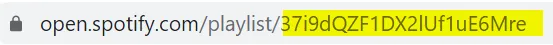
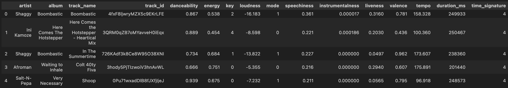
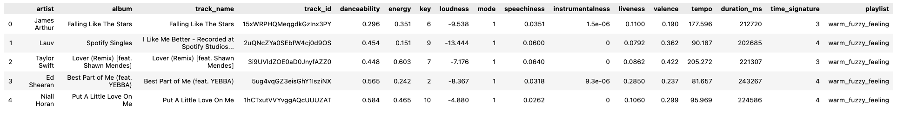
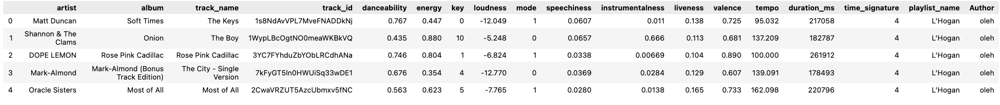

---

# Spotify Functions for the Encoding Music Course
## Table of Contents:
1. [Analyze a Single Playlist](#analyze-a-single-playlist)
2. [Analyze Multiple Playlists](#analyze-multiple-playlists)
3. [Analyze a User's Tracks](#analyze-user-tracks)

##  <span style="color:olive"> Analyze a Single Playlist </span> <a name="analyze-a-single-playlist"></a>

#### This function is used to get the audio features of a Spotify playlist such as: 
- Artist
- Album
- Track Name
- Track ID
- Danceablility
- Energy
- Key
- Loudness
- Mode
- Speechiness
- Instrumentalness
- Liveness
- Valence
- Tempo
- Durations (in ms)
- Time Signature
#### To use this function, you need the creator username of the playlist and the playlist ID. 
---
#### For example:

Image Source: [“Warm Fuzzy Feeling” Playlist by Spotify from Medium Article](https://miro.medium.com/v2/resize:fit:1400/1*P9nEAoRKqybJ4qiORrN7xA.png)

#### From the image above, we get the following:
```python
creator_id = "spotify"
```

Image Source: [“Warm Fuzzy Feeling” Playlist URL from Medium Article](https://miro.medium.com/v2/resize:fit:1106/format:webp/1*RARQekRU6bKakcNTIJo4bQ.png)
#### From the image above, we get the following:
```python
playlist_id = "37i9dQZF1DX5IDTimEWoTd"
```
---
#### Now that we know both the creator username and the playlist ID, we can call the  function <span style="color:olive">analyze_playlist</span> to return a dataframe of the analysis of the playlist:

```python
playlist_data_frame = analyze_playlist(creator_id, playlist_id) #Stores the resulting data frame as the variable: playlist_data_frame
playlist_data_frame.head() #Displays the first n rows of the data frame 
```
<Details>
<Summary>Image of Sample Output</Summary>




</Details>

<Details>
<Summary>
Full Code
</Summary>

```python
def analyze_playlist(creator, playlist_id):
# source: Max Hilsdorf (https://towardsdatascience.com/how-to-create-large-music-datasets-using-spotipy-40e7242cc6a6)

    # Create empty dataframe
    playlist_features_list = ["artist", "album", "track_name", "track_id", 
                             "danceability", "energy", "key", "loudness", "mode", "speechiness",
                             "instrumentalness", "liveness", "valence", "tempo", "duration_ms", "time_signature"]
    playlist_df = pd.DataFrame(columns = playlist_features_list)
    
    # Create empty dict
    playlist_features = {}
    
    # Loop through every track in the playlist, extract features and append the features to the playlist df
    playlist = sp.user_playlist_tracks(creator, playlist_id)["items"]
    for track in playlist:
        # Get metadata
        playlist_features["artist"] = track["track"]["album"]["artists"][0]["name"]
        playlist_features["album"] = track["track"]["album"]["name"]
        playlist_features["track_name"] = track["track"]["name"]
        playlist_features["track_id"] = track["track"]["id"]
        # Get audio features
        audio_features = sp.audio_features(playlist_features["track_id"])[0]
        for feature in playlist_features_list[4:]:
            playlist_features[feature] = audio_features[feature]
        
        # Concat the dfs
        track_df = pd.DataFrame(playlist_features, index = [0])
        playlist_df = pd.concat([playlist_df, track_df], ignore_index = True)
        
    return playlist_df
```
</Details>

---
## <span style="color:olive"> Analyze Multiple Playlists </span> <a name="analyze-multiple-playlists"></a>
#### This function returns the same data frame as the function from above, but allows you to analyze multiple playlists.
---
#### To use this function, you need to create a dictionary of playlists. To do so, see the example code below.
```python
playlist_dict = {
    "PLAYLIST NAME HERE": ("CREATOR_ID HERE", "PLAYLIST_ID HERE")
}
```
```python
playlist_dict = {
    "warm_fuzzy_feeling" : ("spotify", "37i9dQZF1DX5IDTimEWoTd"), 
    #Follow the same format to add more playlists
}
```
---
#### Now that we have created our playlist dictionary, we can call the function <span style="color:olive">analyze_playlist_dict</span> to analyze the audio features of the songs in multiple playlists.
```python
multiple_playlist_data_frame = analyze_playlist_dict(playlist_dict)
multiple_playlist_data_frame.head()
```
<Details>
<Summary>Image of Sample Output</Summary>




</Details>
<Details>
<Summary>
Full Code
</Summary>

```python
def analyze_playlist_dict(playlist_dict):
    
    # Loop through every playlist in the dict and analyze it
    for i, (key, val) in enumerate(playlist_dict.items()):
        playlist_df = analyze_playlist(*val)
        # Add a playlist column so that we can see which playlist a track belongs too
        playlist_df["playlist"] = key
        # Create or concat df
        if i == 0:
            playlist_dict_df = playlist_df
        else:
            playlist_dict_df = pd.concat([playlist_dict_df, playlist_df], ignore_index = True)
            
    return playlist_dict_df
```
</Details>

---

##  <span style="color:olive"> Analyze All of a User's Tracks </span> <a name="analyze-user-tracks"></a>
#### This function allows you to obtain and analyze all the tracks from a user's followed public playlists.

---

#### To use this function, you need to have the Spotify username of the user you want to analyze the tracks from.
```python
my_username = "spotify"
```

---

#### Now that we have the user's Spotify username, we can call the function <span style="color:olive">get_all_user_tracks</span> to analyze all tracks.

```python
all_user_tracks = get_all_user_tracks(my_username)
all_user_tracks.head()
```

<Details>
<Summary>Image of Sample Output</Summary>




</Details>
<Details>
<Summary>
Full Code
</Summary>

```python
def get_all_user_tracks(username):
  all_my_playlists = pd.DataFrame(sp.user_playlists(username))
  list_of_dataframes = []

  for playlist in all_my_playlists.index:
    current_playlist = pd.DataFrame(sp.user_playlist_tracks(username, all_my_playlists["items"][playlist]["id"]))
    current_playlist_audio = get_audio_features_df(current_playlist)
    if all_my_playlists["items"][playlist]["name"]:
      current_playlist_audio["playlist_name"] = all_my_playlists["items"][playlist]["name"]
    else:
       current_playlist_audio["playlist_name"] = None
    list_of_dataframes.append(current_playlist_audio)

  return pd.concat(list_of_dataframes)
```
</Details>