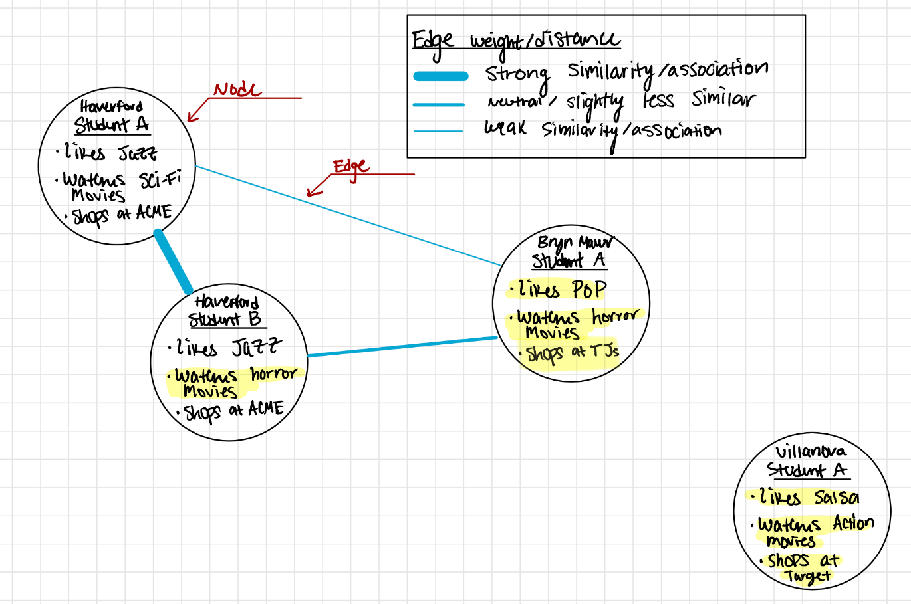

# Introduction to Networks

In the field of data science, networks (also known as graphs) are powerful tools used to represent and study relationships between entities. A network is composed of **nodes** (also called vertices) and **edges** (also called links). Each node represents an entity, while each edge represents a relationship between two entities.

## Nodes
Nodes are the fundamental building blocks of a network. Think of them as the entities or objects you want to study. In a social network, nodes could represent individuals, while in a transportation network, nodes could represent cities or intersections.

## Edges
Edges are the connections between nodes. They show how the entities are related to each other. In a social network, edges could represent friendships, and in a transportation network, edges could represent roads connecting cities.

## Weights
Edges can have an associated **weight**. The weight of an edge represents the strength or intensity of the relationship between the connected nodes. For example, in a co-authorship network, the weight of an edge between two researchers could represent the number of papers they co-authored.

## How are two things more related than others?
Determining the strength of the relationship between two nodes depends on the context of the network. For example, in a social network, the frequency and duration of interactions, mutual friends, and common interests can help establish the strength of friendships. In other cases, such as a transportation network, the distance between nodes could be a factor in determining the weight of the edges.

## Louvain Algorithm

The Louvain algorithm is a community detection algorithm used to find groups of nodes that are densely interconnected with each other within a network. In simpler terms, it helps identify clusters or communities of related nodes.

### How the Louvain Algorithm Works

1. **Step 1: Initialization**
   - Each node is initially assigned to its own community.

2. **Step 2: Iterative Optimization**
   - The algorithm iteratively tries to improve the modularity of the network. Modularity is a measure of how well the nodes are grouped into communities.
   - It does this by attempting to move nodes between communities to increase the overall modularity.

3. **Step 3: Community Aggregation**
   - Once no more improvements can be made, the algorithm aggregates the communities found in the previous step and treats them as individual nodes in a new network.

4. **Step 4: Repeat**
   - The algorithm repeats steps 2 and 3 on the new network until a high modularity value is achieved.

### Why Modularity Matters
Modularity measures how well a network is divided into communities. Higher modularity values indicate better community structures. The Louvain algorithm aims to maximize the modularity by rearranging nodes into communities where they are more densely connected with each other and less connected with nodes in other communities.

## Consider the following example

In the Network graph above, the highlighted characteristics represent the differences between Haverford student A and every other student. We see that Haverford student A & B only have one difference, so the edge weight is strong and the nodes are closer together. Haverford student B and Bryn Mawr student A have two differences, so the edge weight is _relatively_ weaker. We also see a node in our graph that has no connection and has no similarity to the other three nodes.

## Why is Bryn Mawr Student A connected and not Villanova Student A if they both have no similarities to Haverford Student A?
### Reason one
Bryn Mawr student A watches horror movies and Haverford student B also watches horror movies, so they are connected.

### Reason two (less obvious without context)
Haverford and Bryn Mawr are part of the tri-co! Often in network graphs and in data science, machines find an abstract connection between vast amounts of data, often clustering data or nodes together, but that may not always mean that it is directly evident as to what these clusters or connections represent. For example, none of our node bullet points have "_is part of the tri-co_" as a characteristic, but perhaps there is some underlying bias or evidence that may not be evident to us that _is_ evident to machines which allows them to cluster or connect otherwise "different" data. 

**Sources:**
1. NetworkX documentation: https://networkx.org/documentation/stable/tutorial.html
2. Louvain algorithm paper: Blondel, Vincent D., et al. "Fast unfolding of communities in large networks." Journal of statistical mechanics: theory and experiment 2008.10 (2008): P10008. (https://iopscience.iop.org/article/10.1088/1742-5468/2008/10/P10008/pdf)

